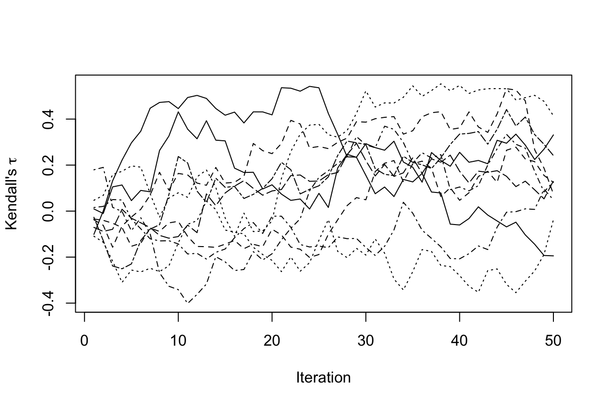

This page contains the R code from the book *Flexible Imputation of Missing Data* (Buuren 2012).

### Chapter 1 Introduction

### Section 1.1 The problem of missing data

``` r
### calculate the mean of three numbers
y <- c(1, 2, 4)
mean(y)
```

    ## [1] 2.33

``` r
### calculate the mean of three numbers, where one is
### missing
y <- c(1, 2, NA)
mean(y)
```

    ## [1] NA

``` r
### repeat, but with any missing data removed
mean(y, na.rm = TRUE)
```

    ## [1] 1.5

``` r
### store your current options (safety measure)
youroptions <- options()

### demo regression that generates an error message using
### default na.fail
options(na.action = na.fail)

### uncomment to see the error lm(Ozone ~ Wind, data =
### airquality)

### remove incomplete observations by 'na.action =
### na.omit'
fit <- lm(Ozone ~ Wind, data = airquality, na.action = na.omit)
coef(fit)
```

    ## (Intercept)        Wind 
    ##       96.87       -5.55

``` r
### set automatic na.action = na.omit
options(na.action = na.omit)

### find out how many rows were deleted
deleted <- na.action(fit)
naprint(deleted)
```

    ## [1] "37 observations deleted due to missingness"

``` r
### more incomplete rows if we add Solar.R as predictor
fit2 <- lm(Ozone ~ Wind + Solar.R, data = airquality)
naprint(na.action(fit2))
```

    ## [1] "42 observations deleted due to missingness"

``` r
### restore your original options, but set na.omit
options(youroptions)
options(na.action = na.omit)
```

### Section 1.3.2 Pairwise deletion

``` r
### note: mean(<data.frame>) is deprecated
colMeans(airquality, na.rm = TRUE)
```

    ##   Ozone Solar.R    Wind    Temp   Month     Day 
    ##   42.13  185.93    9.96   77.88    6.99   15.80

``` r
cor(airquality, use = "pair")
```

    ##           Ozone Solar.R    Wind   Temp    Month
    ## Ozone    1.0000  0.3483 -0.6015  0.698  0.16452
    ## Solar.R  0.3483  1.0000 -0.0568  0.276 -0.07530
    ## Wind    -0.6015 -0.0568  1.0000 -0.458 -0.17829
    ## Temp     0.6984  0.2758 -0.4580  1.000  0.42095
    ## Month    0.1645 -0.0753 -0.1783  0.421  1.00000
    ## Day     -0.0132 -0.1503  0.0272 -0.131 -0.00796
    ##              Day
    ## Ozone   -0.01323
    ## Solar.R -0.15027
    ## Wind     0.02718
    ## Temp    -0.13059
    ## Month   -0.00796
    ## Day      1.00000

``` r
cov(airquality, use = "pair")
```

    ##           Ozone Solar.R    Wind   Temp Month      Day
    ## Ozone   1088.20 1056.58 -70.939 218.52  8.01   -3.818
    ## Solar.R 1056.58 8110.52 -17.946 229.16 -9.52 -119.026
    ## Wind     -70.94  -17.95  12.412 -15.27 -0.89    0.849
    ## Temp     218.52  229.16 -15.272  89.59  5.64  -10.957
    ## Month      8.01   -9.52  -0.890   5.64  2.01   -0.100
    ## Day       -3.82 -119.03   0.849 -10.96 -0.10   78.580

### Section 1.3.3 Mean imputation

``` r
library("mice")
library("lattice")

### impute the mean
imp <- mice(airquality, method = "mean", m = 1, maxit = 1)
```

    ## 
    ##  iter imp variable
    ##   1   1  Ozone  Solar.R

``` r
### Figure 1.1
lwd <- 1.5
par(mfrow = c(1, 2))
breaks <- seq(-20, 200, 10)
nudge <- 1
x <- matrix(c(breaks - nudge, breaks + nudge), ncol = 2)
obs <- airquality[, "Ozone"]
mis <- imp$imp$Ozone[, 1]
fobs <- c(hist(obs, breaks, plot = FALSE)$counts, 0)
fmis <- c(hist(mis, breaks, plot = FALSE)$counts, 0)
y <- matrix(c(fobs, fmis), ncol = 2)
matplot(x, y, type = "s", col = c(mdc(4), mdc(5)), lwd = 2, 
    lty = 1, xlim = c(0, 170), ylim = c(0, 40), yaxs = "i", 
    xlab = "Ozone (ppb)", ylab = "Frequency")
box()

tp <- xyplot(imp, Ozone ~ Solar.R, na.groups = ici(imp), 
    ylab = "Ozone (ppb)", xlab = "Solar Radiation (lang)", 
    cex = 0.75, lex = lwd, ylim = c(-20, 180), xlim = c(0, 
        350))
print(tp, newpage = FALSE, position = c(0.48, 0.08, 1, 0.92))
```


### Section 1.3.4 Regression imputation

``` r
fit <- lm(Ozone ~ Solar.R, data = airquality)
pred <- predict(fit, newdata = ic(airquality))

### alternative using mice
imp <- mice(airquality[, 1:2], method = "norm.predict", 
    m = 1, maxit = 3, seed = 1)
```

    ## 
    ##  iter imp variable
    ##   1   1  Ozone  Solar.R
    ##   2   1  Ozone  Solar.R
    ##   3   1  Ozone  Solar.R

``` r
### Figure 1.2
par(mfrow = c(1, 2))
fmis <- c(hist(pred, breaks, plot = FALSE)$counts, 0)
y <- matrix(c(fobs, fmis), ncol = 2)
matplot(x, y, type = "s", col = c(mdc(4), mdc(5)), lwd = 2, 
    lty = 1, xlim = c(0, 170), ylim = c(0, 40), yaxs = "i", 
    xlab = "Ozone (ppb)", ylab = "Frequency")
box()

tp <- xyplot(imp, Ozone ~ Solar.R, ylab = "Ozone (ppb)", 
    xlab = "Solar Radiation (lang)", cex = 0.75, lex = lwd, 
    ylim = c(-20, 180), xlim = c(0, 350))
print(tp, newpage = FALSE, position = c(0.48, 0.08, 1, 0.92))
```


### Section 1.3.5 Stochastic regression imputation

``` r
imp <- mice(airquality[, 1:2], method = "norm.nob", m = 1, 
    maxit = 1, seed = 1)
```

    ## 
    ##  iter imp variable
    ##   1   1  Ozone  Solar.R

``` r
### Figure 1.3
par(mfrow = c(1, 2))
mis <- imp$imp$Ozone[, 1]
fmis <- c(hist(mis, breaks, plot = FALSE)$counts, 0)
y <- matrix(c(fobs, fmis), ncol = 2)
matplot(x, y, type = "s", col = c(mdc(4), mdc(5)), lwd = 2, 
    lty = 1, xlim = c(0, 170), ylim = c(0, 40), yaxs = "i", 
    xlab = "Ozone (ppb)", ylab = "Frequency")
box()

tp <- xyplot(imp, Ozone ~ Solar.R, na.groups = ici(imp), 
    ylab = "Ozone (ppb)", xlab = "Solar Radiation (lang)", 
    cex = 0.75, lex = lwd, ylim = c(-20, 180), xlim = c(0, 
        350))
print(tp, newpage = FALSE, position = c(0.48, 0.08, 1, 0.92))
```


### Section 1.3.6 LOCF and BOCF

``` r
par(mfrow = c(1, 1))
Oz <- airquality$Ozone
locf <- function(x) {
    a <- x[1]
    for (i in 2:length(x)) {
        if (is.na(x[i])) 
            x[i] <- a else a <- x[i]
    }
    return(x)
}
Ozi <- locf(Oz)
colvec <- ifelse(is.na(Oz), mdc(2), mdc(1))

### Figure 1.4

plot(Ozi[1:80], col = colvec, type = "l", xlab = "Day number", 
    ylab = "Ozone (ppb)")
points(Ozi[1:80], col = colvec, pch = 20, cex = 1)
```


### Section 1.4.3 Example of multiple imputation

``` r
imp <- mice(airquality, seed = 1, print = FALSE)
fit <- with(imp, lm(Ozone ~ Wind + Temp + Solar.R))
tab <- round(summary(pool(fit)), 3)
tab[, c(1:3, 5)]
```

    ##                 est     se     t Pr(>|t|)
    ## (Intercept) -64.331 21.535 -2.99    0.004
    ## Wind         -3.053  0.658 -4.64    0.000
    ## Temp          1.612  0.231  6.97    0.000
    ## Solar.R       0.061  0.022  2.73    0.008

``` r
fit <- lm(Ozone ~ Wind + Temp + Solar.R, data = airquality, 
    na.action = na.omit)
round(coef(summary(fit)), 3)
```

    ##             Estimate Std. Error t value Pr(>|t|)
    ## (Intercept)   -64.34     23.055   -2.79    0.006
    ## Wind           -3.33      0.654   -5.09    0.000
    ## Temp            1.65      0.254    6.52    0.000
    ## Solar.R         0.06      0.023    2.58    0.011

``` r
### Figure 1.6
par(mfrow = c(1, 2))
mis <- imp$imp$Ozone[, 1]
fmis <- c(hist(mis, breaks, plot = FALSE)$counts, 0)
y <- matrix(c(fobs, fmis), ncol = 2)
matplot(x, y, type = "s", col = c(mdc(4), mdc(5)), lwd = 2, 
    lty = 1, xlim = c(0, 170), ylim = c(0, 40), yaxs = "i", 
    xlab = "Ozone (ppb)", ylab = "Frequency")
box()

tp <- xyplot(imp, Ozone ~ Solar.R, subset = .imp == 1, ylab = "Ozone (ppb)", 
    xlab = "Solar Radiation (lang)", cex = 0.75, lex = lwd, 
    ylim = c(-20, 180), xlim = c(0, 350))
print(tp, newpage = FALSE, position = c(0.48, 0.08, 1, 0.92))
```


``` r
### scatterplot of all imputed data sets (not in book)
xyplot(imp, Ozone ~ Solar.R | .imp, ylab = "Ozone (ppb)", 
    xlab = "Solar Radiation (lang)", cex = 0.75, lex = lwd, 
    ylim = c(-20, 180), xlim = c(0, 350))
```


``` r
### Figure 1.7

Oz <- airquality$Ozone
colvec <- ifelse(is.na(Oz), mdc(2), mdc(1))
par(mfrow = c(1, 1))
plot(Oz[1:80], col = mdc(1), type = "l", xlab = "Day number", 
    ylab = "Ozone (ppb)")
points(Oz[1:80], col = mdc(1), pch = 20, cex = 1)

idx <- ici(airquality$Ozone) & (1:153) < 81
x <- (1:153)[idx]
points(x = x, y = complete(imp, 1)$Ozone[idx], col = mdc(2), 
    pch = 20, cex = 1)
points(x = x, y = complete(imp, 2)$Ozone[idx], col = mdc(2), 
    pch = 20, cex = 1)
points(x = x, y = complete(imp, 3)$Ozone[idx], col = mdc(2), 
    pch = 20, cex = 1)
points(x = x, y = complete(imp, 4)$Ozone[idx], col = mdc(2), 
    pch = 20, cex = 1)
points(x = x, y = complete(imp, 5)$Ozone[idx], col = mdc(2), 
    pch = 20, cex = 1)
```


``` r
### figure of the autocorrelation function (not in the
### book)

par(mfrow = c(2, 5))
acf.ozone <- with(imp, acf(Ozone))
model <- expression(acf(resid(lm(Ozone ~ Wind + Temp + Solar.R))))
acf.resid <- with(imp, model)
```


``` r
calcacf <- function(acf.list) {
    k <- length(acf.list)
    acc <- acf.list[[1]]$acf
    for (i in 2:k) acc <- acc + acf.list[[i]]$acf
    return(acc/k)
}
oz <- round(calcacf(acf.ozone$analyses), 2)
re <- round(calcacf(acf.resid$analyses), 2)
```

Chapter 2 Multiple imputation
-----------------------------

``` r
library("mice")
library("lattice")
library("MASS")

### Section 2.1.3 The expanding literature on multiple
### imputation Figure 2.1

cit <- c(2010, 37, 182, NA, 2009, 36, 129, NA, 2008, 27, 
    111, NA, 2007, 35, 136, NA, 2006, 18, 80, NA, 2005, 
    20, 76, NA, 2004, 6, 56, NA, 2003, 17, 42, NA, 2002, 
    14, 40, NA, 2001, 13, 36, 57, 2000, 8, 21, 33, 1999, 
    6, 25, 47, 1998, 6, 13, 22, 1997, 6, 18, 29, 1996, 4, 
    12, 28, 1995, 3, 5, 20, 1994, 2, 5, 34, 1993, 2, 6, 
    15, 1991, 2, 4, 19, 1990, 1, 2, 15, 1989, NA, NA, 11, 
    1988, 1, NA, 13, 1987, NA, NA, 10, 1986, NA, NA, 5, 
    1985, NA, NA, 1, 1984, NA, NA, 2, 1983, NA, NA, 5, 1982, 
    NA, NA, 2, 1981, NA, NA, 1, 1980, NA, NA, 5, 1979, NA, 
    NA, 2, 1978, NA, NA, 1, 1977, NA, NA, 2)

cit <- matrix(cit, nr = 2010 - 1977, nc = 4, byrow = TRUE)
cit <- as.data.frame(cit)
names(cit) <- c("Year", "Title", "Abstract", "All")
par(mfrow = c(1, 1))
par(cex = 0.7, lwd = 0.5)

plot(x = cit$Year, y = cit$Abstract, type = "o", log = "y", 
    xlim = c(1975, 2010), ylim = c(1, 200), ylab = "Number of publications (log)", 
    xlab = "Year", pch = 2, axes = FALSE)
axis(1, lwd = par("lwd"))
axis(2, lwd = par("lwd"), las = 1)
# box(lwd=0.5)
lines(x = cit$Year, y = cit$Title, pch = 15, type = "o")
lines(x = cit$Year, y = cit$All, pch = 16, type = "o")
legend(x = 1975, y = 200, legend = c("early publications", 
    "'multiple imputation' in abstract", "'multiple imputation' in title"), 
    pch = c(16, 2, 15), bty = "n")
```


### Section 2.2.4 MCAR, MAR and MNAR again

``` r
logistic <- function(x) exp(x)/(1 + exp(x))
set.seed(80122)
n <- 300
y <- mvrnorm(n = n, mu = c(0, 0), Sigma = matrix(c(1, 0.5, 
    0.5, 1), nrow = 2))
y1 <- y[, 1]
y2 <- y[, 2]
r2.mcar <- 1 - rbinom(n, 1, 0.5)
r2.mar <- 1 - rbinom(n, 1, logistic(y1))
r2.mnar <- 1 - rbinom(n, 1, logistic(y2))

### Figure 2.2

y3 <- rbind(y, y, y)
r2 <- c(r2.mcar, r2.mar, r2.mnar)
r2 <- factor(r2, labels = c("Ymis", "Yobs"))
typ <- factor(rep(3:1, each = n), labels = c("MNAR", "MAR", 
    "MCAR"))
d <- data.frame(y1 = y3[, 1], y2 = y3[, 2], r2 = r2, typ = typ)
trellis.par.set(box.rectangle = list(col = c(mdc(2), mdc(1)), 
    lwd = 1.2))
trellis.par.set(box.umbrella = list(col = c(mdc(2), mdc(1)), 
    lwd = 1.2))
trellis.par.set(plot.symbol = list(col = mdc(3), lwd = 1))
tp <- bwplot(r2 ~ y2 | typ, data = d, horizontal = TRUE, 
    layout = c(1, 3), xlab = expression(Y^2), col = c(mdc(2), 
        mdc(1)), strip = FALSE, xlim = c(-3, 3), strip.left = strip.custom(bg = "grey95"))
print(tp)
```


### Section 2.3.7 Numerical example

``` r
imp <- mice(nhanes, print = FALSE, m = 10, seed = 24415)
fit <- with(imp, lm(bmi ~ age))
est <- pool(fit)
names(est)
```

    ##  [1] "call"   "call1"  "call2"  "nmis"   "m"     
    ##  [6] "qhat"   "u"      "qbar"   "ubar"   "b"     
    ## [11] "t"      "r"      "dfcom"  "df"     "fmi"   
    ## [16] "lambda"

``` r
attach(est)
(r + 2/(df + 3))/(r + 1)
```

    ## (Intercept)         age 
    ##       0.408       0.310

``` r
(df + 1)/(df + 3) * lambda + 2/(df + 3)
```

    ## (Intercept)         age 
    ##       0.408       0.310

``` r
detach(est)
```

Chapter 3 Univariate imputation
-------------------------------

### Section 3.1 How to generate multiple imputations

``` r
library("mice")
library("lattice")
library("gamlss")
library("rpart")

### In order to draw figure 3.1, we define two tweaked
### mice.impute.xxx functions that will store the
### coefficients of the imputation models in the global
### environment.  Normally, we would not be so interested
### in the parameter estimates of the imputation model,
### but here we need them for Figure 3.1.
mice.impute.normdump <- function(y, ry, x, ...) {
    x <- cbind(1, as.matrix(x))
    parm <- .norm.draw(y, ry, x, ...)
    betadump <<- c(betadump, parm$beta)
    return(x[!ry, ] %*% parm$beta + rnorm(sum(!ry)) * parm$sigma)
}
mice.impute.pmmdump <- function(y, ry, x, ...) {
    x <- cbind(1, as.matrix(x))
    parm <- .norm.draw(y, ry, x, ...)
    yhatobs <- x[ry, ] %*% parm$coef
    yhatmis <- x[!ry, ] %*% parm$beta
    betadump <<- c(betadump, parm$beta)
    return(apply(as.array(yhatmis), 1, .pmm.match, yhat = yhatobs, 
        y = y[ry], ...))
}


### Figure 3.1
par(mfrow = c(3, 2))
data <- whiteside
lwd <- 1.5
plot(x = data$Temp, y = data$Gas, col = mdc(1), lwd = lwd, 
    xlab = expression(paste("Temperature (", degree, "C)")), 
    ylab = "Gas consumption (cubic feet)")
points(x = 5, y = 3.6, pch = 4, cex = 2, lwd = lwd, col = mdc(2))
legend(x = "bottomleft", legend = "deleted observation", 
    pch = 4, col = mdc(2), pt.lwd = lwd, bty = "n", pt.cex = 2)
text(x = 9, y = 6.5, label = "a", cex = 2)

data[47, "Gas"] <- NA
plot(x = data$Temp, y = data$Gas, col = mdc(1), lwd = lwd, 
    xlab = expression(paste("Temperature (", degree, "C)")), 
    ylab = "Gas consumption (cubic feet)")
abline(m1 <- lm(Gas ~ Temp, data = data, na.action = na.omit), 
    col = mdc(4))
points(5, 4.04, lwd = lwd, col = mdc(2), pch = 19)
text(x = 9, y = 6.5, label = "b", cex = 2)

plot(x = data$Temp, y = data$Gas, col = mdc(1), lwd = lwd, 
    xlab = expression(paste("Temperature (", degree, "C)")), 
    ylab = "Gas consumption (cubic feet)")
imp <- mice(data, m = 1, maxit = 0)
pred <- imp$pred
pred["Gas", "Insul"] <- 0
imp <- mice(data, m = 5, pred = pred, meth = "norm.nob", 
    maxit = 1, print = FALSE, seed = 45433)
abline(m1 <- lm(Gas ~ Temp, data = data, na.action = na.omit), 
    col = mdc(4))
points(rep(5, 5), imp$imp$Gas, lwd = lwd, col = mdc(2), 
    pch = 19)
text(x = 9, y = 6.5, label = "c", cex = 2)

plot(x = data$Temp, y = data$Gas, col = mdc(1), lwd = lwd, 
    xlab = expression(paste("Temperature (", degree, "C)")), 
    ylab = "Gas consumption (cubic feet)")
imp <- mice(data, m = 1, maxit = 0)
pred <- imp$pred
pred["Gas", "Insul"] <- 0
betadump <- vector("list", 0)
imp <- mice(data, m = 5, pred = pred, meth = "normdump", 
    maxit = 1, print = FALSE, seed = 83126)
abline(m1 <- lm(Gas ~ Temp, data = data, na.action = na.omit), 
    col = mdc(4))
betadump <- matrix(betadump, nc = 2, byrow = TRUE)
for (i in 1:5) abline(coef = unlist(betadump[i, ]), col = mdc(5))
points(rep(5, 5), imp$imp$Gas, lwd = lwd, col = mdc(2), 
    pch = 19)
text(x = 9, y = 6.5, label = "d", cex = 2)

pch <- c(rep(3, 26), rep(1, 30))
plot(x = data$Temp, y = data$Gas, col = mdc(1), lwd = lwd, 
    pch = pch, xlab = expression(paste("Temperature (", 
        degree, "C)")), ylab = "Gas consumption (cubic feet)")
imp <- mice(data, m = 5, meth = "norm", maxit = 1, print = FALSE, 
    seed = 11727)
abline(m1 <- lm(Gas ~ Temp, data = data, na.action = na.omit, 
    subset = Insul == "Before"), col = mdc(4))
abline(m2 <- lm(Gas ~ Temp, data = data, na.action = na.omit, 
    subset = Insul == "After"), col = mdc(4))
points(rep(5, 5), imp$imp$Gas, lwd = lwd, col = mdc(2), 
    pch = 19)
legend(x = "bottomleft", legend = c("before insulation", 
    "after insulation"), pch = c(3, 1), bty = "n", pt.lwd = lwd)
text(x = 9, y = 6.5, label = "e", cex = 2)

pch <- c(rep(3, 26), rep(1, 30))
plot(x = data$Temp, y = data$Gas, col = mdc(1), lwd = lwd, 
    pch = pch, xlab = expression(paste("Temperature (", 
        degree, "C)")), ylab = "Gas consumption (cubic feet)")
betadump <- vector("list", 0)
imp <- mice(data, m = 5, meth = "pmmdump", maxit = 1, print = FALSE, 
    seed = 68006)
betadump <- matrix(betadump, nc = 3, byrow = TRUE)
m1 <- lm(Gas ~ Temp + Insul, data = data, na.action = na.omit)
an <- coef(m1)[1]
ai <- an + coef(m1)[3]
b <- coef(m1)[2]
abline(a = ai, b = b, col = mdc(4))
abline(a = an, b = b, col = mdc(4))
eta <- 0.6
ylo <- ai + b * (5 - eta)
yhi <- ai + b * (5 + eta)
lines(x = c(5 - eta, 5 + eta), y = c(ylo, yhi), lwd = 3, 
    col = mdc(5))
xlo <- (ylo - an)/b
xhi <- (yhi - an)/b
lines(x = c(xlo, xhi), y = c(ylo, yhi), lwd = 3, col = mdc(5))

donors <- subset(data, (Insul == "After" & Temp > 5 - eta & 
    Temp < 5 + eta) | (Insul == "Before" & Temp > xlo & 
    Temp < xhi))
points(x = donors$Temp, y = donors$Gas, cex = 1.8, col = mdc(5), 
    lwd = lwd)
legend(x = "bottomleft", legend = c("before insulation", 
    "after insulation"), pch = c(3, 1), bty = "n", pt.lwd = lwd)
text(x = 9, y = 6.5, label = "f", cex = 2)
```


### Section 3.2.3 Performance

``` r
### number of simulations use nsim <- 10 for testing nsim
### <- 10000 for the real stuff (TIME CONSUMING)
nsim <- 10

### create data
createdata <- function(beta0 = 5.49, beta1 = -0.29, sigma = 0.86, 
    n = 50, mx = 5, sdx = 3) {
    x <- round(rnorm(n, mean = mx, sd = sdx), 1)
    eps <- rnorm(n, mean = 0, sd = sigma)
    y <- round(beta0 + x * beta1 + eps, 1)
    return(data.frame(x = x, y = y))
}

### make 50% random missing data
makemissing <- function(data, p = 0.5) {
    rx <- rbinom(nrow(data), 1, p)
    data[rx == 0, "y"] <- NA
    return(data)
}

### test function for three imputation functions
test.impute <- function(data, m = 5, method = "norm", ...) {
    imp <- mice(data, method = method, m = m, print = FALSE, 
        ridge = 0, ...)
    fit <- with(imp, lm(y ~ x))
    est <- pool(fit)
    tab <- summary(est)
    return(tab["x", c("est", "se", "lo 95", "hi 95", "fmi", 
        "lambda")])
}

### put everything together
simulate <- function(nsim = 10, seed = 41872) {
    set.seed(seed)
    res <- array(NA, dim = c(4, nsim, 6))
    dimnames(res) <- list(c("predict", "pred + noise", "Bayes MI", 
        "boot MI"), as.character(1:nsim), c("est", "se", 
        "lo 95", "hi 95", "fmi", "lambda"))
    im <- c("norm.predict", "norm.nob", "norm", "norm.boot")
    for (i in 1:nsim) {
        data <- createdata()
        data <- makemissing(data)
        res[1, i, ] <- test.impute(data, method = im[1], 
            m = 2)
        res[2, i, ] <- test.impute(data, method = im[2])
        res[3, i, ] <- test.impute(data, method = im[3])
        res[4, i, ] <- test.impute(data, method = im[4])
    }
    return(res)
}

summarize.results <- function(res) {
    apply(res, c(1, 3), mean, na.rm = TRUE)
    
    ## bias of beta1
    true <- -0.29
    bias <- rowMeans(res[, , 1] - true)
    
    ## coverage
    isin <- res[, , 3] < true & true < res[, , 4]
    cov <- rowMeans(isin)
    
    ## average width of 95 c.i.
    intwidth <- res[, , 4] - res[, , 3]
    aiw <- rowMeans(intwidth)
    
    return(list(bias = bias, cov = cov, aiw = aiw))
}

### do the simulations - MAY BE TIME CONSUMING
res <- simulate(nsim)
summarize.results(res)
```

    ## $bias
    ##      predict pred + noise     Bayes MI      boot MI 
    ##     -0.01635     -0.02184     -0.01149     -0.00582 
    ## 
    ## $cov
    ##      predict pred + noise     Bayes MI      boot MI 
    ##          0.8          0.9          1.0          1.0 
    ## 
    ## $aiw
    ##      predict pred + noise     Bayes MI      boot MI 
    ##        0.126        0.242        0.318        0.287

``` r
### function to simulate performance of CCA
simulate.cca <- function(nsim = 10, seed = 41872) {
    
    set.seed(seed)
    res <- array(NA, dim = c(1, nsim, 6))
    for (i in 1:nsim) {
        data <- createdata()
        data <- makemissing(data)
        fit <- lm(y ~ x, data = data, na.action = na.omit)
        est <- coef(summary(fit))
        lo95 <- est[, 1] - qt(0.975, fit$df) * est[, 2]
        hi95 <- est[, 1] + qt(0.975, fit$df) * est[, 2]
        est <- cbind(est, lo95, hi95)
        res[1, i, ] <- c(est["x", c(1:2, 5:6)], NA, NA)
    }
    return(res)
}

### simulate - MAY BE TIME CONSUMING
res.cca <- simulate.cca(nsim)
### cannot be analysed by summarize.results() but it
### should be obvious how to calculate bias, coverage and
### aiw
```

### Section 3.2.4 Generating MAR missing data

``` r
### script to create missing data according to MARRIGHT
logistic <- function(x) exp(x)/(1 + exp(x))
set.seed(32881)
n <- 10000
y <- mvrnorm(n = n, mu = c(5, 5), Sigma = matrix(c(1, 0.6, 
    0.6, 1), nrow = 2))
p2.marright <- 1 - logistic(-5 + y[, 1])
r2.marright <- rbinom(n, 1, p2.marright)
yobs <- y
yobs[r2.marright == 0, 2] <- NA

### Figure 3.2

grid <- seq(0, 10, 0.1)
mr <- logistic(-5 + grid)
mm <- logistic(0.75 - abs(grid - 5))
mt <- logistic(-0.75 + abs(grid - 5))

par(mfrow = c(1, 1))
z <- data.frame(grid, mr, mm, mt)
matplot(x = z[, 1], y = z[, 2:4], type = "l", lty = 1:3, 
    col = mdc(5), lwd = 2, xlab = "Y1", ylab = "Missingness in Y2", 
    las = 1)
legend(x = "top", bty = "n", legend = c("MARRIGHT", "MARMID", 
    "MARTAIL"), lty = 1:3, lwd = 2, col = mdc(5), cex = 0.8)
```


``` r
### Figure 3.3

y3 <- rbind(y, y, y)
p2.marmid <- 1 - logistic(0.75 - abs(y[, 1] - 5))
p2.martail <- 1 - logistic(0.75 + abs(y[, 1] - 5))
r2.marmid <- rbinom(n, 1, p2.marright)
r2.martail <- rbinom(n, 1, p2.martail)
r2 <- c(r2.marright, r2.marmid, r2.martail)
r2 <- factor(r2, labels = c("Ymis", "Yobs"))
typ <- factor(rep(3:1, each = n), labels = c("MARTAIL", 
    "MARMID", "MARRIGHT"))
d <- data.frame(y1 = y3[, 1], y2 = y3[, 2], r2 = r2, typ = typ)
trellis.par.set(box.rectangle = list(col = c(mdc(2), mdc(1)), 
    lwd = 1.2))
trellis.par.set(box.umbrella = list(col = c(mdc(2), mdc(1)), 
    lwd = 1.2))
trellis.par.set(plot.symbol = list(col = "transparent", 
    lwd = 1))
tp <- bwplot(r2 ~ y2 | typ, data = d, horizontal = TRUE, 
    layout = c(1, 3), xlab = expression(Y2), col = c(mdc(2), 
        mdc(1)), strip = FALSE, xlim = c(2, 8), strip.left = strip.custom(bg = "grey95"))
print(tp)
```


### Section 3.2.2 Imputation from the t-distribution

``` r
mice.impute.tf <- function(y, ry, x, gamlss.trace = FALSE, 
    ...) {
    require(gamlss)
    
    # prepare data
    xobs <- x[ry, , drop = FALSE]
    xmis <- x[!ry, , drop = FALSE]
    yobs <- y[ry]
    n1 <- sum(ry)
    n0 <- sum(!ry)
    
    # draw bootstrap sample
    s <- sample(n1, n1, replace = TRUE)
    dotxobs <- xobs[s, , drop = FALSE]
    dotyobs <- yobs[s]
    dotxy <- data.frame(dotxobs, y = dotyobs)
    
    # fit the gamlss model
    fit <- gamlss(y ~ ., data = dotxy, family = TF, trace = gamlss.trace, 
        ...)
    yhat <- predict(fit, data = dotxy, newdata = xmis)
    sigma <- exp(coef(fit, "sigma"))
    nu <- exp(coef(fit, "nu"))
    
    # draw the imputations
    return(rTF(n0, yhat, sigma, nu))
}
```

### Section 3.3.3 Example

``` r
data(db)

### Figure 3.4

par(mfrow = c(1, 2))
data <- subset(db, age > 1 & age < 2, c("age", "head"))
names(data) <- c("age", "hc")
truehist(data$hc, col = mdc(1), border = "white", xlab = "Head circumference (cm)", 
    ylab = "Density", ylim = c(0, 0.3), xlim = c(38, 60), 
    nbins = 44)

mn <- gamlss(hc ~ 1, data = na.omit(data), family = NO, 
    trace = FALSE)
mu <- coef(mn)
sigma <- exp(coef(mn, "sigma"))
cmfine <- seq(38, 60, 0.1)
lines(cmfine, dNO(cmfine, mu, sigma), lwd = 0.8, lty = 2)
mt <- gamlss(hc ~ 1, data = data, family = TF, trace = FALSE)
mu <- coef(mt)
sigma <- exp(coef(mt, "sigma"))
nu <- exp(coef(mt, "nu"))
lines(cmfine, dTF(cmfine, mu, sigma, nu), lwd = 0.8, lty = 1)
legend(x = "right", legend = c("normal", "t, df=6.7"), lwd = 0.8, 
    lty = c(2, 1), bty = "n", cex = 0.7)

plot(x = data$age, y = data$hc, col = mdc(1), cex = 0.3, 
    xlab = "Age (in years)", ylab = "Head circumference (cm)", 
    ylim = c(39, 60))
```


``` r
### create a synthetic data set
data(db)
data <- subset(db, age > 1 & age < 2, c("age", "head"))
names(data) <- c("age", "hc")
synthetic <- rep(c(FALSE, TRUE), each = nrow(data))
data2 <- rbind(data, data)
data2[synthetic, "hc"] <- NA
imp <- mice(data2, m = 1, meth = "tf", seed = 36650, print = FALSE)
syn <- subset(complete(imp), synthetic)

### Figure 3.5

data <- syn
truehist(data$hc, col = mdc(2), border = "white", xlab = "Head circumference (cm)", 
    ylab = "Density", ylim = c(0, 0.3), xlim = c(38, 60), 
    nbins = 44)

mn <- gamlss(hc ~ 1, data = na.omit(data), family = NO, 
    trace = FALSE)
mu <- coef(mn)
sigma <- exp(coef(mn, "sigma"))
cmfine <- seq(38, 60, 0.1)
lines(cmfine, dNO(cmfine, mu, sigma), lwd = 0.8, lty = 2)
mt <- gamlss(hc ~ 1, data = data, family = TF, trace = FALSE)
mu <- coef(mt)
sigma <- exp(coef(mt, "sigma"))
nu <- exp(coef(mt, "nu"))
lines(cmfine, dTF(cmfine, mu, sigma, nu), lwd = 0.8, lty = 1)
legend(x = "right", legend = c("normal", paste("t, df=", 
    round(nu, 1), sep = "")), lwd = 0.8, lty = c(2, 1), 
    bty = "n", cex = 0.7)
```


``` r
plot(x = data$age, y = data$hc, col = mdc(2), cex = 0.3, 
    xlab = "Age (in years)", ylab = "Head circumference (cm)", 
    ylim = c(39, 60))
```


### Section 3.4.1 PMM, Overview

``` r
### Figure 3.6

data <- boys[boys$age <= 2, c("age", "bmi")]
set.seed(87120)
data[sample(92:136, 10), "bmi"] <- NA
imp <- mice(data, meth = "norm", m = 1, seed = 32212, print = FALSE)
cd1 <- complete(imp)
imp <- mice(data, m = 1, seed = 32212, print = FALSE)
cd2 <- complete(imp)
r <- !is.na(data$bmi)
plot(data, col = mdc(1), xlab = "Age", ylab = "BMI")
points(cd1[!r, ], col = mdc(2), pch = 19, cex = 0.8)
```


``` r
plot(data, col = mdc(1), xlab = "Age", ylab = "BMI")
points(cd2[!r, ], col = mdc(2), pch = 19, cex = 0.8)
```


### Section 3.4.2 PMM, Computational details

``` r
### Figure 3.7

par(mfrow = c(1, 1))
data <- whiteside
lwd <- 1.5
data[47, "Gas"] <- NA

pch <- c(rep(3, 26), rep(1, 30))
plot(x = data$Temp, y = data$Gas, col = mdc(1), lwd = lwd, 
    pch = pch, xlab = expression(paste("Temperature (", 
        degree, "C)")), ylab = "Gas consumption (cubic feet)")
betadump <- vector("list", 0)
imp <- mice(data, m = 5, meth = "pmmdump", maxit = 1, print = FALSE, 
    seed = 68006)
betadump <- matrix(unlist(betadump), nc = 3, byrow = TRUE)
m1 <- lm(Gas ~ Temp + Insul, data = data, na.action = na.omit)
an <- coef(m1)[1]
ai <- an + coef(m1)[3]
b <- coef(m1)[2]
abline(a = ai, b = b, col = mdc(4))
abline(a = an, b = b, col = mdc(4))
## for (i in 56:56) { abline(a=unlist(betadump[i,1]),
## b=unlist(betadump[i,2]), col=mdc(5))
## abline(a=unlist(betadump[i,1])+unlist(betadump[i,3]),
## b=unlist(betadump[i,2]), col=mdc(5)) }
## points(rep(5,5),imp$imp$Gas, lwd=lwd, col=mdc(2),
## pch=20)
eta <- 0.6
ylo <- ai + b * (5 - eta)
yhi <- ai + b * (5 + eta)
lines(x = c(5 - eta, 5 + eta), y = c(ylo, yhi), lwd = 3, 
    col = mdc(4))
an <- 7.05
ai <- an - 1.7
b <- -0.38
xlo1 <- (ylo - ai)/b
xhi1 <- (yhi - ai)/b
xlo2 <- (ylo - an)/b
xhi2 <- (yhi - an)/b
abline(a = an, b = b, col = mdc(5))
abline(a = ai, b = b, col = mdc(5))
lines(x = c(xlo1, xhi1), y = c(ylo, yhi), lwd = 3, col = mdc(5))
lines(x = c(xlo2, xhi2), y = c(ylo, yhi), lwd = 3, col = mdc(5))
abline(v = c(5 - eta, 5 + eta), h = c(ylo, yhi), col = mdc(4), 
    lty = 3)
rect(xlo1, 0, xhi1, 8, col = hcl(0, 100, 40, 0.05), border = NA)
rect(xlo2, 0, xhi2, 8, col = hcl(0, 100, 40, 0.05), border = NA)
# abline(v=c(xlo1,xhi1,xlo2,xhi2),col=mdc(5),lty=3)

donors <- subset(data, (Insul == "After" & Temp > xlo1 & 
    Temp < xhi1) | (Insul == "Before" & Temp > xlo2 & Temp < 
    xhi2))
points(x = donors$Temp, y = donors$Gas, cex = 1.8, col = mdc(5), 
    lwd = lwd)
legend(x = "bottomleft", legend = c("before insulation", 
    "after insulation"), pch = c(3, 1), bty = "n", pt.lwd = lwd)
```


### Section 3.4.3 PMM, Algorithm

``` r
### simulate function used to calculate Table 3.3
simulate <- function(nsim = 10, seed = 41872) {
    set.seed(seed)
    res <- array(NA, dim = c(3, nsim, 6))
    for (i in 1:nsim) {
        data <- createdata()
        data <- makemissing(data)
        res[1, i, ] <- test.impute(data, m = 5)
        res[2, i, ] <- test.impute(data, m = 5, donors = 1)
        res[3, i, ] <- test.impute(data, m = 5, donors = 10)
    }
    return(res)
}

### and perform simulations - MAY BE TIME CONSUMING
res.pmm <- simulate(nsim)
summarize.results(res.pmm)
```

    ## $bias
    ## [1] -0.02267 -0.00413 -0.00607
    ## 
    ## $cov
    ## [1] 1.0 1.0 0.8
    ## 
    ## $aiw
    ## [1] 0.291 0.317 0.298

### Section 3.7.1

``` r
### Figure 3.8

par(mfrow = c(1, 2))
fit <- rpart(Gas ~ Temp + Insul, data = whiteside)
plot(fit, branch = 0, margin = 0.15)
text(fit, use = T, pretty = 0, dig = 3, cex = 0.8)

leaf <- row.names(fit$frame)[fit$where]
label <- factor(leaf, labels = c(2, 3, 1, 4, 5))
plot(x = whiteside$Temp, y = whiteside$Gas, type = "n", 
    xlab = expression(paste("Temperature (", degree, "C)")), 
    ylab = "Gas consumption (cubic feet)")
text(x = whiteside$Temp, y = whiteside$Gas, label = label, 
    col = mdc(4), cex = 0.6)
```


### Section 3.9.4 Converting selection and pattern-mixture models

``` r
### Figure 3.9

par(mfrow = c(1, 2))
s <- c(100, 0.015, 0.058, 0.02, 0.35, 110, 0.024, 0.074, 
    0.03, 0.3, 120, 0.043, 0.103, 0.05, 0.25, 130, 0.091, 
    0.164, 0.1, 0.2, 140, 0.145, 0.185, 0.15, 0.15, 150, 
    0.307, 0.247, 0.3, 0.1, 160, 0.157, 0.099, 0.15, 0.08, 
    170, 0.107, 0.049, 0.1, 0.06, 180, 0.055, 0.016, 0.05, 
    0.04, 190, 0.033, 0.005, 0.03, 0.02, 200, 0.023, 0, 
    0.02, 0, 210, 0.023, 0, 0.02, 0)
sm <- matrix(s, nr = 12, nc = 5, byrow = TRUE)
snug <- 1.5
xx <- cbind(sm[, 1] - 5 + snug, sm[, 1] - 5 - snug, sm[, 
    1] - 5)
matplot(x = xx[, 3], y = cbind(1 - sm[, 5]), col = mdc(1), 
    type = "p", lwd = 2, lty = 1, pch = 20, xlab = "Systolic BP (mmHg)", 
    ylab = "Observation probability")
matplot(x = xx, y = sm[, 2:4], type = "s", col = c(mdc(4), 
    mdc(5), mdc(6)), lwd = 2, lty = 1, xlab = "Systolic BP (mmHg)", 
    ylab = "Density")
```


Chapter 4 Multivariate missing data
-----------------------------------

### Section 4.1 Missing data patterns

``` r
library("mice")
library("lattice")

### define data sets pattern1-pattern4 with four patterns
data <- matrix(sample(1:100, 4 * 8 * 3, replace = TRUE), 
    nrow = 8 * 4, dimnames = list(NULL, c("A", "B", "C")))
data <- as.data.frame(data)
data[c(31:32), "A"] <- NA
data[c(15:16, 22:24, 30:32), "B"] <- NA
data[c(6:8, 12:16, 17:21, 27:29), "C"] <- NA
mdpat <- cbind(expand.grid(rec = 8:1, pat = 1:4, var = 1:3), 
    r = as.numeric(as.vector(is.na(data))))
pattern1 <- data[1:8, ]
pattern2 <- data[9:16, ]
pattern3 <- data[17:24, ]
pattern4 <- data[25:32, ]

### Figure 4.1
types <- c("Univariate", "Monotone", "File matching", "General")
tp41 <- levelplot(r ~ var + rec | as.factor(pat), data = mdpat, 
    as.table = TRUE, aspect = "iso", shrink = c(0.9), col.regions = mdc(1:2), 
    colorkey = FALSE, scales = list(draw = FALSE), xlab = "", 
    ylab = "", between = list(x = 1, y = 0), strip = strip.custom(bg = "grey95", 
        style = 1, factor.levels = types))
print(tp41)
```


``` r
md.pattern(pattern4)
```

    ##   A B C  
    ## 2 1 1 1 0
    ## 1 1 0 1 1
    ## 3 1 1 0 1
    ## 2 0 0 1 2
    ##   2 3 3 8

``` r
p <- md.pairs(pattern4)
p
```

    ## $rr
    ##   A B C
    ## A 6 5 3
    ## B 5 5 2
    ## C 3 2 5
    ## 
    ## $rm
    ##   A B C
    ## A 0 1 3
    ## B 0 0 3
    ## C 2 3 0
    ## 
    ## $mr
    ##   A B C
    ## A 0 0 2
    ## B 1 0 3
    ## C 3 3 0
    ## 
    ## $mm
    ##   A B C
    ## A 2 2 0
    ## B 2 3 0
    ## C 0 0 3

``` r
### proportion of usable cases
p$mr/(p$mr + p$mm)
```

    ##       A B C
    ## A 0.000 0 1
    ## B 0.333 0 1
    ## C 1.000 1 0

``` r
### outbound statistics
p$rm/(p$rm + p$rr)
```

    ##     A     B   C
    ## A 0.0 0.167 0.5
    ## B 0.0 0.000 0.6
    ## C 0.4 0.600 0.0

``` r
### Figure 4.2
par(mfrow = c(2, 2))
fluxplot(pattern1, main = "", xlim = c(-0.1, 1.1), ylim = c(-0.1, 
    1.1))
text(x = 0.5, y = 1, label = "Univariate")
fluxplot(pattern2, main = "", xlim = c(-0.1, 1.1), ylim = c(-0.1, 
    1.1))
text(x = 0.5, y = 1, label = "Monotone")
fluxplot(pattern3, main = "", xlim = c(-0.1, 1.1), ylim = c(-0.1, 
    1.1))
text(x = 0.5, y = 1, label = "File matching")
fluxplot(pattern4, main = "", xlim = c(-0.1, 1.1), ylim = c(-0.1, 
    1.1))
text(x = 0.5, y = 1, label = "General")
```


``` r
### calculate pobs, influx, outflux of general pattern
flux(pattern4)[, 1:3]
```

    ##    pobs influx outflux
    ## A 0.750  0.125   0.500
    ## B 0.625  0.250   0.375
    ## C 0.625  0.375   0.625

``` r
### section 4.3 Monotone data imputation monotone data
### imputation on three columns
data <- nhanes2[, 1:3]
md.pattern(data)
```

    ##    age hyp bmi   
    ## 16   1   1   1  0
    ##  1   1   1   0  1
    ##  8   1   0   0  2
    ##      0   8   9 17

``` r
imp <- mice(data, visit = "monotone", maxit = 1, m = 2)
```

    ## 
    ##  iter imp variable
    ##   1   1  hyp  bmi
    ##   1   2  hyp  bmi

``` r
### Numerical example, approximate two-step
ini <- mice(nhanes2, maxit = 0)
pred <- ini$pred
pred["bmi", "chl"] <- 0
pred["hyp", c("chl", "bmi")] <- 0
imp <- mice(nhanes2, vis = "monotone", pred = pred, maxit = 1, 
    m = 2)
```

    ## 
    ##  iter imp variable
    ##   1   1  hyp  bmi  chl
    ##   1   2  hyp  bmi  chl

### Section 4.5 Fully Conditional Specification

``` r
### Example of slow convergence
generate <- function(n = c(1000, 4500, 4500, 0), cor = matrix(c(1, 
    0.9, 0.9, 0.9, 1, 0.7, 0.9, 0.7, 1), nrow = 3)) {
    require(MASS)
    nt <- sum(n)
    cs <- cumsum(n)
    data <- mvrnorm(nt, mu = rep(0, 3), Sigma = cor)
    dimnames(data) <- list(1:nt, c("X", "Y1", "Y2"))
    if (n[2] > 0) 
        data[(cs[1] + 1):cs[2], "Y1"] <- NA
    if (n[3] > 0) 
        data[(cs[2] + 1):cs[3], "Y2"] <- NA
    if (n[4] > 0) 
        data[(cs[3] + 1):cs[4], c("Y1", "Y2")] <- NA
    return(data)
}

impute <- function(data, m = 5, method = "norm", print = FALSE, 
    maxit = 10, ...) {
    statistic <- matrix(NA, nrow = maxit, ncol = m)
    for (iter in 1:maxit) {
        if (iter == 1) 
            imp <- mice(data, m = m, method = method, print = print, 
                maxit = 1, ...) else imp <- mice.mids(imp, maxit = 1, print = print, 
            ...)
        statistic[iter, ] <- unlist(with(imp, cor(Y1, Y2))$analyses)
    }
    return(list(imp = imp, statistic = statistic))
}

simulate <- function(ns = matrix(c(1000, 500, 250, 100, 
    50, 0, rep(c(4500, 4750, 4875, 4950, 4975, 5000), 2), 
    rep(0, 6)), nrow = 6), m = 5, maxit = 10, seed = 1, 
    ...) {
    if (!missing(seed)) 
        set.seed(seed)
    s <- cbind(rep(1:nrow(ns), each = maxit * m), apply(ns, 
        2, rep, each = maxit * m), rep(1:maxit, each = m), 
        1:m, NA)
    colnames(s) <- c("k", "n111", "n101", "n110", "n100", 
        "iteration", "m", "rY1Y2")
    for (k in 1:nrow(ns)) {
        data <- generate(ns[k, ], ...)
        r <- impute(data, m = m, maxit = maxit, ...)
        s[s[, "k"] == k, "rY1Y2"] <- t(r$statistic)
    }
    return(data.frame(s))
}

### perform simulation - TIME CONSUMING (10 minutes)
slow.demo <- simulate(maxit = 150, seed = 62771)
```

``` r
### Figure 4.3
labels <- c("90% missing", "95% missing", "97.5% missing", 
    "99% missing", "99.5% missing", "100% missing")
tp43 <- xyplot(rY1Y2 ~ iteration | as.factor(k), group = m, 
    data = slow.demo, layout = c(3, 2), type = "l", as.table = TRUE, 
    ylab = "Correlation between Y1 and Y2", xlab = "Iteration", 
    col = mdc(3), scales = list(y = list(alternating = 1, 
        tck = c(1, 0))), strip = strip.custom(bg = "grey95", 
        style = 1, factor.levels = labels))
print(tp43)
```


### Section 4.6.3 Illustration

``` r
## boys data: select subset
select <- with(boys, age >= 8 & age <= 21)

### version with all numeric data for jm and pmm
djm <- boys[select, -4]
djm$gen <- as.integer(djm$gen)
djm$phb <- as.integer(djm$phb)
djm$reg <- as.integer(djm$reg)

### version with categorical variables for fcs
dfcs <- boys[select, -4]

### impute according to joint multivariate normal
jm.10 <- mice(djm, method = "norm", seed = 93005, m = 10, 
    print = FALSE)

### impute according to predictive mean matching
pmm.10 <- mice(djm, seed = 71332, m = 10, print = FALSE)

### impute according to proportional odds model
fcs.10 <- mice(dfcs, seed = 81420, m = 10, print = FALSE)

### Figure 4.4
tp44 <- xyplot(jm.10, gen ~ age | .imp, subset = as.integer(.imp) < 
    7, xlab = "Age", ylab = "Genital stage")
print(tp44)
```


``` r
### Figure 4.5
tp45 <- xyplot(fcs.10, gen ~ age | .imp, subset = as.integer(.imp) < 
    7, xlab = "Age", ylab = "Genital stage")
print(tp45)
```


``` r
### Figure 4.6 is too complex, and will not be given here
```

Chapter 5
---------

``` r
library("mice")
library("gamlss")
library("AGD")
```

    ## AGD 0.35 2015-05-27

``` r
### set Trellis layout parameters
lhset <- trellis.par.get("layout.heights")
lhset$top.padding <- 0
lhset$bottom.padding <- 0
trellis.par.set("layout.heights", lhset)
lwset <- trellis.par.get("layout.widths")
lwset$left.padding <- 0
lwset$right.padding <- 0
trellis.par.set("layout.widths", lwset)
```

### Section 5.3.2 Predictors

``` r
imp <- mice(nhanes, print = FALSE)
imp$predictorMatrix
```

    ##     age bmi hyp chl
    ## age   0   0   0   0
    ## bmi   1   0   1   1
    ## hyp   1   1   0   1
    ## chl   1   1   1   0

``` r
imp <- mice(cbind(nhanes, chl2 = 2 * nhanes$chl), print = FALSE)
imp$loggedEvents
```

    ##   it im co dep      meth  out
    ## 1  0  0  0     collinear chl2

### Section 5.4.1 Ratio of two variables

``` r
imp1 <- mice(boys)
```

    ## 
    ##  iter imp variable
    ##   1   1  hgt  wgt  bmi  hc  gen  phb  tv  reg
    ##   1   2  hgt  wgt  bmi  hc  gen  phb  tv  reg
    ##   1   3  hgt  wgt  bmi  hc  gen  phb  tv  reg
    ##   1   4  hgt  wgt  bmi  hc  gen  phb  tv  reg
    ##   1   5  hgt  wgt  bmi  hc  gen  phb  tv  reg
    ##   2   1  hgt  wgt  bmi  hc  gen  phb  tv  reg
    ##   2   2  hgt  wgt  bmi  hc  gen  phb  tv  reg
    ##   2   3  hgt  wgt  bmi  hc  gen  phb  tv  reg
    ##   2   4  hgt  wgt  bmi  hc  gen  phb  tv  reg
    ##   2   5  hgt  wgt  bmi  hc  gen  phb  tv  reg
    ##   3   1  hgt  wgt  bmi  hc  gen  phb  tv  reg
    ##   3   2  hgt  wgt  bmi  hc  gen  phb  tv  reg
    ##   3   3  hgt  wgt  bmi  hc  gen  phb  tv  reg
    ##   3   4  hgt  wgt  bmi  hc  gen  phb  tv  reg
    ##   3   5  hgt  wgt  bmi  hc  gen  phb  tv  reg
    ##   4   1  hgt  wgt  bmi  hc  gen  phb  tv  reg
    ##   4   2  hgt  wgt  bmi  hc  gen  phb  tv  reg
    ##   4   3  hgt  wgt  bmi  hc  gen  phb  tv  reg
    ##   4   4  hgt  wgt  bmi  hc  gen  phb  tv  reg
    ##   4   5  hgt  wgt  bmi  hc  gen  phb  tv  reg
    ##   5   1  hgt  wgt  bmi  hc  gen  phb  tv  reg
    ##   5   2  hgt  wgt  bmi  hc  gen  phb  tv  reg
    ##   5   3  hgt  wgt  bmi  hc  gen  phb  tv  reg
    ##   5   4  hgt  wgt  bmi  hc  gen  phb  tv  reg
    ##   5   5  hgt  wgt  bmi  hc  gen  phb  tv  reg

``` r
long <- complete(imp1, "long", inc = TRUE)
long$whr <- with(long, wgt/(hgt/100))
# imp2 <- long2mids(long)

### Just anothor varianble (JAV)
boys$whr <- boys$wgt/(boys$hgt/100)
imp.jav <- mice(boys, m = 1, seed = 32093, maxit = 10)
```

    ## 
    ##  iter imp variable
    ##   1   1  hgt  wgt  bmi  hc  gen  phb  tv  reg  whr
    ##   2   1  hgt  wgt  bmi  hc  gen  phb  tv  reg  whr
    ##   3   1  hgt  wgt  bmi  hc  gen  phb  tv  reg  whr
    ##   4   1  hgt  wgt  bmi  hc  gen  phb  tv  reg  whr
    ##   5   1  hgt  wgt  bmi  hc  gen  phb  tv  reg  whr
    ##   6   1  hgt  wgt  bmi  hc  gen  phb  tv  reg  whr
    ##   7   1  hgt  wgt  bmi  hc  gen  phb  tv  reg  whr
    ##   8   1  hgt  wgt  bmi  hc  gen  phb  tv  reg  whr
    ##   9   1  hgt  wgt  bmi  hc  gen  phb  tv  reg  whr
    ##   10   1  hgt  wgt  bmi  hc  gen  phb  tv  reg  whr

``` r
imp.jav$loggedEvents
```

    ##    it im co dep     meth out
    ## 1   1  1  6 gen multinom    
    ## 2   1  1  7 phb multinom    
    ## 3   1  1 10 whr      pmm wgt
    ## 4   2  1  6 gen     polr whr
    ## 5   2  1  6 gen multinom    
    ## 6   2  1  7 phb multinom    
    ## 7   2  1  8  tv      pmm whr
    ## 8   2  1 10 whr      pmm wgt
    ## 9   3  1  6 gen     polr whr
    ## 10  3  1  6 gen multinom    
    ## 11  3  1  7 phb     polr whr
    ## 12  3  1  7 phb multinom    
    ## 13  3  1  8  tv      pmm whr
    ## 14  3  1 10 whr      pmm wgt
    ## 15  4  1  6 gen     polr whr
    ## 16  4  1  6 gen multinom    
    ## 17  4  1  7 phb     polr whr
    ## 18  4  1  7 phb multinom    
    ## 19  4  1  8  tv      pmm whr
    ## 20  4  1 10 whr      pmm wgt
    ## 21  5  1  6 gen multinom    
    ## 22  5  1  7 phb multinom    
    ## 23  5  1 10 whr      pmm wgt
    ## 24  6  1  6 gen     polr whr
    ## 25  6  1  6 gen multinom    
    ## 26  6  1  7 phb     polr whr
    ## 27  6  1  7 phb multinom    
    ## 28  6  1  8  tv      pmm whr
    ## 29  6  1 10 whr      pmm wgt
    ## 30  7  1  6 gen     polr whr
    ## 31  7  1  6 gen multinom    
    ## 32  7  1  7 phb     polr whr
    ## 33  7  1  7 phb multinom    
    ## 34  7  1  8  tv      pmm whr
    ## 35  7  1 10 whr      pmm wgt
    ## 36  8  1  6 gen multinom    
    ## 37  8  1  7 phb multinom    
    ## 38  8  1 10 whr      pmm wgt
    ## 39  9  1  6 gen     polr whr
    ## 40  9  1  6 gen multinom    
    ## 41  9  1  7 phb     polr whr
    ## 42  9  1  7 phb multinom    
    ## 43  9  1  8  tv      pmm whr
    ## 44  9  1 10 whr      pmm wgt
    ## 45 10  1  6 gen multinom    
    ## 46 10  1  7 phb multinom    
    ## 47 10  1 10 whr      pmm wgt

``` r
### Passive imputation
ini <- mice(boys, m = 1, maxit = 0)
meth <- ini$meth
meth["whr"] <- "~I(wgt/(hgt/100))"
meth["bmi"] <- "~I(wgt/(hgt/100)^2)"
pred <- ini$pred
pred[c("wgt", "hgt", "bmi"), "whr"] <- 0
pred[c("wgt", "hgt", "whr"), "bmi"] <- 0
pred
```

    ##     age hgt wgt bmi hc gen phb tv reg whr
    ## age   0   0   0   0  0   0   0  0   0   0
    ## hgt   1   0   1   0  1   1   1  1   1   0
    ## wgt   1   1   0   0  1   1   1  1   1   0
    ## bmi   1   1   1   0  1   1   1  1   1   0
    ## hc    1   1   1   1  0   1   1  1   1   1
    ## gen   1   1   1   1  1   0   1  1   1   1
    ## phb   1   1   1   1  1   1   0  1   1   1
    ## tv    1   1   1   1  1   1   1  0   1   1
    ## reg   1   1   1   1  1   1   1  1   0   1
    ## whr   1   1   1   0  1   1   1  1   1   0

``` r
imp.pas <- mice(boys, m = 1, meth = meth, pred = pred, seed = 32093, 
    maxit = 10)
```

    ## 
    ##  iter imp variable
    ##   1   1  hgt  wgt  bmi  hc  gen  phb  tv  reg  whr
    ##   2   1  hgt  wgt  bmi  hc  gen  phb  tv  reg  whr
    ##   3   1  hgt  wgt  bmi  hc  gen  phb  tv  reg  whr
    ##   4   1  hgt  wgt  bmi  hc  gen  phb  tv  reg  whr
    ##   5   1  hgt  wgt  bmi  hc  gen  phb  tv  reg  whr
    ##   6   1  hgt  wgt  bmi  hc  gen  phb  tv  reg  whr
    ##   7   1  hgt  wgt  bmi  hc  gen  phb  tv  reg  whr
    ##   8   1  hgt  wgt  bmi  hc  gen  phb  tv  reg  whr
    ##   9   1  hgt  wgt  bmi  hc  gen  phb  tv  reg  whr
    ##   10   1  hgt  wgt  bmi  hc  gen  phb  tv  reg  whr

``` r
### passive imputation 2
pred[c("wgt", "hgt", "hc", "reg"), "bmi"] <- 0
pred[c("gen", "phb", "tv"), c("hgt", "wgt", "hc")] <- 0
pred[, "whr"] <- 0
imp.pas2 <- mice(boys, m = 1, meth = meth, pred = pred, 
    seed = 32093, maxit = 10)
```

    ## 
    ##  iter imp variable
    ##   1   1  hgt  wgt  bmi  hc  gen  phb  tv  reg  whr
    ##   2   1  hgt  wgt  bmi  hc  gen  phb  tv  reg  whr
    ##   3   1  hgt  wgt  bmi  hc  gen  phb  tv  reg  whr
    ##   4   1  hgt  wgt  bmi  hc  gen  phb  tv  reg  whr
    ##   5   1  hgt  wgt  bmi  hc  gen  phb  tv  reg  whr
    ##   6   1  hgt  wgt  bmi  hc  gen  phb  tv  reg  whr
    ##   7   1  hgt  wgt  bmi  hc  gen  phb  tv  reg  whr
    ##   8   1  hgt  wgt  bmi  hc  gen  phb  tv  reg  whr
    ##   9   1  hgt  wgt  bmi  hc  gen  phb  tv  reg  whr
    ##   10   1  hgt  wgt  bmi  hc  gen  phb  tv  reg  whr

``` r
### Figure 5.1
c1 <- cbind(model = "JAV", complete(imp.jav))
c2 <- cbind(model = "passive", complete(imp.pas))
c3 <- cbind(model = "passive 2", complete(imp.pas2))
cd <- rbind(c1, c2, c3)
trellis.par.set(mice.theme())
tp51 <- xyplot(whr ~ hgt | model, data = cd, layout = c(3, 
    1), groups = rep(is.na(imp.jav$data$whr), 3), pch = c(1, 
    20), cex = c(0.4, 1), xlab = "Height (cm)", ylab = "Weight/Height (kg/m)")
print(tp51)
```


### Section 5.4.3 Interaction terms

``` r
rm(boys)
expr <- expression((wgt - 40) * (hc - 50))
boys$wgt.hc <- with(boys, eval(expr))
ini <- mice(boys, max = 0)
meth <- ini$meth
meth["wgt.hc"] <- paste("~I(", expr, ")", sep = "")
meth["bmi"] <- ""
pred <- ini$pred
pred[c("wgt", "hc"), "wgt.hc"] <- 0
imp.int <- mice(boys, m = 1, maxit = 10, meth = meth, pred = pred, 
    seed = 62587)
```

    ## 
    ##  iter imp variable
    ##   1   1  hgt  wgt  bmi  hc  gen  phb  tv  reg  wgt.hc
    ##   2   1  hgt  wgt  bmi  hc  gen  phb  tv  reg  wgt.hc
    ##   3   1  hgt  wgt  bmi  hc  gen  phb  tv  reg  wgt.hc
    ##   4   1  hgt  wgt  bmi  hc  gen  phb  tv  reg  wgt.hc
    ##   5   1  hgt  wgt  bmi  hc  gen  phb  tv  reg  wgt.hc
    ##   6   1  hgt  wgt  bmi  hc  gen  phb  tv  reg  wgt.hc
    ##   7   1  hgt  wgt  bmi  hc  gen  phb  tv  reg  wgt.hc
    ##   8   1  hgt  wgt  bmi  hc  gen  phb  tv  reg  wgt.hc
    ##   9   1  hgt  wgt  bmi  hc  gen  phb  tv  reg  wgt.hc
    ##   10   1  hgt  wgt  bmi  hc  gen  phb  tv  reg  wgt.hc

``` r
### Figure 5.2
miss <- is.na(imp.int$data$wgt.hc)
tp52a <- xyplot(imp.int, wgt ~ wgt.hc, na.groups = miss, 
    cex = c(0.8, 1.2), pch = c(1, 20), ylab = "Weight (kg)", 
    xlab = "Interaction")
tp52b <- xyplot(imp.int, hc ~ wgt.hc, na.groups = miss, 
    cex = c(0.8, 1.2), pch = c(1, 20), ylab = "Head circumference (cm)", 
    xlab = "Interaction")
print(tp52a)
```


``` r
print(tp52b)
```


### Section 5.4.4 Conditional imputation

``` r
ini <- mice(airquality[, 1:2], maxit = 0)
post <- ini$post
post["Ozone"] <- "imp[[j]][,i] <- squeeze(imp[[j]][,i],c(1,200))"
### Note: ifdo() not yet implemented so for the moment use
### old form post['Ozone'] <- 'ifdo(c(Ozone<1, Ozone>200),
### c(1, 200))'
imp <- mice(airquality[, 1:2], method = "norm.nob", m = 1, 
    maxit = 1, seed = 1, post = post)
```

    ## 
    ##  iter imp variable
    ##   1   1  Ozone  Solar.R

``` r
### Figure 5.3

lwd <- 1.5
par(mfrow = c(1, 2))
breaks <- seq(-20, 200, 10)
nudge <- 1
x <- matrix(c(breaks - nudge, breaks + nudge), ncol = 2)
obs <- airquality[, "Ozone"]
mis <- imp$imp$Ozone[, 1]
fobs <- c(hist(obs, breaks, plot = FALSE)$counts, 0)
fmis <- c(hist(mis, breaks, plot = FALSE)$counts, 0)
y <- matrix(c(fobs, fmis), ncol = 2)
matplot(x, y, type = "s", col = c(mdc(4), mdc(5)), lwd = 2, 
    lty = 1, xlim = c(0, 170), ylim = c(0, 40), yaxs = "i", 
    xlab = "Ozone (ppb)", ylab = "Frequency")
box()

tp <- xyplot(imp, Ozone ~ Solar.R, na.groups = ici(imp), 
    ylab = "Ozone (ppb)", xlab = "Solar Radiation (lang)", 
    cex = 0.75, lex = lwd, ylim = c(-20, 180), xlim = c(0, 
        350))
print(tp, newpage = FALSE, position = c(0.48, 0.08, 1, 0.92))
```


### Post-processing on the boys data

``` r
post <- mice(boys, m = 1, maxit = 0)$post
post["gen"] <- "imp[[j]][p$data$age[!r[,j]]<8,i] <- levels(boys$gen)[1]"
post["phb"] <- "imp[[j]][p$data$age[!r[,j]]<8,i] <- levels(boys$phb)[1]"
post["tv"] <- "imp[[j]][p$data$age[!r[,j]]<8,i] <- 1"
free <- mice(boys, m = 1, seed = 85444, print = FALSE)
restricted <- mice(boys, m = 1, post = post, seed = 85444, 
    print = FALSE)

### The following code using ifdo does not yet work Use
### the form given above post <- mice(boys, m=1,
### maxit=0)$post post['gen'] <- 'ifdo(age<8,
### levels(gen)[1])' post['phb'] <- 'ifdo(age<8,
### levels(phb)[1])' post['tv'] <- 'ifdo(age<8, 1)' free
### <- mice(boys, m=1, seed=85444) restricted <-
### mice(boys, m=1, post=post, seed=85444)


### Figure 5.4

imp3 <- rbind(free, restricted)  # ignore warning
```

    ## Warning in rbind(deparse.level, ...): `post` not equal;
    ## ignores y$post

``` r
model <- rep(c("Free", "Restricted"), each = nrow(boys))
tp54 <- xyplot(imp3, gen ~ age | model, pch = c(3, 1), cex = c(3, 
    1.5), ylab = "Genital development", xlab = "Age (years)")
print(tp54)
```


### Section 5.4.5 Compositional data

``` r
set.seed(43112)
n <- 400
Y1 <- sample(1:10, size = n, replace = TRUE)
Y2 <- sample(1:20, size = n, replace = TRUE)
Y3 <- 10 + 2 * Y1 + 0.6 * Y2 + sample(-10:10, size = n, 
    replace = TRUE)
Y <- data.frame(Y1, Y2, Y3)
Y[1:100, 1:2] <- NA
md.pattern(Y)
```

    ##     Y3  Y1  Y2    
    ## 300  1   1   1   0
    ## 100  1   0   0   2
    ##      0 100 100 200

``` r
Y123 <- Y1 + Y2 + Y3
Y12 <- Y123 - Y[, 3]
P1 <- Y[, 1]/Y12
data <- data.frame(Y, Y123, Y12, P1)

ini <- mice(data, maxit = 0, m = 10, print = FALSE, seed = 21772)
meth <- ini$meth
meth["Y1"] <- "~I(P1*Y12)"
meth["Y2"] <- "~I((1-P1)*Y12)"
meth["Y12"] <- "~I(Y123-Y3)"
pred <- ini$pred
pred["P1", ] <- 0
pred[c("P1"), c("Y12", "Y3")] <- 1
imp1 <- mice(data, meth = meth, pred = pred, m = 10, print = FALSE)

round(summary(pool(with(imp1, lm(Y3 ~ Y1 + Y2))))[, 1:2], 
    2)
```

    ##              est   se
    ## (Intercept) 9.56 0.98
    ## Y1          2.02 0.11
    ## Y2          0.60 0.06

``` r
### improved solution for Figure 5.5b
ini <- mice(data, maxit = 0, m = 10, print = FALSE, seed = 21772)
meth <- ini$meth
meth["Y1"] <- "~I(P1*Y12)"
meth["Y2"] <- "~I((1-P1)*Y12)"
meth["Y12"] <- "~I(Y123-Y3)"
pred <- ini$pred
pred["P1", ] <- 0
pred[c("P1"), c("Y12", "Y3")] <- 1
imp1 <- mice(data, meth = meth, pred = pred, m = 1, print = FALSE)
pred["P1", "Y3"] <- 0
imp2 <- mice(data, meth = meth, pred = pred, m = 1, print = FALSE)

### Figure 5.5
imp <- rbind(imp1, imp2)  # ignore warning
```

    ## Warning in rbind(deparse.level, ...): `predictorMatrix`
    ## not equal; ignores y$predictorMatrix

``` r
model <- rep(c("Y12 and Y3", "Y12 only"), each = n)
tp55 <- xyplot(imp, P1 ~ Y12 | model, pch = c(1, 19), xlab = "Y1 + Y2")
print(tp55)
```


### Section 5.5.1 Visit sequence

``` r
### Continue from the imp.int object calculated in section
### 5.4.3
imp.int$vis
```

    ##    hgt    wgt    bmi     hc    gen    phb     tv 
    ##      2      3      4      5      6      7      8 
    ##    reg wgt.hc 
    ##      9     10

``` r
vis <- c(2, 3, 5, 10, 6:9)
rm(boys)  # refresh boys data
expr <- expression((wgt - 40) * (hc - 50))
boys$wgt.hc <- with(boys, eval(expr))
imp.int2 <- mice(boys, m = 1, max = 1, vis = vis, meth = imp.int$meth, 
    pred = imp.int$pred, seed = 23390)
```

    ## 
    ##  iter imp variable
    ##   1   1  hgt  wgt  hc  wgt.hc  gen  phb  tv  reg

``` r
### monotone sequence
imp.int2 <- mice(boys, m = 1, max = 1, vis = "monotone", 
    meth = imp.int$meth, pred = imp.int$pred, seed = 23390)
```

    ## 
    ##  iter imp variable
    ##   1   1  reg  wgt  hgt  bmi  hc  wgt.hc  gen  phb  tv

``` r
### Section 5.5.2 Convergence

### Figure 5.6 Default color version

imp <- mice(nhanes, seed = 62006, maxit = 20, print = FALSE)
tp56 <- plot(imp)
print(tp56)
```


``` r
### Figure 5.6 Book version

# tp56b <- plot(imp, col=mdc(5), lty=1:5) print(tp56b)
```

### Example of pathological convergence

``` r
rm(boys)
ini <- mice(boys, max = 0, print = FALSE)
meth <- ini$meth
meth["bmi"] <- "~I(wgt/(hgt/100)^2)"
imp.bmi1 <- mice(boys, meth = meth, maxit = 20, seed = 60109)
```

    ## 
    ##  iter imp variable
    ##   1   1  hgt  wgt  bmi  hc  gen  phb  tv  reg
    ##   1   2  hgt  wgt  bmi  hc  gen  phb  tv  reg
    ##   1   3  hgt  wgt  bmi  hc  gen  phb  tv  reg
    ##   1   4  hgt  wgt  bmi  hc  gen  phb  tv  reg
    ##   1   5  hgt  wgt  bmi  hc  gen  phb  tv  reg
    ##   2   1  hgt  wgt  bmi  hc  gen  phb  tv  reg
    ##   2   2  hgt  wgt  bmi  hc  gen  phb  tv  reg
    ##   2   3  hgt  wgt  bmi  hc  gen  phb  tv  reg
    ##   2   4  hgt  wgt  bmi  hc  gen  phb  tv  reg
    ##   2   5  hgt  wgt  bmi  hc  gen  phb  tv  reg
    ##   3   1  hgt  wgt  bmi  hc  gen  phb  tv  reg
    ##   3   2  hgt  wgt  bmi  hc  gen  phb  tv  reg
    ##   3   3  hgt  wgt  bmi  hc  gen  phb  tv  reg
    ##   3   4  hgt  wgt  bmi  hc  gen  phb  tv  reg
    ##   3   5  hgt  wgt  bmi  hc  gen  phb  tv  reg
    ##   4   1  hgt  wgt  bmi  hc  gen  phb  tv  reg
    ##   4   2  hgt  wgt  bmi  hc  gen  phb  tv  reg
    ##   4   3  hgt  wgt  bmi  hc  gen  phb  tv  reg
    ##   4   4  hgt  wgt  bmi  hc  gen  phb  tv  reg
    ##   4   5  hgt  wgt  bmi  hc  gen  phb  tv  reg
    ##   5   1  hgt  wgt  bmi  hc  gen  phb  tv  reg
    ##   5   2  hgt  wgt  bmi  hc  gen  phb  tv  reg
    ##   5   3  hgt  wgt  bmi  hc  gen  phb  tv  reg
    ##   5   4  hgt  wgt  bmi  hc  gen  phb  tv  reg
    ##   5   5  hgt  wgt  bmi  hc  gen  phb  tv  reg
    ##   6   1  hgt  wgt  bmi  hc  gen  phb  tv  reg
    ##   6   2  hgt  wgt  bmi  hc  gen  phb  tv  reg
    ##   6   3  hgt  wgt  bmi  hc  gen  phb  tv  reg
    ##   6   4  hgt  wgt  bmi  hc  gen  phb  tv  reg
    ##   6   5  hgt  wgt  bmi  hc  gen  phb  tv  reg
    ##   7   1  hgt  wgt  bmi  hc  gen  phb  tv  reg
    ##   7   2  hgt  wgt  bmi  hc  gen  phb  tv  reg
    ##   7   3  hgt  wgt  bmi  hc  gen  phb  tv  reg
    ##   7   4  hgt  wgt  bmi  hc  gen  phb  tv  reg
    ##   7   5  hgt  wgt  bmi  hc  gen  phb  tv  reg
    ##   8   1  hgt  wgt  bmi  hc  gen  phb  tv  reg
    ##   8   2  hgt  wgt  bmi  hc  gen  phb  tv  reg
    ##   8   3  hgt  wgt  bmi  hc  gen  phb  tv  reg
    ##   8   4  hgt  wgt  bmi  hc  gen  phb  tv  reg
    ##   8   5  hgt  wgt  bmi  hc  gen  phb  tv  reg
    ##   9   1  hgt  wgt  bmi  hc  gen  phb  tv  reg
    ##   9   2  hgt  wgt  bmi  hc  gen  phb  tv  reg
    ##   9   3  hgt  wgt  bmi  hc  gen  phb  tv  reg
    ##   9   4  hgt  wgt  bmi  hc  gen  phb  tv  reg
    ##   9   5  hgt  wgt  bmi  hc  gen  phb  tv  reg
    ##   10   1  hgt  wgt  bmi  hc  gen  phb  tv  reg
    ##   10   2  hgt  wgt  bmi  hc  gen  phb  tv  reg
    ##   10   3  hgt  wgt  bmi  hc  gen  phb  tv  reg
    ##   10   4  hgt  wgt  bmi  hc  gen  phb  tv  reg
    ##   10   5  hgt  wgt  bmi  hc  gen  phb  tv  reg
    ##   11   1  hgt  wgt  bmi  hc  gen  phb  tv  reg
    ##   11   2  hgt  wgt  bmi  hc  gen  phb  tv  reg
    ##   11   3  hgt  wgt  bmi  hc  gen  phb  tv  reg
    ##   11   4  hgt  wgt  bmi  hc  gen  phb  tv  reg
    ##   11   5  hgt  wgt  bmi  hc  gen  phb  tv  reg
    ##   12   1  hgt  wgt  bmi  hc  gen  phb  tv  reg
    ##   12   2  hgt  wgt  bmi  hc  gen  phb  tv  reg
    ##   12   3  hgt  wgt  bmi  hc  gen  phb  tv  reg
    ##   12   4  hgt  wgt  bmi  hc  gen  phb  tv  reg
    ##   12   5  hgt  wgt  bmi  hc  gen  phb  tv  reg
    ##   13   1  hgt  wgt  bmi  hc  gen  phb  tv  reg
    ##   13   2  hgt  wgt  bmi  hc  gen  phb  tv  reg
    ##   13   3  hgt  wgt  bmi  hc  gen  phb  tv  reg
    ##   13   4  hgt  wgt  bmi  hc  gen  phb  tv  reg
    ##   13   5  hgt  wgt  bmi  hc  gen  phb  tv  reg
    ##   14   1  hgt  wgt  bmi  hc  gen  phb  tv  reg
    ##   14   2  hgt  wgt  bmi  hc  gen  phb  tv  reg
    ##   14   3  hgt  wgt  bmi  hc  gen  phb  tv  reg
    ##   14   4  hgt  wgt  bmi  hc  gen  phb  tv  reg
    ##   14   5  hgt  wgt  bmi  hc  gen  phb  tv  reg
    ##   15   1  hgt  wgt  bmi  hc  gen  phb  tv  reg
    ##   15   2  hgt  wgt  bmi  hc  gen  phb  tv  reg
    ##   15   3  hgt  wgt  bmi  hc  gen  phb  tv  reg
    ##   15   4  hgt  wgt  bmi  hc  gen  phb  tv  reg
    ##   15   5  hgt  wgt  bmi  hc  gen  phb  tv  reg
    ##   16   1  hgt  wgt  bmi  hc  gen  phb  tv  reg
    ##   16   2  hgt  wgt  bmi  hc  gen  phb  tv  reg
    ##   16   3  hgt  wgt  bmi  hc  gen  phb  tv  reg
    ##   16   4  hgt  wgt  bmi  hc  gen  phb  tv  reg
    ##   16   5  hgt  wgt  bmi  hc  gen  phb  tv  reg
    ##   17   1  hgt  wgt  bmi  hc  gen  phb  tv  reg
    ##   17   2  hgt  wgt  bmi  hc  gen  phb  tv  reg
    ##   17   3  hgt  wgt  bmi  hc  gen  phb  tv  reg
    ##   17   4  hgt  wgt  bmi  hc  gen  phb  tv  reg
    ##   17   5  hgt  wgt  bmi  hc  gen  phb  tv  reg
    ##   18   1  hgt  wgt  bmi  hc  gen  phb  tv  reg
    ##   18   2  hgt  wgt  bmi  hc  gen  phb  tv  reg
    ##   18   3  hgt  wgt  bmi  hc  gen  phb  tv  reg
    ##   18   4  hgt  wgt  bmi  hc  gen  phb  tv  reg
    ##   18   5  hgt  wgt  bmi  hc  gen  phb  tv  reg
    ##   19   1  hgt  wgt  bmi  hc  gen  phb  tv  reg
    ##   19   2  hgt  wgt  bmi  hc  gen  phb  tv  reg
    ##   19   3  hgt  wgt  bmi  hc  gen  phb  tv  reg
    ##   19   4  hgt  wgt  bmi  hc  gen  phb  tv  reg
    ##   19   5  hgt  wgt  bmi  hc  gen  phb  tv  reg
    ##   20   1  hgt  wgt  bmi  hc  gen  phb  tv  reg
    ##   20   2  hgt  wgt  bmi  hc  gen  phb  tv  reg
    ##   20   3  hgt  wgt  bmi  hc  gen  phb  tv  reg
    ##   20   4  hgt  wgt  bmi  hc  gen  phb  tv  reg
    ##   20   5  hgt  wgt  bmi  hc  gen  phb  tv  reg

``` r
### Figure 5.7 Does not reproduce exactly, but the message
### is the same
tp57 <- plot(imp.bmi1, c("hgt", "wgt", "bmi"), col = mdc(5), 
    lty = 1:5)
print(tp57)
```


``` r
### Breaking cyclic imputations for hgt and wgt
pred <- ini$pred
pred[c("hgt", "wgt"), "bmi"] <- 0
imp.bmi2 <- mice(boys, meth = meth, pred = pred, maxit = 20, 
    seed = 60109)
```

    ## 
    ##  iter imp variable
    ##   1   1  hgt  wgt  bmi  hc  gen  phb  tv  reg
    ##   1   2  hgt  wgt  bmi  hc  gen  phb  tv  reg
    ##   1   3  hgt  wgt  bmi  hc  gen  phb  tv  reg
    ##   1   4  hgt  wgt  bmi  hc  gen  phb  tv  reg
    ##   1   5  hgt  wgt  bmi  hc  gen  phb  tv  reg
    ##   2   1  hgt  wgt  bmi  hc  gen  phb  tv  reg
    ##   2   2  hgt  wgt  bmi  hc  gen  phb  tv  reg
    ##   2   3  hgt  wgt  bmi  hc  gen  phb  tv  reg
    ##   2   4  hgt  wgt  bmi  hc  gen  phb  tv  reg
    ##   2   5  hgt  wgt  bmi  hc  gen  phb  tv  reg
    ##   3   1  hgt  wgt  bmi  hc  gen  phb  tv  reg
    ##   3   2  hgt  wgt  bmi  hc  gen  phb  tv  reg
    ##   3   3  hgt  wgt  bmi  hc  gen  phb  tv  reg
    ##   3   4  hgt  wgt  bmi  hc  gen  phb  tv  reg
    ##   3   5  hgt  wgt  bmi  hc  gen  phb  tv  reg
    ##   4   1  hgt  wgt  bmi  hc  gen  phb  tv  reg
    ##   4   2  hgt  wgt  bmi  hc  gen  phb  tv  reg
    ##   4   3  hgt  wgt  bmi  hc  gen  phb  tv  reg
    ##   4   4  hgt  wgt  bmi  hc  gen  phb  tv  reg
    ##   4   5  hgt  wgt  bmi  hc  gen  phb  tv  reg
    ##   5   1  hgt  wgt  bmi  hc  gen  phb  tv  reg
    ##   5   2  hgt  wgt  bmi  hc  gen  phb  tv  reg
    ##   5   3  hgt  wgt  bmi  hc  gen  phb  tv  reg
    ##   5   4  hgt  wgt  bmi  hc  gen  phb  tv  reg
    ##   5   5  hgt  wgt  bmi  hc  gen  phb  tv  reg
    ##   6   1  hgt  wgt  bmi  hc  gen  phb  tv  reg
    ##   6   2  hgt  wgt  bmi  hc  gen  phb  tv  reg
    ##   6   3  hgt  wgt  bmi  hc  gen  phb  tv  reg
    ##   6   4  hgt  wgt  bmi  hc  gen  phb  tv  reg
    ##   6   5  hgt  wgt  bmi  hc  gen  phb  tv  reg
    ##   7   1  hgt  wgt  bmi  hc  gen  phb  tv  reg
    ##   7   2  hgt  wgt  bmi  hc  gen  phb  tv  reg
    ##   7   3  hgt  wgt  bmi  hc  gen  phb  tv  reg
    ##   7   4  hgt  wgt  bmi  hc  gen  phb  tv  reg
    ##   7   5  hgt  wgt  bmi  hc  gen  phb  tv  reg
    ##   8   1  hgt  wgt  bmi  hc  gen  phb  tv  reg
    ##   8   2  hgt  wgt  bmi  hc  gen  phb  tv  reg
    ##   8   3  hgt  wgt  bmi  hc  gen  phb  tv  reg
    ##   8   4  hgt  wgt  bmi  hc  gen  phb  tv  reg
    ##   8   5  hgt  wgt  bmi  hc  gen  phb  tv  reg
    ##   9   1  hgt  wgt  bmi  hc  gen  phb  tv  reg
    ##   9   2  hgt  wgt  bmi  hc  gen  phb  tv  reg
    ##   9   3  hgt  wgt  bmi  hc  gen  phb  tv  reg
    ##   9   4  hgt  wgt  bmi  hc  gen  phb  tv  reg
    ##   9   5  hgt  wgt  bmi  hc  gen  phb  tv  reg
    ##   10   1  hgt  wgt  bmi  hc  gen  phb  tv  reg
    ##   10   2  hgt  wgt  bmi  hc  gen  phb  tv  reg
    ##   10   3  hgt  wgt  bmi  hc  gen  phb  tv  reg
    ##   10   4  hgt  wgt  bmi  hc  gen  phb  tv  reg
    ##   10   5  hgt  wgt  bmi  hc  gen  phb  tv  reg
    ##   11   1  hgt  wgt  bmi  hc  gen  phb  tv  reg
    ##   11   2  hgt  wgt  bmi  hc  gen  phb  tv  reg
    ##   11   3  hgt  wgt  bmi  hc  gen  phb  tv  reg
    ##   11   4  hgt  wgt  bmi  hc  gen  phb  tv  reg
    ##   11   5  hgt  wgt  bmi  hc  gen  phb  tv  reg
    ##   12   1  hgt  wgt  bmi  hc  gen  phb  tv  reg
    ##   12   2  hgt  wgt  bmi  hc  gen  phb  tv  reg
    ##   12   3  hgt  wgt  bmi  hc  gen  phb  tv  reg
    ##   12   4  hgt  wgt  bmi  hc  gen  phb  tv  reg
    ##   12   5  hgt  wgt  bmi  hc  gen  phb  tv  reg
    ##   13   1  hgt  wgt  bmi  hc  gen  phb  tv  reg
    ##   13   2  hgt  wgt  bmi  hc  gen  phb  tv  reg
    ##   13   3  hgt  wgt  bmi  hc  gen  phb  tv  reg
    ##   13   4  hgt  wgt  bmi  hc  gen  phb  tv  reg
    ##   13   5  hgt  wgt  bmi  hc  gen  phb  tv  reg
    ##   14   1  hgt  wgt  bmi  hc  gen  phb  tv  reg
    ##   14   2  hgt  wgt  bmi  hc  gen  phb  tv  reg
    ##   14   3  hgt  wgt  bmi  hc  gen  phb  tv  reg
    ##   14   4  hgt  wgt  bmi  hc  gen  phb  tv  reg
    ##   14   5  hgt  wgt  bmi  hc  gen  phb  tv  reg
    ##   15   1  hgt  wgt  bmi  hc  gen  phb  tv  reg
    ##   15   2  hgt  wgt  bmi  hc  gen  phb  tv  reg
    ##   15   3  hgt  wgt  bmi  hc  gen  phb  tv  reg
    ##   15   4  hgt  wgt  bmi  hc  gen  phb  tv  reg
    ##   15   5  hgt  wgt  bmi  hc  gen  phb  tv  reg
    ##   16   1  hgt  wgt  bmi  hc  gen  phb  tv  reg
    ##   16   2  hgt  wgt  bmi  hc  gen  phb  tv  reg
    ##   16   3  hgt  wgt  bmi  hc  gen  phb  tv  reg
    ##   16   4  hgt  wgt  bmi  hc  gen  phb  tv  reg
    ##   16   5  hgt  wgt  bmi  hc  gen  phb  tv  reg
    ##   17   1  hgt  wgt  bmi  hc  gen  phb  tv  reg
    ##   17   2  hgt  wgt  bmi  hc  gen  phb  tv  reg
    ##   17   3  hgt  wgt  bmi  hc  gen  phb  tv  reg
    ##   17   4  hgt  wgt  bmi  hc  gen  phb  tv  reg
    ##   17   5  hgt  wgt  bmi  hc  gen  phb  tv  reg
    ##   18   1  hgt  wgt  bmi  hc  gen  phb  tv  reg
    ##   18   2  hgt  wgt  bmi  hc  gen  phb  tv  reg
    ##   18   3  hgt  wgt  bmi  hc  gen  phb  tv  reg
    ##   18   4  hgt  wgt  bmi  hc  gen  phb  tv  reg
    ##   18   5  hgt  wgt  bmi  hc  gen  phb  tv  reg
    ##   19   1  hgt  wgt  bmi  hc  gen  phb  tv  reg
    ##   19   2  hgt  wgt  bmi  hc  gen  phb  tv  reg
    ##   19   3  hgt  wgt  bmi  hc  gen  phb  tv  reg
    ##   19   4  hgt  wgt  bmi  hc  gen  phb  tv  reg
    ##   19   5  hgt  wgt  bmi  hc  gen  phb  tv  reg
    ##   20   1  hgt  wgt  bmi  hc  gen  phb  tv  reg
    ##   20   2  hgt  wgt  bmi  hc  gen  phb  tv  reg
    ##   20   3  hgt  wgt  bmi  hc  gen  phb  tv  reg
    ##   20   4  hgt  wgt  bmi  hc  gen  phb  tv  reg
    ##   20   5  hgt  wgt  bmi  hc  gen  phb  tv  reg

``` r
### Figure 5.8 Does not reproduce exactly, but the message
### is the same
tp58 <- plot(imp.bmi2, c("hgt", "wgt", "bmi"), col = mdc(5), 
    lty = 1:5)
print(tp58)
```


### Section 5.6.2 Diagnostic graphs

``` r
set.seed(24417)
### create 50% missing data in wgt
boys$wgt[sample(1:nrow(boys), nrow(boys)/2)] <- NA
meth <- c("", "pmm", "pmm", "", "pmm", "polr", "polr", "pmm", 
    "polyreg")
imp <- mice(boys, m = 1, meth = meth, seed = 53882, print = FALSE)

### Simple scatterplot wgt-age (not given in book)
tp58b <- xyplot(imp, wgt ~ age | .imp)
print(tp58b)
```


``` r
### Fit separate regression models for wgt for observed
### (n=372) and imputed (n=376) data
cd <- complete(imp)[, -4]
isobs <- !is.na(boys$wgt)
cdobs <- cd[isobs, ]
cdmis <- cd[!isobs, ]
obs <- gamlss(wgt ~ age + hgt + hc + gen + phb + tv + reg, 
    data = na.omit(cdobs))
```

    ## GAMLSS-RS iteration 1: Global Deviance = 2440 
    ## GAMLSS-RS iteration 2: Global Deviance = 2440

``` r
mis <- gamlss(wgt ~ age + hgt + hc + gen + phb + tv + reg, 
    data = na.omit(cdmis))
```

    ## GAMLSS-RS iteration 1: Global Deviance = 2429 
    ## GAMLSS-RS iteration 2: Global Deviance = 2429

``` r
### Figure 5.9 worm plot
wp.twin(obs, mis, xvar = NULL, xvar.column = 2, n.inter = 9, 
    col1 = mdc(4), col2 = mdc(5), ylim = 0.9, cex = 1, pch = 1)
```


### Figure 5.10

``` r
imp <- mice(nhanes, seed = 29981)
```

    ## 
    ##  iter imp variable
    ##   1   1  bmi  hyp  chl
    ##   1   2  bmi  hyp  chl
    ##   1   3  bmi  hyp  chl
    ##   1   4  bmi  hyp  chl
    ##   1   5  bmi  hyp  chl
    ##   2   1  bmi  hyp  chl
    ##   2   2  bmi  hyp  chl
    ##   2   3  bmi  hyp  chl
    ##   2   4  bmi  hyp  chl
    ##   2   5  bmi  hyp  chl
    ##   3   1  bmi  hyp  chl
    ##   3   2  bmi  hyp  chl
    ##   3   3  bmi  hyp  chl
    ##   3   4  bmi  hyp  chl
    ##   3   5  bmi  hyp  chl
    ##   4   1  bmi  hyp  chl
    ##   4   2  bmi  hyp  chl
    ##   4   3  bmi  hyp  chl
    ##   4   4  bmi  hyp  chl
    ##   4   5  bmi  hyp  chl
    ##   5   1  bmi  hyp  chl
    ##   5   2  bmi  hyp  chl
    ##   5   3  bmi  hyp  chl
    ##   5   4  bmi  hyp  chl
    ##   5   5  bmi  hyp  chl

``` r
tp510 <- stripplot(imp, pch = c(1, 20))
print(tp510)
```


### Figure 5.11

``` r
tp511 <- densityplot(imp)
print(tp511)
```


### Calculate propensity scores

``` r
fit <- with(imp, glm(ici(imp) ~ age + bmi + hyp + chl, family = binomial))
ps <- rep(rowMeans(sapply(fit$analyses, fitted.values)), 
    imp$m)

### Figure 5.12
tp512 <- xyplot(imp, bmi ~ ps | .imp, pch = c(1, 19), xlab = "Probability that record is incomplete", 
    ylab = "BMI")
print(tp512)
```


Chapter 6
---------

### Section 6.1.1 Averaging and stacking the data

``` r
library("mice")
imp <- mice(nhanes, print = FALSE, seed = 55152)
stacked <- complete(imp, "long")
fit <- lm(chl ~ bmi + age, data = stacked)
coef(fit)
```

    ## (Intercept)         bmi         age 
    ##      -21.34        6.09       29.37

### Section 6.1.2 Repeated analyses

``` r
fit <- with(imp, lm(chl ~ bmi + age))
coef(fit$analyses[[1]])
```

    ## (Intercept)         bmi         age 
    ##      -17.33        5.26       37.01

``` r
coef(fit$analyses[[2]])
```

    ## (Intercept)         bmi         age 
    ##        9.75        5.23       25.87

``` r
est <- pool(fit)
summary(est)
```

    ##                est    se      t    df Pr(>|t|)   lo 95
    ## (Intercept) -16.30 63.59 -0.256 10.24   0.8027 -157.55
    ## bmi           5.93  2.09  2.843 10.27   0.0170    1.30
    ## age          28.95 10.44  2.772  8.35   0.0232    5.04
    ##             hi 95 nmis   fmi lambda
    ## (Intercept) 124.9   NA 0.421  0.318
    ## bmi          10.6    9 0.420  0.317
    ## age          52.9    0 0.500  0.392

``` r
expr <- expression(freq <- table(hyp), freq[1] - freq[2])
fit <- with(imp, eval(expr))
unlist(fit$an)
```

    ##  1  1  1  1  1 
    ## 15 17 17 11  7

### Section 6.3.5 Computation

``` r
imp <- mice(nhanes2, seed = 23210, print = FALSE)
fit <- with(imp, lm(bmi ~ age + chl))
fit.restrict <- with(imp, lm(bmi ~ 1))
res <- pool.compare(fit, fit.restrict)
res$pvalue
```

    ##       [,1]
    ## [1,] 0.137

``` r
est <- pool(fit)
summary(est)
```

    ##                 est     se     t    df Pr(>|t|)
    ## (Intercept) 20.3996 4.4296  4.61 10.07 0.000955
    ## age2        -3.5232 2.3759 -1.48  7.58 0.178450
    ## age3        -4.7645 2.3236 -2.05 11.17 0.064541
    ## chl          0.0445 0.0264  1.68  7.45 0.134004
    ##               lo 95  hi 95 nmis   fmi lambda
    ## (Intercept) 10.5389 30.260   NA 0.416  0.310
    ## age2        -9.0555  2.009   NA 0.526  0.415
    ## age3        -9.8692  0.340   NA 0.374  0.271
    ## chl         -0.0173  0.106   10 0.532  0.422

``` r
C <- matrix(c(c(0, 1, -1, 0), c(0, 2, -1, 0), c(0, 0, 0, 
    1)), nrow = 3, ncol = 4, byrow = TRUE)
c <- c(0, 0, 0.1)
q <- C %*% est$qbar
u <- diag(C %*% est$ubar %*% t(C))
t <- diag(C %*% est$t %*% t(C))
C1 <- C
C1[C1 != 0] <- 1
df <- C1 %*% est$df  # this needs to change to compromise df
d <- (q - c)^2/t
pvalue <- 1 - pf(d, 1, df)
pvalue
```

    ##        [,1]
    ## [1,] 0.5764
    ## [2,] 0.5681
    ## [3,] 0.0715

### Section 6.4.2 Computation

``` r
data <- boys[boys$age >= 8, -4]
imp <- mice(data, seed = 28382, m = 10, print = FALSE)
expr <- expression(f1 <- lm(tv ~ 1), f2 <- step(f1, scope = list(upper = ~age + 
    hgt + wgt + hc + gen + phb + reg), lower = ~1))
```

``` r
fit <- with(imp, expr)
```

    ## Start:  AIC=1743
    ## tv ~ 1
    ## 
    ##        Df Sum of Sq   RSS  AIC
    ## + gen   4     18137  7393 1224
    ## + phb   5     17790  7740 1245
    ## + age   1     16577  8953 1299
    ## + hgt   1     14137 11393 1402
    ## + wgt   1     12099 13431 1472
    ## + hc    1      8244 17286 1579
    ## + reg   4       531 24999 1742
    ## <none>              25530 1743
    ## 
    ## Step:  AIC=1224
    ## tv ~ gen
    ## 
    ##        Df Sum of Sq   RSS  AIC
    ## + reg   4       999  6394 1170
    ## + age   1       775  6618 1179
    ## + wgt   1       689  6704 1184
    ## + phb   5       535  6857 1202
    ## + hgt   1       352  7041 1205
    ## + hc    1       123  7269 1219
    ## <none>               7393 1224
    ## - gen   4     18137 25530 1743
    ## 
    ## Step:  AIC=1170
    ## tv ~ gen + reg
    ## 
    ##        Df Sum of Sq   RSS  AIC
    ## + age   1      1044  5350 1096
    ## + wgt   1       987  5407 1101
    ## + phb   5       691  5703 1132
    ## + hgt   1       534  5860 1135
    ## + hc    1       155  6239 1162
    ## <none>               6394 1170
    ## - reg   4       999  7393 1224
    ## - gen   4     18605 24999 1742
    ## 
    ## Step:  AIC=1096
    ## tv ~ gen + reg + age
    ## 
    ##        Df Sum of Sq  RSS  AIC
    ## + wgt   1       295 5055 1074
    ## + phb   5       262 5088 1085
    ## + hgt   1        50 5300 1094
    ## <none>              5350 1096
    ## + hc    1        12 5338 1097
    ## - age   1      1044 6394 1170
    ## - reg   4      1268 6618 1179
    ## - gen   4      2053 7403 1226
    ## 
    ## Step:  AIC=1074
    ## tv ~ gen + reg + age + wgt
    ## 
    ##        Df Sum of Sq  RSS  AIC
    ## + phb   5       211 4844 1066
    ## <none>              5055 1074
    ## + hgt   1        23 5032 1074
    ## + hc    1         4 5051 1076
    ## - wgt   1       295 5350 1096
    ## - age   1       352 5407 1101
    ## - reg   4      1380 6435 1169
    ## - gen   4      1901 6956 1202
    ## 
    ## Step:  AIC=1066
    ## tv ~ gen + reg + age + wgt + phb
    ## 
    ##        Df Sum of Sq  RSS  AIC
    ## + hgt   1        59 4785 1063
    ## <none>              4844 1066
    ## + hc    1         4 4840 1068
    ## - phb   5       211 5055 1074
    ## - age   1       242 5086 1085
    ## - wgt   1       244 5088 1085
    ## - gen   4       494 5338 1099
    ## - reg   4      1439 6283 1169
    ## 
    ## Step:  AIC=1063
    ## tv ~ gen + reg + age + wgt + phb + hgt
    ## 
    ##        Df Sum of Sq  RSS  AIC
    ## <none>              4785 1063
    ## + hc    1         1 4784 1065
    ## - hgt   1        59 4844 1066
    ## - phb   5       248 5032 1074
    ## - age   1       279 5064 1085
    ## - wgt   1       289 5073 1086
    ## - gen   4       526 5311 1099
    ## - reg   4      1429 6213 1166
    ## Start:  AIC=1749
    ## tv ~ 1
    ## 
    ##        Df Sum of Sq   RSS  AIC
    ## + gen   4     18875  7055 1204
    ## + phb   5     18710  7221 1216
    ## + age   1     17562  8369 1271
    ## + hgt   1     15588 10343 1361
    ## + wgt   1     11510 14421 1502
    ## + hc    1      9636 16294 1554
    ## <none>              25930 1749
    ## + reg   4       188 25742 1754
    ## 
    ## Step:  AIC=1204
    ## tv ~ gen
    ## 
    ##        Df Sum of Sq   RSS  AIC
    ## + age   1       956  6099 1144
    ## + hgt   1       646  6409 1165
    ## + reg   4       667  6388 1170
    ## + phb   5       694  6361 1170
    ## + hc    1       247  6808 1191
    ## + wgt   1       178  6877 1195
    ## <none>               7055 1204
    ## - gen   4     18875 25930 1749
    ## 
    ## Step:  AIC=1144
    ## tv ~ gen + age
    ## 
    ##        Df Sum of Sq  RSS  AIC
    ## + reg   4       765 5334 1095
    ## + phb   5       421 5678 1124
    ## + hgt   1       118 5980 1138
    ## + hc    1        52 6047 1142
    ## <none>              6099 1144
    ## + wgt   1        18 6081 1145
    ## - age   1       956 7055 1204
    ## - gen   4      2270 8369 1271
    ## 
    ## Step:  AIC=1095
    ## tv ~ gen + age + reg
    ## 
    ##        Df Sum of Sq  RSS  AIC
    ## + phb   5       462 4871 1067
    ## + hgt   1       164 5170 1084
    ## + hc    1        53 5281 1093
    ## <none>              5334 1095
    ## + wgt   1         6 5327 1097
    ## - reg   4       765 6099 1144
    ## - age   1      1054 6388 1170
    ## - gen   4      2189 7522 1233
    ## 
    ## Step:  AIC=1067
    ## tv ~ gen + age + reg + phb
    ## 
    ##        Df Sum of Sq  RSS  AIC
    ## + hgt   1        58 4813 1063
    ## + hc    1        40 4831 1065
    ## <none>              4871 1067
    ## + wgt   1         0 4871 1069
    ## - phb   5       462 5334 1095
    ## - gen   4       445 5316 1096
    ## - reg   4       806 5678 1124
    ## - age   1       748 5619 1125
    ## 
    ## Step:  AIC=1063
    ## tv ~ gen + age + reg + phb + hgt
    ## 
    ##        Df Sum of Sq  RSS  AIC
    ## + wgt   1        33 4780 1063
    ## <none>              4813 1063
    ## + hc    1        18 4796 1064
    ## - hgt   1        58 4871 1067
    ## - phb   5       356 5170 1084
    ## - gen   4       457 5270 1094
    ## - age   1       460 5273 1100
    ## - reg   4       829 5642 1123
    ## 
    ## Step:  AIC=1063
    ## tv ~ gen + age + reg + phb + hgt + wgt
    ## 
    ##        Df Sum of Sq  RSS  AIC
    ## + hc    1        36 4744 1061
    ## <none>              4780 1063
    ## - wgt   1        33 4813 1063
    ## - hgt   1        91 4871 1069
    ## - phb   5       358 5137 1083
    ## - gen   4       393 5172 1088
    ## - age   1       494 5273 1102
    ## - reg   4       724 5504 1114
    ## 
    ## Step:  AIC=1061
    ## tv ~ gen + age + reg + phb + hgt + wgt + hc
    ## 
    ##        Df Sum of Sq  RSS  AIC
    ## <none>              4744 1061
    ## - hc    1        36 4780 1063
    ## - wgt   1        52 4796 1064
    ## - hgt   1        76 4820 1066
    ## - phb   5       364 5108 1083
    ## - gen   4       372 5116 1085
    ## - age   1       488 5232 1101
    ## - reg   4       695 5439 1111
    ## Start:  AIC=1743
    ## tv ~ 1
    ## 
    ##        Df Sum of Sq   RSS  AIC
    ## + gen   4     18989  6564 1173
    ## + phb   5     18160  7394 1226
    ## + age   1     16789  8764 1290
    ## + hgt   1     14909 10645 1373
    ## + wgt   1     10719 14835 1514
    ## + hc    1      8435 17119 1575
    ## <none>              25554 1743
    ## + reg   4       196 25358 1748
    ## 
    ## Step:  AIC=1173
    ## tv ~ gen
    ## 
    ##        Df Sum of Sq   RSS  AIC
    ## + age   1       590  5974 1135
    ## + reg   4       586  5979 1142
    ## + hgt   1       300  6265 1155
    ## + phb   5       414  6151 1156
    ## + hc    1        92  6472 1169
    ## + wgt   1        55  6510 1172
    ## <none>               6564 1173
    ## - gen   4     18989 25554 1743
    ## 
    ## Step:  AIC=1135
    ## tv ~ gen + age
    ## 
    ##        Df Sum of Sq  RSS  AIC
    ## + reg   4       768 5207 1085
    ## + phb   5       218 5756 1130
    ## + wgt   1        53 5921 1134
    ## + hgt   1        31 5943 1135
    ## <none>              5974 1135
    ## + hc    1        10 5965 1137
    ## - age   1       590 6564 1173
    ## - gen   4      2790 8764 1290
    ## 
    ## Step:  AIC=1085
    ## tv ~ gen + age + reg
    ## 
    ##        Df Sum of Sq  RSS  AIC
    ## + phb   5       303 4904 1069
    ## + hgt   1        75 5132 1081
    ## <none>              5207 1085
    ## + hc    1        12 5195 1086
    ## + wgt   1         3 5204 1087
    ## - reg   4       768 5974 1135
    ## - age   1       772 5979 1142
    ## - gen   4      2542 7749 1246
    ## 
    ## Step:  AIC=1069
    ## tv ~ gen + age + reg + phb
    ## 
    ##        Df Sum of Sq  RSS  AIC
    ## + wgt   1        24 4879 1069
    ## <none>              4904 1069
    ## + hgt   1        13 4891 1070
    ## + hc    1         7 4896 1071
    ## - phb   5       303 5207 1085
    ## - gen   4       562 5466 1108
    ## - age   1       527 5431 1111
    ## - reg   4       853 5756 1130
    ## 
    ## Step:  AIC=1069
    ## tv ~ gen + age + reg + phb + wgt
    ## 
    ##        Df Sum of Sq  RSS  AIC
    ## + hgt   1        65 4815 1066
    ## + hc    1        27 4852 1069
    ## <none>              4879 1069
    ## - wgt   1        24 4904 1069
    ## - phb   5       325 5204 1087
    ## - gen   4       524 5403 1105
    ## - age   1       505 5385 1109
    ## - reg   4       756 5635 1122
    ## 
    ## Step:  AIC=1066
    ## tv ~ gen + age + reg + phb + wgt + hgt
    ## 
    ##        Df Sum of Sq  RSS  AIC
    ## <none>              4815 1066
    ## + hc    1        18 4796 1066
    ## - hgt   1        65 4879 1069
    ## - wgt   1        76 4891 1070
    ## - phb   5       253 5068 1077
    ## - gen   4       492 5307 1099
    ## - age   1       441 5256 1101
    ## - reg   4       737 5552 1118
    ## Start:  AIC=1764
    ## tv ~ 1
    ## 
    ##        Df Sum of Sq   RSS  AIC
    ## + gen   4     20194  6680 1181
    ## + phb   5     19527  7347 1223
    ## + age   1     17432  9441 1322
    ## + hgt   1     15354 11520 1406
    ## + wgt   1     13377 13496 1474
    ## + hc    1      8822 18052 1597
    ## + reg   4       508 26366 1764
    ## <none>              26874 1764
    ## 
    ## Step:  AIC=1181
    ## tv ~ gen
    ## 
    ##        Df Sum of Sq   RSS  AIC
    ## + reg   4       955  5725 1123
    ## + age   1       462  6218 1152
    ## + wgt   1       253  6426 1166
    ## + phb   5       368  6312 1167
    ## + hgt   1       222  6458 1168
    ## + hc    1        60  6620 1179
    ## <none>               6680 1181
    ## - gen   4     20194 26874 1764
    ## 
    ## Step:  AIC=1123
    ## tv ~ gen + reg
    ## 
    ##        Df Sum of Sq   RSS  AIC
    ## + age   1       687  5038 1071
    ## + wgt   1       573  5152 1080
    ## + phb   5       539  5185 1091
    ## + hgt   1       414  5310 1093
    ## + hc    1       100  5625 1118
    ## <none>               5725 1123
    ## - reg   4       955  6680 1181
    ## - gen   4     20641 26366 1764
    ## 
    ## Step:  AIC=1071
    ## tv ~ gen + reg + age
    ## 
    ##        Df Sum of Sq  RSS  AIC
    ## + phb   5       272 4766 1057
    ## + wgt   1       157 4881 1059
    ## + hgt   1        62 4976 1068
    ## <none>              5038 1071
    ## + hc    1         6 5032 1072
    ## - age   1       687 5725 1123
    ## - reg   4      1180 6218 1152
    ## - gen   4      2884 7922 1255
    ## 
    ## Step:  AIC=1057
    ## tv ~ gen + reg + age + phb
    ## 
    ##        Df Sum of Sq  RSS  AIC
    ## + wgt   1        74 4692 1053
    ## <none>              4766 1057
    ## + hgt   1        11 4754 1058
    ## + hc    1         2 4763 1059
    ## - phb   5       272 5038 1071
    ## - gen   4       451 5217 1088
    ## - age   1       420 5185 1091
    ## - reg   4      1285 6051 1151
    ## 
    ## Step:  AIC=1053
    ## tv ~ gen + reg + age + phb + wgt
    ## 
    ##        Df Sum of Sq  RSS  AIC
    ## <none>              4692 1053
    ## + hc    1         6 4686 1054
    ## + hgt   1         6 4686 1054
    ## - wgt   1        74 4766 1057
    ## - phb   5       189 4881 1059
    ## - age   1       207 4899 1069
    ## - gen   4       481 5172 1086
    ## - reg   4      1352 6044 1152
    ## Start:  AIC=1750
    ## tv ~ 1
    ## 
    ##        Df Sum of Sq   RSS  AIC
    ## + gen   4     18462  7522 1231
    ## + phb   5     17906  8078 1264
    ## + age   1     16448  9535 1326
    ## + hgt   1     14734 11250 1396
    ## + wgt   1     11615 14368 1500
    ## + hc    1      8585 17399 1582
    ## <none>              25984 1750
    ## + reg   4       264 25720 1754
    ## 
    ## Step:  AIC=1231
    ## tv ~ gen
    ## 
    ##        Df Sum of Sq   RSS  AIC
    ## + reg   4      1162  6360 1168
    ## + age   1       692  6830 1192
    ## + phb   5       631  6891 1204
    ## + hgt   1       439  7083 1208
    ## + wgt   1       111  7412 1227
    ## + hc    1        99  7424 1228
    ## <none>               7522 1231
    ## - gen   4     18462 25984 1750
    ## 
    ## Step:  AIC=1168
    ## tv ~ gen + reg
    ## 
    ##        Df Sum of Sq   RSS  AIC
    ## + age   1       775  5585 1115
    ## + hgt   1       544  5816 1132
    ## + phb   5       636  5724 1133
    ## + wgt   1       289  6071 1150
    ## + hc    1        95  6265 1164
    ## <none>               6360 1168
    ## - reg   4      1162  7522 1231
    ## - gen   4     19360 25720 1754
    ## 
    ## Step:  AIC=1115
    ## tv ~ gen + reg + age
    ## 
    ##        Df Sum of Sq  RSS  AIC
    ## + phb   5       338 5247 1098
    ## + hgt   1        97 5488 1109
    ## <none>              5585 1115
    ## + wgt   1         5 5579 1116
    ## + hc    1         5 5580 1116
    ## - age   1       775 6360 1168
    ## - reg   4      1245 6830 1192
    ## - gen   4      2810 8394 1280
    ## 
    ## Step:  AIC=1098
    ## tv ~ gen + reg + age + phb
    ## 
    ##        Df Sum of Sq  RSS  AIC
    ## <none>              5247 1098
    ## + hgt   1        18 5228 1099
    ## + hc    1         3 5244 1100
    ## + wgt   1         1 5245 1100
    ## - phb   5       338 5585 1115
    ## - age   1       478 5724 1133
    ## - gen   4       729 5976 1145
    ## - reg   4      1253 6500 1181
    ## Start:  AIC=1729
    ## tv ~ 1
    ## 
    ##        Df Sum of Sq   RSS  AIC
    ## + gen   4     17514  7228 1214
    ## + phb   5     16885  7857 1252
    ## + age   1     15553  9189 1310
    ## + hgt   1     13799 10943 1385
    ## + wgt   1     11318 13424 1471
    ## + hc    1      7512 17230 1577
    ## <none>              24742 1729
    ## + reg   4       385 24357 1731
    ## 
    ## Step:  AIC=1214
    ## tv ~ gen
    ## 
    ##        Df Sum of Sq   RSS  AIC
    ## + reg   4       845  6383 1169
    ## + age   1       554  6674 1182
    ## + hgt   1       331  6896 1196
    ## + wgt   1       329  6899 1196
    ## + phb   5       400  6828 1200
    ## + hc    1        49  7179 1213
    ## <none>               7228 1214
    ## - gen   4     17514 24742 1729
    ## 
    ## Step:  AIC=1169
    ## tv ~ gen + reg
    ## 
    ##        Df Sum of Sq   RSS  AIC
    ## + age   1       723  5660 1120
    ## + wgt   1       462  5920 1139
    ## + hgt   1       454  5929 1140
    ## + phb   5       482  5901 1146
    ## + hc    1        76  6307 1166
    ## <none>               6383 1169
    ## - reg   4       845  7228 1214
    ## - gen   4     17974 24357 1731
    ## 
    ## Step:  AIC=1120
    ## tv ~ gen + reg + age
    ## 
    ##        Df Sum of Sq  RSS  AIC
    ## + phb   5       327 5332 1105
    ## + wgt   1        76 5583 1117
    ## + hgt   1        76 5584 1117
    ## <none>              5660 1120
    ## + hc    1         3 5657 1122
    ## - age   1       723 6383 1169
    ## - reg   4      1014 6674 1182
    ## - gen   4      2243 7903 1254
    ## 
    ## Step:  AIC=1105
    ## tv ~ gen + reg + age + phb
    ## 
    ##        Df Sum of Sq  RSS  AIC
    ## + wgt   1        69 5264 1102
    ## + hgt   1        33 5300 1104
    ## <none>              5332 1105
    ## + hc    1         2 5331 1107
    ## - phb   5       327 5660 1120
    ## - gen   4       541 5874 1138
    ## - age   1       568 5901 1146
    ## - reg   4      1057 6390 1174
    ## 
    ## Step:  AIC=1102
    ## tv ~ gen + reg + age + phb + wgt
    ## 
    ##        Df Sum of Sq  RSS  AIC
    ## <none>              5264 1102
    ## + hc    1        10 5253 1103
    ## + hgt   1         0 5263 1103
    ## - wgt   1        69 5332 1105
    ## - phb   5       320 5583 1117
    ## - age   1       295 5558 1123
    ## - gen   4       576 5840 1138
    ## - reg   4      1095 6358 1174
    ## Start:  AIC=1759
    ## tv ~ 1
    ## 
    ##        Df Sum of Sq   RSS  AIC
    ## + gen   4     19640  6910 1195
    ## + phb   5     18316  8234 1272
    ## + age   1     17360  9189 1310
    ## + hgt   1     15260 11290 1398
    ## + wgt   1     13474 13076 1460
    ## + hc    1      8907 17643 1588
    ## <none>              26550 1759
    ## + reg   4       192 26358 1764
    ## 
    ## Step:  AIC=1195
    ## tv ~ gen
    ## 
    ##        Df Sum of Sq   RSS  AIC
    ## + reg   4       668  6242 1160
    ## + age   1       546  6364 1162
    ## + wgt   1       273  6638 1180
    ## + hgt   1       267  6643 1180
    ## + phb   5       311  6600 1186
    ## + hc    1       105  6806 1191
    ## <none>               6910 1195
    ## - gen   4     19640 26550 1759
    ## 
    ## Step:  AIC=1160
    ## tv ~ gen + reg
    ## 
    ##        Df Sum of Sq   RSS  AIC
    ## + age   1       709  5533 1111
    ## + wgt   1       477  5765 1128
    ## + hgt   1       412  5830 1133
    ## + phb   5       396  5845 1142
    ## + hc    1       130  6112 1153
    ## <none>               6242 1160
    ## - reg   4       668  6910 1195
    ## - gen   4     20116 26358 1764
    ## 
    ## Step:  AIC=1111
    ## tv ~ gen + reg + age
    ## 
    ##        Df Sum of Sq  RSS  AIC
    ## + phb   5       270 5263 1099
    ## + wgt   1        91 5442 1106
    ## + hgt   1        69 5464 1107
    ## <none>              5533 1111
    ## + hc    1        16 5517 1111
    ## - age   1       709 6242 1160
    ## - reg   4       831 6364 1162
    ## - gen   4      2641 8174 1269
    ## 
    ## Step:  AIC=1099
    ## tv ~ gen + reg + age + phb
    ## 
    ##        Df Sum of Sq  RSS  AIC
    ## + wgt   1        78 5184 1095
    ## + hgt   1        53 5210 1097
    ## <none>              5263 1099
    ## + hc    1        12 5250 1100
    ## - phb   5       270 5533 1111
    ## - age   1       583 5845 1142
    ## - reg   4       917 6180 1160
    ## - gen   4       946 6209 1162
    ## 
    ## Step:  AIC=1095
    ## tv ~ gen + reg + age + phb + wgt
    ## 
    ##        Df Sum of Sq  RSS  AIC
    ## <none>              5184 1095
    ## + hgt   1         5 5179 1097
    ## + hc    1         0 5184 1097
    ## - wgt   1        78 5263 1099
    ## - phb   5       258 5442 1106
    ## - age   1       273 5457 1115
    ## - gen   4       964 6148 1160
    ## - reg   4       982 6166 1161
    ## Start:  AIC=1725
    ## tv ~ 1
    ## 
    ##        Df Sum of Sq   RSS  AIC
    ## + gen   4     17836  6650 1179
    ## + phb   5     16994  7492 1232
    ## + age   1     15074  9411 1320
    ## + hgt   1     14491  9994 1346
    ## + wgt   1      9794 14692 1510
    ## + hc    1      7349 17137 1575
    ## <none>              24485 1725
    ## + reg   4       131 24355 1731
    ## 
    ## Step:  AIC=1179
    ## tv ~ gen
    ## 
    ##        Df Sum of Sq   RSS  AIC
    ## + hgt   1       574  6076 1142
    ## + reg   4       541  6109 1151
    ## + age   1       422  6228 1153
    ## + phb   5       334  6316 1167
    ## + wgt   1        79  6571 1176
    ## + hc    1        73  6577 1176
    ## <none>               6650 1179
    ## - gen   4     17836 24485 1725
    ## 
    ## Step:  AIC=1142
    ## tv ~ gen + hgt
    ## 
    ##        Df Sum of Sq  RSS  AIC
    ## + reg   4       674 5402 1101
    ## + wgt   1       172 5903 1132
    ## + age   1        68 6008 1140
    ## + phb   5       144 5932 1142
    ## <none>              6076 1142
    ## + hc    1         2 6074 1144
    ## - hgt   1       574 6650 1179
    ## - gen   4      3918 9994 1346
    ## 
    ## Step:  AIC=1101
    ## tv ~ gen + hgt + reg
    ## 
    ##        Df Sum of Sq  RSS  AIC
    ## + phb   5       275 5127 1088
    ## + age   1        89 5313 1095
    ## + wgt   1        76 5325 1096
    ## <none>              5402 1101
    ## + hc    1         3 5399 1102
    ## - reg   4       674 6076 1142
    ## - hgt   1       708 6109 1151
    ## - gen   4      3686 9088 1314
    ## 
    ## Step:  AIC=1088
    ## tv ~ gen + hgt + reg + phb
    ## 
    ##        Df Sum of Sq  RSS  AIC
    ## + wgt   1       132 4995 1079
    ## + age   1        69 5058 1085
    ## <none>              5127 1088
    ## + hc    1        12 5115 1089
    ## - phb   5       275 5402 1101
    ## - hgt   1       469 5596 1123
    ## - gen   4       754 5881 1139
    ## - reg   4       805 5932 1142
    ## 
    ## Step:  AIC=1079
    ## tv ~ gen + hgt + reg + phb + wgt
    ## 
    ##        Df Sum of Sq  RSS  AIC
    ## + age   1       201 4794 1064
    ## <none>              4995 1079
    ## + hc    1         1 4995 1081
    ## - wgt   1       132 5127 1088
    ## - phb   5       330 5325 1096
    ## - hgt   1       547 5542 1121
    ## - gen   4       664 5659 1124
    ## - reg   4       669 5664 1125
    ## 
    ## Step:  AIC=1064
    ## tv ~ gen + hgt + reg + phb + wgt + age
    ## 
    ##        Df Sum of Sq  RSS  AIC
    ## <none>              4794 1064
    ## + hc    1         3 4792 1066
    ## - age   1       201 4995 1079
    ## - phb   5       353 5148 1084
    ## - wgt   1       264 5058 1085
    ## - gen   4       468 5262 1095
    ## - hgt   1       454 5248 1100
    ## - reg   4       620 5414 1107
    ## Start:  AIC=1768
    ## tv ~ 1
    ## 
    ##        Df Sum of Sq   RSS  AIC
    ## + gen   4     20275  6844 1191
    ## + phb   5     19623  7496 1232
    ## + age   1     18313  8806 1292
    ## + hgt   1     16475 10644 1373
    ## + wgt   1     14496 12623 1445
    ## + hc    1      9513 17606 1587
    ## <none>              27119 1768
    ## + reg   4       295 26824 1772
    ## 
    ## Step:  AIC=1191
    ## tv ~ gen
    ## 
    ##        Df Sum of Sq   RSS  AIC
    ## + age   1       838  6006 1138
    ## + hgt   1       564  6279 1156
    ## + wgt   1       481  6363 1162
    ## + reg   4       544  6300 1164
    ## + phb   5       502  6342 1169
    ## + hc    1       137  6707 1184
    ## <none>               6844 1191
    ## - gen   4     20275 27119 1768
    ## 
    ## Step:  AIC=1138
    ## tv ~ gen + age
    ## 
    ##        Df Sum of Sq  RSS  AIC
    ## + reg   4       714 5292 1092
    ## + phb   5       234 5772 1131
    ## + hgt   1        89 5917 1133
    ## + wgt   1        86 5920 1133
    ## <none>              6006 1138
    ## + hc    1        20 5986 1138
    ## - age   1       838 6844 1191
    ## - gen   4      2800 8806 1292
    ## 
    ## Step:  AIC=1092
    ## tv ~ gen + age + reg
    ## 
    ##        Df Sum of Sq  RSS  AIC
    ## + phb   5       347 4945 1073
    ## + wgt   1       203 5089 1077
    ## + hgt   1       137 5155 1083
    ## <none>              5292 1092
    ## + hc    1        22 5270 1092
    ## - reg   4       714 6006 1138
    ## - age   1      1008 6300 1164
    ## - gen   4      2643 7935 1256
    ## 
    ## Step:  AIC=1073
    ## tv ~ gen + age + reg + phb
    ## 
    ##        Df Sum of Sq  RSS  AIC
    ## + wgt   1       132 4812 1063
    ## + hgt   1        57 4888 1070
    ## <none>              4945 1073
    ## + hc    1        13 4932 1074
    ## - phb   5       347 5292 1092
    ## - gen   4       499 5443 1106
    ## - age   1       706 5651 1128
    ## - reg   4       828 5772 1131
    ## 
    ## Step:  AIC=1063
    ## tv ~ gen + age + reg + phb + wgt
    ## 
    ##        Df Sum of Sq  RSS  AIC
    ## <none>              4812 1063
    ## + hc    1         0 4812 1065
    ## + hgt   1         0 4812 1065
    ## - wgt   1       132 4945 1073
    ## - phb   5       277 5089 1077
    ## - age   1       395 5208 1095
    ## - gen   4       498 5311 1097
    ## - reg   4       917 5730 1130
    ## Start:  AIC=1747
    ## tv ~ 1
    ## 
    ##        Df Sum of Sq   RSS  AIC
    ## + gen   4     18459  7315 1219
    ## + phb   5     17645  8129 1266
    ## + age   1     14724 11050 1389
    ## + hgt   1     14239 11535 1407
    ## + wgt   1     10437 15337 1528
    ## + hc    1      6717 19058 1620
    ## <none>              25774 1747
    ## + reg   4       393 25381 1748
    ## 
    ## Step:  AIC=1219
    ## tv ~ gen
    ## 
    ##        Df Sum of Sq   RSS  AIC
    ## + reg   4      1112  6204 1157
    ## + hgt   1       351  6964 1200
    ## + phb   5       453  6862 1202
    ## + age   1       240  7075 1207
    ## + wgt   1        59  7256 1218
    ## <none>               7315 1219
    ## + hc    1        13  7302 1221
    ## - gen   4     18459 25774 1747
    ## 
    ## Step:  AIC=1157
    ## tv ~ gen + reg
    ## 
    ##        Df Sum of Sq   RSS  AIC
    ## + hgt   1       551  5652 1120
    ## + phb   5       579  5625 1126
    ## + age   1       391  5812 1132
    ## + wgt   1       187  6016 1146
    ## + hc    1        33  6171 1157
    ## <none>               6204 1157
    ## - reg   4      1112  7315 1219
    ## - gen   4     19178 25381 1748
    ## 
    ## Step:  AIC=1120
    ## tv ~ gen + reg + hgt
    ## 
    ##        Df Sum of Sq  RSS  AIC
    ## + phb   5       252 5400 1110
    ## + age   1        69 5583 1117
    ## <none>              5652 1120
    ## + hc    1        25 5627 1120
    ## + wgt   1        11 5641 1121
    ## - hgt   1       551 6204 1157
    ## - reg   4      1312 6964 1200
    ## - gen   4      4051 9703 1341
    ## 
    ## Step:  AIC=1110
    ## tv ~ gen + reg + hgt + phb
    ## 
    ##        Df Sum of Sq  RSS  AIC
    ## + age   1        41 5358 1109
    ## <none>              5400 1110
    ## + hc    1        16 5384 1111
    ## + wgt   1        10 5390 1112
    ## - phb   5       252 5652 1120
    ## - hgt   1       225 5625 1126
    ## - gen   4       889 6289 1167
    ## - reg   4      1355 6755 1198
    ## 
    ## Step:  AIC=1109
    ## tv ~ gen + reg + hgt + phb + age
    ## 
    ##        Df Sum of Sq  RSS  AIC
    ## <none>              5358 1109
    ## + hc    1        21 5337 1109
    ## + wgt   1        21 5338 1109
    ## - age   1        41 5400 1110
    ## - hgt   1       109 5467 1116
    ## - phb   5       225 5583 1117
    ## - gen   4       807 6166 1161
    ## - reg   4      1379 6738 1198

``` r
formulas <- lapply(fit$an, formula)
terms <- lapply(formulas, terms)
vars <- unlist(lapply(terms, labels))
table(vars)
```

    ## vars
    ## age gen  hc hgt phb reg wgt 
    ##  10  10   1   5  10  10   8

``` r
fit.without <- with(imp, lm(tv ~ age + gen + reg + phb))
fit.with <- with(imp, lm(tv ~ age + gen + reg + phb + hgt))
pool.compare(fit.with, fit.without)$pvalue
```

    ##       [,1]
    ## [1,] 0.196

``` r
fit.without <- with(imp, lm(tv ~ age + gen + reg))
fit.with <- with(imp, lm(tv ~ age + gen + reg + phb))
pool.compare(fit.with, fit.without)$pvalue
```

    ##       [,1]
    ## [1,] 0.029

Chapter 7
---------

### Section 7.1 Too many columns

``` r
library("mice")
library("lattice")
library("foreign")
library("survival")
```

### Section 7.1.3 Data exploration

``` r
data <- leiden85  ## Note: the leiden85 data is not yet avialable in V2.12
if (!is.data.frame(data)) warning("The code for section 7.1/7.2 requires access to the LEIDEN85 data.")

ini <- mice(data, maxit = 0)  # recommended 
table(ini$nmis)

table(data$beroep1, useNA = "always")

v1 <- names(ini$nmis[ini$nmis == 0])
outlist1 <- v1[c(1, 3:5, 7:10, 16:47, 51:60, 62, 64:65, 
    69:72)]
length(outlist1)
```

### Section 7.1.4 Outflux

``` r
fx <- fluxplot(data, main = NULL, cex = 0.9)

outlist2 <- row.names(fx)[fx$outflux < 0.5]
length(outlist2)

data2 <- data[, !names(data) %in% outlist2]
fx2 <- flux(data2)
outlist3 <- row.names(fx2)[fx2$outflux < 0.5]
```

### Section 7.1.5 Logged events

``` r
ini$log[1:3, ]

outlist4 <- as.character(ini$log[, "out"])
```

### Section 7.1.6 Quick predictor selection for wide data

``` r
outlist <- unique(c(outlist1, outlist2, outlist4))
length(outlist)

data2 <- data[, !names(data) %in% outlist]

inlist <- c("sex", "lftanam", "rrsyst", "rrdiast")
pred <- quickpred(data2, minpuc = 0.5, inc = inlist)

table(rowSums(pred))

rowSums(pred[c("rrsyst", "rrdiast"), ])

names(data2)[pred["rrsyst", ] == 1]

vname <- "rrsyst"
y <- cbind(data2[vname], r = !is.na(data2[, vname]))
vdata <- data2[, pred[vname, ] == 1]
round(cor(y = y, x = vdata, use = "pair"), 2)
```

### Section 7.1.7 Generating the imputations

``` r
### Smart imputation using quickpred - - TIME CONSUMING
### (30 MINUTES)
imp.qp <- mice(data2, pred = pred, ridge = 1e-04, seed = 29725)

### Blind imputation - MUCH MORE TIME CONSUMING (10 HOURS)
### Not recommended
imp <- mice(data, ridge = 0.01, seed = 32417, maxit = 2)

vnames <- c("rrsyst", "rrdiast")
cd1 <- complete(imp)[, vnames]
cd2 <- complete(imp.qp)[, vnames]
typ <- factor(rep(c("blind imputation", "quickpred"), each = nrow(cd1)))
mis <- ici(data2[, vnames])
mis <- is.na(imp$data$rrsyst) | is.na(imp$data$rrdiast)
cd <- data.frame(typ = typ, mis = mis, rbind(cd1, cd2))
tp72 <- xyplot(jitter(rrdiast, 10) ~ jitter(rrsyst, 10) | 
    typ, data = cd, groups = mis, xlab = "Systolic BP (mmHg)", 
    ylab = "Diastolic BP (mmHg)", col = c(mdc(1), mdc(2)), 
    pch = c(1, 19), type = c("g", "p"), strip = strip.custom(bg = "grey95"), 
    scales = list(alternating = 1, tck = c(1, 0)))
print(tp72)
```

### Section 7.1.8 A further improvements: Survival as

### predictor variable

``` r
dat <- cbind(data2, dead = 1 - data2$dwa)
hazard <- nelsonaalen(dat, survda, dead)

### calculate correlations between hazard, t and logt (not
### in
tmp <- data.frame(hazard, t = data2$survda, logt = log(data2$survda), 
    SBP = data2$rrsyst, DBP = data2$rrdiast)
round(cor(tmp, use = "pair"), 3)
```

### Section 7.2 Sensitivity analysis

### Figure 7.3

``` r
fit <- survfit(Surv(survda/365, 1 - dwa) ~ is.na(rrsyst), 
    data = data2)
plot(fit, lty = 1, lwd = 1.5, xlab = "Years since intake", 
    ylab = "K-M Survival probability", las = 1, col = c(mdc(4), 
        mdc(5)), mark.time = FALSE)
text(4, 0.7, "BP measured")
text(2, 0.3, "BP missing")
```

### Section 7.2.3 Generating imputations under the

### delta-adjustment

``` r
delta <- c(0, -5, -10, -15, -20)
post <- imp.qp$post

### undamped sensitivity analysis TIME CONSUMING (SEVERAL
### HOURS)
imp.all.undamped <- vector("list", length(delta))
for (i in 1:length(delta)) {
    d <- delta[i]
    cmd <- paste("imp[[j]][,i] <- imp[[j]][,i] +", d)
    post["rrsyst"] <- cmd
    imp <- mice(data2, pred = pred, post = post, maxit = 1, 
        seed = i * 22, ridge = 1e-04)
    imp.all.undamped[[i]] <- imp
}

### damped sensitivity analysis TIME CONSUMING (SEVERAL
### HOURS)
imp.all.damped <- vector("list", length(delta))
for (i in 1:length(delta)) {
    d <- delta[i]
    cmd <- paste("fit <- lm(y ~ as.matrix(x)); 
        damp <- sqrt(1 - summary(fit)$r.squared);
        imp[[j]][, i] <- imp[[j]][, i] + damp * ", 
        d)
    post["rrsyst"] <- cmd
    imp <- mice(data2, pred = pred, post = post, maxit = 1, 
        seed = i * 22, ridge = 1e-04)
    imp.all.damped[[i]] <- imp
}
```

### Section 7.2.4 Complete data analysis

``` r
cda <- expression(sbpgp <- cut(rrsyst, breaks = c(50, 124, 
    144, 164, 184, 200, 500)), agegp <- cut(lftanam, breaks = c(85, 
    90, 95, 110)), dead <- 1 - dwa, coxph(Surv(survda, dead) ~ 
    C(sbpgp, contr.treatment(6, base = 3)) + strata(sexe, 
        agegp)))
imp <- imp.all.damped[[1]]
fit <- with(imp, cda)
as.vector(exp(summary(pool(fit))[, 1]))

### Table 7.5

fit1 <- with(imp.all.damped[[1]], cda)
fit2 <- with(imp.all.damped[[2]], cda)
fit3 <- with(imp.all.damped[[3]], cda)
fit4 <- with(imp.all.damped[[4]], cda)
fit5 <- with(imp.all.damped[[5]], cda)
r1 <- as.vector(t(exp(summary(pool(fit1))[, c(1, 6:7)])))
r2 <- as.vector(t(exp(summary(pool(fit2))[, c(1, 6:7)])))
r3 <- as.vector(t(exp(summary(pool(fit3))[, c(1, 6:7)])))
r4 <- as.vector(t(exp(summary(pool(fit4))[, c(1, 6:7)])))
r5 <- as.vector(t(exp(summary(pool(fit5))[, c(1, 6:7)])))
round(t(matrix(c(r1, r2, r3, r4, r5), nrow = 15)), 2)
```

### Section 7.3 Correct prevalence estimates from

### self-reported data

``` r
library("mice")
krul <- selfreport[selfreport$src == "krul", ]
mgg <- selfreport[selfreport$src == "mgg", ]

### Figure 7.4

xy <- xy.coords(krul$bm, krul$br - krul$bm)
plot(xy, col = mdc(1), xlab = "Measured BMI", ylab = "Reported - Measured BMI", 
    xlim = c(17, 45), ylim = c(-5, 5), type = "n", lwd = 0.7)
polygon(x = c(30, 20, 30), y = c(0, 10, 10), col = "grey95", 
    border = NA)
polygon(x = c(30, 40, 30), y = c(0, -10, -10), col = "grey95", 
    border = NA)
abline(0, 0, lty = 2, lwd = 0.7)
points(xy, col = mdc(1), cex = 0.7)
lines(lowess(xy), lwd = 2, col = mdc(4))
text(1:4, x = c(40, 28, 20, 32), y = c(4, 4, -4, -4), cex = 3)
box(lwd = 1)
```


### Figure 7.5 Krul data - males

``` r
males <- krul[krul$sex == "Male", ]
fit <- lm(bm ~ br, data = males)
plot(x = males$br, y = males$bm, xlim = c(26, 34), ylim = c(26, 
    34), xlab = "Self-reported BMI", ylab = "Measured BMI", 
    col = mdc(1), cex.lab = 1.5, cex.axis = 1.3)
abline(h = 30, v = 30, lty = 2)
abline(coef(fit), col = mdc(4))
abline(v = (30 - coef(fit)[1])/coef(fit)[2], col = mdc(4))
text(1:4, x = c(33.8, 33.8, 26.2, 26.2), y = c(33.8, 26.2, 
    26.2, 33.8), cex = 4)
text(c("a", "b"), x = c(29.1, 29.7, 29.1, 29.7), y = c(34.1, 
    34.1, 26.4, 26.4), cex = 3, adj = c(0.5, 1))
```


### Section 7.3.4 Data

``` r
md.pattern(selfreport[, c("age", "sex", "hm", "hr", "wm", 
    "wr")])
```

    ##      age sex hr wr  hm  wm     
    ## 1257   1   1  1  1   1   1    0
    ##  803   1   1  1  1   0   0    2
    ##        0   0  0  0 803 803 1606

### Section 7.3.5 Application

``` r
bmi <- function(h, w) w/(h/100)^2
init <- mice(selfreport, maxit = 0)
meth <- init$meth
meth["bm"] <- "~bmi(hm,wm)"
meth[c("prg", "edu", "etn")] <- ""
pred <- init$pred
pred[, c("src", "id", "pop", "prg", "edu", "etn", "web", 
    "bm", "br")] <- 0
imp <- mice(selfreport, pred = pred, meth = meth, seed = 66573, 
    maxit = 20, m = 10)
```

    ## 
    ##  iter imp variable
    ##   1   1  hm  wm  prg  edu  etn  bm
    ##   1   2  hm  wm  prg  edu  etn  bm
    ##   1   3  hm  wm  prg  edu  etn  bm
    ##   1   4  hm  wm  prg  edu  etn  bm
    ##   1   5  hm  wm  prg  edu  etn  bm
    ##   1   6  hm  wm  prg  edu  etn  bm
    ##   1   7  hm  wm  prg  edu  etn  bm
    ##   1   8  hm  wm  prg  edu  etn  bm
    ##   1   9  hm  wm  prg  edu  etn  bm
    ##   1   10  hm  wm  prg  edu  etn  bm
    ##   2   1  hm  wm  prg  edu  etn  bm
    ##   2   2  hm  wm  prg  edu  etn  bm
    ##   2   3  hm  wm  prg  edu  etn  bm
    ##   2   4  hm  wm  prg  edu  etn  bm
    ##   2   5  hm  wm  prg  edu  etn  bm
    ##   2   6  hm  wm  prg  edu  etn  bm
    ##   2   7  hm  wm  prg  edu  etn  bm
    ##   2   8  hm  wm  prg  edu  etn  bm
    ##   2   9  hm  wm  prg  edu  etn  bm
    ##   2   10  hm  wm  prg  edu  etn  bm
    ##   3   1  hm  wm  prg  edu  etn  bm
    ##   3   2  hm  wm  prg  edu  etn  bm
    ##   3   3  hm  wm  prg  edu  etn  bm
    ##   3   4  hm  wm  prg  edu  etn  bm
    ##   3   5  hm  wm  prg  edu  etn  bm
    ##   3   6  hm  wm  prg  edu  etn  bm
    ##   3   7  hm  wm  prg  edu  etn  bm
    ##   3   8  hm  wm  prg  edu  etn  bm
    ##   3   9  hm  wm  prg  edu  etn  bm
    ##   3   10  hm  wm  prg  edu  etn  bm
    ##   4   1  hm  wm  prg  edu  etn  bm
    ##   4   2  hm  wm  prg  edu  etn  bm
    ##   4   3  hm  wm  prg  edu  etn  bm
    ##   4   4  hm  wm  prg  edu  etn  bm
    ##   4   5  hm  wm  prg  edu  etn  bm
    ##   4   6  hm  wm  prg  edu  etn  bm
    ##   4   7  hm  wm  prg  edu  etn  bm
    ##   4   8  hm  wm  prg  edu  etn  bm
    ##   4   9  hm  wm  prg  edu  etn  bm
    ##   4   10  hm  wm  prg  edu  etn  bm
    ##   5   1  hm  wm  prg  edu  etn  bm
    ##   5   2  hm  wm  prg  edu  etn  bm
    ##   5   3  hm  wm  prg  edu  etn  bm
    ##   5   4  hm  wm  prg  edu  etn  bm
    ##   5   5  hm  wm  prg  edu  etn  bm
    ##   5   6  hm  wm  prg  edu  etn  bm
    ##   5   7  hm  wm  prg  edu  etn  bm
    ##   5   8  hm  wm  prg  edu  etn  bm
    ##   5   9  hm  wm  prg  edu  etn  bm
    ##   5   10  hm  wm  prg  edu  etn  bm
    ##   6   1  hm  wm  prg  edu  etn  bm
    ##   6   2  hm  wm  prg  edu  etn  bm
    ##   6   3  hm  wm  prg  edu  etn  bm
    ##   6   4  hm  wm  prg  edu  etn  bm
    ##   6   5  hm  wm  prg  edu  etn  bm
    ##   6   6  hm  wm  prg  edu  etn  bm
    ##   6   7  hm  wm  prg  edu  etn  bm
    ##   6   8  hm  wm  prg  edu  etn  bm
    ##   6   9  hm  wm  prg  edu  etn  bm
    ##   6   10  hm  wm  prg  edu  etn  bm
    ##   7   1  hm  wm  prg  edu  etn  bm
    ##   7   2  hm  wm  prg  edu  etn  bm
    ##   7   3  hm  wm  prg  edu  etn  bm
    ##   7   4  hm  wm  prg  edu  etn  bm
    ##   7   5  hm  wm  prg  edu  etn  bm
    ##   7   6  hm  wm  prg  edu  etn  bm
    ##   7   7  hm  wm  prg  edu  etn  bm
    ##   7   8  hm  wm  prg  edu  etn  bm
    ##   7   9  hm  wm  prg  edu  etn  bm
    ##   7   10  hm  wm  prg  edu  etn  bm
    ##   8   1  hm  wm  prg  edu  etn  bm
    ##   8   2  hm  wm  prg  edu  etn  bm
    ##   8   3  hm  wm  prg  edu  etn  bm
    ##   8   4  hm  wm  prg  edu  etn  bm
    ##   8   5  hm  wm  prg  edu  etn  bm
    ##   8   6  hm  wm  prg  edu  etn  bm
    ##   8   7  hm  wm  prg  edu  etn  bm
    ##   8   8  hm  wm  prg  edu  etn  bm
    ##   8   9  hm  wm  prg  edu  etn  bm
    ##   8   10  hm  wm  prg  edu  etn  bm
    ##   9   1  hm  wm  prg  edu  etn  bm
    ##   9   2  hm  wm  prg  edu  etn  bm
    ##   9   3  hm  wm  prg  edu  etn  bm
    ##   9   4  hm  wm  prg  edu  etn  bm
    ##   9   5  hm  wm  prg  edu  etn  bm
    ##   9   6  hm  wm  prg  edu  etn  bm
    ##   9   7  hm  wm  prg  edu  etn  bm
    ##   9   8  hm  wm  prg  edu  etn  bm
    ##   9   9  hm  wm  prg  edu  etn  bm
    ##   9   10  hm  wm  prg  edu  etn  bm
    ##   10   1  hm  wm  prg  edu  etn  bm
    ##   10   2  hm  wm  prg  edu  etn  bm
    ##   10   3  hm  wm  prg  edu  etn  bm
    ##   10   4  hm  wm  prg  edu  etn  bm
    ##   10   5  hm  wm  prg  edu  etn  bm
    ##   10   6  hm  wm  prg  edu  etn  bm
    ##   10   7  hm  wm  prg  edu  etn  bm
    ##   10   8  hm  wm  prg  edu  etn  bm
    ##   10   9  hm  wm  prg  edu  etn  bm
    ##   10   10  hm  wm  prg  edu  etn  bm
    ##   11   1  hm  wm  prg  edu  etn  bm
    ##   11   2  hm  wm  prg  edu  etn  bm
    ##   11   3  hm  wm  prg  edu  etn  bm
    ##   11   4  hm  wm  prg  edu  etn  bm
    ##   11   5  hm  wm  prg  edu  etn  bm
    ##   11   6  hm  wm  prg  edu  etn  bm
    ##   11   7  hm  wm  prg  edu  etn  bm
    ##   11   8  hm  wm  prg  edu  etn  bm
    ##   11   9  hm  wm  prg  edu  etn  bm
    ##   11   10  hm  wm  prg  edu  etn  bm
    ##   12   1  hm  wm  prg  edu  etn  bm
    ##   12   2  hm  wm  prg  edu  etn  bm
    ##   12   3  hm  wm  prg  edu  etn  bm
    ##   12   4  hm  wm  prg  edu  etn  bm
    ##   12   5  hm  wm  prg  edu  etn  bm
    ##   12   6  hm  wm  prg  edu  etn  bm
    ##   12   7  hm  wm  prg  edu  etn  bm
    ##   12   8  hm  wm  prg  edu  etn  bm
    ##   12   9  hm  wm  prg  edu  etn  bm
    ##   12   10  hm  wm  prg  edu  etn  bm
    ##   13   1  hm  wm  prg  edu  etn  bm
    ##   13   2  hm  wm  prg  edu  etn  bm
    ##   13   3  hm  wm  prg  edu  etn  bm
    ##   13   4  hm  wm  prg  edu  etn  bm
    ##   13   5  hm  wm  prg  edu  etn  bm
    ##   13   6  hm  wm  prg  edu  etn  bm
    ##   13   7  hm  wm  prg  edu  etn  bm
    ##   13   8  hm  wm  prg  edu  etn  bm
    ##   13   9  hm  wm  prg  edu  etn  bm
    ##   13   10  hm  wm  prg  edu  etn  bm
    ##   14   1  hm  wm  prg  edu  etn  bm
    ##   14   2  hm  wm  prg  edu  etn  bm
    ##   14   3  hm  wm  prg  edu  etn  bm
    ##   14   4  hm  wm  prg  edu  etn  bm
    ##   14   5  hm  wm  prg  edu  etn  bm
    ##   14   6  hm  wm  prg  edu  etn  bm
    ##   14   7  hm  wm  prg  edu  etn  bm
    ##   14   8  hm  wm  prg  edu  etn  bm
    ##   14   9  hm  wm  prg  edu  etn  bm
    ##   14   10  hm  wm  prg  edu  etn  bm
    ##   15   1  hm  wm  prg  edu  etn  bm
    ##   15   2  hm  wm  prg  edu  etn  bm
    ##   15   3  hm  wm  prg  edu  etn  bm
    ##   15   4  hm  wm  prg  edu  etn  bm
    ##   15   5  hm  wm  prg  edu  etn  bm
    ##   15   6  hm  wm  prg  edu  etn  bm
    ##   15   7  hm  wm  prg  edu  etn  bm
    ##   15   8  hm  wm  prg  edu  etn  bm
    ##   15   9  hm  wm  prg  edu  etn  bm
    ##   15   10  hm  wm  prg  edu  etn  bm
    ##   16   1  hm  wm  prg  edu  etn  bm
    ##   16   2  hm  wm  prg  edu  etn  bm
    ##   16   3  hm  wm  prg  edu  etn  bm
    ##   16   4  hm  wm  prg  edu  etn  bm
    ##   16   5  hm  wm  prg  edu  etn  bm
    ##   16   6  hm  wm  prg  edu  etn  bm
    ##   16   7  hm  wm  prg  edu  etn  bm
    ##   16   8  hm  wm  prg  edu  etn  bm
    ##   16   9  hm  wm  prg  edu  etn  bm
    ##   16   10  hm  wm  prg  edu  etn  bm
    ##   17   1  hm  wm  prg  edu  etn  bm
    ##   17   2  hm  wm  prg  edu  etn  bm
    ##   17   3  hm  wm  prg  edu  etn  bm
    ##   17   4  hm  wm  prg  edu  etn  bm
    ##   17   5  hm  wm  prg  edu  etn  bm
    ##   17   6  hm  wm  prg  edu  etn  bm
    ##   17   7  hm  wm  prg  edu  etn  bm
    ##   17   8  hm  wm  prg  edu  etn  bm
    ##   17   9  hm  wm  prg  edu  etn  bm
    ##   17   10  hm  wm  prg  edu  etn  bm
    ##   18   1  hm  wm  prg  edu  etn  bm
    ##   18   2  hm  wm  prg  edu  etn  bm
    ##   18   3  hm  wm  prg  edu  etn  bm
    ##   18   4  hm  wm  prg  edu  etn  bm
    ##   18   5  hm  wm  prg  edu  etn  bm
    ##   18   6  hm  wm  prg  edu  etn  bm
    ##   18   7  hm  wm  prg  edu  etn  bm
    ##   18   8  hm  wm  prg  edu  etn  bm
    ##   18   9  hm  wm  prg  edu  etn  bm
    ##   18   10  hm  wm  prg  edu  etn  bm
    ##   19   1  hm  wm  prg  edu  etn  bm
    ##   19   2  hm  wm  prg  edu  etn  bm
    ##   19   3  hm  wm  prg  edu  etn  bm
    ##   19   4  hm  wm  prg  edu  etn  bm
    ##   19   5  hm  wm  prg  edu  etn  bm
    ##   19   6  hm  wm  prg  edu  etn  bm
    ##   19   7  hm  wm  prg  edu  etn  bm
    ##   19   8  hm  wm  prg  edu  etn  bm
    ##   19   9  hm  wm  prg  edu  etn  bm
    ##   19   10  hm  wm  prg  edu  etn  bm
    ##   20   1  hm  wm  prg  edu  etn  bm
    ##   20   2  hm  wm  prg  edu  etn  bm
    ##   20   3  hm  wm  prg  edu  etn  bm
    ##   20   4  hm  wm  prg  edu  etn  bm
    ##   20   5  hm  wm  prg  edu  etn  bm
    ##   20   6  hm  wm  prg  edu  etn  bm
    ##   20   7  hm  wm  prg  edu  etn  bm
    ##   20   8  hm  wm  prg  edu  etn  bm
    ##   20   9  hm  wm  prg  edu  etn  bm
    ##   20   10  hm  wm  prg  edu  etn  bm

### Figure 7.6

``` r
cd <- complete(imp, 1)
xy <- xy.coords(cd$bm, cd$br - cd$bm)
plot(xy, col = mdc(2), xlab = "Measured BMI", ylab = "Reported - Measured BMI", 
    xlim = c(17, 45), ylim = c(-5, 5), type = "n", lwd = 0.7)
polygon(x = c(30, 20, 30), y = c(0, 10, 10), col = "grey95", 
    border = NA)
polygon(x = c(30, 40, 30), y = c(0, -10, -10), col = "grey95", 
    border = NA)
abline(0, 0, lty = 2, lwd = 0.7)

idx <- cd$src == "krul"
xyc <- xy
xyc$x <- xy$x[idx]
xyc$y <- xy$y[idx]
xys <- xy
xys$x <- xy$x[!idx]
xys$y <- xy$y[!idx]
points(xyc, col = mdc(1), cex = 0.7)
points(xys, col = mdc(2), cex = 0.7)
lines(lowess(xyc), col = mdc(4), lwd = 2)
lines(lowess(xys), col = mdc(5), lwd = 2)
text(1:4, x = c(40, 28, 20, 32), y = c(4, 4, -4, -4), cex = 3)
box(lwd = 1)
```


### Table 7.7

``` r
### Not particularly elegant code, at the moment
prev <- matrix(NA, nr = 15, nc = 4)
prev[1, 1:2] <- summary(pool(with(imp, lm(br >= 30 ~ 1, 
    subset = (src == "mgg")))))[1, 1:2]
prev[1, 3:4] <- summary(pool(with(imp, lm(bm >= 30 ~ 1, 
    subset = (src == "mgg")))))[1, 1:2]
prev[2, 1:2] <- summary(pool(with(imp, lm(br >= 30 ~ 1, 
    subset = (src == "mgg" & sex == "Male")))))[1, 1:2]
prev[2, 3:4] <- summary(pool(with(imp, lm(bm >= 30 ~ 1, 
    subset = (src == "mgg" & sex == "Male")))))[1, 1:2]
prev[3, 1:2] <- summary(pool(with(imp, lm(br >= 30 ~ 1, 
    subset = (src == "mgg" & sex == "Female")))))[1, 1:2]
prev[3, 3:4] <- summary(pool(with(imp, lm(bm >= 30 ~ 1, 
    subset = (src == "mgg" & sex == "Female")))))[1, 1:2]
prev[4, 1:2] <- summary(pool(with(imp, lm(br >= 30 ~ 1, 
    subset = (src == "mgg" & sex == "Male" & age >= 18 & 
        age < 30)))))[1, 1:2]
prev[4, 3:4] <- summary(pool(with(imp, lm(bm >= 30 ~ 1, 
    subset = (src == "mgg" & sex == "Male" & age > 18 & 
        age < 30)))))[1, 1:2]
prev[5, 1:2] <- summary(pool(with(imp, lm(br >= 30 ~ 1, 
    subset = (src == "mgg" & sex == "Male" & age >= 30 & 
        age < 40)))))[1, 1:2]
prev[5, 3:4] <- summary(pool(with(imp, lm(bm >= 30 ~ 1, 
    subset = (src == "mgg" & sex == "Male" & age > 30 & 
        age < 40)))))[1, 1:2]
prev[6, 1:2] <- summary(pool(with(imp, lm(br >= 30 ~ 1, 
    subset = (src == "mgg" & sex == "Male" & age >= 40 & 
        age < 50)))))[1, 1:2]
prev[6, 3:4] <- summary(pool(with(imp, lm(bm >= 30 ~ 1, 
    subset = (src == "mgg" & sex == "Male" & age > 40 & 
        age < 50)))))[1, 1:2]
prev[7, 1:2] <- summary(pool(with(imp, lm(br >= 30 ~ 1, 
    subset = (src == "mgg" & sex == "Male" & age >= 50 & 
        age < 60)))))[1, 1:2]
prev[7, 3:4] <- summary(pool(with(imp, lm(bm >= 30 ~ 1, 
    subset = (src == "mgg" & sex == "Male" & age > 50 & 
        age < 60)))))[1, 1:2]
prev[8, 1:2] <- summary(pool(with(imp, lm(br >= 30 ~ 1, 
    subset = (src == "mgg" & sex == "Male" & age >= 60 & 
        age < 80)))))[1, 1:2]
prev[8, 3:4] <- summary(pool(with(imp, lm(bm >= 30 ~ 1, 
    subset = (src == "mgg" & sex == "Male" & age > 60 & 
        age < 80)))))[1, 1:2]
prev[10, 1:2] <- summary(pool(with(imp, lm(br >= 30 ~ 1, 
    subset = (src == "mgg" & sex == "Female" & age >= 18 & 
        age < 30)))))[1, 1:2]
prev[10, 3:4] <- summary(pool(with(imp, lm(bm >= 30 ~ 1, 
    subset = (src == "mgg" & sex == "Female" & age > 18 & 
        age < 30)))))[1, 1:2]
prev[11, 1:2] <- summary(pool(with(imp, lm(br >= 30 ~ 1, 
    subset = (src == "mgg" & sex == "Female" & age >= 30 & 
        age < 40)))))[1, 1:2]
prev[11, 3:4] <- summary(pool(with(imp, lm(bm >= 30 ~ 1, 
    subset = (src == "mgg" & sex == "Female" & age > 30 & 
        age < 40)))))[1, 1:2]
prev[12, 1:2] <- summary(pool(with(imp, lm(br >= 30 ~ 1, 
    subset = (src == "mgg" & sex == "Female" & age >= 40 & 
        age < 50)))))[1, 1:2]
prev[12, 3:4] <- summary(pool(with(imp, lm(bm >= 30 ~ 1, 
    subset = (src == "mgg" & sex == "Female" & age > 40 & 
        age < 50)))))[1, 1:2]
prev[13, 1:2] <- summary(pool(with(imp, lm(br >= 30 ~ 1, 
    subset = (src == "mgg" & sex == "Female" & age >= 50 & 
        age < 60)))))[1, 1:2]
prev[13, 3:4] <- summary(pool(with(imp, lm(bm >= 30 ~ 1, 
    subset = (src == "mgg" & sex == "Female" & age > 50 & 
        age < 60)))))[1, 1:2]
prev[14, 1:2] <- summary(pool(with(imp, lm(br >= 30 ~ 1, 
    subset = (src == "mgg" & sex == "Female" & age >= 60 & 
        age < 80)))))[1, 1:2]
prev[14, 3:4] <- summary(pool(with(imp, lm(bm >= 30 ~ 1, 
    subset = (src == "mgg" & sex == "Female" & age > 60 & 
        age < 80)))))[1, 1:2]

### find group sizes
table(mgg$sex, mgg$web)
```

    ##         
    ##           No Yes
    ##   Female 298 105
    ##   Male   303  97

``` r
table(mgg$sex, mgg$web, mgg$age > 55)
```

    ## , ,  = FALSE
    ## 
    ##         
    ##           No Yes
    ##   Female 249   0
    ##   Male   255   0
    ## 
    ## , ,  = TRUE
    ## 
    ##         
    ##           No Yes
    ##   Female  49 105
    ##   Male    48  97

### Section 7.4 Enhancing comparability

``` r
library("mice")

### Section 7.4.3 Independence: Imputation without a
### bridge study

fA <- c(242, 43, 15, 0, 6)
fB <- c(145, 110, 29, 8)
YA <- rep(ordered(c(0:3, NA)), fA)
YB <- rep(ordered(c(0:3)), fB)
Y <- rbind(data.frame(YA, YB = ordered(NA)), data.frame(YB, 
    YA = ordered(NA)))

md.pattern(Y)
```

    ##      YA  YB    
    ## 292   0   1   1
    ## 300   1   0   1
    ##   6   0   0   2
    ##     298 306 604

``` r
### simulation function Warning: micemill() overwrites
### objects 'imp' and 'tau' in the global enviroment

micemill <- function(n) {
    for (i in 1:n) {
        imp <<- mice.mids(imp)  # global assignment 
        cors <- with(imp, cor(as.numeric(YA), as.numeric(YB), 
            method = "kendall"))
        tau <<- rbind(tau, getfit(cors, s = TRUE))  # global assignment
    }
}

tau <- NULL
imp <- mice(Y, max = 0, m = 10, seed = 32662)
micemill(50)
```

    ## 
    ##  iter imp variable
    ##   1   1  YA  YB
    ##   1   2  YA  YB
    ##   1   3  YA  YB
    ##   1   4  YA  YB
    ##   1   5  YA  YB
    ##   1   6  YA  YB
    ##   1   7  YA  YB
    ##   1   8  YA  YB
    ##   1   9  YA  YB
    ##   1   10  YA  YB
    ## 
    ##  iter imp variable
    ##   2   1  YA  YB
    ##   2   2  YA  YB
    ##   2   3  YA  YB
    ##   2   4  YA  YB
    ##   2   5  YA  YB
    ##   2   6  YA  YB
    ##   2   7  YA  YB
    ##   2   8  YA  YB
    ##   2   9  YA  YB
    ##   2   10  YA  YB
    ## 
    ##  iter imp variable
    ##   3   1  YA  YB
    ##   3   2  YA  YB
    ##   3   3  YA  YB
    ##   3   4  YA  YB
    ##   3   5  YA  YB
    ##   3   6  YA  YB
    ##   3   7  YA  YB
    ##   3   8  YA  YB
    ##   3   9  YA  YB
    ##   3   10  YA  YB
    ## 
    ##  iter imp variable
    ##   4   1  YA  YB
    ##   4   2  YA  YB
    ##   4   3  YA  YB
    ##   4   4  YA  YB
    ##   4   5  YA  YB
    ##   4   6  YA  YB
    ##   4   7  YA  YB
    ##   4   8  YA  YB
    ##   4   9  YA  YB
    ##   4   10  YA  YB
    ## 
    ##  iter imp variable
    ##   5   1  YA  YB
    ##   5   2  YA  YB
    ##   5   3  YA  YB
    ##   5   4  YA  YB
    ##   5   5  YA  YB
    ##   5   6  YA  YB
    ##   5   7  YA  YB
    ##   5   8  YA  YB
    ##   5   9  YA  YB
    ##   5   10  YA  YB
    ## 
    ##  iter imp variable
    ##   6   1  YA  YB
    ##   6   2  YA  YB
    ##   6   3  YA  YB
    ##   6   4  YA  YB
    ##   6   5  YA  YB
    ##   6   6  YA  YB
    ##   6   7  YA  YB
    ##   6   8  YA  YB
    ##   6   9  YA  YB
    ##   6   10  YA  YB
    ## 
    ##  iter imp variable
    ##   7   1  YA  YB
    ##   7   2  YA  YB
    ##   7   3  YA  YB
    ##   7   4  YA  YB
    ##   7   5  YA  YB
    ##   7   6  YA  YB
    ##   7   7  YA  YB
    ##   7   8  YA  YB
    ##   7   9  YA  YB
    ##   7   10  YA  YB
    ## 
    ##  iter imp variable
    ##   8   1  YA  YB
    ##   8   2  YA  YB
    ##   8   3  YA  YB
    ##   8   4  YA  YB
    ##   8   5  YA  YB
    ##   8   6  YA  YB
    ##   8   7  YA  YB
    ##   8   8  YA  YB
    ##   8   9  YA  YB
    ##   8   10  YA  YB
    ## 
    ##  iter imp variable
    ##   9   1  YA  YB
    ##   9   2  YA  YB
    ##   9   3  YA  YB
    ##   9   4  YA  YB
    ##   9   5  YA  YB
    ##   9   6  YA  YB
    ##   9   7  YA  YB
    ##   9   8  YA  YB
    ##   9   9  YA  YB
    ##   9   10  YA  YB
    ## 
    ##  iter imp variable
    ##   10   1  YA  YB
    ##   10   2  YA  YB
    ##   10   3  YA  YB
    ##   10   4  YA  YB
    ##   10   5  YA  YB
    ##   10   6  YA  YB
    ##   10   7  YA  YB
    ##   10   8  YA  YB
    ##   10   9  YA  YB
    ##   10   10  YA  YB
    ## 
    ##  iter imp variable
    ##   11   1  YA  YB
    ##   11   2  YA  YB
    ##   11   3  YA  YB
    ##   11   4  YA  YB
    ##   11   5  YA  YB
    ##   11   6  YA  YB
    ##   11   7  YA  YB
    ##   11   8  YA  YB
    ##   11   9  YA  YB
    ##   11   10  YA  YB
    ## 
    ##  iter imp variable
    ##   12   1  YA  YB
    ##   12   2  YA  YB
    ##   12   3  YA  YB
    ##   12   4  YA  YB
    ##   12   5  YA  YB
    ##   12   6  YA  YB
    ##   12   7  YA  YB
    ##   12   8  YA  YB
    ##   12   9  YA  YB
    ##   12   10  YA  YB
    ## 
    ##  iter imp variable
    ##   13   1  YA  YB
    ##   13   2  YA  YB
    ##   13   3  YA  YB
    ##   13   4  YA  YB
    ##   13   5  YA  YB
    ##   13   6  YA  YB
    ##   13   7  YA  YB
    ##   13   8  YA  YB
    ##   13   9  YA  YB
    ##   13   10  YA  YB
    ## 
    ##  iter imp variable
    ##   14   1  YA  YB
    ##   14   2  YA  YB
    ##   14   3  YA  YB
    ##   14   4  YA  YB
    ##   14   5  YA  YB
    ##   14   6  YA  YB
    ##   14   7  YA  YB
    ##   14   8  YA  YB
    ##   14   9  YA  YB
    ##   14   10  YA  YB
    ## 
    ##  iter imp variable
    ##   15   1  YA  YB
    ##   15   2  YA  YB
    ##   15   3  YA  YB
    ##   15   4  YA  YB
    ##   15   5  YA  YB
    ##   15   6  YA  YB
    ##   15   7  YA  YB
    ##   15   8  YA  YB
    ##   15   9  YA  YB
    ##   15   10  YA  YB
    ## 
    ##  iter imp variable
    ##   16   1  YA  YB
    ##   16   2  YA  YB
    ##   16   3  YA  YB
    ##   16   4  YA  YB
    ##   16   5  YA  YB
    ##   16   6  YA  YB
    ##   16   7  YA  YB
    ##   16   8  YA  YB
    ##   16   9  YA  YB
    ##   16   10  YA  YB
    ## 
    ##  iter imp variable
    ##   17   1  YA  YB
    ##   17   2  YA  YB
    ##   17   3  YA  YB
    ##   17   4  YA  YB
    ##   17   5  YA  YB
    ##   17   6  YA  YB
    ##   17   7  YA  YB
    ##   17   8  YA  YB
    ##   17   9  YA  YB
    ##   17   10  YA  YB
    ## 
    ##  iter imp variable
    ##   18   1  YA  YB
    ##   18   2  YA  YB
    ##   18   3  YA  YB
    ##   18   4  YA  YB
    ##   18   5  YA  YB
    ##   18   6  YA  YB
    ##   18   7  YA  YB
    ##   18   8  YA  YB
    ##   18   9  YA  YB
    ##   18   10  YA  YB
    ## 
    ##  iter imp variable
    ##   19   1  YA  YB
    ##   19   2  YA  YB
    ##   19   3  YA  YB
    ##   19   4  YA  YB
    ##   19   5  YA  YB
    ##   19   6  YA  YB
    ##   19   7  YA  YB
    ##   19   8  YA  YB
    ##   19   9  YA  YB
    ##   19   10  YA  YB
    ## 
    ##  iter imp variable
    ##   20   1  YA  YB
    ##   20   2  YA  YB
    ##   20   3  YA  YB
    ##   20   4  YA  YB
    ##   20   5  YA  YB
    ##   20   6  YA  YB
    ##   20   7  YA  YB
    ##   20   8  YA  YB
    ##   20   9  YA  YB
    ##   20   10  YA  YB
    ## 
    ##  iter imp variable
    ##   21   1  YA  YB
    ##   21   2  YA  YB
    ##   21   3  YA  YB
    ##   21   4  YA  YB
    ##   21   5  YA  YB
    ##   21   6  YA  YB
    ##   21   7  YA  YB
    ##   21   8  YA  YB
    ##   21   9  YA  YB
    ##   21   10  YA  YB
    ## 
    ##  iter imp variable
    ##   22   1  YA  YB
    ##   22   2  YA  YB
    ##   22   3  YA  YB
    ##   22   4  YA  YB
    ##   22   5  YA  YB
    ##   22   6  YA  YB
    ##   22   7  YA  YB
    ##   22   8  YA  YB
    ##   22   9  YA  YB
    ##   22   10  YA  YB
    ## 
    ##  iter imp variable
    ##   23   1  YA  YB
    ##   23   2  YA  YB
    ##   23   3  YA  YB
    ##   23   4  YA  YB
    ##   23   5  YA  YB
    ##   23   6  YA  YB
    ##   23   7  YA  YB
    ##   23   8  YA  YB
    ##   23   9  YA  YB
    ##   23   10  YA  YB
    ## 
    ##  iter imp variable
    ##   24   1  YA  YB
    ##   24   2  YA  YB
    ##   24   3  YA  YB
    ##   24   4  YA  YB
    ##   24   5  YA  YB
    ##   24   6  YA  YB
    ##   24   7  YA  YB
    ##   24   8  YA  YB
    ##   24   9  YA  YB
    ##   24   10  YA  YB
    ## 
    ##  iter imp variable
    ##   25   1  YA  YB
    ##   25   2  YA  YB
    ##   25   3  YA  YB
    ##   25   4  YA  YB
    ##   25   5  YA  YB
    ##   25   6  YA  YB
    ##   25   7  YA  YB
    ##   25   8  YA  YB
    ##   25   9  YA  YB
    ##   25   10  YA  YB
    ## 
    ##  iter imp variable
    ##   26   1  YA  YB
    ##   26   2  YA  YB
    ##   26   3  YA  YB
    ##   26   4  YA  YB
    ##   26   5  YA  YB
    ##   26   6  YA  YB
    ##   26   7  YA  YB
    ##   26   8  YA  YB
    ##   26   9  YA  YB
    ##   26   10  YA  YB
    ## 
    ##  iter imp variable
    ##   27   1  YA  YB
    ##   27   2  YA  YB
    ##   27   3  YA  YB
    ##   27   4  YA  YB
    ##   27   5  YA  YB
    ##   27   6  YA  YB
    ##   27   7  YA  YB
    ##   27   8  YA  YB
    ##   27   9  YA  YB
    ##   27   10  YA  YB
    ## 
    ##  iter imp variable
    ##   28   1  YA  YB
    ##   28   2  YA  YB
    ##   28   3  YA  YB
    ##   28   4  YA  YB
    ##   28   5  YA  YB
    ##   28   6  YA  YB
    ##   28   7  YA  YB
    ##   28   8  YA  YB
    ##   28   9  YA  YB
    ##   28   10  YA  YB
    ## 
    ##  iter imp variable
    ##   29   1  YA  YB
    ##   29   2  YA  YB
    ##   29   3  YA  YB
    ##   29   4  YA  YB
    ##   29   5  YA  YB
    ##   29   6  YA  YB
    ##   29   7  YA  YB
    ##   29   8  YA  YB
    ##   29   9  YA  YB
    ##   29   10  YA  YB
    ## 
    ##  iter imp variable
    ##   30   1  YA  YB
    ##   30   2  YA  YB
    ##   30   3  YA  YB
    ##   30   4  YA  YB
    ##   30   5  YA  YB
    ##   30   6  YA  YB
    ##   30   7  YA  YB
    ##   30   8  YA  YB
    ##   30   9  YA  YB
    ##   30   10  YA  YB
    ## 
    ##  iter imp variable
    ##   31   1  YA  YB
    ##   31   2  YA  YB
    ##   31   3  YA  YB
    ##   31   4  YA  YB
    ##   31   5  YA  YB
    ##   31   6  YA  YB
    ##   31   7  YA  YB
    ##   31   8  YA  YB
    ##   31   9  YA  YB
    ##   31   10  YA  YB
    ## 
    ##  iter imp variable
    ##   32   1  YA  YB
    ##   32   2  YA  YB
    ##   32   3  YA  YB
    ##   32   4  YA  YB
    ##   32   5  YA  YB
    ##   32   6  YA  YB
    ##   32   7  YA  YB
    ##   32   8  YA  YB
    ##   32   9  YA  YB
    ##   32   10  YA  YB
    ## 
    ##  iter imp variable
    ##   33   1  YA  YB
    ##   33   2  YA  YB
    ##   33   3  YA  YB
    ##   33   4  YA  YB
    ##   33   5  YA  YB
    ##   33   6  YA  YB
    ##   33   7  YA  YB
    ##   33   8  YA  YB
    ##   33   9  YA  YB
    ##   33   10  YA  YB
    ## 
    ##  iter imp variable
    ##   34   1  YA  YB
    ##   34   2  YA  YB
    ##   34   3  YA  YB
    ##   34   4  YA  YB
    ##   34   5  YA  YB
    ##   34   6  YA  YB
    ##   34   7  YA  YB
    ##   34   8  YA  YB
    ##   34   9  YA  YB
    ##   34   10  YA  YB
    ## 
    ##  iter imp variable
    ##   35   1  YA  YB
    ##   35   2  YA  YB
    ##   35   3  YA  YB
    ##   35   4  YA  YB
    ##   35   5  YA  YB
    ##   35   6  YA  YB
    ##   35   7  YA  YB
    ##   35   8  YA  YB
    ##   35   9  YA  YB
    ##   35   10  YA  YB
    ## 
    ##  iter imp variable
    ##   36   1  YA  YB
    ##   36   2  YA  YB
    ##   36   3  YA  YB
    ##   36   4  YA  YB
    ##   36   5  YA  YB
    ##   36   6  YA  YB
    ##   36   7  YA  YB
    ##   36   8  YA  YB
    ##   36   9  YA  YB
    ##   36   10  YA  YB
    ## 
    ##  iter imp variable
    ##   37   1  YA  YB
    ##   37   2  YA  YB
    ##   37   3  YA  YB
    ##   37   4  YA  YB
    ##   37   5  YA  YB
    ##   37   6  YA  YB
    ##   37   7  YA  YB
    ##   37   8  YA  YB
    ##   37   9  YA  YB
    ##   37   10  YA  YB
    ## 
    ##  iter imp variable
    ##   38   1  YA  YB
    ##   38   2  YA  YB
    ##   38   3  YA  YB
    ##   38   4  YA  YB
    ##   38   5  YA  YB
    ##   38   6  YA  YB
    ##   38   7  YA  YB
    ##   38   8  YA  YB
    ##   38   9  YA  YB
    ##   38   10  YA  YB
    ## 
    ##  iter imp variable
    ##   39   1  YA  YB
    ##   39   2  YA  YB
    ##   39   3  YA  YB
    ##   39   4  YA  YB
    ##   39   5  YA  YB
    ##   39   6  YA  YB
    ##   39   7  YA  YB
    ##   39   8  YA  YB
    ##   39   9  YA  YB
    ##   39   10  YA  YB
    ## 
    ##  iter imp variable
    ##   40   1  YA  YB
    ##   40   2  YA  YB
    ##   40   3  YA  YB
    ##   40   4  YA  YB
    ##   40   5  YA  YB
    ##   40   6  YA  YB
    ##   40   7  YA  YB
    ##   40   8  YA  YB
    ##   40   9  YA  YB
    ##   40   10  YA  YB
    ## 
    ##  iter imp variable
    ##   41   1  YA  YB
    ##   41   2  YA  YB
    ##   41   3  YA  YB
    ##   41   4  YA  YB
    ##   41   5  YA  YB
    ##   41   6  YA  YB
    ##   41   7  YA  YB
    ##   41   8  YA  YB
    ##   41   9  YA  YB
    ##   41   10  YA  YB
    ## 
    ##  iter imp variable
    ##   42   1  YA  YB
    ##   42   2  YA  YB
    ##   42   3  YA  YB
    ##   42   4  YA  YB
    ##   42   5  YA  YB
    ##   42   6  YA  YB
    ##   42   7  YA  YB
    ##   42   8  YA  YB
    ##   42   9  YA  YB
    ##   42   10  YA  YB
    ## 
    ##  iter imp variable
    ##   43   1  YA  YB
    ##   43   2  YA  YB
    ##   43   3  YA  YB
    ##   43   4  YA  YB
    ##   43   5  YA  YB
    ##   43   6  YA  YB
    ##   43   7  YA  YB
    ##   43   8  YA  YB
    ##   43   9  YA  YB
    ##   43   10  YA  YB
    ## 
    ##  iter imp variable
    ##   44   1  YA  YB
    ##   44   2  YA  YB
    ##   44   3  YA  YB
    ##   44   4  YA  YB
    ##   44   5  YA  YB
    ##   44   6  YA  YB
    ##   44   7  YA  YB
    ##   44   8  YA  YB
    ##   44   9  YA  YB
    ##   44   10  YA  YB
    ## 
    ##  iter imp variable
    ##   45   1  YA  YB
    ##   45   2  YA  YB
    ##   45   3  YA  YB
    ##   45   4  YA  YB
    ##   45   5  YA  YB
    ##   45   6  YA  YB
    ##   45   7  YA  YB
    ##   45   8  YA  YB
    ##   45   9  YA  YB
    ##   45   10  YA  YB
    ## 
    ##  iter imp variable
    ##   46   1  YA  YB
    ##   46   2  YA  YB
    ##   46   3  YA  YB
    ##   46   4  YA  YB
    ##   46   5  YA  YB
    ##   46   6  YA  YB
    ##   46   7  YA  YB
    ##   46   8  YA  YB
    ##   46   9  YA  YB
    ##   46   10  YA  YB
    ## 
    ##  iter imp variable
    ##   47   1  YA  YB
    ##   47   2  YA  YB
    ##   47   3  YA  YB
    ##   47   4  YA  YB
    ##   47   5  YA  YB
    ##   47   6  YA  YB
    ##   47   7  YA  YB
    ##   47   8  YA  YB
    ##   47   9  YA  YB
    ##   47   10  YA  YB
    ## 
    ##  iter imp variable
    ##   48   1  YA  YB
    ##   48   2  YA  YB
    ##   48   3  YA  YB
    ##   48   4  YA  YB
    ##   48   5  YA  YB
    ##   48   6  YA  YB
    ##   48   7  YA  YB
    ##   48   8  YA  YB
    ##   48   9  YA  YB
    ##   48   10  YA  YB
    ## 
    ##  iter imp variable
    ##   49   1  YA  YB
    ##   49   2  YA  YB
    ##   49   3  YA  YB
    ##   49   4  YA  YB
    ##   49   5  YA  YB
    ##   49   6  YA  YB
    ##   49   7  YA  YB
    ##   49   8  YA  YB
    ##   49   9  YA  YB
    ##   49   10  YA  YB
    ## 
    ##  iter imp variable
    ##   50   1  YA  YB
    ##   50   2  YA  YB
    ##   50   3  YA  YB
    ##   50   4  YA  YB
    ##   50   5  YA  YB
    ##   50   6  YA  YB
    ##   50   7  YA  YB
    ##   50   8  YA  YB
    ##   50   9  YA  YB
    ##   50   10  YA  YB

``` r
### Figure 7.7
plotit <- function() matplot(x = 1:nrow(tau), y = tau, ylab = expression(paste("Kendall's ", 
    tau)), xlab = "Iteration", type = "l", lwd = 1, lty = 1:10, 
    col = "black")
plotit()
```



### Section 7.4.4 Fully dependent or independent?

``` r
### Use the 'walking' dataset of the mice package

## split walking: ab is sources A and B (598 records)
ab <- walking[walking$src == "A" | walking$src == "B", ]

## split walking: euridiss is external source (292
## records)
external <- walking[walking$src == "E", ]

### create contingency tables: YA by YB (in ab)
ftable(addmargins(table(ab[, c("YA", "YB")], useNA = "ifany")))
```

    ##     YB   0   1   2   3  NA Sum
    ## YA                            
    ## 0        0   0   0   0 242 242
    ## 1        0   0   0   0  43  43
    ## 2        0   0   0   0  15  15
    ## 3        0   0   0   0   0   0
    ## NA     145 110  29   8   6 298
    ## Sum    145 110  29   8 306 598

``` r
### Table 7.8 contingency table YA by YB (in euridiss)
ftable(addmargins(table(external[, c("YA", "YB")], useNA = "ifany")))
```

    ##     YB   0   1   2   3 Sum
    ## YA                        
    ## 0      128  45   3   2 178
    ## 1       13  45  10   0  68
    ## 2        3  20  14   5  42
    ## 3        0   0   1   1   2
    ## NA       1   0   1   0   2
    ## Sum    145 110  29   8 292

``` r
### Section 7.4.5 Imputation using a bridge study
md.pattern(walking)
```

    ##     sex age src  YA  YB    
    ## 290   1   1   1   1   1   0
    ## 294   1   1   1   0   1   1
    ## 300   1   1   1   1   0   1
    ##   6   1   1   1   0   0   2
    ##       0   0   0 300 306 606

``` r
### Figure 7.8
tau <- NULL
imp <- mice(walking, max = 0, m = 10, seed = 92786)
pred <- imp$pred
pred[, c("src", "age", "sex")] <- 0
imp <- mice(walking, max = 0, m = 10, seed = 92786, pred = pred)
micemill(20)
```

    ## 
    ##  iter imp variable
    ##   1   1  YA  YB
    ##   1   2  YA  YB
    ##   1   3  YA  YB
    ##   1   4  YA  YB
    ##   1   5  YA  YB
    ##   1   6  YA  YB
    ##   1   7  YA  YB
    ##   1   8  YA  YB
    ##   1   9  YA  YB
    ##   1   10  YA  YB
    ## 
    ##  iter imp variable
    ##   2   1  YA  YB
    ##   2   2  YA  YB
    ##   2   3  YA  YB
    ##   2   4  YA  YB
    ##   2   5  YA  YB
    ##   2   6  YA  YB
    ##   2   7  YA  YB
    ##   2   8  YA  YB
    ##   2   9  YA  YB
    ##   2   10  YA  YB
    ## 
    ##  iter imp variable
    ##   3   1  YA  YB
    ##   3   2  YA  YB
    ##   3   3  YA  YB
    ##   3   4  YA  YB
    ##   3   5  YA  YB
    ##   3   6  YA  YB
    ##   3   7  YA  YB
    ##   3   8  YA  YB
    ##   3   9  YA  YB
    ##   3   10  YA  YB
    ## 
    ##  iter imp variable
    ##   4   1  YA  YB
    ##   4   2  YA  YB
    ##   4   3  YA  YB
    ##   4   4  YA  YB
    ##   4   5  YA  YB
    ##   4   6  YA  YB
    ##   4   7  YA  YB
    ##   4   8  YA  YB
    ##   4   9  YA  YB
    ##   4   10  YA  YB
    ## 
    ##  iter imp variable
    ##   5   1  YA  YB
    ##   5   2  YA  YB
    ##   5   3  YA  YB
    ##   5   4  YA  YB
    ##   5   5  YA  YB
    ##   5   6  YA  YB
    ##   5   7  YA  YB
    ##   5   8  YA  YB
    ##   5   9  YA  YB
    ##   5   10  YA  YB
    ## 
    ##  iter imp variable
    ##   6   1  YA  YB
    ##   6   2  YA  YB
    ##   6   3  YA  YB
    ##   6   4  YA  YB
    ##   6   5  YA  YB
    ##   6   6  YA  YB
    ##   6   7  YA  YB
    ##   6   8  YA  YB
    ##   6   9  YA  YB
    ##   6   10  YA  YB
    ## 
    ##  iter imp variable
    ##   7   1  YA  YB
    ##   7   2  YA  YB
    ##   7   3  YA  YB
    ##   7   4  YA  YB
    ##   7   5  YA  YB
    ##   7   6  YA  YB
    ##   7   7  YA  YB
    ##   7   8  YA  YB
    ##   7   9  YA  YB
    ##   7   10  YA  YB
    ## 
    ##  iter imp variable
    ##   8   1  YA  YB
    ##   8   2  YA  YB
    ##   8   3  YA  YB
    ##   8   4  YA  YB
    ##   8   5  YA  YB
    ##   8   6  YA  YB
    ##   8   7  YA  YB
    ##   8   8  YA  YB
    ##   8   9  YA  YB
    ##   8   10  YA  YB
    ## 
    ##  iter imp variable
    ##   9   1  YA  YB
    ##   9   2  YA  YB
    ##   9   3  YA  YB
    ##   9   4  YA  YB
    ##   9   5  YA  YB
    ##   9   6  YA  YB
    ##   9   7  YA  YB
    ##   9   8  YA  YB
    ##   9   9  YA  YB
    ##   9   10  YA  YB
    ## 
    ##  iter imp variable
    ##   10   1  YA  YB
    ##   10   2  YA  YB
    ##   10   3  YA  YB
    ##   10   4  YA  YB
    ##   10   5  YA  YB
    ##   10   6  YA  YB
    ##   10   7  YA  YB
    ##   10   8  YA  YB
    ##   10   9  YA  YB
    ##   10   10  YA  YB
    ## 
    ##  iter imp variable
    ##   11   1  YA  YB
    ##   11   2  YA  YB
    ##   11   3  YA  YB
    ##   11   4  YA  YB
    ##   11   5  YA  YB
    ##   11   6  YA  YB
    ##   11   7  YA  YB
    ##   11   8  YA  YB
    ##   11   9  YA  YB
    ##   11   10  YA  YB
    ## 
    ##  iter imp variable
    ##   12   1  YA  YB
    ##   12   2  YA  YB
    ##   12   3  YA  YB
    ##   12   4  YA  YB
    ##   12   5  YA  YB
    ##   12   6  YA  YB
    ##   12   7  YA  YB
    ##   12   8  YA  YB
    ##   12   9  YA  YB
    ##   12   10  YA  YB
    ## 
    ##  iter imp variable
    ##   13   1  YA  YB
    ##   13   2  YA  YB
    ##   13   3  YA  YB
    ##   13   4  YA  YB
    ##   13   5  YA  YB
    ##   13   6  YA  YB
    ##   13   7  YA  YB
    ##   13   8  YA  YB
    ##   13   9  YA  YB
    ##   13   10  YA  YB
    ## 
    ##  iter imp variable
    ##   14   1  YA  YB
    ##   14   2  YA  YB
    ##   14   3  YA  YB
    ##   14   4  YA  YB
    ##   14   5  YA  YB
    ##   14   6  YA  YB
    ##   14   7  YA  YB
    ##   14   8  YA  YB
    ##   14   9  YA  YB
    ##   14   10  YA  YB
    ## 
    ##  iter imp variable
    ##   15   1  YA  YB
    ##   15   2  YA  YB
    ##   15   3  YA  YB
    ##   15   4  YA  YB
    ##   15   5  YA  YB
    ##   15   6  YA  YB
    ##   15   7  YA  YB
    ##   15   8  YA  YB
    ##   15   9  YA  YB
    ##   15   10  YA  YB
    ## 
    ##  iter imp variable
    ##   16   1  YA  YB
    ##   16   2  YA  YB
    ##   16   3  YA  YB
    ##   16   4  YA  YB
    ##   16   5  YA  YB
    ##   16   6  YA  YB
    ##   16   7  YA  YB
    ##   16   8  YA  YB
    ##   16   9  YA  YB
    ##   16   10  YA  YB
    ## 
    ##  iter imp variable
    ##   17   1  YA  YB
    ##   17   2  YA  YB
    ##   17   3  YA  YB
    ##   17   4  YA  YB
    ##   17   5  YA  YB
    ##   17   6  YA  YB
    ##   17   7  YA  YB
    ##   17   8  YA  YB
    ##   17   9  YA  YB
    ##   17   10  YA  YB
    ## 
    ##  iter imp variable
    ##   18   1  YA  YB
    ##   18   2  YA  YB
    ##   18   3  YA  YB
    ##   18   4  YA  YB
    ##   18   5  YA  YB
    ##   18   6  YA  YB
    ##   18   7  YA  YB
    ##   18   8  YA  YB
    ##   18   9  YA  YB
    ##   18   10  YA  YB
    ## 
    ##  iter imp variable
    ##   19   1  YA  YB
    ##   19   2  YA  YB
    ##   19   3  YA  YB
    ##   19   4  YA  YB
    ##   19   5  YA  YB
    ##   19   6  YA  YB
    ##   19   7  YA  YB
    ##   19   8  YA  YB
    ##   19   9  YA  YB
    ##   19   10  YA  YB
    ## 
    ##  iter imp variable
    ##   20   1  YA  YB
    ##   20   2  YA  YB
    ##   20   3  YA  YB
    ##   20   4  YA  YB
    ##   20   5  YA  YB
    ##   20   6  YA  YB
    ##   20   7  YA  YB
    ##   20   8  YA  YB
    ##   20   9  YA  YB
    ##   20   10  YA  YB

``` r
plotit()
```


### impute without and with covariates

``` r
thetaAB <- NULL
props <- with(imp, mean(YB[src == "A"] == "0"))
thetaAB <<- rbind(thetaAB, getfit(props, s = TRUE))

micemill <- function(n) {
    for (i in 1:n) {
        imp <<- mice.mids(imp)  # global assignment 
        cors <- with(imp, cor(as.numeric(YA[src == "A"]), 
            as.numeric(YB[src == "A"]), method = "kendall"))
        tau <<- rbind(tau, getfit(cors, s = TRUE))  # global assignment
        means <- with(imp, mean(as.numeric(YA[src == "A"]), 
            na.rm = TRUE))
        thetaBA <<- rbind(thetaBA, getfit(means, s = TRUE) - 
            1)
        props <- with(imp, mean(YB[src == "A"] == "0"))
        thetaAB <<- rbind(thetaAB, getfit(props, s = TRUE))
        tabs <- with(imp, ftable(addmargins(table(YA[src == 
            "A"], YB[src == "A"], useNA = "ifany", dnn = c("YA", 
            "YB")))))
        print(getfit(tabs)[[2]])
    }
}

tau <- NULL
thetaBA <- NULL
thetaAB <- NULL
imp <- mice(walking, max = 0, m = 10, seed = 99786)
oldpred <- pred <- imp$pred
pred[, c("src", "age", "sex")] <- 0
imp <- mice(walking, max = 0, m = 10, seed = 99786, pred = pred)
micemill(20)
```

    ## 
    ##  iter imp variable
    ##   1   1  YA  YB
    ##   1   2  YA  YB
    ##   1   3  YA  YB
    ##   1   4  YA  YB
    ##   1   5  YA  YB
    ##   1   6  YA  YB
    ##   1   7  YA  YB
    ##   1   8  YA  YB
    ##   1   9  YA  YB
    ##   1   10  YA  YB
    ##     YB   0   1   2   3 Sum
    ## YA                        
    ## 0      152  77  13   5 247
    ## 1        7  30   6   0  43
    ## 2        1   9   4   2  16
    ## 3        0   0   0   0   0
    ## Sum    160 116  23   7 306
    ## 
    ##  iter imp variable
    ##   2   1  YA  YB
    ##   2   2  YA  YB
    ##   2   3  YA  YB
    ##   2   4  YA  YB
    ##   2   5  YA  YB
    ##   2   6  YA  YB
    ##   2   7  YA  YB
    ##   2   8  YA  YB
    ##   2   9  YA  YB
    ##   2   10  YA  YB
    ##     YB   0   1   2   3 Sum
    ## YA                        
    ## 0      167  64  12   4 247
    ## 1        8  28   8   0  44
    ## 2        2  11   1   1  15
    ## 3        0   0   0   0   0
    ## Sum    177 103  21   5 306
    ## 
    ##  iter imp variable
    ##   3   1  YA  YB
    ##   3   2  YA  YB
    ##   3   3  YA  YB
    ##   3   4  YA  YB
    ##   3   5  YA  YB
    ##   3   6  YA  YB
    ##   3   7  YA  YB
    ##   3   8  YA  YB
    ##   3   9  YA  YB
    ##   3   10  YA  YB
    ##     YB   0   1   2   3 Sum
    ## YA                        
    ## 0      164  71   4   7 246
    ## 1        9  26   8   0  43
    ## 2        2   5   7   3  17
    ## 3        0   0   0   0   0
    ## Sum    175 102  19  10 306
    ## 
    ##  iter imp variable
    ##   4   1  YA  YB
    ##   4   2  YA  YB
    ##   4   3  YA  YB
    ##   4   4  YA  YB
    ##   4   5  YA  YB
    ##   4   6  YA  YB
    ##   4   7  YA  YB
    ##   4   8  YA  YB
    ##   4   9  YA  YB
    ##   4   10  YA  YB
    ##     YB   0   1   2   3 Sum
    ## YA                        
    ## 0      160  79   4   4 247
    ## 1        5  26  12   0  43
    ## 2        0   9   6   1  16
    ## 3        0   0   0   0   0
    ## Sum    165 114  22   5 306
    ## 
    ##  iter imp variable
    ##   5   1  YA  YB
    ##   5   2  YA  YB
    ##   5   3  YA  YB
    ##   5   4  YA  YB
    ##   5   5  YA  YB
    ##   5   6  YA  YB
    ##   5   7  YA  YB
    ##   5   8  YA  YB
    ##   5   9  YA  YB
    ##   5   10  YA  YB
    ##     YB   0   1   2   3 Sum
    ## YA                        
    ## 0      185  59   2   1 247
    ## 1        9  24  10   0  43
    ## 2        3   7   5   1  16
    ## 3        0   0   0   0   0
    ## Sum    197  90  17   2 306
    ## 
    ##  iter imp variable
    ##   6   1  YA  YB
    ##   6   2  YA  YB
    ##   6   3  YA  YB
    ##   6   4  YA  YB
    ##   6   5  YA  YB
    ##   6   6  YA  YB
    ##   6   7  YA  YB
    ##   6   8  YA  YB
    ##   6   9  YA  YB
    ##   6   10  YA  YB
    ##     YB   0   1   2   3 Sum
    ## YA                        
    ## 0      167  61   9   8 245
    ## 1        8  27  10   0  45
    ## 2        3   7   5   1  16
    ## 3        0   0   0   0   0
    ## Sum    178  95  24   9 306
    ## 
    ##  iter imp variable
    ##   7   1  YA  YB
    ##   7   2  YA  YB
    ##   7   3  YA  YB
    ##   7   4  YA  YB
    ##   7   5  YA  YB
    ##   7   6  YA  YB
    ##   7   7  YA  YB
    ##   7   8  YA  YB
    ##   7   9  YA  YB
    ##   7   10  YA  YB
    ##     YB   0   1   2   3 Sum
    ## YA                        
    ## 0      168  62  10   6 246
    ## 1        6  32   6   0  44
    ## 2        0   9   6   1  16
    ## 3        0   0   0   0   0
    ## Sum    174 103  22   7 306
    ## 
    ##  iter imp variable
    ##   8   1  YA  YB
    ##   8   2  YA  YB
    ##   8   3  YA  YB
    ##   8   4  YA  YB
    ##   8   5  YA  YB
    ##   8   6  YA  YB
    ##   8   7  YA  YB
    ##   8   8  YA  YB
    ##   8   9  YA  YB
    ##   8   10  YA  YB
    ##     YB   0   1   2   3 Sum
    ## YA                        
    ## 0      170  66   4   5 245
    ## 1        8  29   8   0  45
    ## 2        0  12   3   1  16
    ## 3        0   0   0   0   0
    ## Sum    178 107  15   6 306
    ## 
    ##  iter imp variable
    ##   9   1  YA  YB
    ##   9   2  YA  YB
    ##   9   3  YA  YB
    ##   9   4  YA  YB
    ##   9   5  YA  YB
    ##   9   6  YA  YB
    ##   9   7  YA  YB
    ##   9   8  YA  YB
    ##   9   9  YA  YB
    ##   9   10  YA  YB
    ##     YB   0   1   2   3 Sum
    ## YA                        
    ## 0      166  70   7   2 245
    ## 1       10  25  10   0  45
    ## 2        0   7   7   2  16
    ## 3        0   0   0   0   0
    ## Sum    176 102  24   4 306
    ## 
    ##  iter imp variable
    ##   10   1  YA  YB
    ##   10   2  YA  YB
    ##   10   3  YA  YB
    ##   10   4  YA  YB
    ##   10   5  YA  YB
    ##   10   6  YA  YB
    ##   10   7  YA  YB
    ##   10   8  YA  YB
    ##   10   9  YA  YB
    ##   10   10  YA  YB
    ##     YB   0   1   2   3 Sum
    ## YA                        
    ## 0      161  73   5   8 247
    ## 1        8  27   9   0  44
    ## 2        1   6   6   2  15
    ## 3        0   0   0   0   0
    ## Sum    170 106  20  10 306
    ## 
    ##  iter imp variable
    ##   11   1  YA  YB
    ##   11   2  YA  YB
    ##   11   3  YA  YB
    ##   11   4  YA  YB
    ##   11   5  YA  YB
    ##   11   6  YA  YB
    ##   11   7  YA  YB
    ##   11   8  YA  YB
    ##   11   9  YA  YB
    ##   11   10  YA  YB
    ##     YB   0   1   2   3 Sum
    ## YA                        
    ## 0      171  70   4   2 247
    ## 1        5  33   6   0  44
    ## 2        0   5   7   3  15
    ## 3        0   0   0   0   0
    ## Sum    176 108  17   5 306
    ## 
    ##  iter imp variable
    ##   12   1  YA  YB
    ##   12   2  YA  YB
    ##   12   3  YA  YB
    ##   12   4  YA  YB
    ##   12   5  YA  YB
    ##   12   6  YA  YB
    ##   12   7  YA  YB
    ##   12   8  YA  YB
    ##   12   9  YA  YB
    ##   12   10  YA  YB
    ##     YB   0   1   2   3 Sum
    ## YA                        
    ## 0      175  69   3   1 248
    ## 1        9  29   5   0  43
    ## 2        1   5   7   2  15
    ## 3        0   0   0   0   0
    ## Sum    185 103  15   3 306
    ## 
    ##  iter imp variable
    ##   13   1  YA  YB
    ##   13   2  YA  YB
    ##   13   3  YA  YB
    ##   13   4  YA  YB
    ##   13   5  YA  YB
    ##   13   6  YA  YB
    ##   13   7  YA  YB
    ##   13   8  YA  YB
    ##   13   9  YA  YB
    ##   13   10  YA  YB
    ##     YB   0   1   2   3 Sum
    ## YA                        
    ## 0      159  84   1   2 246
    ## 1        4  30  11   0  45
    ## 2        1   6   5   3  15
    ## 3        0   0   0   0   0
    ## Sum    164 120  17   5 306
    ## 
    ##  iter imp variable
    ##   14   1  YA  YB
    ##   14   2  YA  YB
    ##   14   3  YA  YB
    ##   14   4  YA  YB
    ##   14   5  YA  YB
    ##   14   6  YA  YB
    ##   14   7  YA  YB
    ##   14   8  YA  YB
    ##   14   9  YA  YB
    ##   14   10  YA  YB
    ##     YB   0   1   2   3 Sum
    ## YA                        
    ## 0      177  61   5   4 247
    ## 1       12  25   7   0  44
    ## 2        2   7   5   1  15
    ## 3        0   0   0   0   0
    ## Sum    191  93  17   5 306
    ## 
    ##  iter imp variable
    ##   15   1  YA  YB
    ##   15   2  YA  YB
    ##   15   3  YA  YB
    ##   15   4  YA  YB
    ##   15   5  YA  YB
    ##   15   6  YA  YB
    ##   15   7  YA  YB
    ##   15   8  YA  YB
    ##   15   9  YA  YB
    ##   15   10  YA  YB
    ##     YB   0   1   2   3 Sum
    ## YA                        
    ## 0      179  59   5   3 246
    ## 1       13  27   4   0  44
    ## 2        1  10   5   0  16
    ## 3        0   0   0   0   0
    ## Sum    193  96  14   3 306
    ## 
    ##  iter imp variable
    ##   16   1  YA  YB
    ##   16   2  YA  YB
    ##   16   3  YA  YB
    ##   16   4  YA  YB
    ##   16   5  YA  YB
    ##   16   6  YA  YB
    ##   16   7  YA  YB
    ##   16   8  YA  YB
    ##   16   9  YA  YB
    ##   16   10  YA  YB
    ##     YB   0   1   2   3 Sum
    ## YA                        
    ## 0      160  70  10   6 246
    ## 1       10  29   6   0  45
    ## 2        0   7   6   2  15
    ## 3        0   0   0   0   0
    ## Sum    170 106  22   8 306
    ## 
    ##  iter imp variable
    ##   17   1  YA  YB
    ##   17   2  YA  YB
    ##   17   3  YA  YB
    ##   17   4  YA  YB
    ##   17   5  YA  YB
    ##   17   6  YA  YB
    ##   17   7  YA  YB
    ##   17   8  YA  YB
    ##   17   9  YA  YB
    ##   17   10  YA  YB
    ##     YB   0   1   2   3 Sum
    ## YA                        
    ## 0      170  67   3   5 245
    ## 1        6  28  10   0  44
    ## 2        0  12   2   2  16
    ## 3        0   0   1   0   1
    ## Sum    176 107  16   7 306
    ## 
    ##  iter imp variable
    ##   18   1  YA  YB
    ##   18   2  YA  YB
    ##   18   3  YA  YB
    ##   18   4  YA  YB
    ##   18   5  YA  YB
    ##   18   6  YA  YB
    ##   18   7  YA  YB
    ##   18   8  YA  YB
    ##   18   9  YA  YB
    ##   18   10  YA  YB
    ##     YB   0   1   2   3 Sum
    ## YA                        
    ## 0      180  56   5   5 246
    ## 1        6  25  12   1  44
    ## 2        1   7   6   2  16
    ## 3        0   0   0   0   0
    ## Sum    187  88  23   8 306
    ## 
    ##  iter imp variable
    ##   19   1  YA  YB
    ##   19   2  YA  YB
    ##   19   3  YA  YB
    ##   19   4  YA  YB
    ##   19   5  YA  YB
    ##   19   6  YA  YB
    ##   19   7  YA  YB
    ##   19   8  YA  YB
    ##   19   9  YA  YB
    ##   19   10  YA  YB
    ##     YB   0   1   2   3 Sum
    ## YA                        
    ## 0      171  71   3   1 246
    ## 1        8  29   6   0  43
    ## 2        0   9   7   1  17
    ## 3        0   0   0   0   0
    ## Sum    179 109  16   2 306
    ## 
    ##  iter imp variable
    ##   20   1  YA  YB
    ##   20   2  YA  YB
    ##   20   3  YA  YB
    ##   20   4  YA  YB
    ##   20   5  YA  YB
    ##   20   6  YA  YB
    ##   20   7  YA  YB
    ##   20   8  YA  YB
    ##   20   9  YA  YB
    ##   20   10  YA  YB
    ##     YB   0   1   2   3 Sum
    ## YA                        
    ## 0      175  66   4   0 245
    ## 1        7  29   7   0  43
    ## 2        0   9   8   1  18
    ## 3        0   0   0   0   0
    ## Sum    182 104  19   1 306

``` r
pred <- oldpred
pred[, c("src")] <- 0
imp <- mice(walking, max = 0, m = 10, pred = pred)
micemill(20)
```

    ## 
    ##  iter imp variable
    ##   1   1  YA  YB
    ##   1   2  YA  YB
    ##   1   3  YA  YB
    ##   1   4  YA  YB
    ##   1   5  YA  YB
    ##   1   6  YA  YB
    ##   1   7  YA  YB
    ##   1   8  YA  YB
    ##   1   9  YA  YB
    ##   1   10  YA  YB
    ##     YB   0   1   2   3 Sum
    ## YA                        
    ## 0      152  67  20   8 247
    ## 1       13  23   8   0  44
    ## 2        0   7   5   3  15
    ## 3        0   0   0   0   0
    ## Sum    165  97  33  11 306
    ## 
    ##  iter imp variable
    ##   2   1  YA  YB
    ##   2   2  YA  YB
    ##   2   3  YA  YB
    ##   2   4  YA  YB
    ##   2   5  YA  YB
    ##   2   6  YA  YB
    ##   2   7  YA  YB
    ##   2   8  YA  YB
    ##   2   9  YA  YB
    ##   2   10  YA  YB
    ##     YB   0   1   2   3 Sum
    ## YA                        
    ## 0      154  70  12  10 246
    ## 1       10  18  15   0  43
    ## 2        0   8   6   3  17
    ## 3        0   0   0   0   0
    ## Sum    164  96  33  13 306
    ## 
    ##  iter imp variable
    ##   3   1  YA  YB
    ##   3   2  YA  YB
    ##   3   3  YA  YB
    ##   3   4  YA  YB
    ##   3   5  YA  YB
    ##   3   6  YA  YB
    ##   3   7  YA  YB
    ##   3   8  YA  YB
    ##   3   9  YA  YB
    ##   3   10  YA  YB
    ##     YB   0   1   2   3 Sum
    ## YA                        
    ## 0      152  56  14  23 245
    ## 1        8  16  20   0  44
    ## 2        0   7   9   1  17
    ## 3        0   0   0   0   0
    ## Sum    160  79  43  24 306
    ## 
    ##  iter imp variable
    ##   4   1  YA  YB
    ##   4   2  YA  YB
    ##   4   3  YA  YB
    ##   4   4  YA  YB
    ##   4   5  YA  YB
    ##   4   6  YA  YB
    ##   4   7  YA  YB
    ##   4   8  YA  YB
    ##   4   9  YA  YB
    ##   4   10  YA  YB
    ##     YB   0   1   2   3 Sum
    ## YA                        
    ## 0      155  62  11  16 244
    ## 1        5  21  19   0  45
    ## 2        1  11   2   3  17
    ## 3        0   0   0   0   0
    ## Sum    161  94  32  19 306
    ## 
    ##  iter imp variable
    ##   5   1  YA  YB
    ##   5   2  YA  YB
    ##   5   3  YA  YB
    ##   5   4  YA  YB
    ##   5   5  YA  YB
    ##   5   6  YA  YB
    ##   5   7  YA  YB
    ##   5   8  YA  YB
    ##   5   9  YA  YB
    ##   5   10  YA  YB
    ##     YB   0   1   2   3 Sum
    ## YA                        
    ## 0      163  71   5   5 244
    ## 1        5  21  19   0  45
    ## 2        1   5   8   3  17
    ## 3        0   0   0   0   0
    ## Sum    169  97  32   8 306
    ## 
    ##  iter imp variable
    ##   6   1  YA  YB
    ##   6   2  YA  YB
    ##   6   3  YA  YB
    ##   6   4  YA  YB
    ##   6   5  YA  YB
    ##   6   6  YA  YB
    ##   6   7  YA  YB
    ##   6   8  YA  YB
    ##   6   9  YA  YB
    ##   6   10  YA  YB
    ##     YB   0   1   2   3 Sum
    ## YA                        
    ## 0      145  79   8  14 246
    ## 1        0  32  11   0  43
    ## 2        1  10   4   2  17
    ## 3        0   0   0   0   0
    ## Sum    146 121  23  16 306
    ## 
    ##  iter imp variable
    ##   7   1  YA  YB
    ##   7   2  YA  YB
    ##   7   3  YA  YB
    ##   7   4  YA  YB
    ##   7   5  YA  YB
    ##   7   6  YA  YB
    ##   7   7  YA  YB
    ##   7   8  YA  YB
    ##   7   9  YA  YB
    ##   7   10  YA  YB
    ##     YB   0   1   2   3 Sum
    ## YA                        
    ## 0      156  69  10  13 248
    ## 1        2  22  18   1  43
    ## 2        0   5   8   2  15
    ## 3        0   0   0   0   0
    ## Sum    158  96  36  16 306
    ## 
    ##  iter imp variable
    ##   8   1  YA  YB
    ##   8   2  YA  YB
    ##   8   3  YA  YB
    ##   8   4  YA  YB
    ##   8   5  YA  YB
    ##   8   6  YA  YB
    ##   8   7  YA  YB
    ##   8   8  YA  YB
    ##   8   9  YA  YB
    ##   8   10  YA  YB
    ##     YB   0   1   2   3 Sum
    ## YA                        
    ## 0      169  64   5  10 248
    ## 1        2  25  16   0  43
    ## 2        2   3   7   3  15
    ## 3        0   0   0   0   0
    ## Sum    173  92  28  13 306
    ## 
    ##  iter imp variable
    ##   9   1  YA  YB
    ##   9   2  YA  YB
    ##   9   3  YA  YB
    ##   9   4  YA  YB
    ##   9   5  YA  YB
    ##   9   6  YA  YB
    ##   9   7  YA  YB
    ##   9   8  YA  YB
    ##   9   9  YA  YB
    ##   9   10  YA  YB
    ##     YB   0   1   2   3 Sum
    ## YA                        
    ## 0      151  82   8   7 248
    ## 1        8  24  10   1  43
    ## 2        2   5   4   4  15
    ## 3        0   0   0   0   0
    ## Sum    161 111  22  12 306
    ## 
    ##  iter imp variable
    ##   10   1  YA  YB
    ##   10   2  YA  YB
    ##   10   3  YA  YB
    ##   10   4  YA  YB
    ##   10   5  YA  YB
    ##   10   6  YA  YB
    ##   10   7  YA  YB
    ##   10   8  YA  YB
    ##   10   9  YA  YB
    ##   10   10  YA  YB
    ##     YB   0   1   2   3 Sum
    ## YA                        
    ## 0      150  79   4  13 246
    ## 1        5  27  12   1  45
    ## 2        0   4   6   5  15
    ## 3        0   0   0   0   0
    ## Sum    155 110  22  19 306
    ## 
    ##  iter imp variable
    ##   11   1  YA  YB
    ##   11   2  YA  YB
    ##   11   3  YA  YB
    ##   11   4  YA  YB
    ##   11   5  YA  YB
    ##   11   6  YA  YB
    ##   11   7  YA  YB
    ##   11   8  YA  YB
    ##   11   9  YA  YB
    ##   11   10  YA  YB
    ##     YB   0   1   2   3 Sum
    ## YA                        
    ## 0      161  63  14   8 246
    ## 1       11  23  11   0  45
    ## 2        0   8   5   2  15
    ## 3        0   0   0   0   0
    ## Sum    172  94  30  10 306
    ## 
    ##  iter imp variable
    ##   12   1  YA  YB
    ##   12   2  YA  YB
    ##   12   3  YA  YB
    ##   12   4  YA  YB
    ##   12   5  YA  YB
    ##   12   6  YA  YB
    ##   12   7  YA  YB
    ##   12   8  YA  YB
    ##   12   9  YA  YB
    ##   12   10  YA  YB
    ##     YB   0   1   2   3 Sum
    ## YA                        
    ## 0      150  77   9  10 246
    ## 1        4  27  13   0  44
    ## 2        0   6   7   3  16
    ## 3        0   0   0   0   0
    ## Sum    154 110  29  13 306
    ## 
    ##  iter imp variable
    ##   13   1  YA  YB
    ##   13   2  YA  YB
    ##   13   3  YA  YB
    ##   13   4  YA  YB
    ##   13   5  YA  YB
    ##   13   6  YA  YB
    ##   13   7  YA  YB
    ##   13   8  YA  YB
    ##   13   9  YA  YB
    ##   13   10  YA  YB
    ##     YB   0   1   2   3 Sum
    ## YA                        
    ## 0      156  80   8   4 248
    ## 1        7  21  14   1  43
    ## 2        0   4   7   4  15
    ## 3        0   0   0   0   0
    ## Sum    163 105  29   9 306
    ## 
    ##  iter imp variable
    ##   14   1  YA  YB
    ##   14   2  YA  YB
    ##   14   3  YA  YB
    ##   14   4  YA  YB
    ##   14   5  YA  YB
    ##   14   6  YA  YB
    ##   14   7  YA  YB
    ##   14   8  YA  YB
    ##   14   9  YA  YB
    ##   14   10  YA  YB
    ##     YB   0   1   2   3 Sum
    ## YA                        
    ## 0      153  73   9  12 247
    ## 1        5  25  14   0  44
    ## 2        1   4   7   3  15
    ## 3        0   0   0   0   0
    ## Sum    159 102  30  15 306
    ## 
    ##  iter imp variable
    ##   15   1  YA  YB
    ##   15   2  YA  YB
    ##   15   3  YA  YB
    ##   15   4  YA  YB
    ##   15   5  YA  YB
    ##   15   6  YA  YB
    ##   15   7  YA  YB
    ##   15   8  YA  YB
    ##   15   9  YA  YB
    ##   15   10  YA  YB
    ##     YB   0   1   2   3 Sum
    ## YA                        
    ## 0      151  78   7  12 248
    ## 1        2  27  14   0  43
    ## 2        2   5   6   2  15
    ## 3        0   0   0   0   0
    ## Sum    155 110  27  14 306
    ## 
    ##  iter imp variable
    ##   16   1  YA  YB
    ##   16   2  YA  YB
    ##   16   3  YA  YB
    ##   16   4  YA  YB
    ##   16   5  YA  YB
    ##   16   6  YA  YB
    ##   16   7  YA  YB
    ##   16   8  YA  YB
    ##   16   9  YA  YB
    ##   16   10  YA  YB
    ##     YB   0   1   2   3 Sum
    ## YA                        
    ## 0      149  84   9   4 246
    ## 1        6  21  18   0  45
    ## 2        1   4   5   5  15
    ## 3        0   0   0   0   0
    ## Sum    156 109  32   9 306
    ## 
    ##  iter imp variable
    ##   17   1  YA  YB
    ##   17   2  YA  YB
    ##   17   3  YA  YB
    ##   17   4  YA  YB
    ##   17   5  YA  YB
    ##   17   6  YA  YB
    ##   17   7  YA  YB
    ##   17   8  YA  YB
    ##   17   9  YA  YB
    ##   17   10  YA  YB
    ##     YB   0   1   2   3 Sum
    ## YA                        
    ## 0      157  72   8   9 246
    ## 1        3  26  14   1  44
    ## 2        0   4   7   5  16
    ## 3        0   0   0   0   0
    ## Sum    160 102  29  15 306
    ## 
    ##  iter imp variable
    ##   18   1  YA  YB
    ##   18   2  YA  YB
    ##   18   3  YA  YB
    ##   18   4  YA  YB
    ##   18   5  YA  YB
    ##   18   6  YA  YB
    ##   18   7  YA  YB
    ##   18   8  YA  YB
    ##   18   9  YA  YB
    ##   18   10  YA  YB
    ##     YB   0   1   2   3 Sum
    ## YA                        
    ## 0      156  69   6  15 246
    ## 1        8  24  12   1  45
    ## 2        0   8   4   3  15
    ## 3        0   0   0   0   0
    ## Sum    164 101  22  19 306
    ## 
    ##  iter imp variable
    ##   19   1  YA  YB
    ##   19   2  YA  YB
    ##   19   3  YA  YB
    ##   19   4  YA  YB
    ##   19   5  YA  YB
    ##   19   6  YA  YB
    ##   19   7  YA  YB
    ##   19   8  YA  YB
    ##   19   9  YA  YB
    ##   19   10  YA  YB
    ##     YB   0   1   2   3 Sum
    ## YA                        
    ## 0      161  68   3  13 245
    ## 1        5  27  12   0  44
    ## 2        2   3  12   0  17
    ## 3        0   0   0   0   0
    ## Sum    168  98  27  13 306
    ## 
    ##  iter imp variable
    ##   20   1  YA  YB
    ##   20   2  YA  YB
    ##   20   3  YA  YB
    ##   20   4  YA  YB
    ##   20   5  YA  YB
    ##   20   6  YA  YB
    ##   20   7  YA  YB
    ##   20   8  YA  YB
    ##   20   9  YA  YB
    ##   20   10  YA  YB
    ##     YB   0   1   2   3 Sum
    ## YA                        
    ## 0      159  70   5  13 247
    ## 1        4  26  13   0  43
    ## 2        1   5   9   1  16
    ## 3        0   0   0   0   0
    ## Sum    164 101  27  14 306

``` r
### Figure 7.9

matplot(x = 1:nrow(thetaAB), y = thetaAB, xlab = "Iteration", 
    ylab = expression(hat(theta)[AB]), type = "l", lwd = 1, 
    lty = 1:10, col = "black", ylim = c(0.4, 0.7))
abline(h = 0.497, v = 20, lty = 2)
text(x = 5, y = 0.488, expression(hat(theta)[BB]), adj = 0)
text(x = 5, y = 0.43, "Without covariates", adj = 0)
text(x = 25, y = 0.43, "With covariates", adj = 0)
arrows(x0 = 4.5, y0 = 0.488, x1 = 0, y1 = 0.495, length = 0.1, 
    angle = 20)
points(x = -0.4, y = 0.497, pch = 20)
```


``` r
## file <-
## file.path('~/Documents/Sync/Impute/mice/V2.12/mice/data/walking.rda')
## save(walking, file=file)

## selfreport <- nl file <-
## file.path('~/Documents/Sync/Impute/mice/V2.12/mice/data/selfreport.rda')
## save(selfreport, file=file)
```

Buuren, S. van. 2012. *Flexible Imputation of Missing Data*. Boca Raton, FL: Chapman & Hall/CRC Press.
