This page contains the R code from the book *Flexible Imputation of Missing Data* (Buuren 2012).

### Chapter 1 Introduction

### Section 1.1 The problem of missing data

``` r
### calculate the mean of three numbers
y <- c(1, 2, 4)
mean(y)
```

    ## [1] 2.33

``` r
### calculate the mean of three numbers, where one is
### missing
y <- c(1, 2, NA)
mean(y)
```

    ## [1] NA

``` r
### repeat, but with any missing data removed
mean(y, na.rm = TRUE)
```

    ## [1] 1.5

``` r
### store your current options (safety measure)
youroptions <- options()

### demo regression that generates an error message using
### default na.fail
options(na.action = na.fail)

### uncomment to see the error lm(Ozone ~ Wind,
### data=airquality)

### remove incomplete observations by 'na.action =
### na.omit'
fit <- lm(Ozone ~ Wind, data = airquality, na.action = na.omit)
coef(fit)
```

    ## (Intercept)        Wind 
    ##       96.87       -5.55

``` r
### set automatic na.action = na.omit
options(na.action = na.omit)

### find out how many rows were deleted
deleted <- na.action(fit)
naprint(deleted)
```

    ## [1] "37 observations deleted due to missingness"

``` r
### more incomplete rows if we add Solar.R as predictor
fit2 <- lm(Ozone ~ Wind + Solar.R, data = airquality)
naprint(na.action(fit2))
```

    ## [1] "42 observations deleted due to missingness"

``` r
### restore your original options, but set na.omit
options(youroptions)
options(na.action = na.omit)
```

### Section 1.3.2 Pairwise deletion

``` r
### note: mean(<data.frame>) is deprecated
colMeans(airquality, na.rm = TRUE)
```

    ##   Ozone Solar.R    Wind    Temp   Month     Day 
    ##   42.13  185.93    9.96   77.88    6.99   15.80

``` r
cor(airquality, use = "pair")
```

    ##           Ozone Solar.R    Wind   Temp    Month
    ## Ozone    1.0000  0.3483 -0.6015  0.698  0.16452
    ## Solar.R  0.3483  1.0000 -0.0568  0.276 -0.07530
    ## Wind    -0.6015 -0.0568  1.0000 -0.458 -0.17829
    ## Temp     0.6984  0.2758 -0.4580  1.000  0.42095
    ## Month    0.1645 -0.0753 -0.1783  0.421  1.00000
    ## Day     -0.0132 -0.1503  0.0272 -0.131 -0.00796
    ##              Day
    ## Ozone   -0.01323
    ## Solar.R -0.15027
    ## Wind     0.02718
    ## Temp    -0.13059
    ## Month   -0.00796
    ## Day      1.00000

``` r
cov(airquality, use = "pair")
```

    ##           Ozone Solar.R    Wind   Temp Month      Day
    ## Ozone   1088.20 1056.58 -70.939 218.52  8.01   -3.818
    ## Solar.R 1056.58 8110.52 -17.946 229.16 -9.52 -119.026
    ## Wind     -70.94  -17.95  12.412 -15.27 -0.89    0.849
    ## Temp     218.52  229.16 -15.272  89.59  5.64  -10.957
    ## Month      8.01   -9.52  -0.890   5.64  2.01   -0.100
    ## Day       -3.82 -119.03   0.849 -10.96 -0.10   78.580

### Section 1.3.3 Mean imputation

``` r
library("mice")
```

    ## Loading required package: lattice

``` r
### impute the mean
imp <- mice(airquality, method = "mean", m = 1, maxit = 1)
```

    ## 
    ##  iter imp variable
    ##   1   1  Ozone  Solar.R

``` r
### Figure 1.1
lwd <- 1.5
par(mfrow = c(1, 2))
breaks <- seq(-20, 200, 10)
nudge <- 1
x <- matrix(c(breaks - nudge, breaks + nudge), ncol = 2)
obs <- airquality[, "Ozone"]
mis <- imp$imp$Ozone[, 1]
fobs <- c(hist(obs, breaks, plot = FALSE)$counts, 0)
fmis <- c(hist(mis, breaks, plot = FALSE)$counts, 0)
y <- matrix(c(fobs, fmis), ncol = 2)
matplot(x, y, type = "s", col = c(mdc(4), mdc(5)), lwd = 2, 
    lty = 1, xlim = c(0, 170), ylim = c(0, 40), yaxs = "i", 
    xlab = "Ozone (ppb)", ylab = "Frequency")
box()
tp <- xyplot(imp, Ozone ~ Solar.R, na.groups = ici(imp), 
    ylab = "Ozone (ppb)", xlab = "Solar Radiation (lang)", 
    cex = 0.75, lex = lwd, ylim = c(-20, 180), xlim = c(0, 
        350))
print(tp, newpage = FALSE, position = c(0.48, 0.08, 1, 0.92))
```

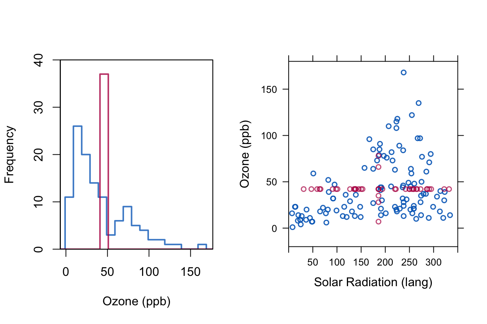

### Section 1.3.4 Regression imputation

``` r
fit <- lm(Ozone ~ Solar.R, data = airquality)
pred <- predict(fit, newdata = ic(airquality))

### alternative using mice
imp <- mice(airquality[, 1:2], method = "norm.predict", 
    m = 1, maxit = 3, seed = 1)
```

    ## 
    ##  iter imp variable
    ##   1   1  Ozone  Solar.R
    ##   2   1  Ozone  Solar.R
    ##   3   1  Ozone  Solar.R

``` r
### Figure 1.2
par(mfrow = c(1, 2))
fmis <- c(hist(pred, breaks, plot = FALSE)$counts, 0)
y <- matrix(c(fobs, fmis), ncol = 2)
matplot(x, y, type = "s", col = c(mdc(4), mdc(5)), lwd = 2, 
    lty = 1, xlim = c(0, 170), ylim = c(0, 40), yaxs = "i", 
    xlab = "Ozone (ppb)", ylab = "Frequency")
box()
tp <- xyplot(imp, Ozone ~ Solar.R, ylab = "Ozone (ppb)", 
    xlab = "Solar Radiation (lang)", cex = 0.75, lex = lwd, 
    ylim = c(-20, 180), xlim = c(0, 350))
print(tp, newpage = FALSE, position = c(0.48, 0.08, 1, 0.92))
```

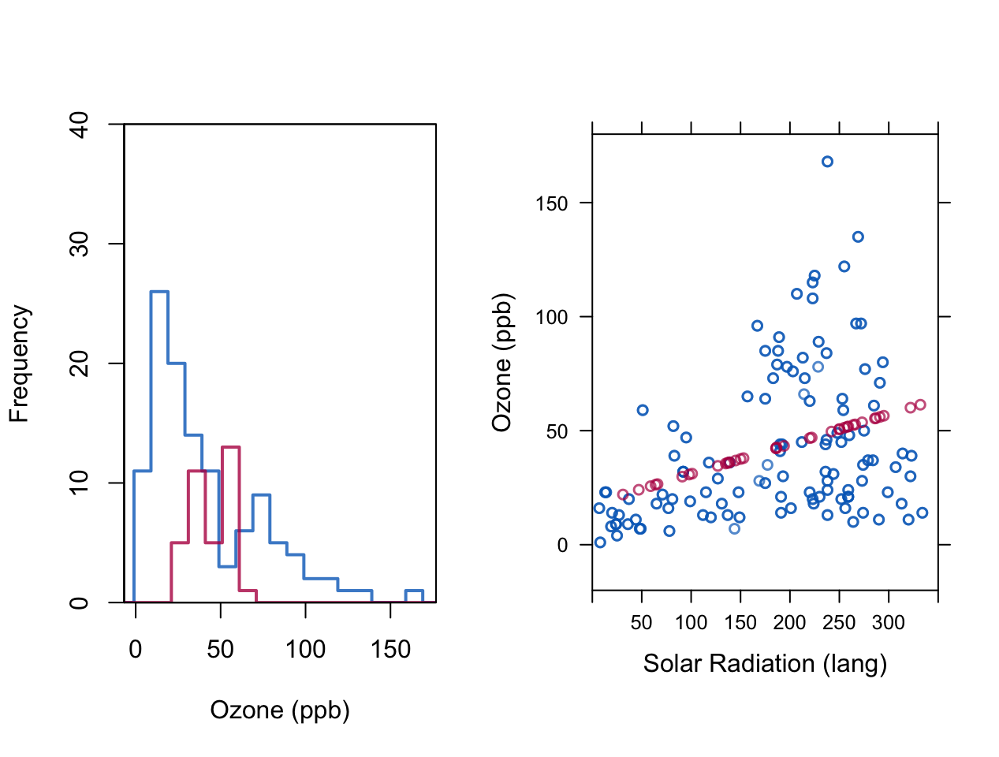

### Section 1.3.5 Stochastic regression imputation

``` r
imp <- mice(airquality[, 1:2], method = "norm.nob", m = 1, 
    maxit = 1, seed = 1)
```

    ## 
    ##  iter imp variable
    ##   1   1  Ozone  Solar.R

``` r
### Figure 1.3
par(mfrow = c(1, 2))
mis <- imp$imp$Ozone[, 1]
fmis <- c(hist(mis, breaks, plot = FALSE)$counts, 0)
y <- matrix(c(fobs, fmis), ncol = 2)
matplot(x, y, type = "s", col = c(mdc(4), mdc(5)), lwd = 2, 
    lty = 1, xlim = c(0, 170), ylim = c(0, 40), yaxs = "i", 
    xlab = "Ozone (ppb)", ylab = "Frequency")
box()
tp <- xyplot(imp, Ozone ~ Solar.R, na.groups = ici(imp), 
    ylab = "Ozone (ppb)", xlab = "Solar Radiation (lang)", 
    cex = 0.75, lex = lwd, ylim = c(-20, 180), xlim = c(0, 
        350))
print(tp, newpage = FALSE, position = c(0.48, 0.08, 1, 0.92))
```

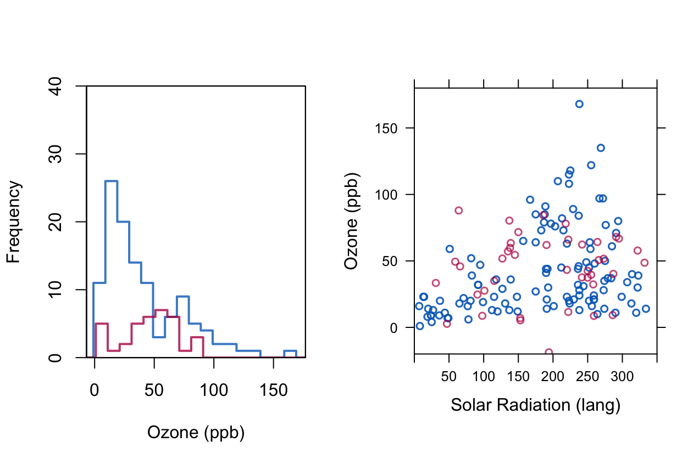

### Section 1.3.6 LOCF and BOCF

``` r
par(mfrow = c(1, 1))
Oz <- airquality$Ozone
locf <- function(x) {
    a <- x[1]
    for (i in 2:length(x)) {
        if (is.na(x[i])) 
            x[i] <- a else a <- x[i]
    }
    return(x)
}
Ozi <- locf(Oz)
colvec <- ifelse(is.na(Oz), mdc(2), mdc(1))

### Figure 1.4

plot(Ozi[1:80], col = colvec, type = "l", xlab = "Day number", 
    ylab = "Ozone (ppb)")
points(Ozi[1:80], col = colvec, pch = 20, cex = 1)
```

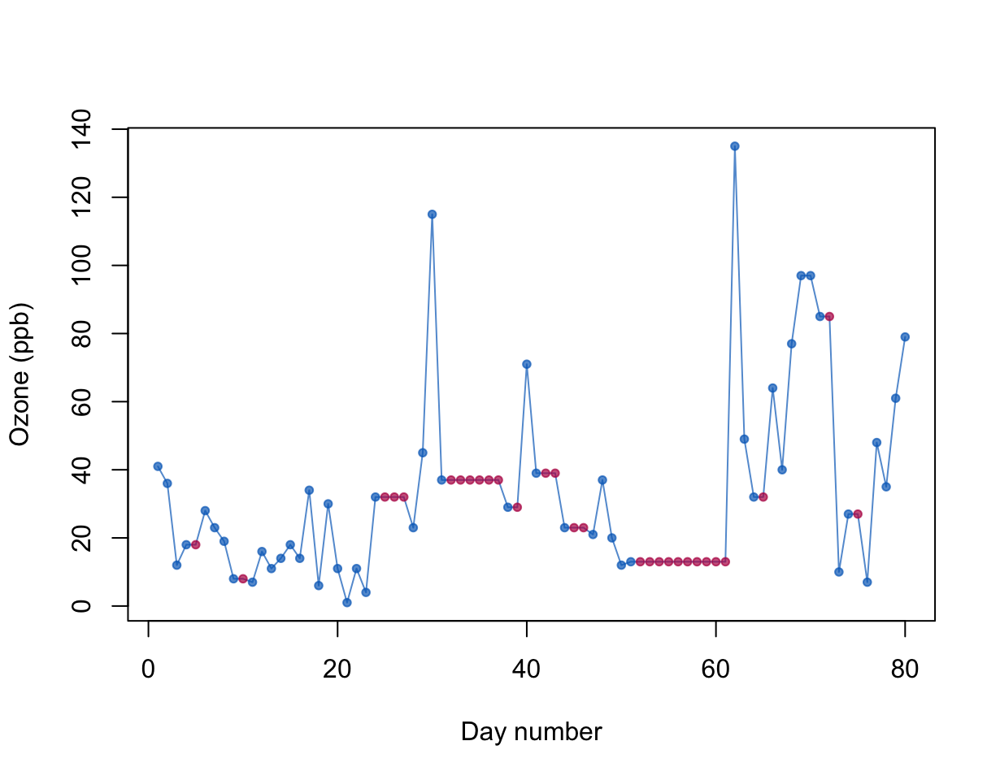

### Section 1.4.3 Example of multiple imputation

``` r
imp <- mice(airquality, seed = 1, print = FALSE)
fit <- with(imp, lm(Ozone ~ Wind + Temp + Solar.R))
tab <- round(summary(pool(fit)), 3)
tab[, c(1:3, 5)]
```

    ##                 est     se     t Pr(>|t|)
    ## (Intercept) -64.331 21.535 -2.99    0.004
    ## Wind         -3.053  0.658 -4.64    0.000
    ## Temp          1.612  0.231  6.97    0.000
    ## Solar.R       0.061  0.022  2.73    0.008

``` r
fit <- lm(Ozone ~ Wind + Temp + Solar.R, data = airquality, 
    na.action = na.omit)
round(coef(summary(fit)), 3)
```

    ##             Estimate Std. Error t value Pr(>|t|)
    ## (Intercept)   -64.34     23.055   -2.79    0.006
    ## Wind           -3.33      0.654   -5.09    0.000
    ## Temp            1.65      0.254    6.52    0.000
    ## Solar.R         0.06      0.023    2.58    0.011

``` r
### Figure 1.6
par(mfrow = c(1, 2))
mis <- imp$imp$Ozone[, 1]
fmis <- c(hist(mis, breaks, plot = FALSE)$counts, 0)
y <- matrix(c(fobs, fmis), ncol = 2)
matplot(x, y, type = "s", col = c(mdc(4), mdc(5)), lwd = 2, 
    lty = 1, xlim = c(0, 170), ylim = c(0, 40), yaxs = "i", 
    xlab = "Ozone (ppb)", ylab = "Frequency")
box()

tp <- xyplot(imp, Ozone ~ Solar.R, subset = .imp == 1, ylab = "Ozone (ppb)", 
    xlab = "Solar Radiation (lang)", cex = 0.75, lex = lwd, 
    ylim = c(-20, 180), xlim = c(0, 350))
print(tp, newpage = FALSE, position = c(0.48, 0.08, 1, 0.92))
```

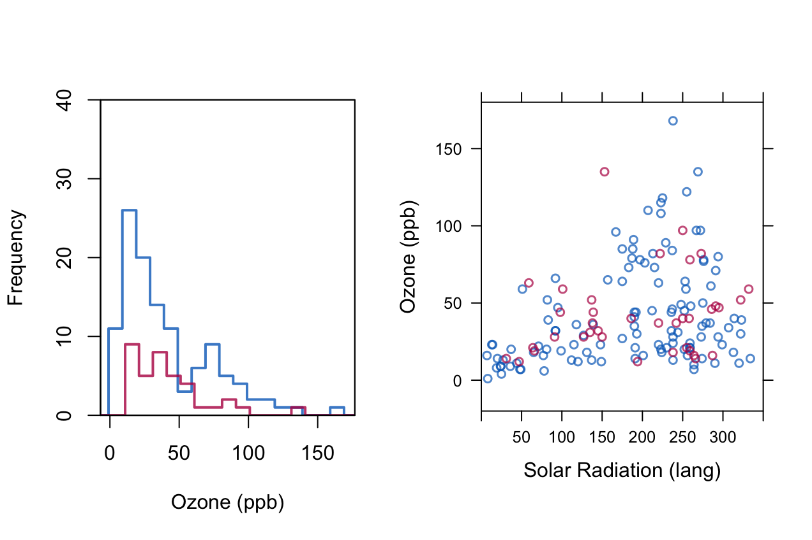

``` r
### scatterplot of all imputed data sets (not in the book)
xyplot(imp, Ozone ~ Solar.R | .imp, ylab = "Ozone (ppb)", 
    xlab = "Solar Radiation (lang)", cex = 0.75, lex = lwd, 
    ylim = c(-20, 180), xlim = c(0, 350))
```

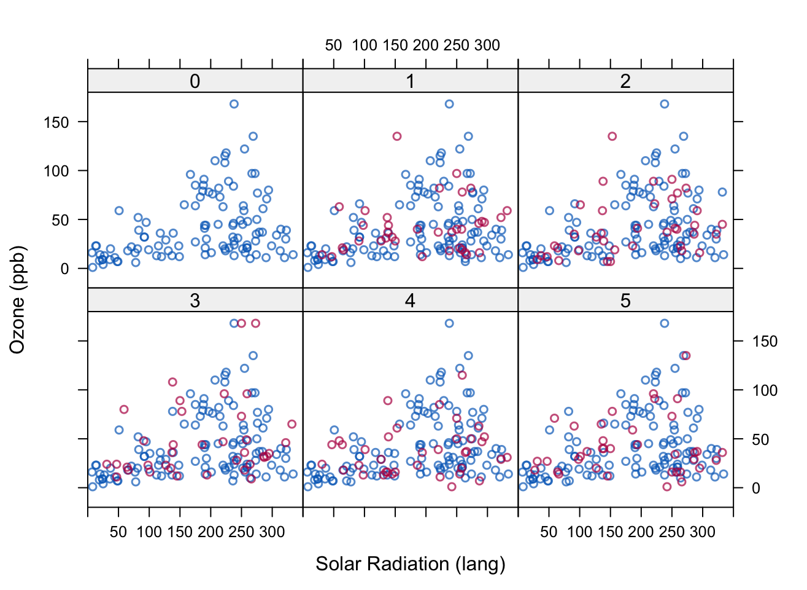

``` r
### Figure 1.7

Oz <- airquality$Ozone
colvec <- ifelse(is.na(Oz), mdc(2), mdc(1))
par(mfrow = c(1, 1))
plot(Oz[1:80], col = mdc(1), type = "l", xlab = "Day number", 
    ylab = "Ozone (ppb)")
points(Oz[1:80], col = mdc(1), pch = 20, cex = 1)

idx <- ici(airquality$Ozone) & (1:153) < 81
x <- (1:153)[idx]
points(x = x, y = complete(imp, 1)$Ozone[idx], col = mdc(2), 
    pch = 20, cex = 1)
points(x = x, y = complete(imp, 2)$Ozone[idx], col = mdc(2), 
    pch = 20, cex = 1)
points(x = x, y = complete(imp, 3)$Ozone[idx], col = mdc(2), 
    pch = 20, cex = 1)
points(x = x, y = complete(imp, 4)$Ozone[idx], col = mdc(2), 
    pch = 20, cex = 1)
points(x = x, y = complete(imp, 5)$Ozone[idx], col = mdc(2), 
    pch = 20, cex = 1)
```

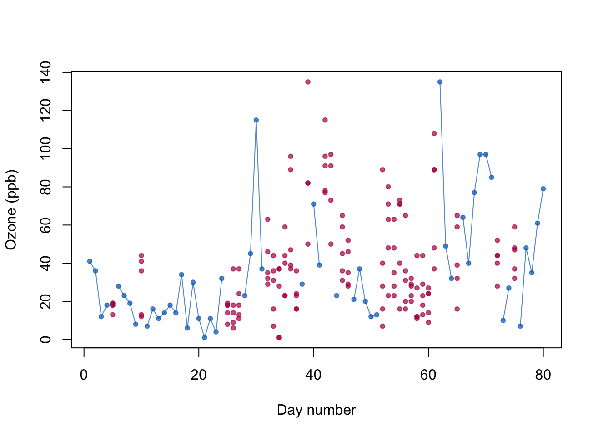

``` r
### figure of the autocorrelation function (not in the
### book)

par(mfrow = c(2, 5))
acf.ozone <- with(imp, acf(Ozone))
model <- expression(acf(resid(lm(Ozone ~ Wind + Temp + Solar.R))))
acf.resid <- with(imp, model)
```

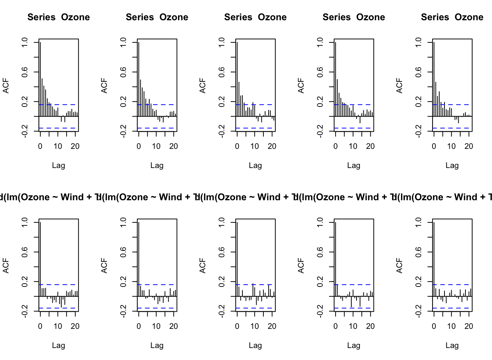

``` r
calcacf <- function(acf.list) {
    k <- length(acf.list)
    acc <- acf.list[[1]]$acf
    for (i in 2:k) acc <- acc + acf.list[[i]]$acf
    return(acc/k)
}
oz <- round(calcacf(acf.ozone$analyses), 2)
re <- round(calcacf(acf.resid$analyses), 2)
```

Chapter 2 Multiple imputation
-----------------------------

``` r
library("mice")
library("lattice")
library("MASS")

### Section 2.1.3 The expanding literature on multiple
### imputation Figure 2.1

cit <- c(2010, 37, 182, NA, 2009, 36, 129, NA, 2008, 27, 
    111, NA, 2007, 35, 136, NA, 2006, 18, 80, NA, 2005, 
    20, 76, NA, 2004, 6, 56, NA, 2003, 17, 42, NA, 2002, 
    14, 40, NA, 2001, 13, 36, 57, 2000, 8, 21, 33, 1999, 
    6, 25, 47, 1998, 6, 13, 22, 1997, 6, 18, 29, 1996, 4, 
    12, 28, 1995, 3, 5, 20, 1994, 2, 5, 34, 1993, 2, 6, 
    15, 1991, 2, 4, 19, 1990, 1, 2, 15, 1989, NA, NA, 11, 
    1988, 1, NA, 13, 1987, NA, NA, 10, 1986, NA, NA, 5, 
    1985, NA, NA, 1, 1984, NA, NA, 2, 1983, NA, NA, 5, 1982, 
    NA, NA, 2, 1981, NA, NA, 1, 1980, NA, NA, 5, 1979, NA, 
    NA, 2, 1978, NA, NA, 1, 1977, NA, NA, 2)
cit <- matrix(cit, nr = 2010 - 1977, nc = 4, byrow = TRUE)
cit <- as.data.frame(cit)
names(cit) <- c("Year", "Title", "Abstract", "All")
par(mfrow = c(1, 1))
par(cex = 0.7, lwd = 0.5)
plot(x = cit$Year, y = cit$Abstract, type = "o", log = "y", 
    xlim = c(1975, 2010), ylim = c(1, 200), ylab = "Number of publications (log)", 
    xlab = "Year", pch = 2, axes = FALSE)
axis(1, lwd = par("lwd"))
axis(2, lwd = par("lwd"), las = 1)
# box(lwd=0.5)
lines(x = cit$Year, y = cit$Title, pch = 15, type = "o")
lines(x = cit$Year, y = cit$All, pch = 16, type = "o")
legend(x = 1975, y = 200, legend = c("early publications", 
    "'multiple imputation' in abstract", "'multiple imputation' in title"), 
    pch = c(16, 2, 15), bty = "n")
```

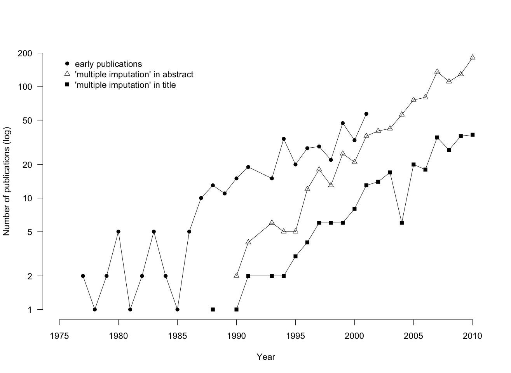

### Section 2.2.4 MCAR, MAR and MNAR again

``` r
logistic <- function(x) exp(x)/(1 + exp(x))
set.seed(80122)
n <- 300
y <- mvrnorm(n = n, mu = c(0, 0), Sigma = matrix(c(1, 0.5, 
    0.5, 1), nrow = 2))
y1 <- y[, 1]
y2 <- y[, 2]
r2.mcar <- 1 - rbinom(n, 1, 0.5)
r2.mar <- 1 - rbinom(n, 1, logistic(y1))
r2.mnar <- 1 - rbinom(n, 1, logistic(y2))

### Figure 2.2

y3 <- rbind(y, y, y)
r2 <- c(r2.mcar, r2.mar, r2.mnar)
r2 <- factor(r2, labels = c("Ymis", "Yobs"))
typ <- factor(rep(3:1, each = n), labels = c("MNAR", "MAR", 
    "MCAR"))
d <- data.frame(y1 = y3[, 1], y2 = y3[, 2], r2 = r2, typ = typ)
trellis.par.set(box.rectangle = list(col = c(mdc(2), mdc(1)), 
    lwd = 1.2))
trellis.par.set(box.umbrella = list(col = c(mdc(2), mdc(1)), 
    lwd = 1.2))
trellis.par.set(plot.symbol = list(col = mdc(3), lwd = 1))
tp <- bwplot(r2 ~ y2 | typ, data = d, horizontal = TRUE, 
    layout = c(1, 3), xlab = expression(Y^2), col = c(mdc(2), 
        mdc(1)), strip = FALSE, xlim = c(-3, 3), strip.left = strip.custom(bg = "grey95"))
print(tp)
```

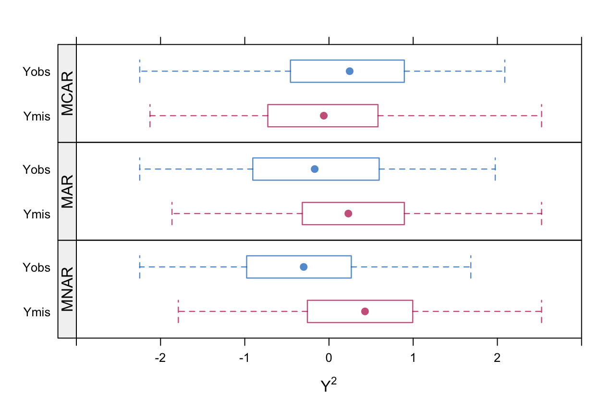

### Section 2.3.7 Numerical example

``` r
imp <- mice(nhanes, print = FALSE, m = 10, seed = 24415)
fit <- with(imp, lm(bmi ~ age))
est <- pool(fit)
names(est)
```

    ##  [1] "call"   "call1"  "call2"  "nmis"   "m"     
    ##  [6] "qhat"   "u"      "qbar"   "ubar"   "b"     
    ## [11] "t"      "r"      "dfcom"  "df"     "fmi"   
    ## [16] "lambda"

``` r
attach(est)
(r + 2/(df + 3))/(r + 1)
```

    ## (Intercept)         age 
    ##       0.408       0.310

``` r
(df + 1)/(df + 3) * lambda + 2/(df + 3)
```

    ## (Intercept)         age 
    ##       0.408       0.310

``` r
detach(est)
```

Chapter 3 Univariate imputation
-------------------------------

### Section 3.1 How to generate multiple imputations

``` r
library("mice")
library("lattice")
library("gamlss")
```

    ## Loading required package: splines

    ## Loading required package: gamlss.data

    ## Loading required package: gamlss.dist

    ## Loading required package: nlme

    ## Loading required package: parallel

    ##  **********   GAMLSS Version 5.0-2  **********

    ## For more on GAMLSS look at http://www.gamlss.org/

    ## Type gamlssNews() to see new features/changes/bug fixes.

``` r
library("rpart")

### In order to draw figure 3.1, we define two tweaked
### mice.impute.xxx functions that will store the
### coefficients of the imputation models in the global
### environment.  Normally, we would not be so interested
### in the parameter estimates of the imputation model,
### but here we need them for Figure 3.1.
mice.impute.normdump <- function(y, ry, x, ...) {
    x <- cbind(1, as.matrix(x))
    parm <- .norm.draw(y, ry, x, ...)
    betadump <<- c(betadump, parm$beta)
    return(x[!ry, ] %*% parm$beta + rnorm(sum(!ry)) * parm$sigma)
}
mice.impute.pmmdump <- function(y, ry, x, ...) {
    x <- cbind(1, as.matrix(x))
    parm <- .norm.draw(y, ry, x, ...)
    yhatobs <- x[ry, ] %*% parm$coef
    yhatmis <- x[!ry, ] %*% parm$beta
    betadump <<- c(betadump, parm$beta)
    return(apply(as.array(yhatmis), 1, .pmm.match, yhat = yhatobs, 
        y = y[ry], ...))
}


### Figure 3.1
par(mfrow = c(3, 2))
data <- whiteside
lwd <- 1.5
plot(x = data$Temp, y = data$Gas, col = mdc(1), lwd = lwd, 
    xlab = expression(paste("Temperature (", degree, "C)")), 
    ylab = "Gas consumption (cubic feet)")
points(x = 5, y = 3.6, pch = 4, cex = 2, lwd = lwd, col = mdc(2))
legend(x = "bottomleft", legend = "deleted observation", 
    pch = 4, col = mdc(2), pt.lwd = lwd, bty = "n", pt.cex = 2)
text(x = 9, y = 6.5, label = "a", cex = 2)

data[47, "Gas"] <- NA
plot(x = data$Temp, y = data$Gas, col = mdc(1), lwd = lwd, 
    xlab = expression(paste("Temperature (", degree, "C)")), 
    ylab = "Gas consumption (cubic feet)")
abline(m1 <- lm(Gas ~ Temp, data = data, na.action = na.omit), 
    col = mdc(4))
points(5, 4.04, lwd = lwd, col = mdc(2), pch = 19)
text(x = 9, y = 6.5, label = "b", cex = 2)

plot(x = data$Temp, y = data$Gas, col = mdc(1), lwd = lwd, 
    xlab = expression(paste("Temperature (", degree, "C)")), 
    ylab = "Gas consumption (cubic feet)")
imp <- mice(data, m = 1, maxit = 0)
pred <- imp$pred
pred["Gas", "Insul"] <- 0
imp <- mice(data, m = 5, pred = pred, meth = "norm.nob", 
    maxit = 1, print = FALSE, seed = 45433)
abline(m1 <- lm(Gas ~ Temp, data = data, na.action = na.omit), 
    col = mdc(4))
points(rep(5, 5), imp$imp$Gas, lwd = lwd, col = mdc(2), 
    pch = 19)
text(x = 9, y = 6.5, label = "c", cex = 2)

plot(x = data$Temp, y = data$Gas, col = mdc(1), lwd = lwd, 
    xlab = expression(paste("Temperature (", degree, "C)")), 
    ylab = "Gas consumption (cubic feet)")
imp <- mice(data, m = 1, maxit = 0)
pred <- imp$pred
pred["Gas", "Insul"] <- 0
betadump <- vector("list", 0)
imp <- mice(data, m = 5, pred = pred, meth = "normdump", 
    maxit = 1, print = FALSE, seed = 83126)
abline(m1 <- lm(Gas ~ Temp, data = data, na.action = na.omit), 
    col = mdc(4))
betadump <- matrix(betadump, nc = 2, byrow = TRUE)
for (i in 1:5) abline(coef = unlist(betadump[i, ]), col = mdc(5))
points(rep(5, 5), imp$imp$Gas, lwd = lwd, col = mdc(2), 
    pch = 19)
text(x = 9, y = 6.5, label = "d", cex = 2)

pch <- c(rep(3, 26), rep(1, 30))
plot(x = data$Temp, y = data$Gas, col = mdc(1), lwd = lwd, 
    pch = pch, xlab = expression(paste("Temperature (", 
        degree, "C)")), ylab = "Gas consumption (cubic feet)")
imp <- mice(data, m = 5, meth = "norm", maxit = 1, print = FALSE, 
    seed = 11727)
abline(m1 <- lm(Gas ~ Temp, data = data, na.action = na.omit, 
    subset = Insul == "Before"), col = mdc(4))
abline(m2 <- lm(Gas ~ Temp, data = data, na.action = na.omit, 
    subset = Insul == "After"), col = mdc(4))
points(rep(5, 5), imp$imp$Gas, lwd = lwd, col = mdc(2), 
    pch = 19)
legend(x = "bottomleft", legend = c("before insulation", 
    "after insulation"), pch = c(3, 1), bty = "n", pt.lwd = lwd)
text(x = 9, y = 6.5, label = "e", cex = 2)

pch <- c(rep(3, 26), rep(1, 30))
plot(x = data$Temp, y = data$Gas, col = mdc(1), lwd = lwd, 
    pch = pch, xlab = expression(paste("Temperature (", 
        degree, "C)")), ylab = "Gas consumption (cubic feet)")
betadump <- vector("list", 0)
imp <- mice(data, m = 5, meth = "pmmdump", maxit = 1, print = FALSE, 
    seed = 68006)
betadump <- matrix(betadump, nc = 3, byrow = TRUE)
m1 <- lm(Gas ~ Temp + Insul, data = data, na.action = na.omit)
an <- coef(m1)[1]
ai <- an + coef(m1)[3]
b <- coef(m1)[2]
abline(a = ai, b = b, col = mdc(4))
abline(a = an, b = b, col = mdc(4))
eta <- 0.6
ylo <- ai + b * (5 - eta)
yhi <- ai + b * (5 + eta)
lines(x = c(5 - eta, 5 + eta), y = c(ylo, yhi), lwd = 3, 
    col = mdc(5))
xlo <- (ylo - an)/b
xhi <- (yhi - an)/b
lines(x = c(xlo, xhi), y = c(ylo, yhi), lwd = 3, col = mdc(5))

donors <- subset(data, (Insul == "After" & Temp > 5 - eta & 
    Temp < 5 + eta) | (Insul == "Before" & Temp > xlo & 
    Temp < xhi))
points(x = donors$Temp, y = donors$Gas, cex = 1.8, col = mdc(5), 
    lwd = lwd)
legend(x = "bottomleft", legend = c("before insulation", 
    "after insulation"), pch = c(3, 1), bty = "n", pt.lwd = lwd)
text(x = 9, y = 6.5, label = "f", cex = 2)
```

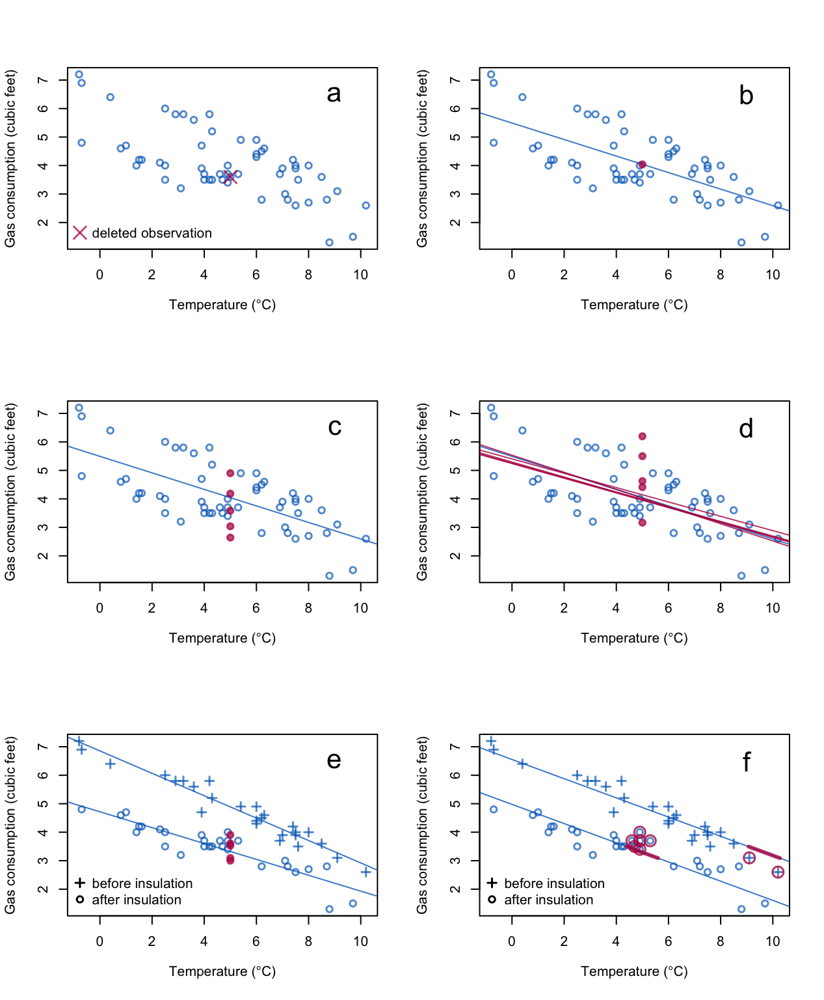

### Section 3.2.3 Performance

``` r
### number of simulations use nsim <- 10 for testing nsim
### <- 10000 for the real stuff (TIME CONSUMING)
nsim <- 10

### create data
createdata <- function(beta0 = 5.49, beta1 = -0.29, sigma = 0.86, 
    n = 50, mx = 5, sdx = 3) {
    x <- round(rnorm(n, mean = mx, sd = sdx), 1)
    eps <- rnorm(n, mean = 0, sd = sigma)
    y <- round(beta0 + x * beta1 + eps, 1)
    return(data.frame(x = x, y = y))
}

### make 50% random missing data
makemissing <- function(data, p = 0.5) {
    rx <- rbinom(nrow(data), 1, p)
    data[rx == 0, "y"] <- NA
    return(data)
}

### test function for three imputation functions
test.impute <- function(data, m = 5, method = "norm", ...) {
    imp <- mice(data, method = method, m = m, print = FALSE, 
        ridge = 0, ...)
    fit <- with(imp, lm(y ~ x))
    est <- pool(fit)
    tab <- summary(est)
    return(tab["x", c("est", "se", "lo 95", "hi 95", "fmi", 
        "lambda")])
}

### put everything together
simulate <- function(nsim = 10, seed = 41872) {
    set.seed(seed)
    res <- array(NA, dim = c(4, nsim, 6))
    dimnames(res) <- list(c("predict", "pred + noise", "Bayes MI", 
        "boot MI"), as.character(1:nsim), c("est", "se", 
        "lo 95", "hi 95", "fmi", "lambda"))
    im <- c("norm.predict", "norm.nob", "norm", "norm.boot")
    for (i in 1:nsim) {
        data <- createdata()
        data <- makemissing(data)
        res[1, i, ] <- test.impute(data, method = im[1], 
            m = 2)
        res[2, i, ] <- test.impute(data, method = im[2])
        res[3, i, ] <- test.impute(data, method = im[3])
        res[4, i, ] <- test.impute(data, method = im[4])
    }
    return(res)
}

summarize.results <- function(res) {
    apply(res, c(1, 3), mean, na.rm = TRUE)
    
    ## bias of beta1
    true <- -0.29
    bias <- rowMeans(res[, , 1] - true)
    
    ## coverage
    isin <- res[, , 3] < true & true < res[, , 4]
    cov <- rowMeans(isin)
    
    ## average width of 95 c.i.
    intwidth <- res[, , 4] - res[, , 3]
    aiw <- rowMeans(intwidth)
    
    return(list(bias = bias, cov = cov, aiw = aiw))
}

### do the simulations - MAY BE TIME CONSUMING
res <- simulate(nsim)
summarize.results(res)
```

    ## $bias
    ##      predict pred + noise     Bayes MI      boot MI 
    ##     -0.01635     -0.02184     -0.01149     -0.00582 
    ## 
    ## $cov
    ##      predict pred + noise     Bayes MI      boot MI 
    ##          0.8          0.9          1.0          1.0 
    ## 
    ## $aiw
    ##      predict pred + noise     Bayes MI      boot MI 
    ##        0.126        0.242        0.318        0.287

``` r
### function to simulate performance of CCA
simulate.cca <- function(nsim = 10, seed = 41872) {
    
    set.seed(seed)
    res <- array(NA, dim = c(1, nsim, 6))
    for (i in 1:nsim) {
        data <- createdata()
        data <- makemissing(data)
        fit <- lm(y ~ x, data = data, na.action = na.omit)
        est <- coef(summary(fit))
        lo95 <- est[, 1] - qt(0.975, fit$df) * est[, 2]
        hi95 <- est[, 1] + qt(0.975, fit$df) * est[, 2]
        est <- cbind(est, lo95, hi95)
        res[1, i, ] <- c(est["x", c(1:2, 5:6)], NA, NA)
    }
    return(res)
}

### simulate - MAY BE TIME CONSUMING
res.cca <- simulate.cca(nsim)
### cannot be analysed by summarize.results() but it
### should be obvious how to calculate bias, coverage and
### aiw
```

### Section 3.2.4 Generating MAR missing data

``` r
### script to create missing data according to MARRIGHT
logistic <- function(x) exp(x)/(1 + exp(x))
set.seed(32881)
n <- 10000
y <- mvrnorm(n = n, mu = c(5, 5), Sigma = matrix(c(1, 0.6, 
    0.6, 1), nrow = 2))
p2.marright <- 1 - logistic(-5 + y[, 1])
r2.marright <- rbinom(n, 1, p2.marright)
yobs <- y
yobs[r2.marright == 0, 2] <- NA

### Figure 3.2

grid <- seq(0, 10, 0.1)
mr <- logistic(-5 + grid)
mm <- logistic(0.75 - abs(grid - 5))
mt <- logistic(-0.75 + abs(grid - 5))

par(mfrow = c(1, 1))
z <- data.frame(grid, mr, mm, mt)
matplot(x = z[, 1], y = z[, 2:4], type = "l", lty = 1:3, 
    col = mdc(5), lwd = 2, xlab = "Y1", ylab = "Missingness in Y2", 
    las = 1)
legend(x = "top", bty = "n", legend = c("MARRIGHT", "MARMID", 
    "MARTAIL"), lty = 1:3, lwd = 2, col = mdc(5), cex = 0.8)
```

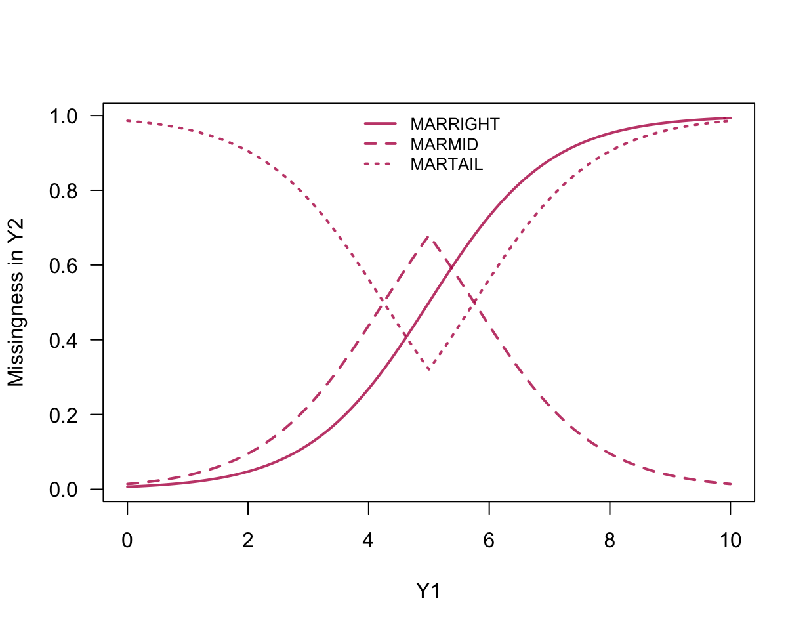

``` r
### Figure 3.3

y3 <- rbind(y, y, y)
p2.marmid <- 1 - logistic(0.75 - abs(y[, 1] - 5))
p2.martail <- 1 - logistic(0.75 + abs(y[, 1] - 5))
r2.marmid <- rbinom(n, 1, p2.marright)
r2.martail <- rbinom(n, 1, p2.martail)
r2 <- c(r2.marright, r2.marmid, r2.martail)
r2 <- factor(r2, labels = c("Ymis", "Yobs"))
typ <- factor(rep(3:1, each = n), labels = c("MARTAIL", 
    "MARMID", "MARRIGHT"))
d <- data.frame(y1 = y3[, 1], y2 = y3[, 2], r2 = r2, typ = typ)
trellis.par.set(box.rectangle = list(col = c(mdc(2), mdc(1)), 
    lwd = 1.2))
trellis.par.set(box.umbrella = list(col = c(mdc(2), mdc(1)), 
    lwd = 1.2))
trellis.par.set(plot.symbol = list(col = "transparent", 
    lwd = 1))
tp <- bwplot(r2 ~ y2 | typ, data = d, horizontal = TRUE, 
    layout = c(1, 3), xlab = expression(Y2), col = c(mdc(2), 
        mdc(1)), strip = FALSE, xlim = c(2, 8), strip.left = strip.custom(bg = "grey95"))
print(tp)
```

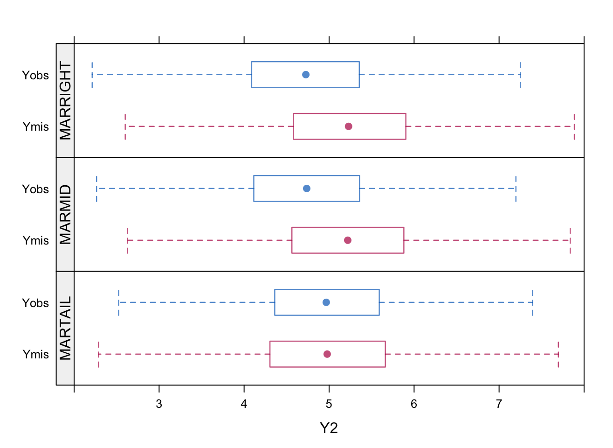

### Section 3.2.2 Imputation from the t-distribution

``` r
mice.impute.tf <- function(y, ry, x, gamlss.trace = FALSE, 
    ...) {
    require(gamlss)
    
    # prepare data
    xobs <- x[ry, , drop = FALSE]
    xmis <- x[!ry, , drop = FALSE]
    yobs <- y[ry]
    n1 <- sum(ry)
    n0 <- sum(!ry)
    
    # draw bootstrap sample
    s <- sample(n1, n1, replace = TRUE)
    dotxobs <- xobs[s, , drop = FALSE]
    dotyobs <- yobs[s]
    dotxy <- data.frame(dotxobs, y = dotyobs)
    
    # fit the gamlss model
    fit <- gamlss(y ~ ., data = dotxy, family = TF, trace = gamlss.trace, 
        ...)
    yhat <- predict(fit, data = dotxy, newdata = xmis)
    sigma <- exp(coef(fit, "sigma"))
    nu <- exp(coef(fit, "nu"))
    
    # draw the imputations
    return(rTF(n0, yhat, sigma, nu))
}
```

### Section 3.3.3 Example

``` r
data(db)

### Figure 3.4

par(mfrow = c(1, 2))
data <- subset(db, age > 1 & age < 2, c("age", "head"))
names(data) <- c("age", "hc")
truehist(data$hc, col = mdc(1), border = "white", xlab = "Head circumference (cm)", 
    ylab = "Density", ylim = c(0, 0.3), xlim = c(38, 60), 
    nbins = 44)

mn <- gamlss(hc ~ 1, data = na.omit(data), family = NO, 
    trace = FALSE)
mu <- coef(mn)
sigma <- exp(coef(mn, "sigma"))
cmfine <- seq(38, 60, 0.1)
lines(cmfine, dNO(cmfine, mu, sigma), lwd = 0.8, lty = 2)
mt <- gamlss(hc ~ 1, data = data, family = TF, trace = FALSE)
mu <- coef(mt)
sigma <- exp(coef(mt, "sigma"))
nu <- exp(coef(mt, "nu"))
lines(cmfine, dTF(cmfine, mu, sigma, nu), lwd = 0.8, lty = 1)
legend(x = "right", legend = c("normal", "t, df=6.7"), lwd = 0.8, 
    lty = c(2, 1), bty = "n", cex = 0.7)

plot(x = data$age, y = data$hc, col = mdc(1), cex = 0.3, 
    xlab = "Age (in years)", ylab = "Head circumference (cm)", 
    ylim = c(39, 60))
```

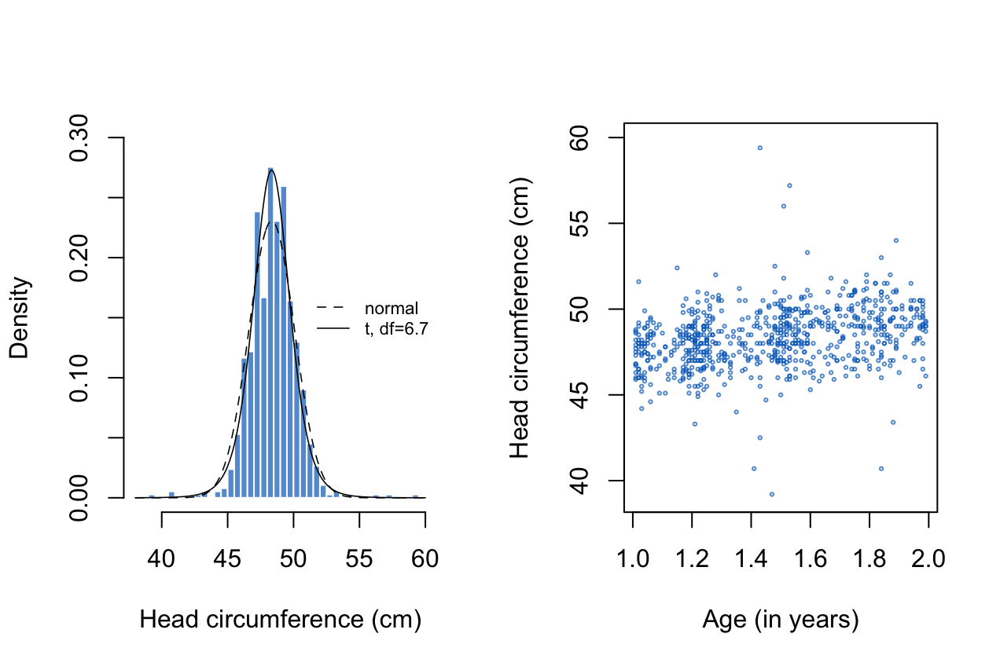

``` r
### create a synthetic data set
data(db)
data <- subset(db, age > 1 & age < 2, c("age", "head"))
names(data) <- c("age", "hc")
synthetic <- rep(c(FALSE, TRUE), each = nrow(data))
data2 <- rbind(data, data)
data2[synthetic, "hc"] <- NA
imp <- mice(data2, m = 1, meth = "tf", seed = 36650, print = FALSE)
syn <- subset(complete(imp), synthetic)

### Figure 3.5

data <- syn
truehist(data$hc, col = mdc(2), border = "white", xlab = "Head circumference (cm)", 
    ylab = "Density", ylim = c(0, 0.3), xlim = c(38, 60), 
    nbins = 44)

mn <- gamlss(hc ~ 1, data = na.omit(data), family = NO, 
    trace = FALSE)
mu <- coef(mn)
sigma <- exp(coef(mn, "sigma"))
cmfine <- seq(38, 60, 0.1)
lines(cmfine, dNO(cmfine, mu, sigma), lwd = 0.8, lty = 2)
mt <- gamlss(hc ~ 1, data = data, family = TF, trace = FALSE)
mu <- coef(mt)
sigma <- exp(coef(mt, "sigma"))
nu <- exp(coef(mt, "nu"))
lines(cmfine, dTF(cmfine, mu, sigma, nu), lwd = 0.8, lty = 1)
legend(x = "right", legend = c("normal", paste("t, df=", 
    round(nu, 1), sep = "")), lwd = 0.8, lty = c(2, 1), 
    bty = "n", cex = 0.7)
```

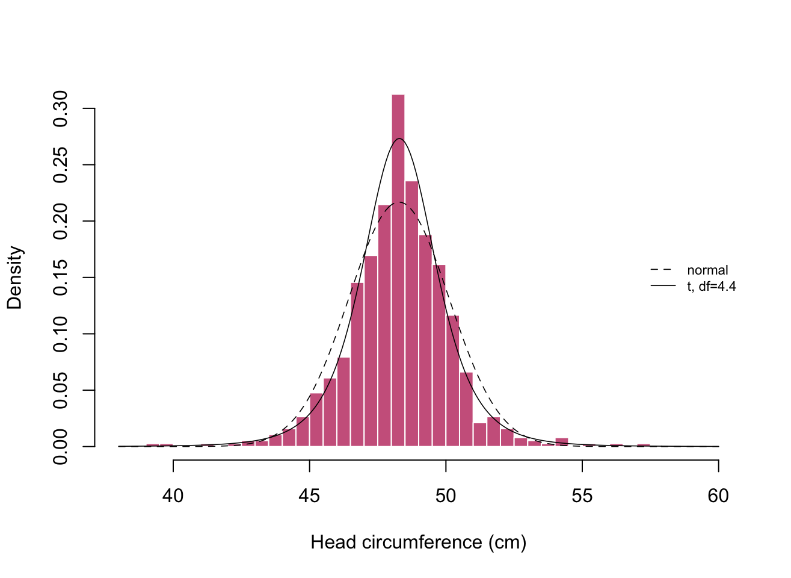

``` r
plot(x = data$age, y = data$hc, col = mdc(2), cex = 0.3, 
    xlab = "Age (in years)", ylab = "Head circumference (cm)", 
    ylim = c(39, 60))
```

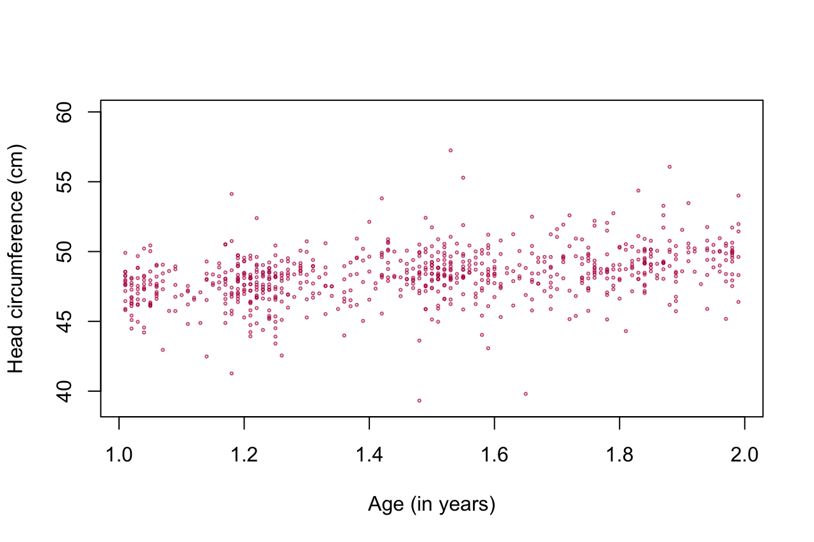

### Section 3.4.1 PMM, Overview

``` r
### Figure 3.6

data <- boys[boys$age <= 2, c("age", "bmi")]
set.seed(87120)
data[sample(92:136, 10), "bmi"] <- NA
imp <- mice(data, meth = "norm", m = 1, seed = 32212, print = FALSE)
cd1 <- complete(imp)
imp <- mice(data, m = 1, seed = 32212, print = FALSE)
cd2 <- complete(imp)
r <- !is.na(data$bmi)
plot(data, col = mdc(1), xlab = "Age", ylab = "BMI")
points(cd1[!r, ], col = mdc(2), pch = 19, cex = 0.8)
```

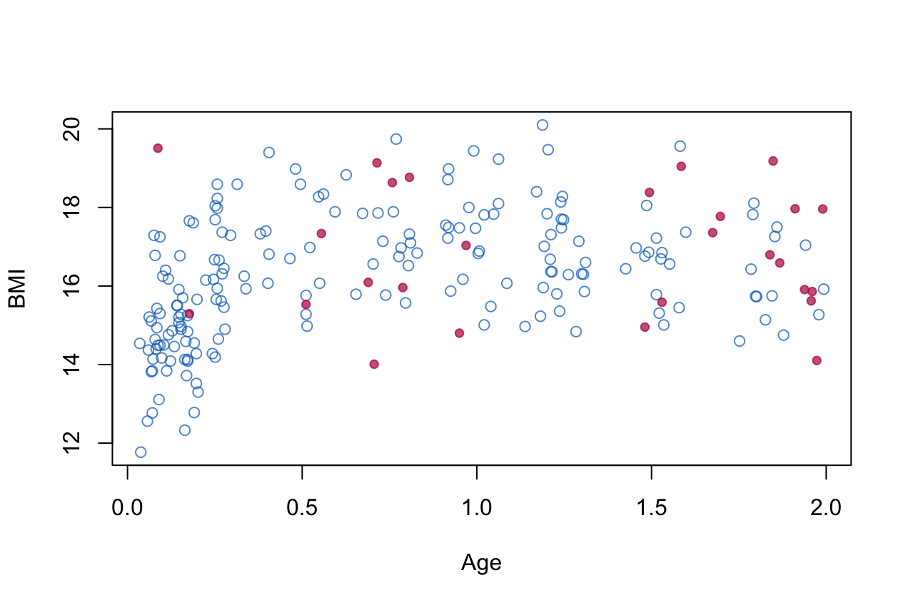

``` r
plot(data, col = mdc(1), xlab = "Age", ylab = "BMI")
points(cd2[!r, ], col = mdc(2), pch = 19, cex = 0.8)
```

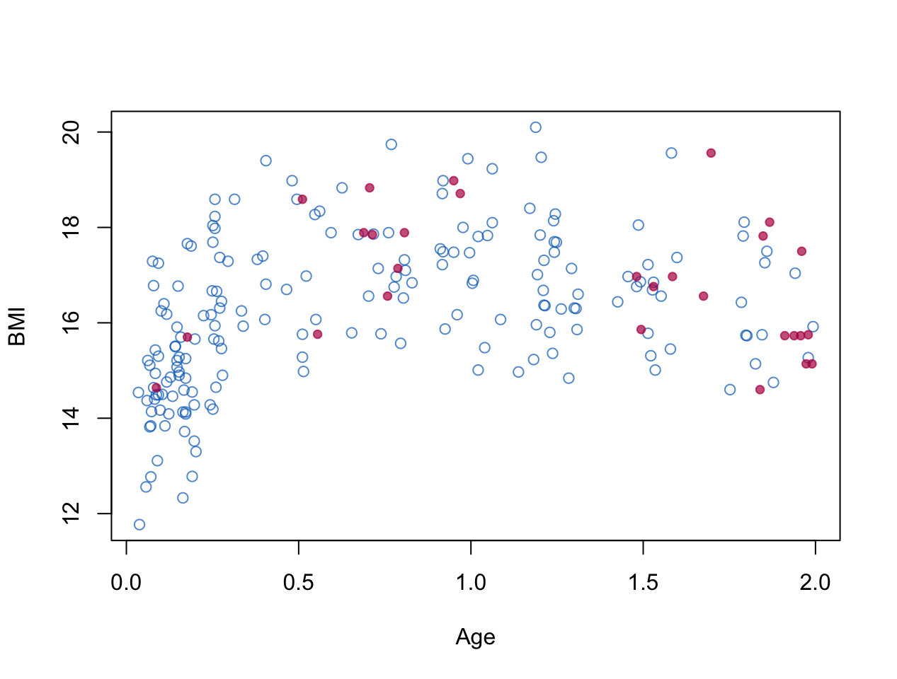

### Section 3.4.2 PMM, Computational details

``` r
### Figure 3.7

par(mfrow = c(1, 1))
data <- whiteside
lwd <- 1.5
data[47, "Gas"] <- NA

pch <- c(rep(3, 26), rep(1, 30))
plot(x = data$Temp, y = data$Gas, col = mdc(1), lwd = lwd, 
    pch = pch, xlab = expression(paste("Temperature (", 
        degree, "C)")), ylab = "Gas consumption (cubic feet)")
betadump <- vector("list", 0)
imp <- mice(data, m = 5, meth = "pmmdump", maxit = 1, print = FALSE, 
    seed = 68006)
betadump <- matrix(unlist(betadump), nc = 3, byrow = TRUE)
m1 <- lm(Gas ~ Temp + Insul, data = data, na.action = na.omit)
an <- coef(m1)[1]
ai <- an + coef(m1)[3]
b <- coef(m1)[2]
abline(a = ai, b = b, col = mdc(4))
abline(a = an, b = b, col = mdc(4))
## for (i in 56:56) { abline(a=unlist(betadump[i,1]),
## b=unlist(betadump[i,2]), col=mdc(5))
## abline(a=unlist(betadump[i,1])+unlist(betadump[i,3]),
## b=unlist(betadump[i,2]), col=mdc(5)) }
## points(rep(5,5),imp$imp$Gas, lwd=lwd, col=mdc(2),
## pch=20)
eta <- 0.6
ylo <- ai + b * (5 - eta)
yhi <- ai + b * (5 + eta)
lines(x = c(5 - eta, 5 + eta), y = c(ylo, yhi), lwd = 3, 
    col = mdc(4))
an <- 7.05
ai <- an - 1.7
b <- -0.38
xlo1 <- (ylo - ai)/b
xhi1 <- (yhi - ai)/b
xlo2 <- (ylo - an)/b
xhi2 <- (yhi - an)/b
abline(a = an, b = b, col = mdc(5))
abline(a = ai, b = b, col = mdc(5))
lines(x = c(xlo1, xhi1), y = c(ylo, yhi), lwd = 3, col = mdc(5))
lines(x = c(xlo2, xhi2), y = c(ylo, yhi), lwd = 3, col = mdc(5))
abline(v = c(5 - eta, 5 + eta), h = c(ylo, yhi), col = mdc(4), 
    lty = 3)
rect(xlo1, 0, xhi1, 8, col = hcl(0, 100, 40, 0.05), border = NA)
rect(xlo2, 0, xhi2, 8, col = hcl(0, 100, 40, 0.05), border = NA)
# abline(v=c(xlo1,xhi1,xlo2,xhi2),col=mdc(5),lty=3)

donors <- subset(data, (Insul == "After" & Temp > xlo1 & 
    Temp < xhi1) | (Insul == "Before" & Temp > xlo2 & Temp < 
    xhi2))
points(x = donors$Temp, y = donors$Gas, cex = 1.8, col = mdc(5), 
    lwd = lwd)
legend(x = "bottomleft", legend = c("before insulation", 
    "after insulation"), pch = c(3, 1), bty = "n", pt.lwd = lwd)
```


### Section 3.4.3 PMM, Algorithm

``` r
### simulate function used to calculate Table 3.3
simulate <- function(nsim = 10, seed = 41872) {
    set.seed(seed)
    res <- array(NA, dim = c(3, nsim, 6))
    for (i in 1:nsim) {
        data <- createdata()
        data <- makemissing(data)
        res[1, i, ] <- test.impute(data, m = 5)
        res[2, i, ] <- test.impute(data, m = 5, donors = 1)
        res[3, i, ] <- test.impute(data, m = 5, donors = 10)
    }
    return(res)
}

### and perform simulations - MAY BE TIME CONSUMING
res.pmm <- simulate(nsim)
summarize.results(res.pmm)
```

    ## $bias
    ## [1] -0.02267 -0.00413 -0.00607
    ## 
    ## $cov
    ## [1] 1.0 1.0 0.8
    ## 
    ## $aiw
    ## [1] 0.291 0.317 0.298

### Section 3.7.1

``` r
### Figure 3.8

par(mfrow = c(1, 2))
fit <- rpart(Gas ~ Temp + Insul, data = whiteside)
plot(fit, branch = 0, margin = 0.15)
text(fit, use = T, pretty = 0, dig = 3, cex = 0.8)

leaf <- row.names(fit$frame)[fit$where]
label <- factor(leaf, labels = c(2, 3, 1, 4, 5))
plot(x = whiteside$Temp, y = whiteside$Gas, type = "n", 
    xlab = expression(paste("Temperature (", degree, "C)")), 
    ylab = "Gas consumption (cubic feet)")
text(x = whiteside$Temp, y = whiteside$Gas, label = label, 
    col = mdc(4), cex = 0.6)
```

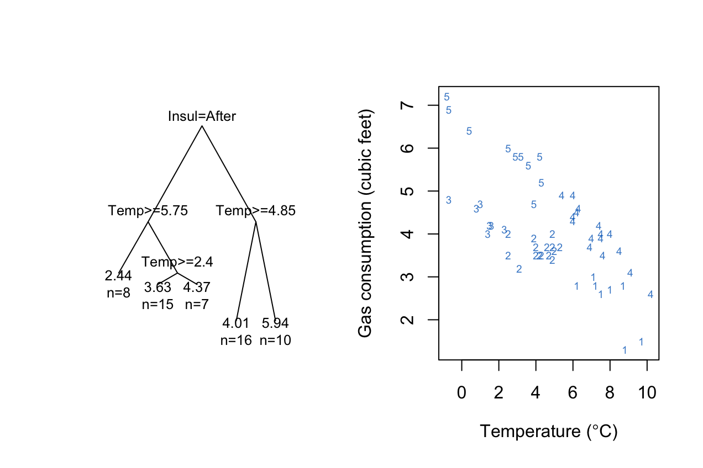

### Section 3.9.4 Converting selection and pattern-mixture models

``` r
### Figure 3.9

par(mfrow = c(1, 2))
s <- c(100, 0.015, 0.058, 0.02, 0.35, 110, 0.024, 0.074, 
    0.03, 0.3, 120, 0.043, 0.103, 0.05, 0.25, 130, 0.091, 
    0.164, 0.1, 0.2, 140, 0.145, 0.185, 0.15, 0.15, 150, 
    0.307, 0.247, 0.3, 0.1, 160, 0.157, 0.099, 0.15, 0.08, 
    170, 0.107, 0.049, 0.1, 0.06, 180, 0.055, 0.016, 0.05, 
    0.04, 190, 0.033, 0.005, 0.03, 0.02, 200, 0.023, 0, 
    0.02, 0, 210, 0.023, 0, 0.02, 0)
sm <- matrix(s, nr = 12, nc = 5, byrow = TRUE)
snug <- 1.5
xx <- cbind(sm[, 1] - 5 + snug, sm[, 1] - 5 - snug, sm[, 
    1] - 5)
matplot(x = xx[, 3], y = cbind(1 - sm[, 5]), col = mdc(1), 
    type = "p", lwd = 2, lty = 1, pch = 20, xlab = "Systolic BP (mmHg)", 
    ylab = "Observation probability")
matplot(x = xx, y = sm[, 2:4], type = "s", col = c(mdc(4), 
    mdc(5), mdc(6)), lwd = 2, lty = 1, xlab = "Systolic BP (mmHg)", 
    ylab = "Density")
```

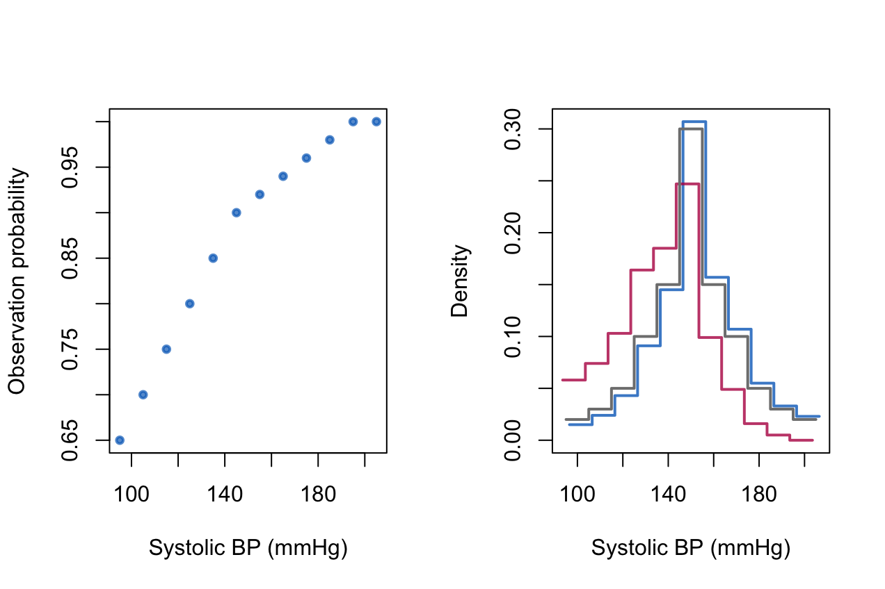

Chapter 4 Multivariate missing data
-----------------------------------

### Section 4.1 Missing data patterns

``` r
library("mice")
library("lattice")

### define data sets pattern1-pattern4 with four patterns
data <- matrix(sample(1:100, 4 * 8 * 3, replace = TRUE), 
    nrow = 8 * 4, dimnames = list(NULL, c("A", "B", "C")))
data <- as.data.frame(data)
data[c(31:32), "A"] <- NA
data[c(15:16, 22:24, 30:32), "B"] <- NA
data[c(6:8, 12:16, 17:21, 27:29), "C"] <- NA
mdpat <- cbind(expand.grid(rec = 8:1, pat = 1:4, var = 1:3), 
    r = as.numeric(as.vector(is.na(data))))
pattern1 <- data[1:8, ]
pattern2 <- data[9:16, ]
pattern3 <- data[17:24, ]
pattern4 <- data[25:32, ]

### Figure 4.1
types <- c("Univariate", "Monotone", "File matching", "General")
tp41 <- levelplot(r ~ var + rec | as.factor(pat), data = mdpat, 
    as.table = TRUE, aspect = "iso", shrink = c(0.9), col.regions = mdc(1:2), 
    colorkey = FALSE, scales = list(draw = FALSE), xlab = "", 
    ylab = "", between = list(x = 1, y = 0), strip = strip.custom(bg = "grey95", 
        style = 1, factor.levels = types))
print(tp41)
```

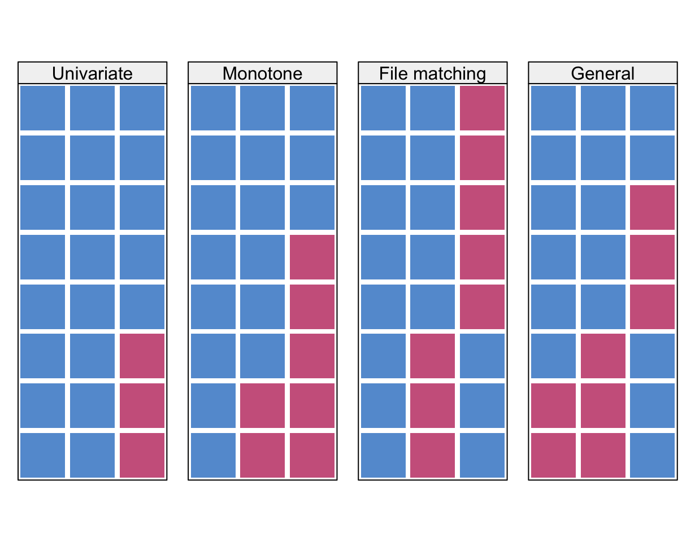

``` r
md.pattern(pattern4)
```

    ##   A B C  
    ## 2 1 1 1 0
    ## 1 1 0 1 1
    ## 3 1 1 0 1
    ## 2 0 0 1 2
    ##   2 3 3 8

``` r
p <- md.pairs(pattern4)
p
```

    ## $rr
    ##   A B C
    ## A 6 5 3
    ## B 5 5 2
    ## C 3 2 5
    ## 
    ## $rm
    ##   A B C
    ## A 0 1 3
    ## B 0 0 3
    ## C 2 3 0
    ## 
    ## $mr
    ##   A B C
    ## A 0 0 2
    ## B 1 0 3
    ## C 3 3 0
    ## 
    ## $mm
    ##   A B C
    ## A 2 2 0
    ## B 2 3 0
    ## C 0 0 3

``` r
### proportion of usable cases
p$mr/(p$mr + p$mm)
```

    ##       A B C
    ## A 0.000 0 1
    ## B 0.333 0 1
    ## C 1.000 1 0

``` r
### outbound statistics
p$rm/(p$rm + p$rr)
```

    ##     A     B   C
    ## A 0.0 0.167 0.5
    ## B 0.0 0.000 0.6
    ## C 0.4 0.600 0.0

``` r
### Figure 4.2
par(mfrow = c(2, 2))
fluxplot(pattern1, main = "", xlim = c(-0.1, 1.1), ylim = c(-0.1, 
    1.1))
text(x = 0.5, y = 1, label = "Univariate")
fluxplot(pattern2, main = "", xlim = c(-0.1, 1.1), ylim = c(-0.1, 
    1.1))
text(x = 0.5, y = 1, label = "Monotone")
fluxplot(pattern3, main = "", xlim = c(-0.1, 1.1), ylim = c(-0.1, 
    1.1))
text(x = 0.5, y = 1, label = "File matching")
fluxplot(pattern4, main = "", xlim = c(-0.1, 1.1), ylim = c(-0.1, 
    1.1))
text(x = 0.5, y = 1, label = "General")
```

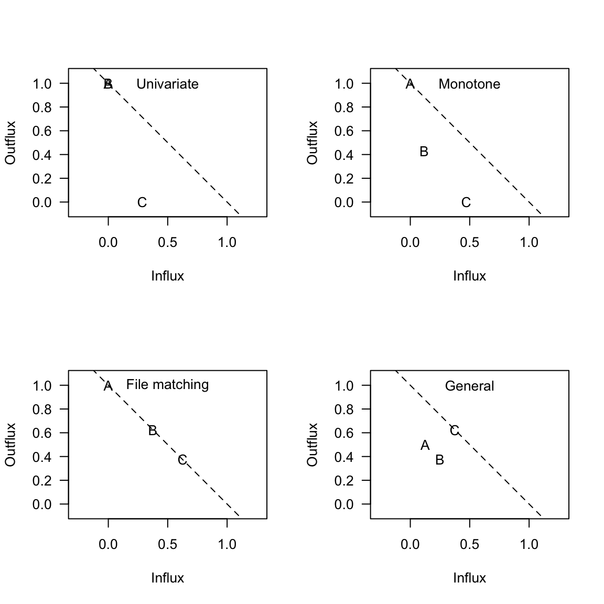

``` r
### calculate pobs, influx, outflux of general pattern
flux(pattern4)[, 1:3]
```

    ##    pobs influx outflux
    ## A 0.750  0.125   0.500
    ## B 0.625  0.250   0.375
    ## C 0.625  0.375   0.625

``` r
### section 4.3 Monotone data imputation monotone data
### imputation on three columns
data <- nhanes2[, 1:3]
md.pattern(data)
```

    ##    age hyp bmi   
    ## 16   1   1   1  0
    ##  1   1   1   0  1
    ##  8   1   0   0  2
    ##      0   8   9 17

``` r
imp <- mice(data, visit = "monotone", maxit = 1, m = 2)
```

    ## 
    ##  iter imp variable
    ##   1   1  hyp  bmi
    ##   1   2  hyp  bmi

``` r
### Numerical example, approximate two-step
ini <- mice(nhanes2, maxit = 0)
pred <- ini$pred
pred["bmi", "chl"] <- 0
pred["hyp", c("chl", "bmi")] <- 0
imp <- mice(nhanes2, vis = "monotone", pred = pred, maxit = 1, 
    m = 2)
```

    ## 
    ##  iter imp variable
    ##   1   1  hyp  bmi  chl
    ##   1   2  hyp  bmi  chl

### Section 4.5 Fully Conditional Specification

``` r
### Example of slow convergence
generate <- function(n = c(1000, 4500, 4500, 0), cor = matrix(c(1, 
    0.9, 0.9, 0.9, 1, 0.7, 0.9, 0.7, 1), nrow = 3)) {
    require(MASS)
    nt <- sum(n)
    cs <- cumsum(n)
    data <- mvrnorm(nt, mu = rep(0, 3), Sigma = cor)
    dimnames(data) <- list(1:nt, c("X", "Y1", "Y2"))
    if (n[2] > 0) 
        data[(cs[1] + 1):cs[2], "Y1"] <- NA
    if (n[3] > 0) 
        data[(cs[2] + 1):cs[3], "Y2"] <- NA
    if (n[4] > 0) 
        data[(cs[3] + 1):cs[4], c("Y1", "Y2")] <- NA
    return(data)
}

impute <- function(data, m = 5, method = "norm", print = FALSE, 
    maxit = 10, ...) {
    statistic <- matrix(NA, nrow = maxit, ncol = m)
    for (iter in 1:maxit) {
        if (iter == 1) 
            imp <- mice(data, m = m, method = method, print = print, 
                maxit = 1, ...) else imp <- mice.mids(imp, maxit = 1, print = print, 
            ...)
        statistic[iter, ] <- unlist(with(imp, cor(Y1, Y2))$analyses)
    }
    return(list(imp = imp, statistic = statistic))
}

simulate <- function(ns = matrix(c(1000, 500, 250, 100, 
    50, 0, rep(c(4500, 4750, 4875, 4950, 4975, 5000), 2), 
    rep(0, 6)), nrow = 6), m = 5, maxit = 10, seed = 1, 
    ...) {
    if (!missing(seed)) 
        set.seed(seed)
    s <- cbind(rep(1:nrow(ns), each = maxit * m), apply(ns, 
        2, rep, each = maxit * m), rep(1:maxit, each = m), 
        1:m, NA)
    colnames(s) <- c("k", "n111", "n101", "n110", "n100", 
        "iteration", "m", "rY1Y2")
    for (k in 1:nrow(ns)) {
        data <- generate(ns[k, ], ...)
        r <- impute(data, m = m, maxit = maxit, ...)
        s[s[, "k"] == k, "rY1Y2"] <- t(r$statistic)
    }
    return(data.frame(s))
}

### perform simulation - TIME CONSUMING (10 minutes)
slow.demo <- simulate(maxit = 150, seed = 62771)
```

``` r
### Figure 4.3
labels <- c("90% missing", "95% missing", "97.5% missing", 
    "99% missing", "99.5% missing", "100% missing")
tp43 <- xyplot(rY1Y2 ~ iteration | as.factor(k), group = m, 
    data = slow.demo, layout = c(3, 2), type = "l", as.table = TRUE, 
    ylab = "Correlation between Y1 and Y2", xlab = "Iteration", 
    col = mdc(3), scales = list(y = list(alternating = 1, 
        tck = c(1, 0))), strip = strip.custom(bg = "grey95", 
        style = 1, factor.levels = labels))
print(tp43)
```

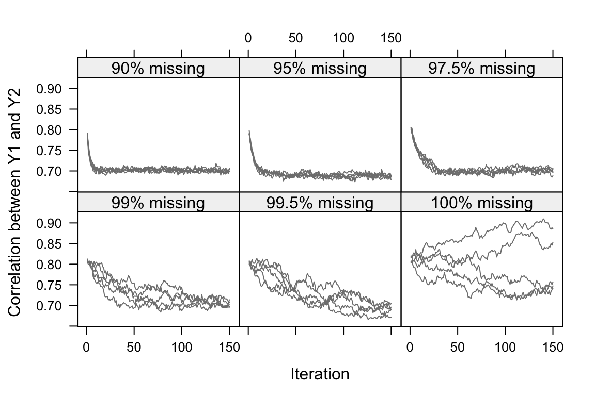

### Section 4.6.3 Illustration

``` r
## boys data: select subset
select <- with(boys, age >= 8 & age <= 21)

### version with all numeric data for jm and pmm
djm <- boys[select, -4]
djm$gen <- as.integer(djm$gen)
djm$phb <- as.integer(djm$phb)
djm$reg <- as.integer(djm$reg)

### version with categorical variables for fcs
dfcs <- boys[select, -4]

### impute according to joint multivariate normal
jm.10 <- mice(djm, method = "norm", seed = 93005, m = 10, 
    print = FALSE)

### impute according to predictive mean matching
pmm.10 <- mice(djm, seed = 71332, m = 10, print = FALSE)

### impute according to proportional odds model
fcs.10 <- mice(dfcs, seed = 81420, m = 10, print = FALSE)

### Figure 4.4
tp44 <- xyplot(jm.10, gen ~ age | .imp, subset = as.integer(.imp) < 
    7, xlab = "Age", ylab = "Genital stage")
print(tp44)
```

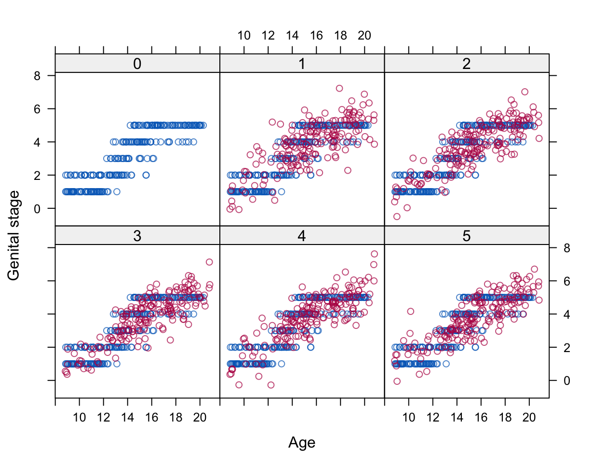

``` r
### Figure 4.5
tp45 <- xyplot(fcs.10, gen ~ age | .imp, subset = as.integer(.imp) < 
    7, xlab = "Age", ylab = "Genital stage")
print(tp45)
```

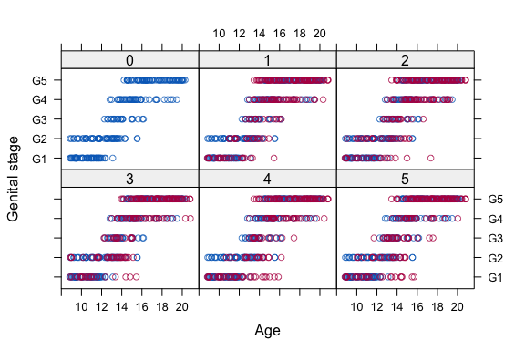

``` r
### Figure 4.6 is too complex, and will not be given here
```

Buuren, S. van. 2012. *Flexible Imputation of Missing Data*. Boca Raton, FL: Chapman & Hall/CRC Press.
