This page contains the R code from the book *Flexible Imputation of Missing Data* (Buuren 2012). For other examples using MICE see [MICE: Multivariate Imputation by Chained Equations](http://stefvanbuuren.github.io/mice/).

The code was tested in R 3.4.2 using mice 2.44.

Chapter 1 Introduction
----------------------

### Section 1.1 The problem of missing data

``` r
### calculate the mean of three numbers
y <- c(1, 2, 4)
mean(y)
```

    ## [1] 2.33

``` r
### calculate the mean of three numbers, where one is
### missing
y <- c(1, 2, NA)
mean(y)
```

    ## [1] NA

``` r
### repeat, but with any missing data removed
mean(y, na.rm = TRUE)
```

    ## [1] 1.5

``` r
### store your current options (safety measure)
youroptions <- options()

### demo regression that generates an error message using
### default na.fail
options(na.action = na.fail)

### uncomment to see the error lm(Ozone ~ Wind, data =
### airquality)

### remove incomplete observations by 'na.action =
### na.omit'
fit <- lm(Ozone ~ Wind, data = airquality, na.action = na.omit)
coef(fit)
```

    ## (Intercept)        Wind 
    ##       96.87       -5.55

``` r
### set automatic na.action = na.omit
options(na.action = na.omit)

### find out how many rows were deleted
deleted <- na.action(fit)
naprint(deleted)
```

    ## [1] "37 observations deleted due to missingness"

``` r
### more incomplete rows if we add Solar.R as predictor
fit2 <- lm(Ozone ~ Wind + Solar.R, data = airquality)
naprint(na.action(fit2))
```

    ## [1] "42 observations deleted due to missingness"

``` r
### restore your original options, but set na.omit
options(youroptions)
options(na.action = na.omit)
```

### Section 1.3.2 Pairwise deletion

``` r
### note: mean(<data.frame>) is deprecated
colMeans(airquality, na.rm = TRUE)
```

    ##   Ozone Solar.R    Wind    Temp   Month     Day 
    ##   42.13  185.93    9.96   77.88    6.99   15.80

``` r
cor(airquality, use = "pair")
```

    ##           Ozone Solar.R    Wind   Temp    Month
    ## Ozone    1.0000  0.3483 -0.6015  0.698  0.16452
    ## Solar.R  0.3483  1.0000 -0.0568  0.276 -0.07530
    ## Wind    -0.6015 -0.0568  1.0000 -0.458 -0.17829
    ## Temp     0.6984  0.2758 -0.4580  1.000  0.42095
    ## Month    0.1645 -0.0753 -0.1783  0.421  1.00000
    ## Day     -0.0132 -0.1503  0.0272 -0.131 -0.00796
    ##              Day
    ## Ozone   -0.01323
    ## Solar.R -0.15027
    ## Wind     0.02718
    ## Temp    -0.13059
    ## Month   -0.00796
    ## Day      1.00000

``` r
cov(airquality, use = "pair")
```

    ##           Ozone Solar.R    Wind   Temp Month      Day
    ## Ozone   1088.20 1056.58 -70.939 218.52  8.01   -3.818
    ## Solar.R 1056.58 8110.52 -17.946 229.16 -9.52 -119.026
    ## Wind     -70.94  -17.95  12.412 -15.27 -0.89    0.849
    ## Temp     218.52  229.16 -15.272  89.59  5.64  -10.957
    ## Month      8.01   -9.52  -0.890   5.64  2.01   -0.100
    ## Day       -3.82 -119.03   0.849 -10.96 -0.10   78.580

### Section 1.3.3 Mean imputation

``` r
library("mice")
```

    ## Loading required package: lattice

``` r
library("lattice")

### impute the mean
imp <- mice(airquality, method = "mean", m = 1, maxit = 1)
```

    ## 
    ##  iter imp variable
    ##   1   1  Ozone  Solar.R

``` r
### Figure 1.1
lwd <- 1.5
par(mfrow = c(1, 2))
breaks <- seq(-20, 200, 10)
nudge <- 1
x <- matrix(c(breaks - nudge, breaks + nudge), ncol = 2)
obs <- airquality[, "Ozone"]
mis <- imp$imp$Ozone[, 1]
fobs <- c(hist(obs, breaks, plot = FALSE)$counts, 0)
fmis <- c(hist(mis, breaks, plot = FALSE)$counts, 0)
y <- matrix(c(fobs, fmis), ncol = 2)
matplot(x, y, type = "s", col = c(mdc(4), mdc(5)), lwd = 2, 
    lty = 1, xlim = c(0, 170), ylim = c(0, 40), yaxs = "i", 
    xlab = "Ozone (ppb)", ylab = "Frequency")
box()

tp <- xyplot(imp, Ozone ~ Solar.R, na.groups = ici(imp), 
    ylab = "Ozone (ppb)", xlab = "Solar Radiation (lang)", 
    cex = 0.75, lex = lwd, ylim = c(-20, 180), xlim = c(0, 
        350))
print(tp, newpage = FALSE, position = c(0.48, 0.08, 1, 0.92))
```


### Section 1.3.4 Regression imputation

``` r
fit <- lm(Ozone ~ Solar.R, data = airquality)
pred <- predict(fit, newdata = ic(airquality))

### alternative using mice
imp <- mice(airquality[, 1:2], method = "norm.predict", 
    m = 1, maxit = 3, seed = 1)
```

    ## 
    ##  iter imp variable
    ##   1   1  Ozone  Solar.R
    ##   2   1  Ozone  Solar.R
    ##   3   1  Ozone  Solar.R

``` r
### Figure 1.2
par(mfrow = c(1, 2))
fmis <- c(hist(pred, breaks, plot = FALSE)$counts, 0)
y <- matrix(c(fobs, fmis), ncol = 2)
matplot(x, y, type = "s", col = c(mdc(4), mdc(5)), lwd = 2, 
    lty = 1, xlim = c(0, 170), ylim = c(0, 40), yaxs = "i", 
    xlab = "Ozone (ppb)", ylab = "Frequency")
box()

tp <- xyplot(imp, Ozone ~ Solar.R, ylab = "Ozone (ppb)", 
    xlab = "Solar Radiation (lang)", cex = 0.75, lex = lwd, 
    ylim = c(-20, 180), xlim = c(0, 350))
print(tp, newpage = FALSE, position = c(0.48, 0.08, 1, 0.92))
```


### Section 1.3.5 Stochastic regression imputation

``` r
imp <- mice(airquality[, 1:2], method = "norm.nob", m = 1, 
    maxit = 1, seed = 1)
```

    ## 
    ##  iter imp variable
    ##   1   1  Ozone  Solar.R

``` r
### Figure 1.3
par(mfrow = c(1, 2))
mis <- imp$imp$Ozone[, 1]
fmis <- c(hist(mis, breaks, plot = FALSE)$counts, 0)
y <- matrix(c(fobs, fmis), ncol = 2)
matplot(x, y, type = "s", col = c(mdc(4), mdc(5)), lwd = 2, 
    lty = 1, xlim = c(0, 170), ylim = c(0, 40), yaxs = "i", 
    xlab = "Ozone (ppb)", ylab = "Frequency")
box()

tp <- xyplot(imp, Ozone ~ Solar.R, na.groups = ici(imp), 
    ylab = "Ozone (ppb)", xlab = "Solar Radiation (lang)", 
    cex = 0.75, lex = lwd, ylim = c(-20, 180), xlim = c(0, 
        350))
print(tp, newpage = FALSE, position = c(0.48, 0.08, 1, 0.92))
```


### Section 1.3.6 LOCF and BOCF

``` r
par(mfrow = c(1, 1))
Oz <- airquality$Ozone
locf <- function(x) {
    a <- x[1]
    for (i in 2:length(x)) {
        if (is.na(x[i])) 
            x[i] <- a else a <- x[i]
    }
    return(x)
}
Ozi <- locf(Oz)
colvec <- ifelse(is.na(Oz), mdc(2), mdc(1))

### Figure 1.4

plot(Ozi[1:80], col = colvec, type = "l", xlab = "Day number", 
    ylab = "Ozone (ppb)")
points(Ozi[1:80], col = colvec, pch = 20, cex = 1)
```


### Section 1.4.3 Example of multiple imputation

``` r
imp <- mice(airquality, seed = 1, print = FALSE)
fit <- with(imp, lm(Ozone ~ Wind + Temp + Solar.R))
tab <- round(summary(pool(fit)), 3)
tab[, c(1:3, 5)]
```

    ##                 est     se     t Pr(>|t|)
    ## (Intercept) -64.331 21.535 -2.99    0.004
    ## Wind         -3.053  0.658 -4.64    0.000
    ## Temp          1.612  0.231  6.97    0.000
    ## Solar.R       0.061  0.022  2.73    0.008

``` r
fit <- lm(Ozone ~ Wind + Temp + Solar.R, data = airquality, 
    na.action = na.omit)
round(coef(summary(fit)), 3)
```

    ##             Estimate Std. Error t value Pr(>|t|)
    ## (Intercept)   -64.34     23.055   -2.79    0.006
    ## Wind           -3.33      0.654   -5.09    0.000
    ## Temp            1.65      0.254    6.52    0.000
    ## Solar.R         0.06      0.023    2.58    0.011

``` r
### Figure 1.6
par(mfrow = c(1, 2))
mis <- imp$imp$Ozone[, 1]
fmis <- c(hist(mis, breaks, plot = FALSE)$counts, 0)
y <- matrix(c(fobs, fmis), ncol = 2)
matplot(x, y, type = "s", col = c(mdc(4), mdc(5)), lwd = 2, 
    lty = 1, xlim = c(0, 170), ylim = c(0, 40), yaxs = "i", 
    xlab = "Ozone (ppb)", ylab = "Frequency")
box()

tp <- xyplot(imp, Ozone ~ Solar.R, subset = .imp == 1, ylab = "Ozone (ppb)", 
    xlab = "Solar Radiation (lang)", cex = 0.75, lex = lwd, 
    ylim = c(-20, 180), xlim = c(0, 350))
print(tp, newpage = FALSE, position = c(0.48, 0.08, 1, 0.92))
```


``` r
### scatterplot of all imputed data sets (not in book)
xyplot(imp, Ozone ~ Solar.R | .imp, ylab = "Ozone (ppb)", 
    xlab = "Solar Radiation (lang)", cex = 0.75, lex = lwd, 
    ylim = c(-20, 180), xlim = c(0, 350))
```


``` r
### Figure 1.7

Oz <- airquality$Ozone
colvec <- ifelse(is.na(Oz), mdc(2), mdc(1))
par(mfrow = c(1, 1))
plot(Oz[1:80], col = mdc(1), type = "l", xlab = "Day number", 
    ylab = "Ozone (ppb)")
points(Oz[1:80], col = mdc(1), pch = 20, cex = 1)

idx <- ici(airquality$Ozone) & (1:153) < 81
x <- (1:153)[idx]
points(x = x, y = complete(imp, 1)$Ozone[idx], col = mdc(2), 
    pch = 20, cex = 1)
points(x = x, y = complete(imp, 2)$Ozone[idx], col = mdc(2), 
    pch = 20, cex = 1)
points(x = x, y = complete(imp, 3)$Ozone[idx], col = mdc(2), 
    pch = 20, cex = 1)
points(x = x, y = complete(imp, 4)$Ozone[idx], col = mdc(2), 
    pch = 20, cex = 1)
points(x = x, y = complete(imp, 5)$Ozone[idx], col = mdc(2), 
    pch = 20, cex = 1)
```


``` r
### figure of the autocorrelation function (not in the
### book)

par(mfrow = c(2, 5))
acf.ozone <- with(imp, acf(Ozone))
model <- expression(acf(resid(lm(Ozone ~ Wind + Temp + Solar.R))))
acf.resid <- with(imp, model)
```


``` r
calcacf <- function(acf.list) {
    k <- length(acf.list)
    acc <- acf.list[[1]]$acf
    for (i in 2:k) acc <- acc + acf.list[[i]]$acf
    return(acc/k)
}
oz <- round(calcacf(acf.ozone$analyses), 2)
re <- round(calcacf(acf.resid$analyses), 2)
```

Chapter 2 Multiple imputation
-----------------------------

``` r
library("mice")
library("lattice")
library("MASS")

### Section 2.1.3 The expanding literature on multiple
### imputation Figure 2.1

cit <- c(2010, 37, 182, NA, 2009, 36, 129, NA, 2008, 27, 
    111, NA, 2007, 35, 136, NA, 2006, 18, 80, NA, 2005, 
    20, 76, NA, 2004, 6, 56, NA, 2003, 17, 42, NA, 2002, 
    14, 40, NA, 2001, 13, 36, 57, 2000, 8, 21, 33, 1999, 
    6, 25, 47, 1998, 6, 13, 22, 1997, 6, 18, 29, 1996, 4, 
    12, 28, 1995, 3, 5, 20, 1994, 2, 5, 34, 1993, 2, 6, 
    15, 1991, 2, 4, 19, 1990, 1, 2, 15, 1989, NA, NA, 11, 
    1988, 1, NA, 13, 1987, NA, NA, 10, 1986, NA, NA, 5, 
    1985, NA, NA, 1, 1984, NA, NA, 2, 1983, NA, NA, 5, 1982, 
    NA, NA, 2, 1981, NA, NA, 1, 1980, NA, NA, 5, 1979, NA, 
    NA, 2, 1978, NA, NA, 1, 1977, NA, NA, 2)

cit <- matrix(cit, nr = 2010 - 1977, nc = 4, byrow = TRUE)
cit <- as.data.frame(cit)
names(cit) <- c("Year", "Title", "Abstract", "All")
par(mfrow = c(1, 1))
par(cex = 0.7, lwd = 0.5)

plot(x = cit$Year, y = cit$Abstract, type = "o", log = "y", 
    xlim = c(1975, 2010), ylim = c(1, 200), ylab = "Number of publications (log)", 
    xlab = "Year", pch = 2, axes = FALSE)
axis(1, lwd = par("lwd"))
axis(2, lwd = par("lwd"), las = 1)
# box(lwd=0.5)
lines(x = cit$Year, y = cit$Title, pch = 15, type = "o")
lines(x = cit$Year, y = cit$All, pch = 16, type = "o")
legend(x = 1975, y = 200, legend = c("early publications", 
    "'multiple imputation' in abstract", "'multiple imputation' in title"), 
    pch = c(16, 2, 15), bty = "n")
```


### Section 2.2.4 MCAR, MAR and MNAR again

``` r
logistic <- function(x) exp(x)/(1 + exp(x))
set.seed(80122)
n <- 300
y <- mvrnorm(n = n, mu = c(0, 0), Sigma = matrix(c(1, 0.5, 
    0.5, 1), nrow = 2))
y1 <- y[, 1]
y2 <- y[, 2]
r2.mcar <- 1 - rbinom(n, 1, 0.5)
r2.mar <- 1 - rbinom(n, 1, logistic(y1))
r2.mnar <- 1 - rbinom(n, 1, logistic(y2))

### Figure 2.2

y3 <- rbind(y, y, y)
r2 <- c(r2.mcar, r2.mar, r2.mnar)
r2 <- factor(r2, labels = c("Ymis", "Yobs"))
typ <- factor(rep(3:1, each = n), labels = c("MNAR", "MAR", 
    "MCAR"))
d <- data.frame(y1 = y3[, 1], y2 = y3[, 2], r2 = r2, typ = typ)
trellis.par.set(box.rectangle = list(col = c(mdc(2), mdc(1)), 
    lwd = 1.2))
trellis.par.set(box.umbrella = list(col = c(mdc(2), mdc(1)), 
    lwd = 1.2))
trellis.par.set(plot.symbol = list(col = mdc(3), lwd = 1))
tp <- bwplot(r2 ~ y2 | typ, data = d, horizontal = TRUE, 
    layout = c(1, 3), xlab = expression(Y^2), col = c(mdc(2), 
        mdc(1)), strip = FALSE, xlim = c(-3, 3), strip.left = strip.custom(bg = "grey95"))
print(tp)
```


### Section 2.3.7 Numerical example

``` r
imp <- mice(nhanes, print = FALSE, m = 10, seed = 24415)
fit <- with(imp, lm(bmi ~ age))
est <- pool(fit)
names(est)
```

    ##  [1] "call"   "call1"  "call2"  "nmis"   "m"     
    ##  [6] "qhat"   "u"      "qbar"   "ubar"   "b"     
    ## [11] "t"      "r"      "dfcom"  "df"     "fmi"   
    ## [16] "lambda"

``` r
attach(est)
(r + 2/(df + 3))/(r + 1)
```

    ## (Intercept)         age 
    ##       0.408       0.310

``` r
(df + 1)/(df + 3) * lambda + 2/(df + 3)
```

    ## (Intercept)         age 
    ##       0.408       0.310

``` r
detach(est)
```

Chapter 3 Univariate missing data
---------------------------------

### Section 3.1 How to generate multiple imputations

``` r
library("mice")
library("lattice")
library("gamlss")
```

    ## Loading required package: splines

    ## Loading required package: gamlss.data

    ## Loading required package: gamlss.dist

    ## Loading required package: nlme

    ## Loading required package: parallel

    ##  **********   GAMLSS Version 5.0-2  **********

    ## For more on GAMLSS look at http://www.gamlss.org/

    ## Type gamlssNews() to see new features/changes/bug fixes.

``` r
library("rpart")

### In order to draw figure 3.1, we define two tweaked
### mice.impute.xxx functions that will store the
### coefficients of the imputation models in the global
### environment.  Normally, we would not be so interested
### in the parameter estimates of the imputation model,
### but here we need them for Figure 3.1.
mice.impute.normdump <- function(y, ry, x, ...) {
    x <- cbind(1, as.matrix(x))
    parm <- .norm.draw(y, ry, x, ...)
    betadump <<- c(betadump, parm$beta)
    return(x[!ry, ] %*% parm$beta + rnorm(sum(!ry)) * parm$sigma)
}
mice.impute.pmmdump <- function(y, ry, x, ...) {
    x <- cbind(1, as.matrix(x))
    parm <- .norm.draw(y, ry, x, ...)
    yhatobs <- x[ry, ] %*% parm$coef
    yhatmis <- x[!ry, ] %*% parm$beta
    betadump <<- c(betadump, parm$beta)
    return(apply(as.array(yhatmis), 1, .pmm.match, yhat = yhatobs, 
        y = y[ry], ...))
}


### Figure 3.1
par(mfrow = c(3, 2))
data <- whiteside
lwd <- 1.5
plot(x = data$Temp, y = data$Gas, col = mdc(1), lwd = lwd, 
    xlab = expression(paste("Temperature (", degree, "C)")), 
    ylab = "Gas consumption (cubic feet)")
points(x = 5, y = 3.6, pch = 4, cex = 2, lwd = lwd, col = mdc(2))
legend(x = "bottomleft", legend = "deleted observation", 
    pch = 4, col = mdc(2), pt.lwd = lwd, bty = "n", pt.cex = 2)
text(x = 9, y = 6.5, label = "a", cex = 2)

data[47, "Gas"] <- NA
plot(x = data$Temp, y = data$Gas, col = mdc(1), lwd = lwd, 
    xlab = expression(paste("Temperature (", degree, "C)")), 
    ylab = "Gas consumption (cubic feet)")
abline(m1 <- lm(Gas ~ Temp, data = data, na.action = na.omit), 
    col = mdc(4))
points(5, 4.04, lwd = lwd, col = mdc(2), pch = 19)
text(x = 9, y = 6.5, label = "b", cex = 2)

plot(x = data$Temp, y = data$Gas, col = mdc(1), lwd = lwd, 
    xlab = expression(paste("Temperature (", degree, "C)")), 
    ylab = "Gas consumption (cubic feet)")
imp <- mice(data, m = 1, maxit = 0)
pred <- imp$pred
pred["Gas", "Insul"] <- 0
imp <- mice(data, m = 5, pred = pred, meth = "norm.nob", 
    maxit = 1, print = FALSE, seed = 45433)
abline(m1 <- lm(Gas ~ Temp, data = data, na.action = na.omit), 
    col = mdc(4))
points(rep(5, 5), imp$imp$Gas, lwd = lwd, col = mdc(2), 
    pch = 19)
text(x = 9, y = 6.5, label = "c", cex = 2)

plot(x = data$Temp, y = data$Gas, col = mdc(1), lwd = lwd, 
    xlab = expression(paste("Temperature (", degree, "C)")), 
    ylab = "Gas consumption (cubic feet)")
imp <- mice(data, m = 1, maxit = 0)
pred <- imp$pred
pred["Gas", "Insul"] <- 0
betadump <- vector("list", 0)
imp <- mice(data, m = 5, pred = pred, meth = "normdump", 
    maxit = 1, print = FALSE, seed = 83126)
abline(m1 <- lm(Gas ~ Temp, data = data, na.action = na.omit), 
    col = mdc(4))
betadump <- matrix(betadump, nc = 2, byrow = TRUE)
for (i in 1:5) abline(coef = unlist(betadump[i, ]), col = mdc(5))
points(rep(5, 5), imp$imp$Gas, lwd = lwd, col = mdc(2), 
    pch = 19)
text(x = 9, y = 6.5, label = "d", cex = 2)

pch <- c(rep(3, 26), rep(1, 30))
plot(x = data$Temp, y = data$Gas, col = mdc(1), lwd = lwd, 
    pch = pch, xlab = expression(paste("Temperature (", 
        degree, "C)")), ylab = "Gas consumption (cubic feet)")
imp <- mice(data, m = 5, meth = "norm", maxit = 1, print = FALSE, 
    seed = 11727)
abline(m1 <- lm(Gas ~ Temp, data = data, na.action = na.omit, 
    subset = Insul == "Before"), col = mdc(4))
abline(m2 <- lm(Gas ~ Temp, data = data, na.action = na.omit, 
    subset = Insul == "After"), col = mdc(4))
points(rep(5, 5), imp$imp$Gas, lwd = lwd, col = mdc(2), 
    pch = 19)
legend(x = "bottomleft", legend = c("before insulation", 
    "after insulation"), pch = c(3, 1), bty = "n", pt.lwd = lwd)
text(x = 9, y = 6.5, label = "e", cex = 2)

pch <- c(rep(3, 26), rep(1, 30))
plot(x = data$Temp, y = data$Gas, col = mdc(1), lwd = lwd, 
    pch = pch, xlab = expression(paste("Temperature (", 
        degree, "C)")), ylab = "Gas consumption (cubic feet)")
betadump <- vector("list", 0)
imp <- mice(data, m = 5, meth = "pmmdump", maxit = 1, print = FALSE, 
    seed = 68006)
betadump <- matrix(betadump, nc = 3, byrow = TRUE)
m1 <- lm(Gas ~ Temp + Insul, data = data, na.action = na.omit)
an <- coef(m1)[1]
ai <- an + coef(m1)[3]
b <- coef(m1)[2]
abline(a = ai, b = b, col = mdc(4))
abline(a = an, b = b, col = mdc(4))
eta <- 0.6
ylo <- ai + b * (5 - eta)
yhi <- ai + b * (5 + eta)
lines(x = c(5 - eta, 5 + eta), y = c(ylo, yhi), lwd = 3, 
    col = mdc(5))
xlo <- (ylo - an)/b
xhi <- (yhi - an)/b
lines(x = c(xlo, xhi), y = c(ylo, yhi), lwd = 3, col = mdc(5))

donors <- subset(data, (Insul == "After" & Temp > 5 - eta & 
    Temp < 5 + eta) | (Insul == "Before" & Temp > xlo & 
    Temp < xhi))
points(x = donors$Temp, y = donors$Gas, cex = 1.8, col = mdc(5), 
    lwd = lwd)
legend(x = "bottomleft", legend = c("before insulation", 
    "after insulation"), pch = c(3, 1), bty = "n", pt.lwd = lwd)
text(x = 9, y = 6.5, label = "f", cex = 2)
```


### Section 3.2.3 Performance

``` r
### number of simulations use nsim <- 10 for testing nsim
### <- 10000 for the real stuff (TIME CONSUMING)
nsim <- 10

### create data
createdata <- function(beta0 = 5.49, beta1 = -0.29, sigma = 0.86, 
    n = 50, mx = 5, sdx = 3) {
    x <- round(rnorm(n, mean = mx, sd = sdx), 1)
    eps <- rnorm(n, mean = 0, sd = sigma)
    y <- round(beta0 + x * beta1 + eps, 1)
    return(data.frame(x = x, y = y))
}

### make 50% random missing data
makemissing <- function(data, p = 0.5) {
    rx <- rbinom(nrow(data), 1, p)
    data[rx == 0, "y"] <- NA
    return(data)
}

### test function for three imputation functions
test.impute <- function(data, m = 5, method = "norm", ...) {
    imp <- mice(data, method = method, m = m, print = FALSE, 
        ridge = 0, ...)
    fit <- with(imp, lm(y ~ x))
    est <- pool(fit)
    tab <- summary(est)
    return(tab["x", c("est", "se", "lo 95", "hi 95", "fmi", 
        "lambda")])
}

### put everything together
simulate <- function(nsim = 10, seed = 41872) {
    set.seed(seed)
    res <- array(NA, dim = c(4, nsim, 6))
    dimnames(res) <- list(c("predict", "pred + noise", "Bayes MI", 
        "boot MI"), as.character(1:nsim), c("est", "se", 
        "lo 95", "hi 95", "fmi", "lambda"))
    im <- c("norm.predict", "norm.nob", "norm", "norm.boot")
    for (i in 1:nsim) {
        data <- createdata()
        data <- makemissing(data)
        res[1, i, ] <- test.impute(data, method = im[1], 
            m = 2)
        res[2, i, ] <- test.impute(data, method = im[2])
        res[3, i, ] <- test.impute(data, method = im[3])
        res[4, i, ] <- test.impute(data, method = im[4])
    }
    return(res)
}

summarize.results <- function(res) {
    apply(res, c(1, 3), mean, na.rm = TRUE)
    
    ## bias of beta1
    true <- -0.29
    bias <- rowMeans(res[, , 1] - true)
    
    ## coverage
    isin <- res[, , 3] < true & true < res[, , 4]
    cov <- rowMeans(isin)
    
    ## average width of 95 c.i.
    intwidth <- res[, , 4] - res[, , 3]
    aiw <- rowMeans(intwidth)
    
    return(list(bias = bias, cov = cov, aiw = aiw))
}

### do the simulations - MAY BE TIME CONSUMING
res <- simulate(nsim)
summarize.results(res)
```

    ## $bias
    ##      predict pred + noise     Bayes MI      boot MI 
    ##     -0.01635     -0.02184     -0.01149     -0.00582 
    ## 
    ## $cov
    ##      predict pred + noise     Bayes MI      boot MI 
    ##          0.8          0.9          1.0          1.0 
    ## 
    ## $aiw
    ##      predict pred + noise     Bayes MI      boot MI 
    ##        0.126        0.242        0.318        0.287

``` r
### function to simulate performance of CCA
simulate.cca <- function(nsim = 10, seed = 41872) {
    
    set.seed(seed)
    res <- array(NA, dim = c(1, nsim, 6))
    for (i in 1:nsim) {
        data <- createdata()
        data <- makemissing(data)
        fit <- lm(y ~ x, data = data, na.action = na.omit)
        est <- coef(summary(fit))
        lo95 <- est[, 1] - qt(0.975, fit$df) * est[, 2]
        hi95 <- est[, 1] + qt(0.975, fit$df) * est[, 2]
        est <- cbind(est, lo95, hi95)
        res[1, i, ] <- c(est["x", c(1:2, 5:6)], NA, NA)
    }
    return(res)
}

### simulate - MAY BE TIME CONSUMING
res.cca <- simulate.cca(nsim)
### cannot be analysed by summarize.results() but it
### should be obvious how to calculate bias, coverage and
### aiw
```

### Section 3.2.4 Generating MAR missing data

``` r
### script to create missing data according to MARRIGHT
logistic <- function(x) exp(x)/(1 + exp(x))
set.seed(32881)
n <- 10000
y <- mvrnorm(n = n, mu = c(5, 5), Sigma = matrix(c(1, 0.6, 
    0.6, 1), nrow = 2))
p2.marright <- 1 - logistic(-5 + y[, 1])
r2.marright <- rbinom(n, 1, p2.marright)
yobs <- y
yobs[r2.marright == 0, 2] <- NA

### Figure 3.2

grid <- seq(0, 10, 0.1)
mr <- logistic(-5 + grid)
mm <- logistic(0.75 - abs(grid - 5))
mt <- logistic(-0.75 + abs(grid - 5))

par(mfrow = c(1, 1))
z <- data.frame(grid, mr, mm, mt)
matplot(x = z[, 1], y = z[, 2:4], type = "l", lty = 1:3, 
    col = mdc(5), lwd = 2, xlab = "Y1", ylab = "Missingness in Y2", 
    las = 1)
legend(x = "top", bty = "n", legend = c("MARRIGHT", "MARMID", 
    "MARTAIL"), lty = 1:3, lwd = 2, col = mdc(5), cex = 0.8)
```


``` r
### Figure 3.3

y3 <- rbind(y, y, y)
p2.marmid <- 1 - logistic(0.75 - abs(y[, 1] - 5))
p2.martail <- 1 - logistic(0.75 + abs(y[, 1] - 5))
r2.marmid <- rbinom(n, 1, p2.marright)
r2.martail <- rbinom(n, 1, p2.martail)
r2 <- c(r2.marright, r2.marmid, r2.martail)
r2 <- factor(r2, labels = c("Ymis", "Yobs"))
typ <- factor(rep(3:1, each = n), labels = c("MARTAIL", 
    "MARMID", "MARRIGHT"))
d <- data.frame(y1 = y3[, 1], y2 = y3[, 2], r2 = r2, typ = typ)
trellis.par.set(box.rectangle = list(col = c(mdc(2), mdc(1)), 
    lwd = 1.2))
trellis.par.set(box.umbrella = list(col = c(mdc(2), mdc(1)), 
    lwd = 1.2))
trellis.par.set(plot.symbol = list(col = "transparent", 
    lwd = 1))
tp <- bwplot(r2 ~ y2 | typ, data = d, horizontal = TRUE, 
    layout = c(1, 3), xlab = expression(Y2), col = c(mdc(2), 
        mdc(1)), strip = FALSE, xlim = c(2, 8), strip.left = strip.custom(bg = "grey95"))
print(tp)
```


### Section 3.2.2 Imputation from the t-distribution

``` r
mice.impute.tf <- function(y, ry, x, gamlss.trace = FALSE, 
    ...) {
    require(gamlss)
    
    # prepare data
    xobs <- x[ry, , drop = FALSE]
    xmis <- x[!ry, , drop = FALSE]
    yobs <- y[ry]
    n1 <- sum(ry)
    n0 <- sum(!ry)
    
    # draw bootstrap sample
    s <- sample(n1, n1, replace = TRUE)
    dotxobs <- xobs[s, , drop = FALSE]
    dotyobs <- yobs[s]
    dotxy <- data.frame(dotxobs, y = dotyobs)
    
    # fit the gamlss model
    fit <- gamlss(y ~ ., data = dotxy, family = TF, trace = gamlss.trace, 
        ...)
    yhat <- predict(fit, data = dotxy, newdata = xmis)
    sigma <- exp(coef(fit, "sigma"))
    nu <- exp(coef(fit, "nu"))
    
    # draw the imputations
    return(rTF(n0, yhat, sigma, nu))
}
```

### Section 3.3.3 Example

``` r
data(db)

### Figure 3.4

par(mfrow = c(1, 2))
data <- subset(db, age > 1 & age < 2, c("age", "head"))
names(data) <- c("age", "hc")
truehist(data$hc, col = mdc(1), border = "white", xlab = "Head circumference (cm)", 
    ylab = "Density", ylim = c(0, 0.3), xlim = c(38, 60), 
    nbins = 44)

mn <- gamlss(hc ~ 1, data = na.omit(data), family = NO, 
    trace = FALSE)
mu <- coef(mn)
sigma <- exp(coef(mn, "sigma"))
cmfine <- seq(38, 60, 0.1)
lines(cmfine, dNO(cmfine, mu, sigma), lwd = 0.8, lty = 2)
mt <- gamlss(hc ~ 1, data = data, family = TF, trace = FALSE)
mu <- coef(mt)
sigma <- exp(coef(mt, "sigma"))
nu <- exp(coef(mt, "nu"))
lines(cmfine, dTF(cmfine, mu, sigma, nu), lwd = 0.8, lty = 1)
legend(x = "right", legend = c("normal", "t, df=6.7"), lwd = 0.8, 
    lty = c(2, 1), bty = "n", cex = 0.7)

plot(x = data$age, y = data$hc, col = mdc(1), cex = 0.3, 
    xlab = "Age (in years)", ylab = "Head circumference (cm)", 
    ylim = c(39, 60))
```


``` r
### create a synthetic data set
data(db)
data <- subset(db, age > 1 & age < 2, c("age", "head"))
names(data) <- c("age", "hc")
synthetic <- rep(c(FALSE, TRUE), each = nrow(data))
data2 <- rbind(data, data)
data2[synthetic, "hc"] <- NA
imp <- mice(data2, m = 1, meth = "tf", seed = 36650, print = FALSE)
syn <- subset(complete(imp), synthetic)

### Figure 3.5

data <- syn
truehist(data$hc, col = mdc(2), border = "white", xlab = "Head circumference (cm)", 
    ylab = "Density", ylim = c(0, 0.3), xlim = c(38, 60), 
    nbins = 44)

mn <- gamlss(hc ~ 1, data = na.omit(data), family = NO, 
    trace = FALSE)
mu <- coef(mn)
sigma <- exp(coef(mn, "sigma"))
cmfine <- seq(38, 60, 0.1)
lines(cmfine, dNO(cmfine, mu, sigma), lwd = 0.8, lty = 2)
mt <- gamlss(hc ~ 1, data = data, family = TF, trace = FALSE)
mu <- coef(mt)
sigma <- exp(coef(mt, "sigma"))
nu <- exp(coef(mt, "nu"))
lines(cmfine, dTF(cmfine, mu, sigma, nu), lwd = 0.8, lty = 1)
legend(x = "right", legend = c("normal", paste("t, df=", 
    round(nu, 1), sep = "")), lwd = 0.8, lty = c(2, 1), 
    bty = "n", cex = 0.7)
```


``` r
plot(x = data$age, y = data$hc, col = mdc(2), cex = 0.3, 
    xlab = "Age (in years)", ylab = "Head circumference (cm)", 
    ylim = c(39, 60))
```


### Section 3.4.1 PMM, Overview

``` r
### Figure 3.6

data <- boys[boys$age <= 2, c("age", "bmi")]
set.seed(87120)
data[sample(92:136, 10), "bmi"] <- NA
imp <- mice(data, meth = "norm", m = 1, seed = 32212, print = FALSE)
cd1 <- complete(imp)
imp <- mice(data, m = 1, seed = 32212, print = FALSE)
cd2 <- complete(imp)
r <- !is.na(data$bmi)
plot(data, col = mdc(1), xlab = "Age", ylab = "BMI")
points(cd1[!r, ], col = mdc(2), pch = 19, cex = 0.8)
```


``` r
plot(data, col = mdc(1), xlab = "Age", ylab = "BMI")
points(cd2[!r, ], col = mdc(2), pch = 19, cex = 0.8)
```


### Section 3.4.2 PMM, Computational details

``` r
### Figure 3.7

par(mfrow = c(1, 1))
data <- whiteside
lwd <- 1.5
data[47, "Gas"] <- NA

pch <- c(rep(3, 26), rep(1, 30))
plot(x = data$Temp, y = data$Gas, col = mdc(1), lwd = lwd, 
    pch = pch, xlab = expression(paste("Temperature (", 
        degree, "C)")), ylab = "Gas consumption (cubic feet)")
betadump <- vector("list", 0)
imp <- mice(data, m = 5, meth = "pmmdump", maxit = 1, print = FALSE, 
    seed = 68006)
betadump <- matrix(unlist(betadump), nc = 3, byrow = TRUE)
m1 <- lm(Gas ~ Temp + Insul, data = data, na.action = na.omit)
an <- coef(m1)[1]
ai <- an + coef(m1)[3]
b <- coef(m1)[2]
abline(a = ai, b = b, col = mdc(4))
abline(a = an, b = b, col = mdc(4))
## for (i in 56:56) { abline(a=unlist(betadump[i,1]),
## b=unlist(betadump[i,2]), col=mdc(5))
## abline(a=unlist(betadump[i,1])+unlist(betadump[i,3]),
## b=unlist(betadump[i,2]), col=mdc(5)) }
## points(rep(5,5),imp$imp$Gas, lwd=lwd, col=mdc(2),
## pch=20)
eta <- 0.6
ylo <- ai + b * (5 - eta)
yhi <- ai + b * (5 + eta)
lines(x = c(5 - eta, 5 + eta), y = c(ylo, yhi), lwd = 3, 
    col = mdc(4))
an <- 7.05
ai <- an - 1.7
b <- -0.38
xlo1 <- (ylo - ai)/b
xhi1 <- (yhi - ai)/b
xlo2 <- (ylo - an)/b
xhi2 <- (yhi - an)/b
abline(a = an, b = b, col = mdc(5))
abline(a = ai, b = b, col = mdc(5))
lines(x = c(xlo1, xhi1), y = c(ylo, yhi), lwd = 3, col = mdc(5))
lines(x = c(xlo2, xhi2), y = c(ylo, yhi), lwd = 3, col = mdc(5))
abline(v = c(5 - eta, 5 + eta), h = c(ylo, yhi), col = mdc(4), 
    lty = 3)
rect(xlo1, 0, xhi1, 8, col = hcl(0, 100, 40, 0.05), border = NA)
rect(xlo2, 0, xhi2, 8, col = hcl(0, 100, 40, 0.05), border = NA)
# abline(v=c(xlo1,xhi1,xlo2,xhi2),col=mdc(5),lty=3)

donors <- subset(data, (Insul == "After" & Temp > xlo1 & 
    Temp < xhi1) | (Insul == "Before" & Temp > xlo2 & Temp < 
    xhi2))
points(x = donors$Temp, y = donors$Gas, cex = 1.8, col = mdc(5), 
    lwd = lwd)
legend(x = "bottomleft", legend = c("before insulation", 
    "after insulation"), pch = c(3, 1), bty = "n", pt.lwd = lwd)
```


### Section 3.4.3 PMM, Algorithm

``` r
### simulate function used to calculate Table 3.3
simulate <- function(nsim = 10, seed = 41872) {
    set.seed(seed)
    res <- array(NA, dim = c(3, nsim, 6))
    for (i in 1:nsim) {
        data <- createdata()
        data <- makemissing(data)
        res[1, i, ] <- test.impute(data, m = 5)
        res[2, i, ] <- test.impute(data, m = 5, donors = 1)
        res[3, i, ] <- test.impute(data, m = 5, donors = 10)
    }
    return(res)
}

### and perform simulations - MAY BE TIME CONSUMING
res.pmm <- simulate(nsim)
summarize.results(res.pmm)
```

    ## $bias
    ## [1] -0.02267 -0.00413 -0.00607
    ## 
    ## $cov
    ## [1] 1.0 1.0 0.8
    ## 
    ## $aiw
    ## [1] 0.291 0.317 0.298

### Section 3.7.1

``` r
### Figure 3.8

par(mfrow = c(1, 2))
fit <- rpart(Gas ~ Temp + Insul, data = whiteside)
plot(fit, branch = 0, margin = 0.15)
text(fit, use = T, pretty = 0, dig = 3, cex = 0.8)

leaf <- row.names(fit$frame)[fit$where]
label <- factor(leaf, labels = c(2, 3, 1, 4, 5))
plot(x = whiteside$Temp, y = whiteside$Gas, type = "n", 
    xlab = expression(paste("Temperature (", degree, "C)")), 
    ylab = "Gas consumption (cubic feet)")
text(x = whiteside$Temp, y = whiteside$Gas, label = label, 
    col = mdc(4), cex = 0.6)
```


### Section 3.9.4 Converting selection and pattern-mixture models

``` r
### Figure 3.9

par(mfrow = c(1, 2))
s <- c(100, 0.015, 0.058, 0.02, 0.35, 110, 0.024, 0.074, 
    0.03, 0.3, 120, 0.043, 0.103, 0.05, 0.25, 130, 0.091, 
    0.164, 0.1, 0.2, 140, 0.145, 0.185, 0.15, 0.15, 150, 
    0.307, 0.247, 0.3, 0.1, 160, 0.157, 0.099, 0.15, 0.08, 
    170, 0.107, 0.049, 0.1, 0.06, 180, 0.055, 0.016, 0.05, 
    0.04, 190, 0.033, 0.005, 0.03, 0.02, 200, 0.023, 0, 
    0.02, 0, 210, 0.023, 0, 0.02, 0)
sm <- matrix(s, nr = 12, nc = 5, byrow = TRUE)
snug <- 1.5
xx <- cbind(sm[, 1] - 5 + snug, sm[, 1] - 5 - snug, sm[, 
    1] - 5)
matplot(x = xx[, 3], y = cbind(1 - sm[, 5]), col = mdc(1), 
    type = "p", lwd = 2, lty = 1, pch = 20, xlab = "Systolic BP (mmHg)", 
    ylab = "Observation probability")
matplot(x = xx, y = sm[, 2:4], type = "s", col = c(mdc(4), 
    mdc(5), mdc(6)), lwd = 2, lty = 1, xlab = "Systolic BP (mmHg)", 
    ylab = "Density")
```


Chapter 4 Multivariate missing data
-----------------------------------

### Section 4.1 Missing data patterns

``` r
library("mice")
library("lattice")

### define data sets pattern1-pattern4 with four patterns
data <- matrix(sample(1:100, 4 * 8 * 3, replace = TRUE), 
    nrow = 8 * 4, dimnames = list(NULL, c("A", "B", "C")))
data <- as.data.frame(data)
data[c(31:32), "A"] <- NA
data[c(15:16, 22:24, 30:32), "B"] <- NA
data[c(6:8, 12:16, 17:21, 27:29), "C"] <- NA
mdpat <- cbind(expand.grid(rec = 8:1, pat = 1:4, var = 1:3), 
    r = as.numeric(as.vector(is.na(data))))
pattern1 <- data[1:8, ]
pattern2 <- data[9:16, ]
pattern3 <- data[17:24, ]
pattern4 <- data[25:32, ]

### Figure 4.1
types <- c("Univariate", "Monotone", "File matching", "General")
tp41 <- levelplot(r ~ var + rec | as.factor(pat), data = mdpat, 
    as.table = TRUE, aspect = "iso", shrink = c(0.9), col.regions = mdc(1:2), 
    colorkey = FALSE, scales = list(draw = FALSE), xlab = "", 
    ylab = "", between = list(x = 1, y = 0), strip = strip.custom(bg = "grey95", 
        style = 1, factor.levels = types))
print(tp41)
```


``` r
md.pattern(pattern4)
```

    ##   A B C  
    ## 2 1 1 1 0
    ## 1 1 0 1 1
    ## 3 1 1 0 1
    ## 2 0 0 1 2
    ##   2 3 3 8

``` r
p <- md.pairs(pattern4)
p
```

    ## $rr
    ##   A B C
    ## A 6 5 3
    ## B 5 5 2
    ## C 3 2 5
    ## 
    ## $rm
    ##   A B C
    ## A 0 1 3
    ## B 0 0 3
    ## C 2 3 0
    ## 
    ## $mr
    ##   A B C
    ## A 0 0 2
    ## B 1 0 3
    ## C 3 3 0
    ## 
    ## $mm
    ##   A B C
    ## A 2 2 0
    ## B 2 3 0
    ## C 0 0 3

``` r
### proportion of usable cases
p$mr/(p$mr + p$mm)
```

    ##       A B C
    ## A 0.000 0 1
    ## B 0.333 0 1
    ## C 1.000 1 0

``` r
### outbound statistics
p$rm/(p$rm + p$rr)
```

    ##     A     B   C
    ## A 0.0 0.167 0.5
    ## B 0.0 0.000 0.6
    ## C 0.4 0.600 0.0

``` r
### Figure 4.2
par(mfrow = c(2, 2))
fluxplot(pattern1, main = "", xlim = c(-0.1, 1.1), ylim = c(-0.1, 
    1.1))
text(x = 0.5, y = 1, label = "Univariate")
fluxplot(pattern2, main = "", xlim = c(-0.1, 1.1), ylim = c(-0.1, 
    1.1))
text(x = 0.5, y = 1, label = "Monotone")
fluxplot(pattern3, main = "", xlim = c(-0.1, 1.1), ylim = c(-0.1, 
    1.1))
text(x = 0.5, y = 1, label = "File matching")
fluxplot(pattern4, main = "", xlim = c(-0.1, 1.1), ylim = c(-0.1, 
    1.1))
text(x = 0.5, y = 1, label = "General")
```


``` r
### calculate pobs, influx, outflux of general pattern
flux(pattern4)[, 1:3]
```

    ##    pobs influx outflux
    ## A 0.750  0.125   0.500
    ## B 0.625  0.250   0.375
    ## C 0.625  0.375   0.625

``` r
### section 4.3 Monotone data imputation monotone data
### imputation on three columns
data <- nhanes2[, 1:3]
md.pattern(data)
```

    ##    age hyp bmi   
    ## 16   1   1   1  0
    ##  1   1   1   0  1
    ##  8   1   0   0  2
    ##      0   8   9 17

``` r
imp <- mice(data, visit = "monotone", maxit = 1, m = 2)
```

    ## 
    ##  iter imp variable
    ##   1   1  hyp  bmi
    ##   1   2  hyp  bmi

``` r
### Numerical example, approximate two-step
ini <- mice(nhanes2, maxit = 0)
pred <- ini$pred
pred["bmi", "chl"] <- 0
pred["hyp", c("chl", "bmi")] <- 0
imp <- mice(nhanes2, vis = "monotone", pred = pred, maxit = 1, 
    m = 2)
```

    ## 
    ##  iter imp variable
    ##   1   1  hyp  bmi  chl
    ##   1   2  hyp  bmi  chl

### Section 4.5 Fully Conditional Specification

``` r
### Example of slow convergence
generate <- function(n = c(1000, 4500, 4500, 0), cor = matrix(c(1, 
    0.9, 0.9, 0.9, 1, 0.7, 0.9, 0.7, 1), nrow = 3)) {
    require(MASS)
    nt <- sum(n)
    cs <- cumsum(n)
    data <- mvrnorm(nt, mu = rep(0, 3), Sigma = cor)
    dimnames(data) <- list(1:nt, c("X", "Y1", "Y2"))
    if (n[2] > 0) 
        data[(cs[1] + 1):cs[2], "Y1"] <- NA
    if (n[3] > 0) 
        data[(cs[2] + 1):cs[3], "Y2"] <- NA
    if (n[4] > 0) 
        data[(cs[3] + 1):cs[4], c("Y1", "Y2")] <- NA
    return(data)
}

impute <- function(data, m = 5, method = "norm", print = FALSE, 
    maxit = 10, ...) {
    statistic <- matrix(NA, nrow = maxit, ncol = m)
    for (iter in 1:maxit) {
        if (iter == 1) 
            imp <- mice(data, m = m, method = method, print = print, 
                maxit = 1, ...) else imp <- mice.mids(imp, maxit = 1, print = print, 
            ...)
        statistic[iter, ] <- unlist(with(imp, cor(Y1, Y2))$analyses)
    }
    return(list(imp = imp, statistic = statistic))
}

simulate <- function(ns = matrix(c(1000, 500, 250, 100, 
    50, 0, rep(c(4500, 4750, 4875, 4950, 4975, 5000), 2), 
    rep(0, 6)), nrow = 6), m = 5, maxit = 10, seed = 1, 
    ...) {
    if (!missing(seed)) 
        set.seed(seed)
    s <- cbind(rep(1:nrow(ns), each = maxit * m), apply(ns, 
        2, rep, each = maxit * m), rep(1:maxit, each = m), 
        1:m, NA)
    colnames(s) <- c("k", "n111", "n101", "n110", "n100", 
        "iteration", "m", "rY1Y2")
    for (k in 1:nrow(ns)) {
        data <- generate(ns[k, ], ...)
        r <- impute(data, m = m, maxit = maxit, ...)
        s[s[, "k"] == k, "rY1Y2"] <- t(r$statistic)
    }
    return(data.frame(s))
}

### perform simulation - TIME CONSUMING (10 minutes)
slow.demo <- simulate(maxit = 150, seed = 62771)
```

``` r
### Figure 4.3
labels <- c("90% missing", "95% missing", "97.5% missing", 
    "99% missing", "99.5% missing", "100% missing")
tp43 <- xyplot(rY1Y2 ~ iteration | as.factor(k), group = m, 
    data = slow.demo, layout = c(3, 2), type = "l", as.table = TRUE, 
    ylab = "Correlation between Y1 and Y2", xlab = "Iteration", 
    col = mdc(3), scales = list(y = list(alternating = 1, 
        tck = c(1, 0))), strip = strip.custom(bg = "grey95", 
        style = 1, factor.levels = labels))
print(tp43)
```


### Section 4.6.3 Illustration

``` r
## boys data: select subset
select <- with(boys, age >= 8 & age <= 21)

### version with all numeric data for jm and pmm
djm <- boys[select, -4]
djm$gen <- as.integer(djm$gen)
djm$phb <- as.integer(djm$phb)
djm$reg <- as.integer(djm$reg)

### version with categorical variables for fcs
dfcs <- boys[select, -4]

### impute according to joint multivariate normal
jm.10 <- mice(djm, method = "norm", seed = 93005, m = 10, 
    print = FALSE)

### impute according to predictive mean matching
pmm.10 <- mice(djm, seed = 71332, m = 10, print = FALSE)

### impute according to proportional odds model
fcs.10 <- mice(dfcs, seed = 81420, m = 10, print = FALSE)

### Figure 4.4
tp44 <- xyplot(jm.10, gen ~ age | .imp, subset = as.integer(.imp) < 
    7, xlab = "Age", ylab = "Genital stage")
print(tp44)
```


``` r
### Figure 4.5
tp45 <- xyplot(fcs.10, gen ~ age | .imp, subset = as.integer(.imp) < 
    7, xlab = "Age", ylab = "Genital stage")
print(tp45)
```


``` r
### Figure 4.6 is too complex, and will not be given here
```

Chapter 5 Imputation in practice
--------------------------------

``` r
library("mice")
library("gamlss")
library("AGD")
```

    ## AGD 0.35 2015-05-27

``` r
### set Trellis layout parameters
lhset <- trellis.par.get("layout.heights")
lhset$top.padding <- 0
lhset$bottom.padding <- 0
trellis.par.set("layout.heights", lhset)
lwset <- trellis.par.get("layout.widths")
lwset$left.padding <- 0
lwset$right.padding <- 0
trellis.par.set("layout.widths", lwset)
```

### Section 5.3.2 Predictors

``` r
imp <- mice(nhanes, print = FALSE)
imp$predictorMatrix
```

    ##     age bmi hyp chl
    ## age   0   0   0   0
    ## bmi   1   0   1   1
    ## hyp   1   1   0   1
    ## chl   1   1   1   0

``` r
imp <- mice(cbind(nhanes, chl2 = 2 * nhanes$chl), print = FALSE)
imp$loggedEvents
```

    ##   it im co dep      meth  out
    ## 1  0  0  0     collinear chl2

### Section 5.4.1 Ratio of two variables

``` r
imp1 <- mice(boys, print = FALSE)
long <- complete(imp1, "long", inc = TRUE)
long$whr <- with(long, wgt/(hgt/100))
# imp2 <- long2mids(long)

### Just anothor varianble (JAV)
boys$whr <- boys$wgt/(boys$hgt/100)
imp.jav <- mice(boys, m = 1, seed = 32093, maxit = 10, print = FALSE)
imp.jav$loggedEvents
```

    ##    it im co dep     meth out
    ## 1   1  1  6 gen multinom    
    ## 2   1  1  7 phb multinom    
    ## 3   1  1 10 whr      pmm wgt
    ## 4   2  1  6 gen     polr whr
    ## 5   2  1  6 gen multinom    
    ## 6   2  1  7 phb multinom    
    ## 7   2  1  8  tv      pmm whr
    ## 8   2  1 10 whr      pmm wgt
    ## 9   3  1  6 gen     polr whr
    ## 10  3  1  6 gen multinom    
    ## 11  3  1  7 phb     polr whr
    ## 12  3  1  7 phb multinom    
    ## 13  3  1  8  tv      pmm whr
    ## 14  3  1 10 whr      pmm wgt
    ## 15  4  1  6 gen     polr whr
    ## 16  4  1  6 gen multinom    
    ## 17  4  1  7 phb     polr whr
    ## 18  4  1  7 phb multinom    
    ## 19  4  1  8  tv      pmm whr
    ## 20  4  1 10 whr      pmm wgt
    ## 21  5  1  6 gen multinom    
    ## 22  5  1  7 phb multinom    
    ## 23  5  1 10 whr      pmm wgt
    ## 24  6  1  6 gen     polr whr
    ## 25  6  1  6 gen multinom    
    ## 26  6  1  7 phb     polr whr
    ## 27  6  1  7 phb multinom    
    ## 28  6  1  8  tv      pmm whr
    ## 29  6  1 10 whr      pmm wgt
    ## 30  7  1  6 gen     polr whr
    ## 31  7  1  6 gen multinom    
    ## 32  7  1  7 phb     polr whr
    ## 33  7  1  7 phb multinom    
    ## 34  7  1  8  tv      pmm whr
    ## 35  7  1 10 whr      pmm wgt
    ## 36  8  1  6 gen multinom    
    ## 37  8  1  7 phb multinom    
    ## 38  8  1 10 whr      pmm wgt
    ## 39  9  1  6 gen     polr whr
    ## 40  9  1  6 gen multinom    
    ## 41  9  1  7 phb     polr whr
    ## 42  9  1  7 phb multinom    
    ## 43  9  1  8  tv      pmm whr
    ## 44  9  1 10 whr      pmm wgt
    ## 45 10  1  6 gen multinom    
    ## 46 10  1  7 phb multinom    
    ## 47 10  1 10 whr      pmm wgt

``` r
### Passive imputation
ini <- mice(boys, m = 1, maxit = 0)
meth <- ini$meth
meth["whr"] <- "~I(wgt/(hgt/100))"
meth["bmi"] <- "~I(wgt/(hgt/100)^2)"
pred <- ini$pred
pred[c("wgt", "hgt", "bmi"), "whr"] <- 0
pred[c("wgt", "hgt", "whr"), "bmi"] <- 0
pred
```

    ##     age hgt wgt bmi hc gen phb tv reg whr
    ## age   0   0   0   0  0   0   0  0   0   0
    ## hgt   1   0   1   0  1   1   1  1   1   0
    ## wgt   1   1   0   0  1   1   1  1   1   0
    ## bmi   1   1   1   0  1   1   1  1   1   0
    ## hc    1   1   1   1  0   1   1  1   1   1
    ## gen   1   1   1   1  1   0   1  1   1   1
    ## phb   1   1   1   1  1   1   0  1   1   1
    ## tv    1   1   1   1  1   1   1  0   1   1
    ## reg   1   1   1   1  1   1   1  1   0   1
    ## whr   1   1   1   0  1   1   1  1   1   0

``` r
imp.pas <- mice(boys, m = 1, meth = meth, pred = pred, seed = 32093, 
    maxit = 10, print = FALSE)

### passive imputation 2
pred[c("wgt", "hgt", "hc", "reg"), "bmi"] <- 0
pred[c("gen", "phb", "tv"), c("hgt", "wgt", "hc")] <- 0
pred[, "whr"] <- 0
imp.pas2 <- mice(boys, m = 1, meth = meth, pred = pred, 
    seed = 32093, maxit = 10)
```

    ## 
    ##  iter imp variable
    ##   1   1  hgt  wgt  bmi  hc  gen  phb  tv  reg  whr
    ##   2   1  hgt  wgt  bmi  hc  gen  phb  tv  reg  whr
    ##   3   1  hgt  wgt  bmi  hc  gen  phb  tv  reg  whr
    ##   4   1  hgt  wgt  bmi  hc  gen  phb  tv  reg  whr
    ##   5   1  hgt  wgt  bmi  hc  gen  phb  tv  reg  whr
    ##   6   1  hgt  wgt  bmi  hc  gen  phb  tv  reg  whr
    ##   7   1  hgt  wgt  bmi  hc  gen  phb  tv  reg  whr
    ##   8   1  hgt  wgt  bmi  hc  gen  phb  tv  reg  whr
    ##   9   1  hgt  wgt  bmi  hc  gen  phb  tv  reg  whr
    ##   10   1  hgt  wgt  bmi  hc  gen  phb  tv  reg  whr

``` r
### Figure 5.1
c1 <- cbind(model = "JAV", complete(imp.jav))
c2 <- cbind(model = "passive", complete(imp.pas))
c3 <- cbind(model = "passive 2", complete(imp.pas2))
cd <- rbind(c1, c2, c3)
trellis.par.set(mice.theme())
tp51 <- xyplot(whr ~ hgt | model, data = cd, layout = c(3, 
    1), groups = rep(is.na(imp.jav$data$whr), 3), pch = c(1, 
    20), cex = c(0.4, 1), xlab = "Height (cm)", ylab = "Weight/Height (kg/m)")
print(tp51)
```

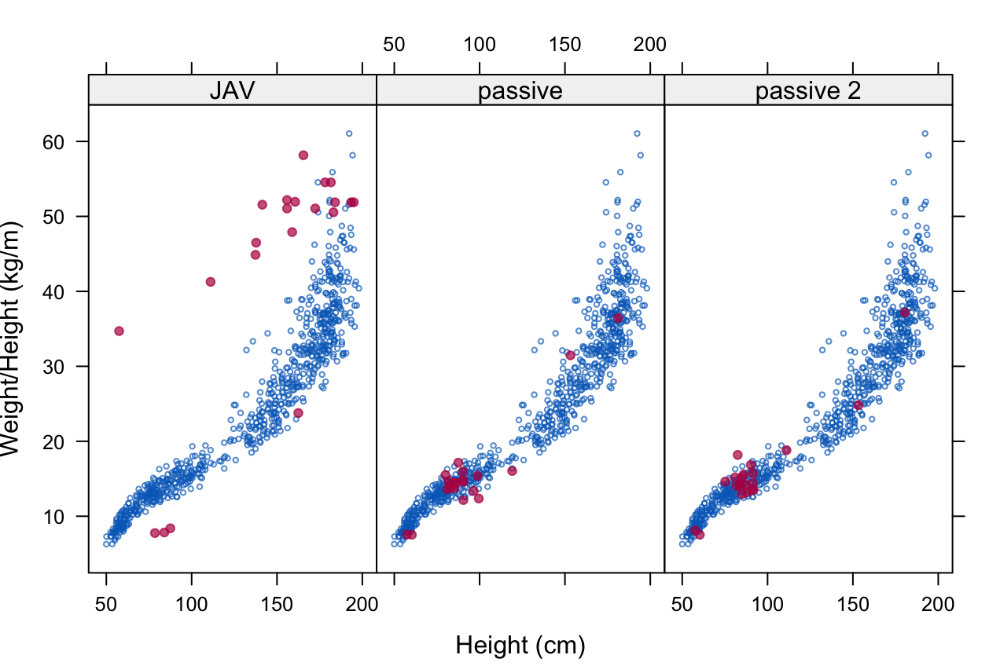

### Section 5.4.3 Interaction terms

``` r
rm(boys)
expr <- expression((wgt - 40) * (hc - 50))
boys$wgt.hc <- with(boys, eval(expr))
ini <- mice(boys, max = 0)
meth <- ini$meth
meth["wgt.hc"] <- paste("~I(", expr, ")", sep = "")
meth["bmi"] <- ""
pred <- ini$pred
pred[c("wgt", "hc"), "wgt.hc"] <- 0
imp.int <- mice(boys, m = 1, maxit = 10, meth = meth, pred = pred, 
    seed = 62587)
```

    ## 
    ##  iter imp variable
    ##   1   1  hgt  wgt  bmi  hc  gen  phb  tv  reg  wgt.hc
    ##   2   1  hgt  wgt  bmi  hc  gen  phb  tv  reg  wgt.hc
    ##   3   1  hgt  wgt  bmi  hc  gen  phb  tv  reg  wgt.hc
    ##   4   1  hgt  wgt  bmi  hc  gen  phb  tv  reg  wgt.hc
    ##   5   1  hgt  wgt  bmi  hc  gen  phb  tv  reg  wgt.hc
    ##   6   1  hgt  wgt  bmi  hc  gen  phb  tv  reg  wgt.hc
    ##   7   1  hgt  wgt  bmi  hc  gen  phb  tv  reg  wgt.hc
    ##   8   1  hgt  wgt  bmi  hc  gen  phb  tv  reg  wgt.hc
    ##   9   1  hgt  wgt  bmi  hc  gen  phb  tv  reg  wgt.hc
    ##   10   1  hgt  wgt  bmi  hc  gen  phb  tv  reg  wgt.hc

``` r
### Figure 5.2
miss <- is.na(imp.int$data$wgt.hc)
tp52a <- xyplot(imp.int, wgt ~ wgt.hc, na.groups = miss, 
    cex = c(0.8, 1.2), pch = c(1, 20), ylab = "Weight (kg)", 
    xlab = "Interaction")
tp52b <- xyplot(imp.int, hc ~ wgt.hc, na.groups = miss, 
    cex = c(0.8, 1.2), pch = c(1, 20), ylab = "Head circumference (cm)", 
    xlab = "Interaction")
print(tp52a)
```

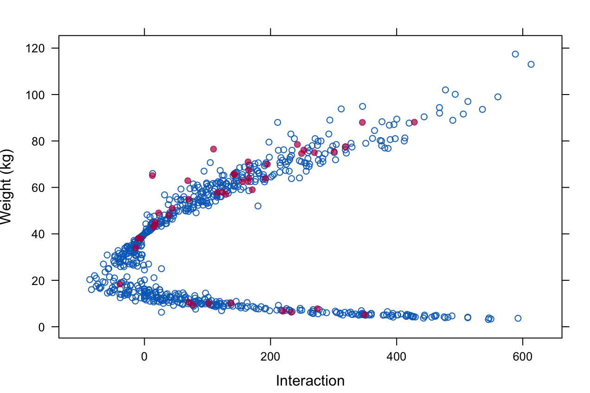

``` r
print(tp52b)
```

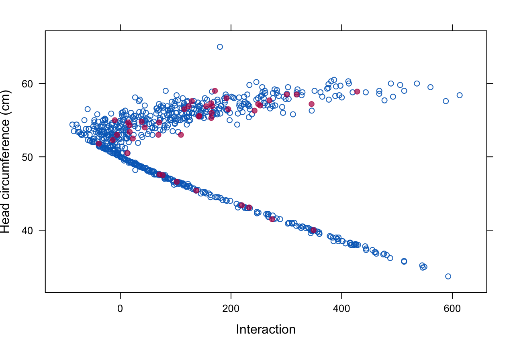

### Section 5.4.4 Conditional imputation

``` r
ini <- mice(airquality[, 1:2], maxit = 0)
post <- ini$post
post["Ozone"] <- "imp[[j]][,i] <- squeeze(imp[[j]][,i],c(1,200))"
### Note: ifdo() not yet implemented so for the moment use
### old form post['Ozone'] <- 'ifdo(c(Ozone<1, Ozone>200),
### c(1, 200))'
imp <- mice(airquality[, 1:2], method = "norm.nob", m = 1, 
    maxit = 1, seed = 1, post = post)
```

    ## 
    ##  iter imp variable
    ##   1   1  Ozone  Solar.R

``` r
### Figure 5.3

lwd <- 1.5
par(mfrow = c(1, 2))
breaks <- seq(-20, 200, 10)
nudge <- 1
x <- matrix(c(breaks - nudge, breaks + nudge), ncol = 2)
obs <- airquality[, "Ozone"]
mis <- imp$imp$Ozone[, 1]
fobs <- c(hist(obs, breaks, plot = FALSE)$counts, 0)
fmis <- c(hist(mis, breaks, plot = FALSE)$counts, 0)
y <- matrix(c(fobs, fmis), ncol = 2)
matplot(x, y, type = "s", col = c(mdc(4), mdc(5)), lwd = 2, 
    lty = 1, xlim = c(0, 170), ylim = c(0, 40), yaxs = "i", 
    xlab = "Ozone (ppb)", ylab = "Frequency")
box()

tp <- xyplot(imp, Ozone ~ Solar.R, na.groups = ici(imp), 
    ylab = "Ozone (ppb)", xlab = "Solar Radiation (lang)", 
    cex = 0.75, lex = lwd, ylim = c(-20, 180), xlim = c(0, 
        350))
print(tp, newpage = FALSE, position = c(0.48, 0.08, 1, 0.92))
```

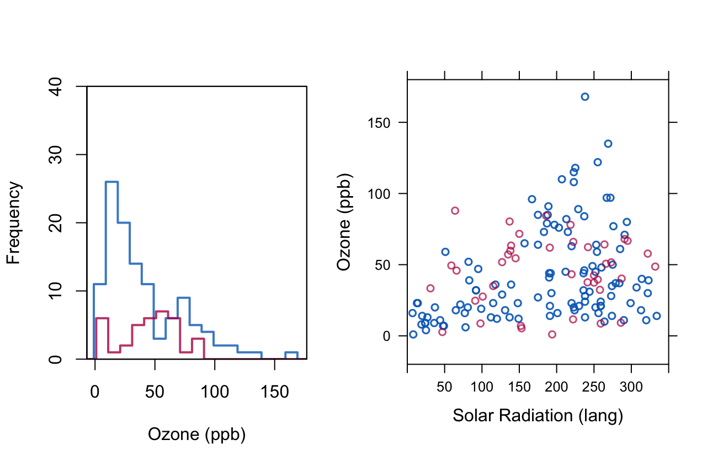

### Post-processing on the boys data

``` r
post <- mice(boys, m = 1, maxit = 0)$post
post["gen"] <- "imp[[j]][p$data$age[!r[,j]]<8,i] <- levels(boys$gen)[1]"
post["phb"] <- "imp[[j]][p$data$age[!r[,j]]<8,i] <- levels(boys$phb)[1]"
post["tv"] <- "imp[[j]][p$data$age[!r[,j]]<8,i] <- 1"
free <- mice(boys, m = 1, seed = 85444, print = FALSE)
restricted <- mice(boys, m = 1, post = post, seed = 85444, 
    print = FALSE)

### The following code using ifdo does not yet work Use
### the form given above post <- mice(boys, m=1,
### maxit=0)$post post['gen'] <- 'ifdo(age<8,
### levels(gen)[1])' post['phb'] <- 'ifdo(age<8,
### levels(phb)[1])' post['tv'] <- 'ifdo(age<8, 1)' free
### <- mice(boys, m=1, seed=85444) restricted <-
### mice(boys, m=1, post=post, seed=85444)


### Figure 5.4

imp3 <- rbind(free, restricted)  # ignore warning
```

    ## Warning in rbind(deparse.level, ...): `post` not equal;
    ## ignores y$post

``` r
model <- rep(c("Free", "Restricted"), each = nrow(boys))
tp54 <- xyplot(imp3, gen ~ age | model, pch = c(3, 1), cex = c(3, 
    1.5), ylab = "Genital development", xlab = "Age (years)")
print(tp54)
```

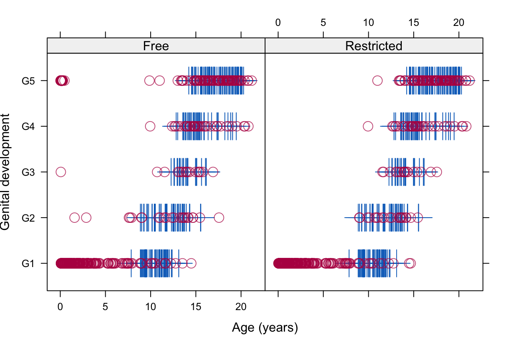

### Section 5.4.5 Compositional data

``` r
set.seed(43112)
n <- 400
Y1 <- sample(1:10, size = n, replace = TRUE)
Y2 <- sample(1:20, size = n, replace = TRUE)
Y3 <- 10 + 2 * Y1 + 0.6 * Y2 + sample(-10:10, size = n, 
    replace = TRUE)
Y <- data.frame(Y1, Y2, Y3)
Y[1:100, 1:2] <- NA
md.pattern(Y)
```

    ##     Y3  Y1  Y2    
    ## 300  1   1   1   0
    ## 100  1   0   0   2
    ##      0 100 100 200

``` r
Y123 <- Y1 + Y2 + Y3
Y12 <- Y123 - Y[, 3]
P1 <- Y[, 1]/Y12
data <- data.frame(Y, Y123, Y12, P1)

ini <- mice(data, maxit = 0, m = 10, print = FALSE, seed = 21772)
meth <- ini$meth
meth["Y1"] <- "~I(P1*Y12)"
meth["Y2"] <- "~I((1-P1)*Y12)"
meth["Y12"] <- "~I(Y123-Y3)"
pred <- ini$pred
pred["P1", ] <- 0
pred[c("P1"), c("Y12", "Y3")] <- 1
imp1 <- mice(data, meth = meth, pred = pred, m = 10, print = FALSE)

round(summary(pool(with(imp1, lm(Y3 ~ Y1 + Y2))))[, 1:2], 
    2)
```

    ##              est   se
    ## (Intercept) 9.56 0.98
    ## Y1          2.02 0.11
    ## Y2          0.60 0.06

``` r
### improved solution for Figure 5.5b
ini <- mice(data, maxit = 0, m = 10, print = FALSE, seed = 21772)
meth <- ini$meth
meth["Y1"] <- "~I(P1*Y12)"
meth["Y2"] <- "~I((1-P1)*Y12)"
meth["Y12"] <- "~I(Y123-Y3)"
pred <- ini$pred
pred["P1", ] <- 0
pred[c("P1"), c("Y12", "Y3")] <- 1
imp1 <- mice(data, meth = meth, pred = pred, m = 1, print = FALSE)
pred["P1", "Y3"] <- 0
imp2 <- mice(data, meth = meth, pred = pred, m = 1, print = FALSE)

### Figure 5.5
imp <- rbind(imp1, imp2)  # ignore warning
```

    ## Warning in rbind(deparse.level, ...): `predictorMatrix`
    ## not equal; ignores y$predictorMatrix

``` r
model <- rep(c("Y12 and Y3", "Y12 only"), each = n)
tp55 <- xyplot(imp, P1 ~ Y12 | model, pch = c(1, 19), xlab = "Y1 + Y2")
print(tp55)
```


### Section 5.5.1 Visit sequence

``` r
### Continue from the imp.int object calculated in section
### 5.4.3
imp.int$vis
```

    ##    hgt    wgt    bmi     hc    gen    phb     tv 
    ##      2      3      4      5      6      7      8 
    ##    reg wgt.hc 
    ##      9     10

``` r
vis <- c(2, 3, 5, 10, 6:9)
rm(boys)  # refresh boys data
expr <- expression((wgt - 40) * (hc - 50))
boys$wgt.hc <- with(boys, eval(expr))
imp.int2 <- mice(boys, m = 1, max = 1, vis = vis, meth = imp.int$meth, 
    pred = imp.int$pred, seed = 23390)
```

    ## 
    ##  iter imp variable
    ##   1   1  hgt  wgt  hc  wgt.hc  gen  phb  tv  reg

``` r
### monotone sequence
imp.int2 <- mice(boys, m = 1, max = 1, vis = "monotone", 
    meth = imp.int$meth, pred = imp.int$pred, seed = 23390)
```

    ## 
    ##  iter imp variable
    ##   1   1  reg  wgt  hgt  bmi  hc  wgt.hc  gen  phb  tv

``` r
### Section 5.5.2 Convergence

### Figure 5.6 Default color version

imp <- mice(nhanes, seed = 62006, maxit = 20, print = FALSE)
tp56 <- plot(imp)
print(tp56)
```

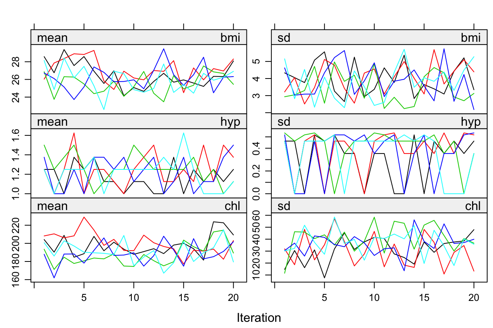

``` r
### Figure 5.6 Book version

# tp56b <- plot(imp, col=mdc(5), lty=1:5) print(tp56b)
```

### Example of pathological convergence

``` r
rm(boys)
ini <- mice(boys, max = 0, print = FALSE)
meth <- ini$meth
meth["bmi"] <- "~I(wgt/(hgt/100)^2)"
imp.bmi1 <- mice(boys, meth = meth, maxit = 20, seed = 60109, 
    print = FALSE)

### Figure 5.7 Does not reproduce exactly, but the message
### is the same
tp57 <- plot(imp.bmi1, c("hgt", "wgt", "bmi"), col = mdc(5), 
    lty = 1:5)
print(tp57)
```

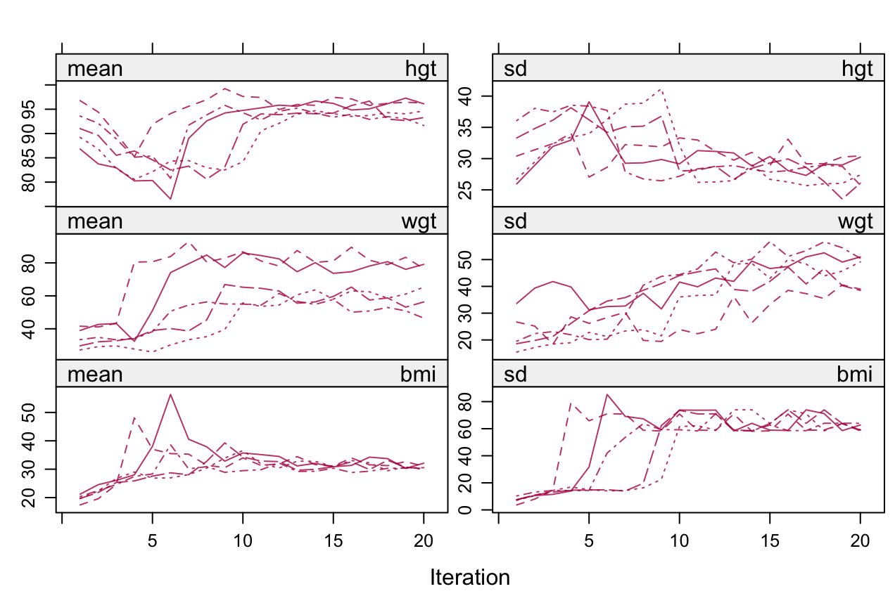

``` r
### Breaking cyclic imputations for hgt and wgt
pred <- ini$pred
pred[c("hgt", "wgt"), "bmi"] <- 0
imp.bmi2 <- mice(boys, meth = meth, pred = pred, maxit = 20, 
    seed = 60109, print = FALSE)

### Figure 5.8 Does not reproduce exactly, but the message
### is the same
tp58 <- plot(imp.bmi2, c("hgt", "wgt", "bmi"), col = mdc(5), 
    lty = 1:5)
print(tp58)
```

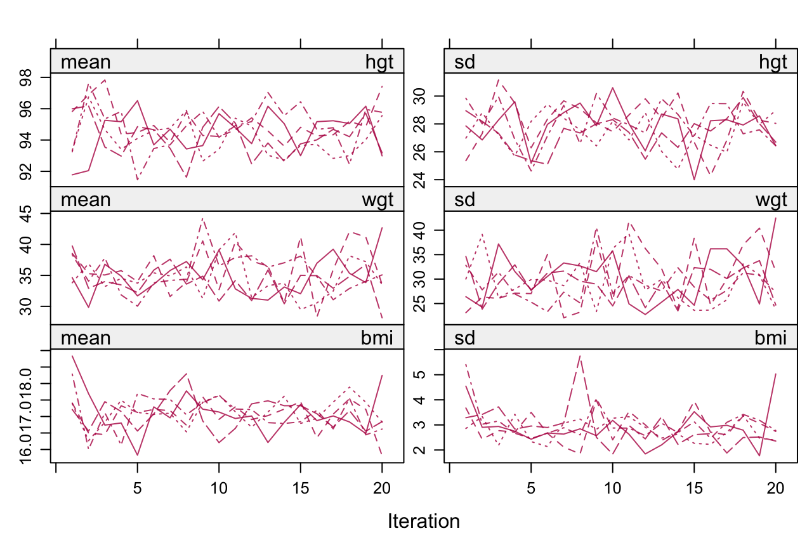

### Section 5.6.2 Diagnostic graphs

``` r
set.seed(24417)
### create 50% missing data in wgt
boys$wgt[sample(1:nrow(boys), nrow(boys)/2)] <- NA
meth <- c("", "pmm", "pmm", "", "pmm", "polr", "polr", "pmm", 
    "polyreg")
imp <- mice(boys, m = 1, meth = meth, seed = 53882, print = FALSE)

### Simple scatterplot wgt-age (not given in book)
tp58b <- xyplot(imp, wgt ~ age | .imp)
print(tp58b)
```

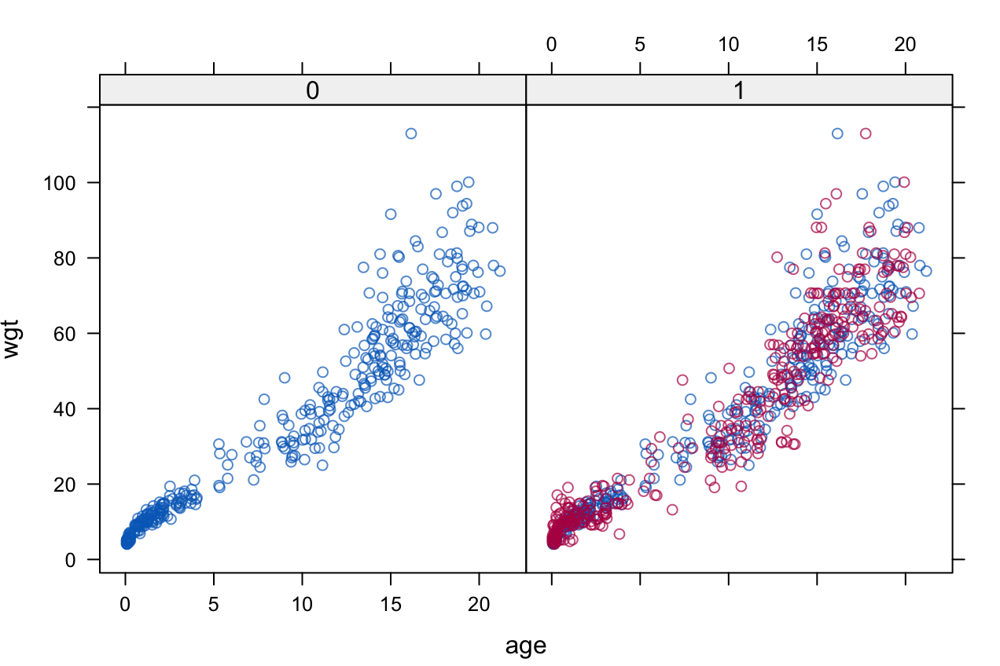

``` r
### Fit separate regression models for wgt for observed
### (n=372) and imputed (n=376) data
cd <- complete(imp)[, -4]
isobs <- !is.na(boys$wgt)
cdobs <- cd[isobs, ]
cdmis <- cd[!isobs, ]
obs <- gamlss(wgt ~ age + hgt + hc + gen + phb + tv + reg, 
    data = na.omit(cdobs))
```

    ## GAMLSS-RS iteration 1: Global Deviance = 2440 
    ## GAMLSS-RS iteration 2: Global Deviance = 2440

``` r
mis <- gamlss(wgt ~ age + hgt + hc + gen + phb + tv + reg, 
    data = na.omit(cdmis))
```

    ## GAMLSS-RS iteration 1: Global Deviance = 2429 
    ## GAMLSS-RS iteration 2: Global Deviance = 2429

``` r
### Figure 5.9 worm plot
wp.twin(obs, mis, xvar = NULL, xvar.column = 2, n.inter = 9, 
    col1 = mdc(4), col2 = mdc(5), ylim = 0.9, cex = 1, pch = 1)
```

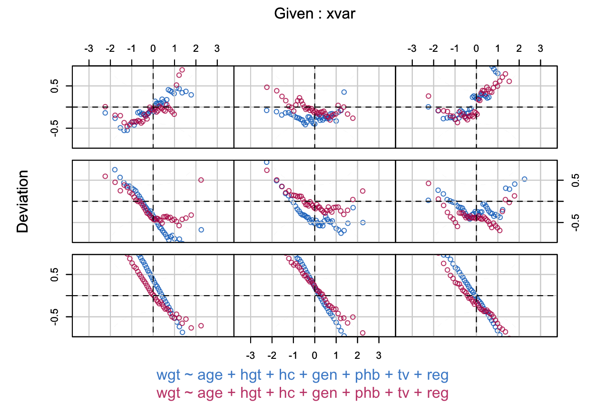

### Figure 5.10

``` r
imp <- mice(nhanes, seed = 29981)
```

    ## 
    ##  iter imp variable
    ##   1   1  bmi  hyp  chl
    ##   1   2  bmi  hyp  chl
    ##   1   3  bmi  hyp  chl
    ##   1   4  bmi  hyp  chl
    ##   1   5  bmi  hyp  chl
    ##   2   1  bmi  hyp  chl
    ##   2   2  bmi  hyp  chl
    ##   2   3  bmi  hyp  chl
    ##   2   4  bmi  hyp  chl
    ##   2   5  bmi  hyp  chl
    ##   3   1  bmi  hyp  chl
    ##   3   2  bmi  hyp  chl
    ##   3   3  bmi  hyp  chl
    ##   3   4  bmi  hyp  chl
    ##   3   5  bmi  hyp  chl
    ##   4   1  bmi  hyp  chl
    ##   4   2  bmi  hyp  chl
    ##   4   3  bmi  hyp  chl
    ##   4   4  bmi  hyp  chl
    ##   4   5  bmi  hyp  chl
    ##   5   1  bmi  hyp  chl
    ##   5   2  bmi  hyp  chl
    ##   5   3  bmi  hyp  chl
    ##   5   4  bmi  hyp  chl
    ##   5   5  bmi  hyp  chl

``` r
tp510 <- stripplot(imp, pch = c(1, 20))
print(tp510)
```

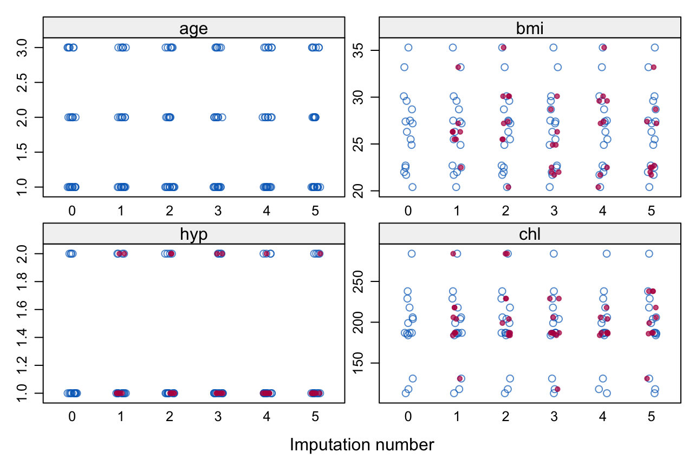

### Figure 5.11

``` r
tp511 <- densityplot(imp)
print(tp511)
```

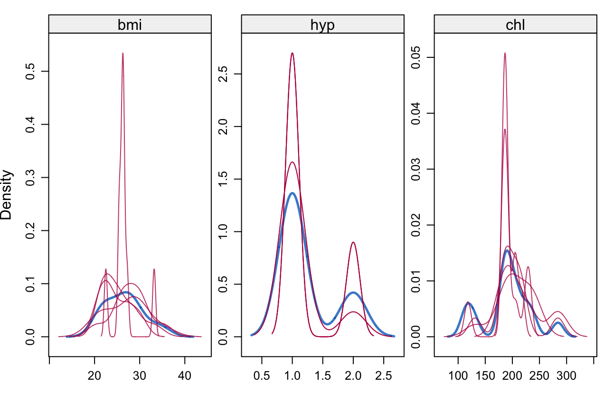

### Calculate propensity scores

``` r
fit <- with(imp, glm(ici(imp) ~ age + bmi + hyp + chl, family = binomial))
ps <- rep(rowMeans(sapply(fit$analyses, fitted.values)), 
    imp$m)

### Figure 5.12
tp512 <- xyplot(imp, bmi ~ ps | .imp, pch = c(1, 19), xlab = "Probability that record is incomplete", 
    ylab = "BMI")
print(tp512)
```

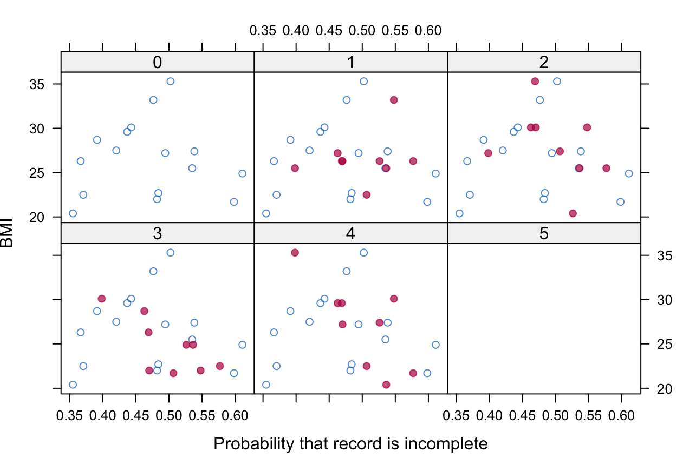

Chapter 6 Analysis of imputed data
----------------------------------

### Section 6.1.1 Averaging and stacking the data

``` r
library("mice")
imp <- mice(nhanes, print = FALSE, seed = 55152)
stacked <- complete(imp, "long")
fit <- lm(chl ~ bmi + age, data = stacked)
coef(fit)
```

    ## (Intercept)         bmi         age 
    ##      -21.34        6.09       29.37

### Section 6.1.2 Repeated analyses

``` r
fit <- with(imp, lm(chl ~ bmi + age))
coef(fit$analyses[[1]])
```

    ## (Intercept)         bmi         age 
    ##      -17.33        5.26       37.01

``` r
coef(fit$analyses[[2]])
```

    ## (Intercept)         bmi         age 
    ##        9.75        5.23       25.87

``` r
est <- pool(fit)
summary(est)
```

    ##                est    se      t    df Pr(>|t|)   lo 95
    ## (Intercept) -16.30 63.59 -0.256 10.24   0.8027 -157.55
    ## bmi           5.93  2.09  2.843 10.27   0.0170    1.30
    ## age          28.95 10.44  2.772  8.35   0.0232    5.04
    ##             hi 95 nmis   fmi lambda
    ## (Intercept) 124.9   NA 0.421  0.318
    ## bmi          10.6    9 0.420  0.317
    ## age          52.9    0 0.500  0.392

``` r
expr <- expression(freq <- table(hyp), freq[1] - freq[2])
fit <- with(imp, eval(expr))
unlist(fit$an)
```

    ##  1  1  1  1  1 
    ## 15 17 17 11  7

### Section 6.3.5 Computation

``` r
imp <- mice(nhanes2, seed = 23210, print = FALSE)
fit <- with(imp, lm(bmi ~ age + chl))
fit.restrict <- with(imp, lm(bmi ~ 1))
res <- pool.compare(fit, fit.restrict)
res$pvalue
```

    ##       [,1]
    ## [1,] 0.137

``` r
est <- pool(fit)
summary(est)
```

    ##                 est     se     t    df Pr(>|t|)
    ## (Intercept) 20.3996 4.4296  4.61 10.07 0.000955
    ## age2        -3.5232 2.3759 -1.48  7.58 0.178450
    ## age3        -4.7645 2.3236 -2.05 11.17 0.064541
    ## chl          0.0445 0.0264  1.68  7.45 0.134004
    ##               lo 95  hi 95 nmis   fmi lambda
    ## (Intercept) 10.5389 30.260   NA 0.416  0.310
    ## age2        -9.0555  2.009   NA 0.526  0.415
    ## age3        -9.8692  0.340   NA 0.374  0.271
    ## chl         -0.0173  0.106   10 0.532  0.422

``` r
C <- matrix(c(c(0, 1, -1, 0), c(0, 2, -1, 0), c(0, 0, 0, 
    1)), nrow = 3, ncol = 4, byrow = TRUE)
c <- c(0, 0, 0.1)
q <- C %*% est$qbar
u <- diag(C %*% est$ubar %*% t(C))
t <- diag(C %*% est$t %*% t(C))
C1 <- C
C1[C1 != 0] <- 1
df <- C1 %*% est$df  # this needs to change to compromise df
d <- (q - c)^2/t
pvalue <- 1 - pf(d, 1, df)
pvalue
```

    ##        [,1]
    ## [1,] 0.5764
    ## [2,] 0.5681
    ## [3,] 0.0715

### Section 6.4.2 Computation

``` r
data <- boys[boys$age >= 8, -4]
imp <- mice(data, seed = 28382, m = 10, print = FALSE)
expr <- expression(f1 <- lm(tv ~ 1), f2 <- step(f1, scope = list(upper = ~age + 
    hgt + wgt + hc + gen + phb + reg), lower = ~1))
fit <- with(imp, expr)
```

``` r
formulas <- lapply(fit$an, formula)
terms <- lapply(formulas, terms)
vars <- unlist(lapply(terms, labels))
table(vars)
```

    ## vars
    ## age gen  hc hgt phb reg wgt 
    ##  10  10   1   5  10  10   8

``` r
fit.without <- with(imp, lm(tv ~ age + gen + reg + phb))
fit.with <- with(imp, lm(tv ~ age + gen + reg + phb + hgt))
pool.compare(fit.with, fit.without)$pvalue
```

    ##       [,1]
    ## [1,] 0.196

``` r
fit.without <- with(imp, lm(tv ~ age + gen + reg))
fit.with <- with(imp, lm(tv ~ age + gen + reg + phb))
pool.compare(fit.with, fit.without)$pvalue
```

    ##       [,1]
    ## [1,] 0.029

Chapter 7 Measurement issues
----------------------------

### Section 7.1 Too many columns

``` r
library("mice")
library("lattice")
library("foreign")
library("survival")
```

### Section 7.1.3 Data exploration

``` r
data <- leiden85  ## Note: the leiden85 data is not avialable
if (!is.data.frame(data)) warning("The code for section 7.1/7.2 requires access to the LEIDEN85 data.")

ini <- mice(data, maxit = 0)  # recommended 
table(ini$nmis)

table(data$beroep1, useNA = "always")

v1 <- names(ini$nmis[ini$nmis == 0])
outlist1 <- v1[c(1, 3:5, 7:10, 16:47, 51:60, 62, 64:65, 
    69:72)]
length(outlist1)
```

### Section 7.1.4 Outflux

``` r
fx <- fluxplot(data, main = NULL, cex = 0.9)

outlist2 <- row.names(fx)[fx$outflux < 0.5]
length(outlist2)

data2 <- data[, !names(data) %in% outlist2]
fx2 <- flux(data2)
outlist3 <- row.names(fx2)[fx2$outflux < 0.5]
```

### Section 7.1.5 Logged events

``` r
ini$log[1:3, ]

outlist4 <- as.character(ini$log[, "out"])
```

### Section 7.1.6 Quick predictor selection for wide data

``` r
outlist <- unique(c(outlist1, outlist2, outlist4))
length(outlist)

data2 <- data[, !names(data) %in% outlist]

inlist <- c("sex", "lftanam", "rrsyst", "rrdiast")
pred <- quickpred(data2, minpuc = 0.5, inc = inlist)

table(rowSums(pred))

rowSums(pred[c("rrsyst", "rrdiast"), ])

names(data2)[pred["rrsyst", ] == 1]

vname <- "rrsyst"
y <- cbind(data2[vname], r = !is.na(data2[, vname]))
vdata <- data2[, pred[vname, ] == 1]
round(cor(y = y, x = vdata, use = "pair"), 2)
```

### Section 7.1.7 Generating the imputations

``` r
### Smart imputation using quickpred - - TIME CONSUMING
### (30 MINUTES)
imp.qp <- mice(data2, pred = pred, ridge = 1e-04, seed = 29725)

### Blind imputation - MUCH MORE TIME CONSUMING (10 HOURS)
### Not recommended
imp <- mice(data, ridge = 0.01, seed = 32417, maxit = 2)

vnames <- c("rrsyst", "rrdiast")
cd1 <- complete(imp)[, vnames]
cd2 <- complete(imp.qp)[, vnames]
typ <- factor(rep(c("blind imputation", "quickpred"), each = nrow(cd1)))
mis <- ici(data2[, vnames])
mis <- is.na(imp$data$rrsyst) | is.na(imp$data$rrdiast)
cd <- data.frame(typ = typ, mis = mis, rbind(cd1, cd2))
tp72 <- xyplot(jitter(rrdiast, 10) ~ jitter(rrsyst, 10) | 
    typ, data = cd, groups = mis, xlab = "Systolic BP (mmHg)", 
    ylab = "Diastolic BP (mmHg)", col = c(mdc(1), mdc(2)), 
    pch = c(1, 19), type = c("g", "p"), strip = strip.custom(bg = "grey95"), 
    scales = list(alternating = 1, tck = c(1, 0)))
print(tp72)
```

### Section 7.1.8 A further improvements: Survival as

### predictor variable

``` r
dat <- cbind(data2, dead = 1 - data2$dwa)
hazard <- nelsonaalen(dat, survda, dead)

### calculate correlations between hazard, t and logt (not
### in
tmp <- data.frame(hazard, t = data2$survda, logt = log(data2$survda), 
    SBP = data2$rrsyst, DBP = data2$rrdiast)
round(cor(tmp, use = "pair"), 3)
```

### Section 7.2 Sensitivity analysis

``` r
### Figure 7.3
fit <- survfit(Surv(survda/365, 1 - dwa) ~ is.na(rrsyst), 
    data = data2)
plot(fit, lty = 1, lwd = 1.5, xlab = "Years since intake", 
    ylab = "K-M Survival probability", las = 1, col = c(mdc(4), 
        mdc(5)), mark.time = FALSE)
text(4, 0.7, "BP measured")
text(2, 0.3, "BP missing")
```

### Section 7.2.3 Generating imputations under the

### delta-adjustment

``` r
delta <- c(0, -5, -10, -15, -20)
post <- imp.qp$post

### undamped sensitivity analysis TIME CONSUMING (SEVERAL
### HOURS)
imp.all.undamped <- vector("list", length(delta))
for (i in 1:length(delta)) {
    d <- delta[i]
    cmd <- paste("imp[[j]][,i] <- imp[[j]][,i] +", d)
    post["rrsyst"] <- cmd
    imp <- mice(data2, pred = pred, post = post, maxit = 1, 
        seed = i * 22, ridge = 1e-04)
    imp.all.undamped[[i]] <- imp
}

### damped sensitivity analysis TIME CONSUMING (SEVERAL
### HOURS)
imp.all.damped <- vector("list", length(delta))
for (i in 1:length(delta)) {
    d <- delta[i]
    cmd <- paste("fit <- lm(y ~ as.matrix(x)); 
        damp <- sqrt(1 - summary(fit)$r.squared);
        imp[[j]][, i] <- imp[[j]][, i] + damp * ", 
        d)
    post["rrsyst"] <- cmd
    imp <- mice(data2, pred = pred, post = post, maxit = 1, 
        seed = i * 22, ridge = 1e-04)
    imp.all.damped[[i]] <- imp
}
```

### Section 7.2.4 Complete data analysis

``` r
cda <- expression(sbpgp <- cut(rrsyst, breaks = c(50, 124, 
    144, 164, 184, 200, 500)), agegp <- cut(lftanam, breaks = c(85, 
    90, 95, 110)), dead <- 1 - dwa, coxph(Surv(survda, dead) ~ 
    C(sbpgp, contr.treatment(6, base = 3)) + strata(sexe, 
        agegp)))
imp <- imp.all.damped[[1]]
fit <- with(imp, cda)
as.vector(exp(summary(pool(fit))[, 1]))

### Table 7.5

fit1 <- with(imp.all.damped[[1]], cda)
fit2 <- with(imp.all.damped[[2]], cda)
fit3 <- with(imp.all.damped[[3]], cda)
fit4 <- with(imp.all.damped[[4]], cda)
fit5 <- with(imp.all.damped[[5]], cda)
r1 <- as.vector(t(exp(summary(pool(fit1))[, c(1, 6:7)])))
r2 <- as.vector(t(exp(summary(pool(fit2))[, c(1, 6:7)])))
r3 <- as.vector(t(exp(summary(pool(fit3))[, c(1, 6:7)])))
r4 <- as.vector(t(exp(summary(pool(fit4))[, c(1, 6:7)])))
r5 <- as.vector(t(exp(summary(pool(fit5))[, c(1, 6:7)])))
round(t(matrix(c(r1, r2, r3, r4, r5), nrow = 15)), 2)
```

### Section 7.3 Correct prevalence estimates from

### self-reported data

``` r
library("mice")
krul <- selfreport[selfreport$src == "krul", ]
mgg <- selfreport[selfreport$src == "mgg", ]

### Figure 7.4

xy <- xy.coords(krul$bm, krul$br - krul$bm)
plot(xy, col = mdc(1), xlab = "Measured BMI", ylab = "Reported - Measured BMI", 
    xlim = c(17, 45), ylim = c(-5, 5), type = "n", lwd = 0.7)
polygon(x = c(30, 20, 30), y = c(0, 10, 10), col = "grey95", 
    border = NA)
polygon(x = c(30, 40, 30), y = c(0, -10, -10), col = "grey95", 
    border = NA)
abline(0, 0, lty = 2, lwd = 0.7)
points(xy, col = mdc(1), cex = 0.7)
lines(lowess(xy), lwd = 2, col = mdc(4))
text(1:4, x = c(40, 28, 20, 32), y = c(4, 4, -4, -4), cex = 3)
box(lwd = 1)
```

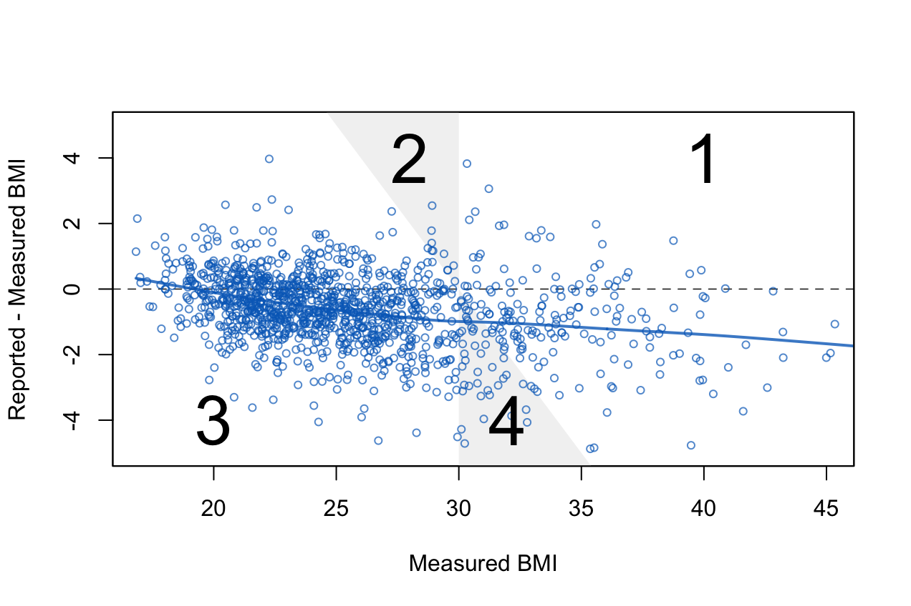

### Figure 7.5 Krul data - males

``` r
males <- krul[krul$sex == "Male", ]
fit <- lm(bm ~ br, data = males)
plot(x = males$br, y = males$bm, xlim = c(26, 34), ylim = c(26, 
    34), xlab = "Self-reported BMI", ylab = "Measured BMI", 
    col = mdc(1), cex.lab = 1.5, cex.axis = 1.3)
abline(h = 30, v = 30, lty = 2)
abline(coef(fit), col = mdc(4))
abline(v = (30 - coef(fit)[1])/coef(fit)[2], col = mdc(4))
text(1:4, x = c(33.8, 33.8, 26.2, 26.2), y = c(33.8, 26.2, 
    26.2, 33.8), cex = 4)
text(c("a", "b"), x = c(29.1, 29.7, 29.1, 29.7), y = c(34.1, 
    34.1, 26.4, 26.4), cex = 3, adj = c(0.5, 1))
```

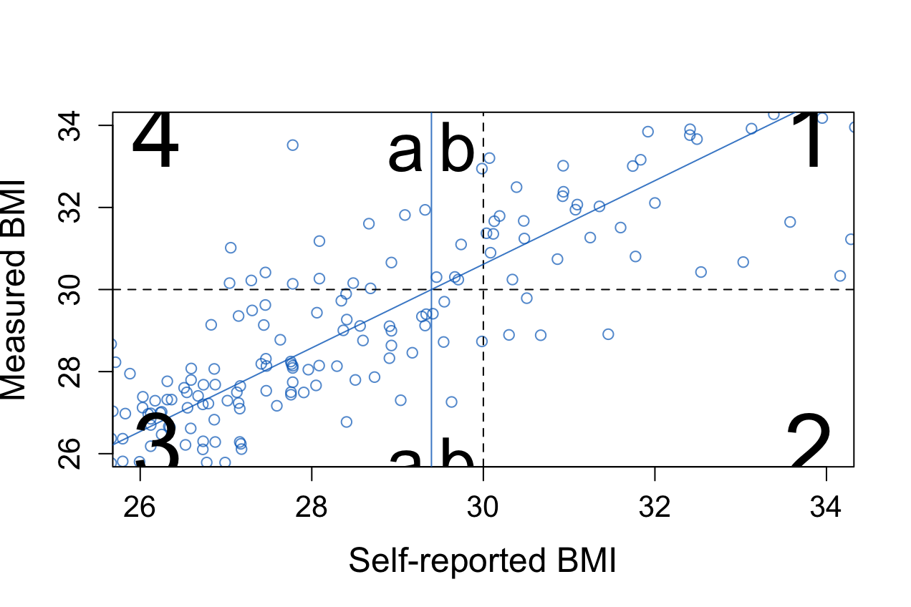

### Section 7.3.4 Data

``` r
md.pattern(selfreport[, c("age", "sex", "hm", "hr", "wm", 
    "wr")])
```

    ##      age sex hr wr  hm  wm     
    ## 1257   1   1  1  1   1   1    0
    ##  803   1   1  1  1   0   0    2
    ##        0   0  0  0 803 803 1606

### Section 7.3.5 Application

``` r
bmi <- function(h, w) w/(h/100)^2
init <- mice(selfreport, maxit = 0)
meth <- init$meth
meth["bm"] <- "~bmi(hm,wm)"
meth[c("prg", "edu", "etn")] <- ""
pred <- init$pred
pred[, c("src", "id", "pop", "prg", "edu", "etn", "web", 
    "bm", "br")] <- 0
imp <- mice(selfreport, pred = pred, meth = meth, seed = 66573, 
    maxit = 20, m = 10, print = FALSE)
```

### Figure 7.6

``` r
cd <- complete(imp, 1)
xy <- xy.coords(cd$bm, cd$br - cd$bm)
plot(xy, col = mdc(2), xlab = "Measured BMI", ylab = "Reported - Measured BMI", 
    xlim = c(17, 45), ylim = c(-5, 5), type = "n", lwd = 0.7)
polygon(x = c(30, 20, 30), y = c(0, 10, 10), col = "grey95", 
    border = NA)
polygon(x = c(30, 40, 30), y = c(0, -10, -10), col = "grey95", 
    border = NA)
abline(0, 0, lty = 2, lwd = 0.7)

idx <- cd$src == "krul"
xyc <- xy
xyc$x <- xy$x[idx]
xyc$y <- xy$y[idx]
xys <- xy
xys$x <- xy$x[!idx]
xys$y <- xy$y[!idx]
points(xyc, col = mdc(1), cex = 0.7)
points(xys, col = mdc(2), cex = 0.7)
lines(lowess(xyc), col = mdc(4), lwd = 2)
lines(lowess(xys), col = mdc(5), lwd = 2)
text(1:4, x = c(40, 28, 20, 32), y = c(4, 4, -4, -4), cex = 3)
box(lwd = 1)
```

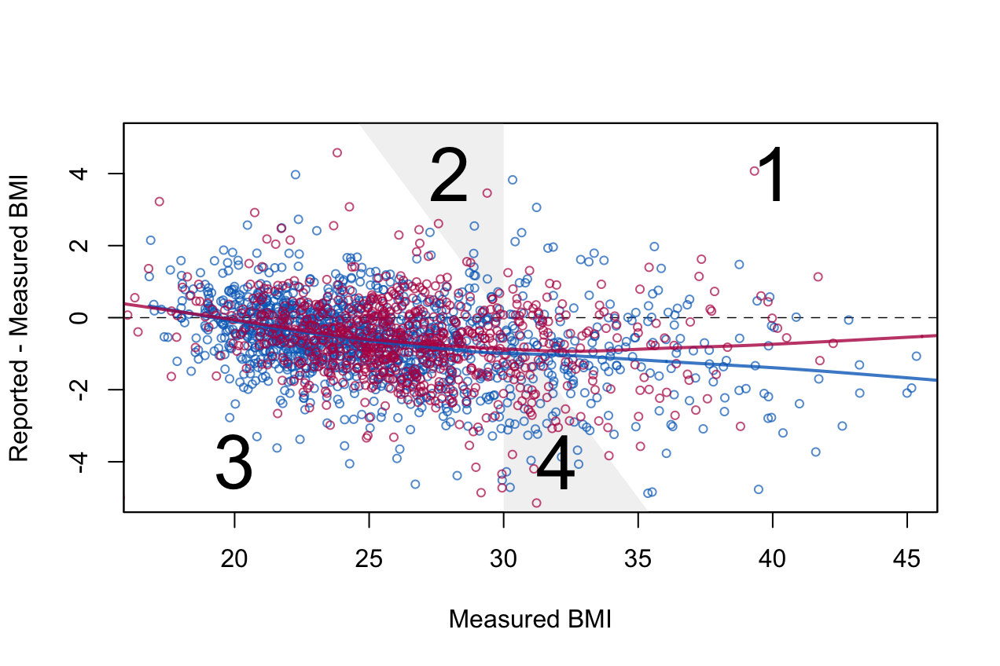

### Table 7.7

``` r
### Not particularly elegant code
prev <- matrix(NA, nr = 15, nc = 4)
prev[1, 1:2] <- summary(pool(with(imp, lm(br >= 30 ~ 1, 
    subset = (src == "mgg")))))[1, 1:2]
prev[1, 3:4] <- summary(pool(with(imp, lm(bm >= 30 ~ 1, 
    subset = (src == "mgg")))))[1, 1:2]
prev[2, 1:2] <- summary(pool(with(imp, lm(br >= 30 ~ 1, 
    subset = (src == "mgg" & sex == "Male")))))[1, 1:2]
prev[2, 3:4] <- summary(pool(with(imp, lm(bm >= 30 ~ 1, 
    subset = (src == "mgg" & sex == "Male")))))[1, 1:2]
prev[3, 1:2] <- summary(pool(with(imp, lm(br >= 30 ~ 1, 
    subset = (src == "mgg" & sex == "Female")))))[1, 1:2]
prev[3, 3:4] <- summary(pool(with(imp, lm(bm >= 30 ~ 1, 
    subset = (src == "mgg" & sex == "Female")))))[1, 1:2]
prev[4, 1:2] <- summary(pool(with(imp, lm(br >= 30 ~ 1, 
    subset = (src == "mgg" & sex == "Male" & age >= 18 & 
        age < 30)))))[1, 1:2]
prev[4, 3:4] <- summary(pool(with(imp, lm(bm >= 30 ~ 1, 
    subset = (src == "mgg" & sex == "Male" & age > 18 & 
        age < 30)))))[1, 1:2]
prev[5, 1:2] <- summary(pool(with(imp, lm(br >= 30 ~ 1, 
    subset = (src == "mgg" & sex == "Male" & age >= 30 & 
        age < 40)))))[1, 1:2]
prev[5, 3:4] <- summary(pool(with(imp, lm(bm >= 30 ~ 1, 
    subset = (src == "mgg" & sex == "Male" & age > 30 & 
        age < 40)))))[1, 1:2]
prev[6, 1:2] <- summary(pool(with(imp, lm(br >= 30 ~ 1, 
    subset = (src == "mgg" & sex == "Male" & age >= 40 & 
        age < 50)))))[1, 1:2]
prev[6, 3:4] <- summary(pool(with(imp, lm(bm >= 30 ~ 1, 
    subset = (src == "mgg" & sex == "Male" & age > 40 & 
        age < 50)))))[1, 1:2]
prev[7, 1:2] <- summary(pool(with(imp, lm(br >= 30 ~ 1, 
    subset = (src == "mgg" & sex == "Male" & age >= 50 & 
        age < 60)))))[1, 1:2]
prev[7, 3:4] <- summary(pool(with(imp, lm(bm >= 30 ~ 1, 
    subset = (src == "mgg" & sex == "Male" & age > 50 & 
        age < 60)))))[1, 1:2]
prev[8, 1:2] <- summary(pool(with(imp, lm(br >= 30 ~ 1, 
    subset = (src == "mgg" & sex == "Male" & age >= 60 & 
        age < 80)))))[1, 1:2]
prev[8, 3:4] <- summary(pool(with(imp, lm(bm >= 30 ~ 1, 
    subset = (src == "mgg" & sex == "Male" & age > 60 & 
        age < 80)))))[1, 1:2]
prev[10, 1:2] <- summary(pool(with(imp, lm(br >= 30 ~ 1, 
    subset = (src == "mgg" & sex == "Female" & age >= 18 & 
        age < 30)))))[1, 1:2]
prev[10, 3:4] <- summary(pool(with(imp, lm(bm >= 30 ~ 1, 
    subset = (src == "mgg" & sex == "Female" & age > 18 & 
        age < 30)))))[1, 1:2]
prev[11, 1:2] <- summary(pool(with(imp, lm(br >= 30 ~ 1, 
    subset = (src == "mgg" & sex == "Female" & age >= 30 & 
        age < 40)))))[1, 1:2]
prev[11, 3:4] <- summary(pool(with(imp, lm(bm >= 30 ~ 1, 
    subset = (src == "mgg" & sex == "Female" & age > 30 & 
        age < 40)))))[1, 1:2]
prev[12, 1:2] <- summary(pool(with(imp, lm(br >= 30 ~ 1, 
    subset = (src == "mgg" & sex == "Female" & age >= 40 & 
        age < 50)))))[1, 1:2]
prev[12, 3:4] <- summary(pool(with(imp, lm(bm >= 30 ~ 1, 
    subset = (src == "mgg" & sex == "Female" & age > 40 & 
        age < 50)))))[1, 1:2]
prev[13, 1:2] <- summary(pool(with(imp, lm(br >= 30 ~ 1, 
    subset = (src == "mgg" & sex == "Female" & age >= 50 & 
        age < 60)))))[1, 1:2]
prev[13, 3:4] <- summary(pool(with(imp, lm(bm >= 30 ~ 1, 
    subset = (src == "mgg" & sex == "Female" & age > 50 & 
        age < 60)))))[1, 1:2]
prev[14, 1:2] <- summary(pool(with(imp, lm(br >= 30 ~ 1, 
    subset = (src == "mgg" & sex == "Female" & age >= 60 & 
        age < 80)))))[1, 1:2]
prev[14, 3:4] <- summary(pool(with(imp, lm(bm >= 30 ~ 1, 
    subset = (src == "mgg" & sex == "Female" & age > 60 & 
        age < 80)))))[1, 1:2]

### find group sizes
table(mgg$sex, mgg$web)
```

    ##         
    ##           No Yes
    ##   Female 298 105
    ##   Male   303  97

``` r
table(mgg$sex, mgg$web, mgg$age > 55)
```

    ## , ,  = FALSE
    ## 
    ##         
    ##           No Yes
    ##   Female 249   0
    ##   Male   255   0
    ## 
    ## , ,  = TRUE
    ## 
    ##         
    ##           No Yes
    ##   Female  49 105
    ##   Male    48  97

### Section 7.4 Enhancing comparability

``` r
library("mice")

### Section 7.4.3 Independence: Imputation without a
### bridge study

fA <- c(242, 43, 15, 0, 6)
fB <- c(145, 110, 29, 8)
YA <- rep(ordered(c(0:3, NA)), fA)
YB <- rep(ordered(c(0:3)), fB)
Y <- rbind(data.frame(YA, YB = ordered(NA)), data.frame(YB, 
    YA = ordered(NA)))

md.pattern(Y)
```

    ##      YA  YB    
    ## 292   0   1   1
    ## 300   1   0   1
    ##   6   0   0   2
    ##     298 306 604

``` r
### simulation function Warning: micemill() overwrites
### objects 'imp' and 'tau' in the global enviroment

micemill <- function(n) {
    for (i in 1:n) {
        imp <<- mice.mids(imp)  # global assignment 
        cors <- with(imp, cor(as.numeric(YA), as.numeric(YB), 
            method = "kendall"))
        tau <<- rbind(tau, getfit(cors, s = TRUE))  # global assignment
    }
}

tau <- NULL
imp <- mice(Y, max = 0, m = 10, seed = 32662, print = FALSE)
micemill(50)
```

### Figure 7.7

``` r
plotit <- function() matplot(x = 1:nrow(tau), y = tau, ylab = expression(paste("Kendall's ", 
    tau)), xlab = "Iteration", type = "l", lwd = 1, lty = 1:10, 
    col = "black")
plotit()
```


### Section 7.4.4 Fully dependent or independent?

``` r
### Use the 'walking' dataset of the mice package

## split walking: ab is sources A and B (598 records)
ab <- walking[walking$src == "A" | walking$src == "B", ]

## split walking: euridiss is external source (292
## records)
external <- walking[walking$src == "E", ]

### create contingency tables: YA by YB (in ab)
ftable(addmargins(table(ab[, c("YA", "YB")], useNA = "ifany")))
```

    ##     YB   0   1   2   3  NA Sum
    ## YA                            
    ## 0        0   0   0   0 242 242
    ## 1        0   0   0   0  43  43
    ## 2        0   0   0   0  15  15
    ## 3        0   0   0   0   0   0
    ## NA     145 110  29   8   6 298
    ## Sum    145 110  29   8 306 598

``` r
### Table 7.8 contingency table YA by YB (in euridiss)
ftable(addmargins(table(external[, c("YA", "YB")], useNA = "ifany")))
```

    ##     YB   0   1   2   3 Sum
    ## YA                        
    ## 0      128  45   3   2 178
    ## 1       13  45  10   0  68
    ## 2        3  20  14   5  42
    ## 3        0   0   1   1   2
    ## NA       1   0   1   0   2
    ## Sum    145 110  29   8 292

``` r
### Section 7.4.5 Imputation using a bridge study
md.pattern(walking)
```

    ##     sex age src  YA  YB    
    ## 290   1   1   1   1   1   0
    ## 294   1   1   1   0   1   1
    ## 300   1   1   1   1   0   1
    ##   6   1   1   1   0   0   2
    ##       0   0   0 300 306 606

``` r
tau <- NULL
imp <- mice(walking, max = 0, m = 10, seed = 92786)
pred <- imp$pred
pred[, c("src", "age", "sex")] <- 0
imp <- mice(walking, max = 0, m = 10, seed = 92786, pred = pred, 
    print = FALSE)
micemill(20)
```

``` r
plotit()
```

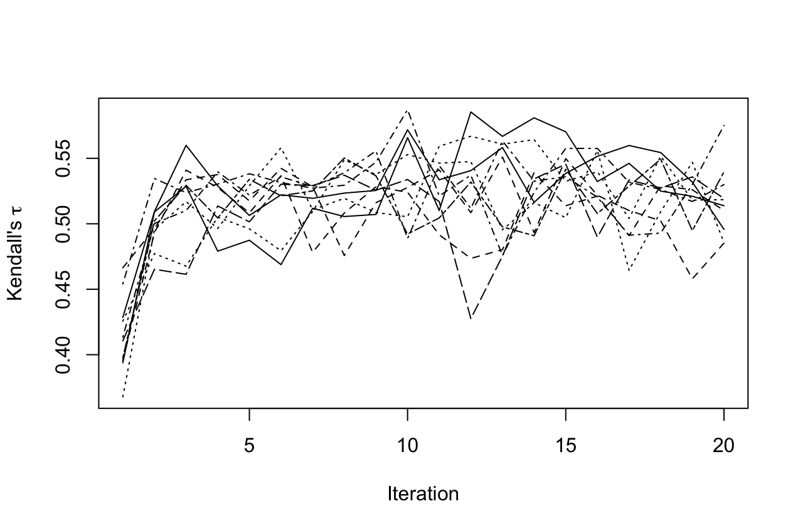

### impute without and with covariates

``` r
thetaAB <- NULL
props <- with(imp, mean(YB[src == "A"] == "0"))
thetaAB <<- rbind(thetaAB, getfit(props, s = TRUE))

micemill <- function(n) {
    for (i in 1:n) {
        imp <<- mice.mids(imp)  # global assignment 
        cors <- with(imp, cor(as.numeric(YA[src == "A"]), 
            as.numeric(YB[src == "A"]), method = "kendall"))
        tau <<- rbind(tau, getfit(cors, s = TRUE))  # global assignment
        means <- with(imp, mean(as.numeric(YA[src == "A"]), 
            na.rm = TRUE))
        thetaBA <<- rbind(thetaBA, getfit(means, s = TRUE) - 
            1)
        props <- with(imp, mean(YB[src == "A"] == "0"))
        thetaAB <<- rbind(thetaAB, getfit(props, s = TRUE))
        tabs <- with(imp, ftable(addmargins(table(YA[src == 
            "A"], YB[src == "A"], useNA = "ifany", dnn = c("YA", 
            "YB")))))
        print(getfit(tabs)[[2]])
    }
}

tau <- NULL
thetaBA <- NULL
thetaAB <- NULL
imp <- mice(walking, max = 0, m = 10, seed = 99786, print = FALSE)
oldpred <- pred <- imp$pred
pred[, c("src", "age", "sex")] <- 0
imp <- mice(walking, max = 0, m = 10, seed = 99786, pred = pred)
micemill(20)
pred <- oldpred
pred[, c("src")] <- 0
imp <- mice(walking, max = 0, m = 10, pred = pred)
micemill(20)
```

### Figure 7.9

``` r
matplot(x = 1:nrow(thetaAB), y = thetaAB, xlab = "Iteration", 
    ylab = expression(hat(theta)[AB]), type = "l", lwd = 1, 
    lty = 1:10, col = "black", ylim = c(0.4, 0.7))
abline(h = 0.497, v = 20, lty = 2)
text(x = 5, y = 0.488, expression(hat(theta)[BB]), adj = 0)
text(x = 5, y = 0.43, "Without covariates", adj = 0)
text(x = 25, y = 0.43, "With covariates", adj = 0)
arrows(x0 = 4.5, y0 = 0.488, x1 = 0, y1 = 0.495, length = 0.1, 
    angle = 20)
points(x = -0.4, y = 0.497, pch = 20)
```

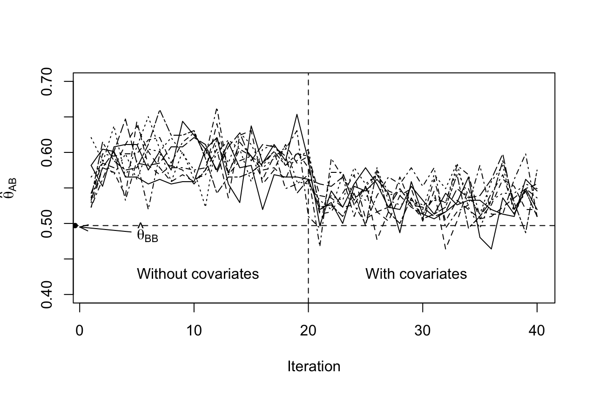

``` r
## file <-
## file.path('~/Documents/Sync/Impute/mice/V2.12/mice/data/walking.rda')
## save(walking, file=file)

## selfreport <- nl file <-
## file.path('~/Documents/Sync/Impute/mice/V2.12/mice/data/selfreport.rda')
## save(selfreport, file=file)
```

Chapter 8 Selection issues
--------------------------

### Section 8.1 Correcting for selective drop-out

``` r
library("mice")
library("lattice")
```

``` r
data <- pops
pred <- pops.pred
if (!is.data.frame(data)) stop("The code for section 8.1 requires access to the POPS data.")
```

### Section 8.1.4 A degenerate solution

``` r
### TIME CONSUMING (30 MINUTES))

imp1 <- mice(data, pred = pred, maxit = 20, seed = 51121)

### Figure 8.2

tp82 <- plot(imp1, c("a10u", "a10b", "adhd"), col = mdc(5), 
    lty = 1:5)
print(tp82)


### Section 8.1.5 A better solution

## TIME CONSUMING (30 MINUTES)
pred2 <- pred
pred2[61:86, 61:86] <- 0
imp2 <- mice(data, pred = pred2, maxit = 20, seed = 51121)

### Figure 8.3

tp83 <- bwplot(imp2, iq + e_tot + l19_sd + b19_sd + coping + 
    seffz ~ .imp, layout = c(2, 3))
print(tp83)


### Section 8.1.6 Results

### Full responders
summary(lm(as.numeric(a10u) ~ 1, data, na.action = na.omit))
summary(lm(as.numeric(a10b) ~ 1, data, na.action = na.omit))
summary(lm(as.numeric(adhd) ~ 1, data, na.action = na.omit))

### All children
summary(pool(with(imp2, lm(as.numeric(a10u) ~ 1))))
summary(pool(with(imp2, lm(as.numeric(a10b) ~ 1))))
summary(pool(with(imp2, lm(as.numeric(adhd) ~ 1))))
```

### Section 8.2 Correcting for nonresponse

``` r
library("mice")
data <- fdgs
```

### Section 8.2.4 Augmenting the sample

``` r
nimp <- c(400, 600, 75, 300, 200, 400)
regcat <- c("North", "City", "North", "East", "North", "City")
reg <- rep(regcat, nimp)

nimp2 <- floor(rep(nimp, each = 2)/2)
nimp2[5:6] <- c(38, 37)
sex <- rep(rep(c("boy", "girl"), 6), nimp2)

minage <- rep(c(0, 0, 10, 10, 14, 14), nimp)
maxage <- rep(c(10, 10, 14, 14, 21, 21), nimp)
set.seed(42444)
age <- runif(length(minage), minage, maxage)

id <- 600001:601975

pad <- data.frame(id, reg, age, sex, hgt = NA, wgt = NA, 
    hgt.z = NA, wgt.z = NA)
data2 <- rbind(data, pad)


### Figure 8.4

## inspect the age by region pattern
means <- aggregate(data$hgt.z, by = list(reg = data$reg, 
    age = floor(data$age)), mean, na.rm = TRUE)
tp84 <- xyplot(x ~ age, means, group = reg, type = c("g", 
    "l"), lty = 1:5, col = mdc(4), xlim = c(-1, 22), ylim = c(-0.6, 
    0.8), ylab = "Height (SDS)", xlab = "Age (years)", key = list(text = list(levels(means$reg)), 
    lines = list(lty = 1:5, col = mdc(4)), x = 0.1, y = 0.98, 
    background = "white", columns = 3, between.columns = 0), 
    scales = list(x = list(tck = c(1, 0)), y = list(tck = c(1, 
        0))))
print(tp84)
```

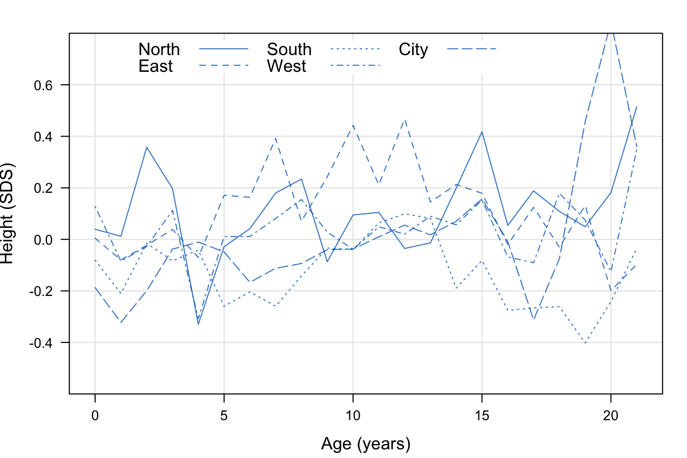

### Section 8.2.5 Imputation model

``` r
## add interaction terms
na.opt <- options(na.action = na.pass)
int <- model.matrix(~I(age - 10) * hgt.z + I(age - 10) * 
    wgt.z + age * reg, data = data2)[, -(1:9)]
options(na.opt)
data3 <- cbind(data2, int)

### define the imputation model

ini <- mice(data3, maxit = 0)

meth <- ini$meth
meth["hgt"] <- ""
meth["wgt"] <- ""
meth["hgt.z"] <- "norm"
meth["wgt.z"] <- "norm"
meth["I(age - 10):hgt.z"] <- "~I(I(age-10)*hgt.z)"
meth["I(age - 10):wgt.z"] <- "~I(I(age-10)*wgt.z)"

pred <- ini$pred
pred[, c("hgt", "wgt")] <- 0
pred["hgt.z", c("id", "I(age - 10):hgt.z")] <- 0
pred["wgt.z", c("id", "I(age - 10):wgt.z")] <- 0

vis <- ini$vis[c(3, 5, 4, 6)]

### run the imputation model

imp <- mice(data3, meth = meth, pred = pred, vis = vis, 
    m = 10, maxit = 20, seed = 28107, print = FALSE)

### Figure 8.5

cda <- complete(imp, "long", include = TRUE)
means2 <- aggregate(cda$hgt.z, by = list(reg = cda$reg, 
    age = floor(cda$age), imp = cda$.imp), mean, na.rm = TRUE)
tp85 <- xyplot(x ~ age | reg, means2, group = imp, subset = (reg == 
    "North" | reg == "City"), type = c("g", "l"), lwd = c(4, 
    rep(1, imp$m)), lty = 1:5, col = c(mdc(4), rep(mdc(6), 
    imp$m)), ylab = "Height (SDS)", xlab = "Age (years)", 
    ylim = c(-0.5, 0.8), xlim = c(-2, 23), scales = list(x = list(alternating = FALSE, 
        tck = c(1, 0)), y = list(tck = c(1, 0))), strip = strip.custom(bg = "grey95"))
print(tp85)
```

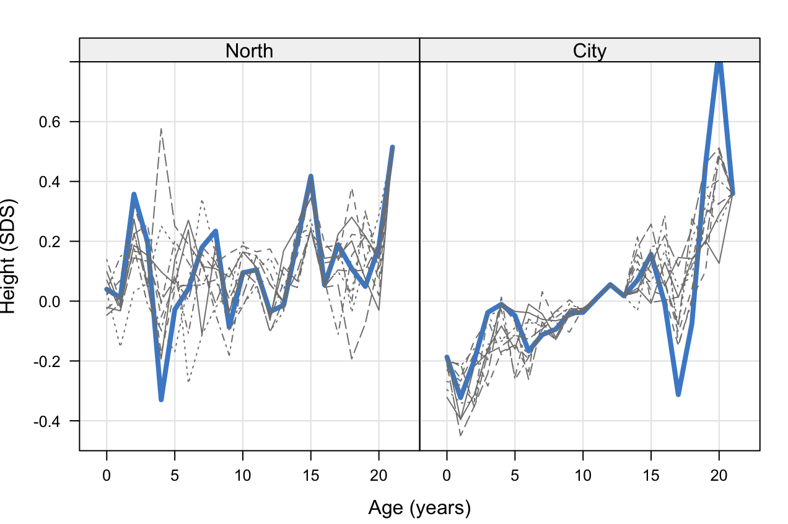

Chapter 9
---------

### Section 9.2.1 Intention to treat

``` r
library("mice")
library("lattice")

### Table 9.1

yvars <- c("yc1", "yc2", "yc3", "yp1", "yp2", "yp3")
x <- cbind(fdd[, c("id", "trt", "pp", yvars)])
x
```

    ##    id trt pp yc1 yc2 yc3 yp1 yp2 yp3
    ## 1   1   E  Y  NA  NA  NA  36  35  38
    ## 2   2   C  N  45  NA  NA  NA  NA  NA
    ## 3   3   E  N  NA  NA  NA  13  19  13
    ## 4   4   C  Y  NA  NA  NA  33  27  20
    ## 5   5   E  Y  26   6   4  27  16  11
    ## 6   6   C  Y   8   1   2  32  15  13
    ## 7   7   C  Y  41  26  31  NA  39  39
    ## 8   8   C  N  NA  NA  NA  24  13  35
    ## 9  10   C  Y  35  27  14  48  23  NA
    ## 10 12   C  Y  28  15  13  45  33  36
    ## 11 13   E  Y  NA  NA  NA  26  17  14
    ## 12 14   C  Y  33   8   9  37   7   3
    ## 13 15   E  Y  43  NA   7  25  27   1
    ## 14 16   C  Y  50   8  35  39  21  34
    ## 15 17   C  Y  31  21  10  32  21  19
    ## 16 18   E  Y  30  17  16  47  28  34
    ## 17 19   E  Y  29   6   5  20  14  11
    ## 18 20   E  Y  47  14  22  44  21  25
    ## 19 21   C  Y  39  12  12  39   5  19
    ## 20 23   C  Y  14  12   5  29   9   4
    ## 21 24   E  N  27  NA  NA  NA  NA  NA
    ## 22 25   E  Y   6  10   5  25  16  16
    ## 23 28   C  Y  NA   2   6  36  17  23
    ## 24 29   E  Y  23  23  28  23  25  13
    ## 25 30   E  Y  NA  NA  NA  20  23  12
    ## 26 31   C  N  15  24  26  33  36  38
    ## 27 32   E  N  28  17   8  40  42  33
    ## 28 33   E  N  NA  NA  NA  38  22  25
    ## 29 34   E  N  NA  NA  NA  17  NA  NA
    ## 30 35   E  Y  50  20  NA  19   1   5
    ## 31 37   C  N  30  NA  26  59  NA  28
    ## 32 38   C  Y  NA  NA  NA  35  24  27
    ## 33 39   E  N  NA  NA  NA  NA  NA  NA
    ## 34 40   E  Y  25   5   2  42  13  11
    ## 35 41   E  Y  36  11   9  30   2   1
    ## 36 43   E  N  17  NA  NA  NA  NA  NA
    ## 37 44   E  N  27  NA  NA  40  NA  NA
    ## 38 45   C  Y  31  12  29  34  28  29
    ## 39 46   C  Y  NA  NA  NA  44  35  25
    ## 40 47   C  Y  NA  NA  NA  30  18  14
    ## 41 48   E  Y  25  18  NA  18  17   2
    ## 42 49   C  N  24  23  16  44  29  34
    ## 43 50   E  Y  31  13   9  34  18  13
    ## 44 51   C  Y  NA  NA  NA  52  13  13
    ## 45 52   C  Y  30  35  28  NA  44  50
    ## 46 53   C  Y  19  33  21  36  21  21
    ## 47 54   C  N  43  NA  NA  48  NA  NA
    ## 48 55   E  Y  64  42  35  44  31  16
    ## 49 56   C  Y  NA  NA  NA  37   6   9
    ## 50 57   C  Y  31  12  NA  32  26  NA
    ## 51 58   E  Y  NA  NA  NA  49  28  25
    ## 52 59   E  Y  39   7  NA  39   7  NA

``` r
md.pattern(fdd[fdd$pp == "Y", yvars])
```

    ##    yp2 yp1 yp3 yc1 yc2 yc3   
    ## 19   1   1   1   1   1   1  0
    ##  1   1   1   1   0   1   1  1
    ##  1   1   1   1   1   0   1  1
    ##  2   1   1   1   1   1   0  1
    ##  2   1   0   1   1   1   1  1
    ##  1   1   1   0   1   1   1  1
    ##  2   1   1   0   1   1   0  2
    ## 10   1   1   1   0   0   0  3
    ##      0   2   3  11  11  14 41

``` r
md.pattern(fdd[fdd$pp == "N", yvars])
```

    ##   yp1 yc1 yp3 yp2 yc3 yc2   
    ## 3   1   1   1   1   1   1  0
    ## 1   1   1   1   0   1   0  2
    ## 3   1   0   1   1   0   0  3
    ## 2   1   1   0   0   0   0  4
    ## 1   1   0   0   0   0   0  5
    ## 3   0   1   0   0   0   0  5
    ## 1   0   0   0   0   0   0  6
    ##     4   5   7   8  10  11 45

``` r
### Section 9.2.2 Imputation model

pred <- fdd.pred
vars <- c("ypa1", "ypb1", "ypc1", "ypa2", "ypb2", "ypc2", 
    "ypa3", "ypb3", "ypc3")
pred[vars[1:3], vars]
```

    ##      ypa1 ypb1 ypc1 ypa2 ypb2 ypc2 ypa3 ypb3 ypc3
    ## ypa1    0    1    1    1    0    0    1    0    0
    ## ypb1    1    0    1    0    1    0    0    1    0
    ## ypc1    1    1    0    0    0    1    0    0    1

``` r
dry <- mice(fdd, maxit = 0)
method <- dry$method
method["yc1"] <- "~I(yca1 + ycb1 + ycc1)"
method["yc2"] <- "~I(yca2 + ycb2 + ycc2)"
method["yc3"] <- "~I(yca3 + ycb3 + ycc3)"
method["yp1"] <- "~I(ypa1 + ypb1 + ypc1)"
method["yp2"] <- "~I(ypa2 + ypb2 + ypc2)"
method["yp3"] <- "~I(ypa3 + ypb3 + ypc3)"
imp <- mice(fdd, pred = pred, meth = method, maxit = 20, 
    seed = 54434, print = FALSE)


### Section 9.2.3 Inspecting imputations

lowi <- complete(imp, "long", inc = TRUE)
lowi <- data.frame(lowi, cbcl2 = NA, cbin2 = NA, cbex2 = NA)
lolo <- reshape(lowi, idvar = "id", varying = 11:ncol(lowi), 
    direction = "long", new.row.names = 1:(nrow(lowi) * 
        3), sep = "")
lolo <- lolo[order(lolo$.imp, lolo$id, lolo$time), ]
row.names(lolo) <- 1:nrow(lolo)


### Figure 9.1

iv <- is.na(lolo[lolo$.imp == 0, ]$yp)
ivn <- ifelse(iv, 1, 0)
col12 <- c("grey80", "grey80", mdc(2), mdc(1), mdc(2), "transparent", 
    mdc(2), "transparent", mdc(2), "transparent", mdc(2), 
    "transparent")
ic <- unique(lolo$id[iv])
ss <- lolo$id %in% ic
grp <- 2 * as.integer(lolo$.imp) - ivn
loloss <- data.frame(lolo, grp = grp)
trellis.par.set(strip.background = list(col = "grey95"))
tp1 <- xyplot(yp ~ time | factor(id), data = loloss, type = "l", 
    groups = factor(.imp), col = "grey80", subset = ss, 
    ylab = "UCLA-RI Parent Score", pch = 19, cex = 1, xlab = "Time", 
    xlim = c("T1", "T2", "T3"), as.table = TRUE)
tp2 <- xyplot(yp ~ time | factor(id), data = loloss, type = "p", 
    groups = grp, col = col12, subset = ss, ylab = "UCLA-RI Parent Score", 
    pch = 19, cex = 0.8, xlab = "Time", xlim = c("T1", "T2", 
        "T3"), as.table = TRUE)
print(tp1)
print(tp2, newpage = FALSE)
```


### Figure 9.2

``` r
means <- aggregate(lolo$yp, list(lolo$.imp != 0, lolo$trt, 
    lolo$time), mean, na.rm = TRUE)
names(means) <- c(".imp", "trt", "time", "yp")
levels(means$trt) <- c("EMDR", "CBT")
tp <- xyplot(yp ~ time | trt, data = means, type = "o", 
    pch = 19, groups = factor(.imp), col = c(mdc(4), mdc(6)), 
    ylab = "UCLA-RI Parent Score", lwd = 2, xlab = "Time", 
    xlim = c("T1", "T2", "T3"))
print(tp)
```


### Figure 9.3

``` r
means <- aggregate(lolo$yc, list(lolo$.imp != 0, lolo$trt, 
    lolo$time), mean, na.rm = TRUE)
names(means) <- c(".imp", "trt", "time", "yc")
levels(means$trt) <- c("EMDR", "CBT")
tp <- xyplot(yc ~ time | trt, data = means, type = "o", 
    pch = 19, groups = factor(.imp), col = c(mdc(4), mdc(6)), 
    ylab = "UCLA-RI Child Score", lwd = 2, xlab = "Time", 
    xlim = c("T1", "T2", "T3"))
print(tp)
```


### Section 9.3 Time raster imputation

``` r
library("mice")
library("splines")
library("lme4")
```

    ## Loading required package: Matrix

    ## 
    ## Attaching package: 'lme4'

    ## The following object is masked from 'package:gamlss':
    ## 
    ##     refit

    ## The following object is masked from 'package:nlme':
    ## 
    ##     lmList

``` r
data <- tbc
md.pattern(data)
```

    ##      id occ nocc first typ age sex wgt.z hgt.z bmi.z
    ## 1202  1   1    1     1   1   1   1     1     1     1
    ## 1886  1   1    1     1   1   1   1     1     1     1
    ##  331  1   1    1     1   1   1   1     1     0     0
    ##    3  1   1    1     1   1   1   1     0     1     0
    ##  522  1   1    1     1   1   1   1     1     0     0
    ##    7  1   1    1     1   1   1   1     0     1     0
    ##       0   0    0     0   0   0   0    10   853   863
    ##        ao     
    ## 1202    1    0
    ## 1886    0    1
    ##  331    1    2
    ##    3    1    2
    ##  522    0    3
    ##    7    0    3
    ##      2415 4141

``` r
### remove those with nocc 1 or 2 or 3
data <- data[data$nocc >= 3, ]

### Section 9.3.3 Broken stick model

### specify break ages
brk <- c(0, 8/365, 1/3, 1, 2, 6, 10, 18, 29)
k <- length(brk)

### calculate B-spline
X <- bs(data$age, knots = brk, B = c(brk[1], brk[k] + 1e-04), 
    degree = 1)
X <- X[, -(k + 1)]
dimnames(X)[[2]] <- paste("x", 1:ncol(X), sep = "")
data <- cbind(data, X)
round(head(X, 3), 2)
```

    ##      x1   x2   x3 x4 x5 x6 x7 x8 x9
    ## [1,]  1 0.00 0.00  0  0  0  0  0  0
    ## [2,]  0 0.99 0.01  0  0  0  0  0  0
    ## [3,]  0 0.92 0.08  0  0  0  0  0  0

``` r
### fit broken stick model
fit <- lmer(wgt.z ~ 0 + x1 + x2 + x3 + x4 + x5 + x6 + x7 + 
    x8 + x9 + (0 + x1 + x2 + x3 + x4 + x5 + x6 + x7 + x8 + 
    x9 | id), data = data)
```

    ## Warning in commonArgs(par, fn, control, environment()):
    ## maxfun < 10 * length(par)^2 is not recommended.

``` r
### calculate size and increment per person
tsiz <- t(ranef(fit)$id) + fixef(fit)
tinc <- diff(tsiz)

### inspect size and increment estimates
round(head(t(tsiz)), 2)
```

    ##       x1    x2    x3    x4    x5    x6    x7    x8
    ## 8  -0.79 -1.21 -0.56 -0.45  0.85  0.24  0.47  1.19
    ## 24  0.84  1.02 -0.56 -1.08 -0.79 -1.15 -1.24  0.17
    ## 46 -0.62 -0.85 -0.42 -0.33  0.38  0.10  0.27  0.38
    ## 60  0.14  0.01  0.42  0.09 -0.07 -0.28 -0.62 -0.97
    ## 69  0.26  0.05  0.98 -0.28  0.06  0.35  0.58  0.25
    ## 73 -1.01 -1.70 -0.02  1.00  1.09  0.64  0.95  1.11
    ##       x9
    ## 8  -1.73
    ## 24 -2.06
    ## 46  0.44
    ## 60 -1.07
    ## 69  0.67
    ## 73  1.59

``` r
round(head(t(tinc)), 2)
```

    ##       x2    x3    x4    x5    x6    x7    x8    x9
    ## 8  -0.41  0.65  0.10  1.30 -0.61  0.23  0.73 -2.92
    ## 24  0.18 -1.58 -0.52  0.29 -0.36 -0.09  1.41 -2.23
    ## 46 -0.23  0.43  0.08  0.72 -0.28  0.16  0.11  0.06
    ## 60 -0.13  0.41 -0.34 -0.16 -0.20 -0.35 -0.34 -0.11
    ## 69 -0.21  0.93 -1.25  0.33  0.29  0.23 -0.33  0.43
    ## 73 -0.69  1.68  1.02  0.09 -0.45  0.31  0.16  0.49

``` r
### broken stick for hgt and BMI
fit.wgt <- fit
fit.hgt <- lmer(hgt.z ~ 0 + x1 + x2 + x3 + x4 + x5 + x6 + 
    x7 + x8 + x9 + (0 + x1 + x2 + x3 + x4 + x5 + x6 + x7 + 
    x8 + x9 | id), data = data)
```

    ## Warning in commonArgs(par, fn, control, environment()):
    ## maxfun < 10 * length(par)^2 is not recommended.

``` r
fit.bmi <- lmer(bmi.z ~ 0 + x1 + x2 + x3 + x4 + x5 + x6 + 
    x7 + x8 + x9 + (0 + x1 + x2 + x3 + x4 + x5 + x6 + x7 + 
    x8 + x9 | id), data = data)
```

    ## Warning in commonArgs(par, fn, control, environment()):
    ## maxfun < 10 * length(par)^2 is not recommended.

``` r
### define time warp

warp.setup <- data.frame(age = brk, age2 = seq(0, 29, length.out = k))
warp.model <- lm(age2 ~ bs(age, knots = brk[c(-1, -k)], 
    degree = 1) - 1, data = warp.setup, x = T, y = T)
warped.knots <- warp.model$y
maxage <- max(warped.knots)
age2 <- predict(warp.model, newdata = data)
data <- cbind(data, age2 = age2)
rm(age2)

### Figure: time warping function (not in book)

par(fin = c(3, 3), omi = c(0, 0, 0, 0), mai = c(1, 1, 1, 
    1), mfrow = c(1, 1), lwd = 0.5)
eqscplot(x = brk, y = warp.model$y, ylab = "Warped age", 
    xlab = "Age (years)", axes = F, type = "o", lwd = 1, 
    pch = 16)
axis(1, at = seq(0, 32, 4), cex = 0.5, pos = c(-0.5, 0))
axis(2, at = warp.setup$age2, labels = c("0y", "8d", "4m", 
    "1y", "2y", "6y", "10y", "18y", "29y"), line = 0.5, 
    cex = 0.5)
lines(x = c(0, 29), y = c(0, 29), lwd = 1)
```

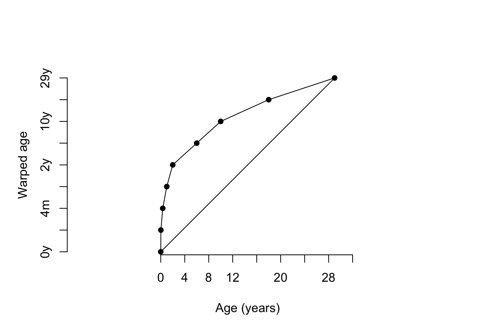

``` r
# Prepare for figure 9.5 (weight, height and BMI
# profiles for six cases)

wsiz.bs <- extractBS(fit.wgt)
hsiz.bs <- extractBS(fit.hgt)
bsiz.bs <- extractBS(fit.bmi)
id <- unique(fit.wgt@flist$id)

data2 <- appendbreak(data, brk, id = id, warp.model = warp.model, 
    typ = "pred")
data2[data2$typ == "pred", c("wgt.z", "hgt.z", "bmi.z")] <- round(cbind(wsiz.bs, 
    hsiz.bs, bsiz.bs), 3)

six <- c(1259, 7019, 2447, 7460, 8046, 7646)
set.seed(23221)
sample <- unique(c(six, sample(unique(tbc$id), 300)))

idx <- data2$id %in% six
pd <- data2[idx, ]
pd$id <- as.factor(pd$id)
pd <- cbind(pd, rowname = row.names(pd))
pdr <- reshape(pd, varying = c("wgt.z", "hgt.z", "bmi.z"), 
    idvar = "rowname", direction = "long", v.names = "y")
pdr$grp <- pdr$time
pdr$grp[pdr$typ == "pred"] <- pdr$grp[pdr$typ == "pred"] + 
    3


### Figure 9.5 Only weight

tbcstick <- xyplot(y ~ age2 | id, data = pdr, xlim = c(-1, 
    maxage + 1), ylim = c(-4, 4), as.table = TRUE, scales = list(x = list(at = warped.knots, 
    labels = c("0", "8d", "4m", "1y", "2y", "6y", "10y", 
        "18y", "29y"))), xlab = "Age", ylab = "Weight SDS", 
    layout = c(2, 3), subset = (grp == 1 | grp == 4), groups = grp, 
    pch = 19, type = c(rep("p", 3), rep("l", 3)), distribute.type = TRUE, 
    lwd = 2, col = c(rep(mdc(1), 3), rep(mdc(5), 3)), panel = function(...) {
        panel.abline(v = warped.knots, lty = 2, col = "grey80")
        panel.abline(h = c(-2, 0, 2), lty = 1, col = "grey80")
        panel.xyplot(...)
    }, strip = strip.custom(bg = "grey95"))
print(tbcstick)
```

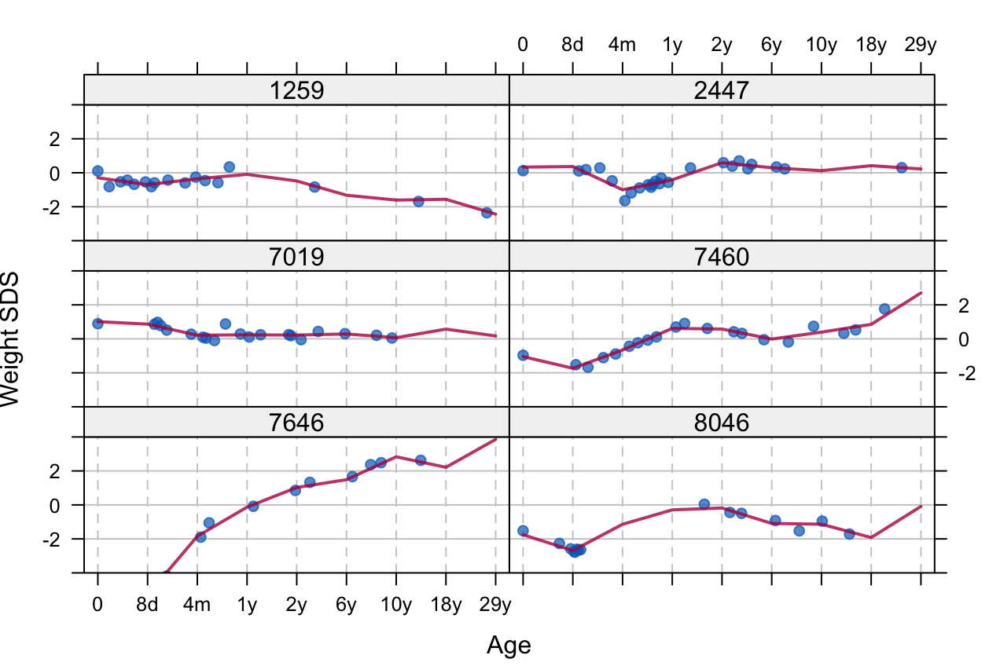

``` r
### Same plot, but then with height and BMI added (not in
### book)

tbcstick <- xyplot(y ~ age2 | id, data = pdr, xlim = c(-1, 
    maxage + 1), ylim = c(-4, 4), as.table = TRUE, scales = list(x = list(at = warped.knots, 
    labels = c("0", "8d", "4m", "1y", "2y", "6y", "10y", 
        "18y", "29y"))), xlab = "Age", ylab = "Standard Deviation Score (SDS)", 
    layout = c(2, 3), groups = grp, pch = 20, type = c(rep("p", 
        3), rep("l", 3)), distribute.type = TRUE, lwd = 1.5, 
    col = c(mdc(1), hcl(80, 100, 40, 0.7), hcl(160, 100, 
        40, 0.7)), panel = function(...) {
        panel.abline(v = warped.knots, lty = 2, col = "grey80")
        panel.abline(h = c(-2, 0, 2), lty = 1, col = "grey80")
        panel.xyplot(...)
    }, strip = strip.custom(bg = "grey95"), key = list(text = list(c("Weight", 
        "Height", "BMI"), cex = 0.8), lines = list(lty = 1, 
        lwd = 2, type = "l"), col = c(mdc(1), hcl(80, 100, 
        40, 0.7), hcl(160, 100, 40, 0.7)), columns = 3, 
        space = "bottom", border = FALSE))
print(tbcstick)
```

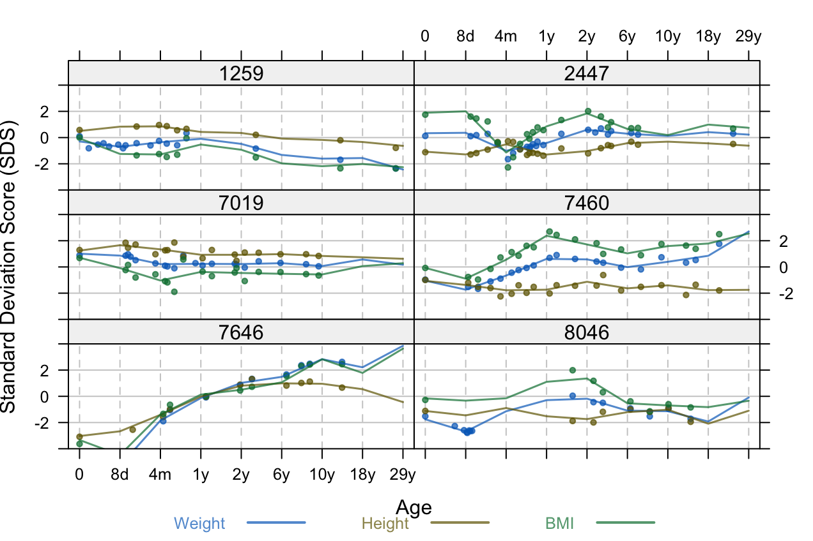

### Section 9.3.6 Imputation

``` r
### append break ages before imputation
id <- unique(data$id)
data2 <- appendbreak(data, brk, id = id, warp.model = warp.model, 
    typ = "sup")
table(data2$typ)
```

    ## 
    ##  obs  sup pred 
    ## 3838 1899    0

``` r
options(digits = 2)
head(data2)
```

    ##      id occ nocc first typ   age sex hgt.z wgt.z bmi.z
    ## 65    8   0   25  TRUE obs 0.000   2  -2.0 -0.64  1.25
    ## 651   8  NA   25 FALSE sup 0.000   2    NA    NA    NA
    ## 65.1  8  NA   25 FALSE sup 0.022   2    NA    NA    NA
    ## 66    8   1   25 FALSE obs 0.024   2    NA -1.20    NA
    ## 67    8   2   25 FALSE obs 0.046   2    NA -1.40    NA
    ## 68    8   3   25 FALSE obs 0.079   2  -1.4 -1.13 -0.28
    ##      ao x1   x2     x3 x4 x5 x6 x7 x8 x9 age2
    ## 65    0  1 0.00 0.0000  0  0  0  0  0  0  0.0
    ## 651   0  1 0.00 0.0000  0  0  0  0  0  0  0.0
    ## 65.1  0  0 1.00 0.0000  0  0  0  0  0  0  3.6
    ## 66    0  0 0.99 0.0067  0  0  0  0  0  0  3.6
    ## 67    0  0 0.92 0.0773  0  0  0  0  0  0  3.9
    ## 68    0  0 0.82 0.1833  0  0  0  0  0  0  4.3

``` r
### specify imputation methods
Y <- c("hgt.z", "wgt.z", "bmi.z")
imp <- mice(data2, maxit = 0)
meth <- imp$method
meth[1:length(meth)] <- ""
meth[Y] <- "2l.norm"

## Note: The following statements are outdated and
## replaced by the intercept=FALSE option in the call to
## mice() mice.impute.2l.norm.noint <-
## mice.impute.2l.norm meth[Y] <- '2l.norm.noint'

### specify predictor matrix
pred <- imp$pred
pred[1:nrow(pred), 1:ncol(pred)] <- 0
pred[Y, "id"] <- (-2)  # class variable
pred[Y, "sex"] <- 1  # fixed effect
pred[Y, paste("x", 1:9, sep = "")] <- 2
pred[Y[1], Y[2]] <- 2  # mutual random effect
pred[Y[2], Y[1]] <- 2  # mutual random effect
pred[Y[3], Y[1:2]] <- 2  # random effect


### specify visit sequence
vis <- 1:3
names(vis) <- c("hgt.z", "wgt.z", "bmi.z")

### ready to go - TIME CONSUMING (30 MINUTES)
imp.1 <- mice(data2, intercept = FALSE, meth = meth, pred = pred, 
    m = 5, maxit = 10, seed = 52711, print = FALSE)
imp.2 <- mice(data2, intercept = FALSE, meth = meth, pred = pred, 
    m = 5, maxit = 10, seed = 88348, print = FALSE)
imp.1745 <- ibind(imp.1, imp.2)  ## create m=10 imputations


### Figure 9.6 diagnostic plot Note: The solution is
### different from that in the book The sample size in the
### book is much larger (n=2604 instead of n=306) The
### larger sample regularizes many of the imputed sticks
### The plot for non-typical subject 7646 reveals that
### with n=306, fit to the data is low for this subject

cd <- complete(imp.1745, "long")
sup <- cd[cd$typ == "sup", ]
data3 <- data.frame(.imp = 0, data2)
data3 <- rbind(data3, sup[, -2])
idx <- data3$id %in% six
pd <- data3[idx, ]
pd$id <- as.factor(pd$id)
pd$grp <- pd$.imp
pd$grp[pd$grp == 0] <- NA
pd$grp[pd$typ == "obs"] <- 11
pd$grp <- reorder(pd$grp, as.numeric(pd$grp))
tbcimp <- xyplot(wgt.z ~ age2 | id, data = pd, xlim = c(-1, 
    maxage + 1), ylim = c(-4, 4), as.table = TRUE, scales = list(x = list(at = warped.knots, 
    labels = c("0", "8d", "4m", "1y", "2y", "6y", "10y", 
        "18y", "29y"))), xlab = "Age", ylab = "Weight SDS", 
    groups = grp, layout = c(2, 3), pch = c(rep(20, 10), 
        19), type = c(rep("l", 10), "p"), lwd = c(rep(1, 
        10), 1), col = c(rep(mdc(5), 10), mdc(1)), distribute.type = TRUE, 
    panel = function(...) {
        panel.abline(v = warped.knots, lty = 2, col = "grey80")
        panel.abline(h = c(-2, 0, 2), lty = 1, col = "grey80")
        panel.xyplot(...)
    }, strip = strip.custom(bg = "grey95"))
print(tbcimp)
```

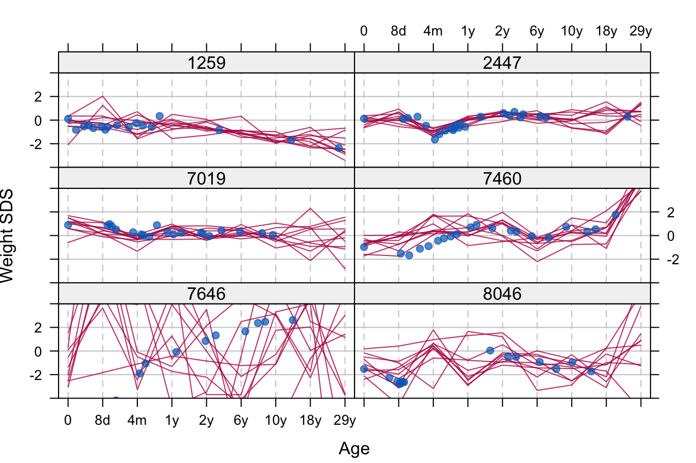

### Figure 9.7

``` r
cd <- complete(imp.1745, 1)
idx <- (cd$id) %in% sample
cd <- cd[idx, ]
shingle <- cut(cd$age, breaks = c(brk, 29.01), right = FALSE, 
    inc = TRUE, labels = c("0d-8d", "8d-4m", "4m-1y", "1y-2y", 
        "2y-6y", "6y-10y", "10y-18y", "18y-29y", "29y"))
tbchw <- xyplot(wgt.z ~ hgt.z | shingle, data = cd, xlim = c(-4, 
    4), ylim = c(-4, 4), type = c("p", "g"), group = (typ == 
    "sup"), pch = c(1, 20), col = c(mdc(1:2)), xlab = "Height SDS", 
    ylab = "Weight SDS", pty = "s", strip = strip.custom(bg = "grey95"))
print(tbchw)
```

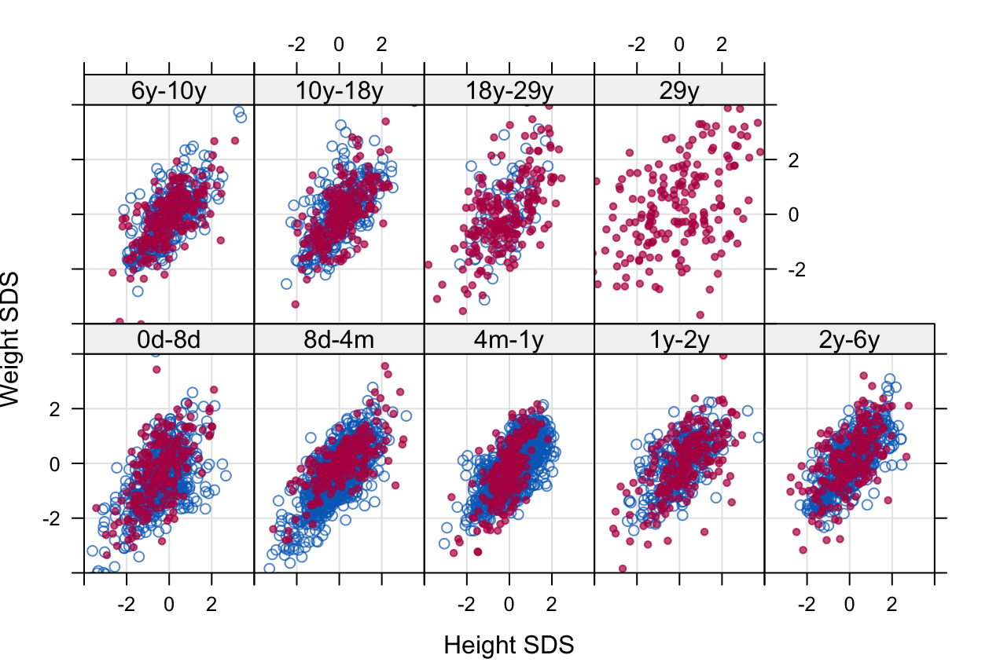

### Section 9.3.7 Complete data analysis

``` r
### post-processing of imputed data

imp <- imp.1745
cd <- complete(imp, "long")
sup <- cd[cd$typ == "sup", ]

sup$age <- round(sup$age, 2)
sup$hgt.z <- round(sup$hgt.z, 2)
sup$wgt.z <- round(sup$wgt.z, 2)
sup$bmi.z <- round(sup$bmi.z, 2)

lowi <- reshape(sup, idvar = c("id", ".imp"), timevar = "age", 
    v.names = c("hgt.z", "wgt.z", "bmi.z"), direction = "wide", 
    drop = c(".id", "occ", "first", "typ", "hgt", "wgt", 
        "bmi", paste("x", 1:9, sep = ""), "age2"))
hsiz <- lowi[, c(".imp", "id", "nocc", "sex", "hgt.z.0", 
    "hgt.z.0.02", "hgt.z.0.33", "hgt.z.1", "hgt.z.2", "hgt.z.6", 
    "hgt.z.10", "hgt.z.18", "hgt.z.29")]
wsiz <- lowi[, c(".imp", "id", "nocc", "sex", "wgt.z.0", 
    "wgt.z.0.02", "wgt.z.0.33", "wgt.z.1", "wgt.z.2", "wgt.z.6", 
    "wgt.z.10", "wgt.z.18", "wgt.z.29")]
bsiz <- lowi[, c(".imp", "id", "nocc", "sex", "bmi.z.0", 
    "bmi.z.0.02", "bmi.z.0.33", "bmi.z.1", "bmi.z.2", "bmi.z.6", 
    "bmi.z.10", "bmi.z.18", "bmi.z.29")]
# merge outcome data
bsiz <- merge(bsiz, tbc.target, all.x = TRUE)


hinc <- cbind(hsiz[, 1:4], t(diff(t(hsiz[, -1:-4]))))
winc <- cbind(wsiz[, 1:4], t(diff(t(wsiz[, -1:-4]))))
binc <- cbind(bsiz[, 1:4], t(diff(t(bsiz[, -1:-4]))))

# merge outcome data
binc <- merge(binc, tbc.target, all.x = TRUE)

bmi.z.0.02 <- by(binc, binc$.imp, function(x) lm(bmi.z.0.02 ~ 
    ao, data = x, na.action = "na.omit"))
bmi.z.0.33 <- by(binc, binc$.imp, function(x) lm(bmi.z.0.33 ~ 
    ao, data = x, na.action = "na.omit"))
bmi.z.1 <- by(binc, binc$.imp, function(x) lm(bmi.z.1 ~ 
    ao, data = x, na.action = "na.omit"))
bmi.z.2 <- by(binc, binc$.imp, function(x) lm(bmi.z.2 ~ 
    ao, data = x, na.action = "na.omit"))
bmi.z.6 <- by(binc, binc$.imp, function(x) lm(bmi.z.6 ~ 
    ao, data = x, na.action = "na.omit"))
bmi.z.10 <- by(binc, binc$.imp, function(x) lm(bmi.z.10 ~ 
    ao, data = x, na.action = "na.omit"))
bmi.z.18 <- by(binc, binc$.imp, function(x) lm(bmi.z.18 ~ 
    ao, data = x, na.action = "na.omit"))
bmi.z.29 <- by(binc, binc$.imp, function(x) lm(bmi.z.29 ~ 
    ao, data = x, na.action = "na.omit"))

tab.bmi.z.0.02 <- summary(pool(as.mira(bmi.z.0.02)))
tab.bmi.z.0.33 <- summary(pool(as.mira(bmi.z.0.33)))
tab.bmi.z.1 <- summary(pool(as.mira(bmi.z.1)))
tab.bmi.z.2 <- summary(pool(as.mira(bmi.z.2)))
tab.bmi.z.6 <- summary(pool(as.mira(bmi.z.6)))
tab.bmi.z.10 <- summary(pool(as.mira(bmi.z.10)))
tab.bmi.z.18 <- summary(pool(as.mira(bmi.z.18)))
tab.bmi.z.29 <- summary(pool(as.mira(bmi.z.29)))

(bmi.z.0.33 <- summary(pool(as.mira(by(bsiz, bsiz$.imp, 
    function(x) lm(bmi.z.jv ~ bmi.z.0.33 + bmi.z.0.02, data = x, 
        na.action = "na.omit"))))))
```

    ##               est   se     t df Pr(>|t|)  lo 95 hi 95
    ## (Intercept) 0.251 0.15 1.651 64     0.10 -0.053  0.55
    ## bmi.z.0.33  0.133 0.18 0.726 14     0.48 -0.259  0.52
    ## bmi.z.0.02  0.016 0.20 0.079 14     0.94 -0.415  0.45
    ##             nmis   fmi lambda
    ## (Intercept)   NA 0.087  0.059
    ## bmi.z.0.33    NA 0.629  0.580
    ## bmi.z.0.02    NA 0.622  0.573

``` r
(bmi.z.1 <- summary(pool(as.mira(by(bsiz, bsiz$.imp, function(x) lm(bmi.z.jv ~ 
    bmi.z.1 + bmi.z.0.33, data = x, na.action = "na.omit"))))))
```

    ##               est   se    t df Pr(>|t|)   lo 95 hi 95
    ## (Intercept) 0.295 0.15 1.98 61    0.052 -0.0025  0.59
    ## bmi.z.1     0.277 0.15 1.84 24    0.078 -0.0334  0.59
    ## bmi.z.0.33  0.047 0.15 0.31 22    0.763 -0.2708  0.36
    ##             nmis  fmi lambda
    ## (Intercept)   NA 0.11  0.084
    ## bmi.z.1       NA 0.45  0.403
    ## bmi.z.0.33    NA 0.48  0.430

``` r
(bmi.z.2 <- summary(pool(as.mira(by(bsiz, bsiz$.imp, function(x) lm(bmi.z.jv ~ 
    bmi.z.2 + bmi.z.1, data = x, na.action = "na.omit"))))))
```

    ##              est   se    t df Pr(>|t|)  lo 95 hi 95
    ## (Intercept) 0.25 0.16 1.53 51     0.13 -0.077  0.57
    ## bmi.z.2     0.10 0.17 0.62 23     0.54 -0.241  0.45
    ## bmi.z.1     0.24 0.17 1.41 22     0.17 -0.113  0.59
    ##             nmis  fmi lambda
    ## (Intercept)   NA 0.18   0.15
    ## bmi.z.2       NA 0.46   0.42
    ## bmi.z.1       NA 0.48   0.43

``` r
(bmi.z.6 <- summary(pool(as.mira(by(bsiz, bsiz$.imp, function(x) lm(bmi.z.jv ~ 
    bmi.z.6 + bmi.z.2, data = x, na.action = "na.omit"))))))
```

    ##               est   se    t df Pr(>|t|)  lo 95 hi 95
    ## (Intercept) 0.229 0.15 1.54 45    0.129 -0.070  0.53
    ## bmi.z.6     0.507 0.20 2.55 13    0.024  0.078  0.93
    ## bmi.z.2     0.061 0.18 0.34 12    0.741 -0.333  0.46
    ##             nmis  fmi lambda
    ## (Intercept)   NA 0.23   0.20
    ## bmi.z.6       NA 0.65   0.60
    ## bmi.z.2       NA 0.68   0.63

``` r
(bmi.z.10 <- summary(pool(as.mira(by(bsiz, bsiz$.imp, function(x) lm(bmi.z.jv ~ 
    bmi.z.10 + bmi.z.6, data = x, na.action = "na.omit"))))))
```

    ##              est   se    t   df Pr(>|t|)   lo 95 hi 95
    ## (Intercept) 0.26 0.13 1.98 42.6  0.05461 -0.0054  0.53
    ## bmi.z.10    0.49 0.13 3.83 42.6  0.00042  0.2327  0.75
    ## bmi.z.6     0.22 0.23 0.96  9.6  0.36036 -0.2888  0.72
    ##             nmis  fmi lambda
    ## (Intercept)   NA 0.25   0.22
    ## bmi.z.10      NA 0.25   0.22
    ## bmi.z.6       NA 0.75   0.71

``` r
(bmi.z.18 <- summary(pool(as.mira(by(bsiz, bsiz$.imp, function(x) lm(bmi.z.jv ~ 
    bmi.z.18 + bmi.z.10, data = x, na.action = "na.omit"))))))
```

    ##              est   se   t df Pr(>|t|)  lo 95 hi 95
    ## (Intercept) 0.21 0.12 1.7 54    0.095 -0.037  0.45
    ## bmi.z.18    0.24 0.12 2.0 14    0.071 -0.024  0.51
    ## bmi.z.10    0.42 0.16 2.6 14    0.021  0.073  0.77
    ##             nmis  fmi lambda
    ## (Intercept)   NA 0.16   0.13
    ## bmi.z.18      NA 0.64   0.59
    ## bmi.z.10      NA 0.62   0.57

``` r
(bmi.z.6 <- summary(pool(as.mira(by(bsiz, bsiz$.imp, function(x) lm(bmi.z.jv ~ 
    bmi.z.6 + bmi.z.2, data = x, na.action = "na.omit"))))))
```

    ##               est   se    t df Pr(>|t|)  lo 95 hi 95
    ## (Intercept) 0.229 0.15 1.54 45    0.129 -0.070  0.53
    ## bmi.z.6     0.507 0.20 2.55 13    0.024  0.078  0.93
    ## bmi.z.2     0.061 0.18 0.34 12    0.741 -0.333  0.46
    ##             nmis  fmi lambda
    ## (Intercept)   NA 0.23   0.20
    ## bmi.z.6       NA 0.65   0.60
    ## bmi.z.2       NA 0.68   0.63

``` r
summary(by(bsiz, bsiz$.imp, function(x) lm(bmi.z.jv ~ bmi.z.6 + 
    bmi.z.2, data = x, na.action = "na.omit"))[[2]])
```

    ## 
    ## Call:
    ## lm(formula = bmi.z.jv ~ bmi.z.6 + bmi.z.2, data = x, na.action = "na.omit")
    ## 
    ## Residuals:
    ##     Min      1Q  Median      3Q     Max 
    ## -2.4776 -0.6658 -0.0858  0.6150  2.8231 
    ## 
    ## Coefficients:
    ##             Estimate Std. Error t value Pr(>|t|)    
    ## (Intercept)   0.2859     0.1334    2.14  0.03540 *  
    ## bmi.z.6       0.5943     0.1448    4.10  0.00011 ***
    ## bmi.z.2      -0.0826     0.1182   -0.70  0.48707    
    ## ---
    ## Signif. codes:  
    ## 0 '***' 0.001 '**' 0.01 '*' 0.05 '.' 0.1 ' ' 1
    ## 
    ## Residual standard error: 1.1 on 72 degrees of freedom
    ##   (136 observations deleted due to missingness)
    ## Multiple R-squared:  0.211,  Adjusted R-squared:  0.189 
    ## F-statistic: 9.64 on 2 and 72 DF,  p-value: 0.000195

``` r
# repeat the analysis for the broken stick estimates

bsiz.bs <- as.data.frame(t(t(ranef(fit.bmi)[[1]]) + fixef(fit.bmi)))
dimnames(bsiz.bs)[[2]] <- names(bsiz)[5:13]
binc.bs <- t(diff(t(bsiz.bs)))
bsiz.bs <- data.frame(id = bsiz[bsiz$.imp == 1, "id"], bsiz.bs)
binc.bs <- data.frame(id = bsiz[bsiz$.imp == 1, "id"], binc.bs)
bsiz.bs <- merge(bsiz.bs, tbc.target)
binc.bs <- merge(binc.bs, tbc.target)

bmi.z.0.02.bs <- lm(bmi.z.0.02 ~ ao, data = binc.bs, na.action = "na.omit")
bmi.z.0.33.bs <- lm(bmi.z.0.33 ~ ao, data = binc.bs, na.action = "na.omit")
bmi.z.1.bs <- lm(bmi.z.1 ~ ao, data = binc.bs, na.action = "na.omit")
bmi.z.2.bs <- lm(bmi.z.2 ~ ao, data = binc.bs, na.action = "na.omit")
bmi.z.6.bs <- lm(bmi.z.6 ~ ao, data = binc.bs, na.action = "na.omit")
bmi.z.10.bs <- lm(bmi.z.10 ~ ao, data = binc.bs, na.action = "na.omit")
bmi.z.18.bs <- lm(bmi.z.18 ~ ao, data = binc.bs, na.action = "na.omit")

summary(bmi.z.0.02.bs)
```

    ## 
    ## Call:
    ## lm(formula = bmi.z.0.02 ~ ao, data = binc.bs, na.action = "na.omit")
    ## 
    ## Residuals:
    ##     Min      1Q  Median      3Q     Max 
    ## -1.4146 -0.4192 -0.0616  0.4442  1.9860 
    ## 
    ## Coefficients:
    ##             Estimate Std. Error t value Pr(>|t|)    
    ## (Intercept)  -0.8833     0.0911    -9.7  9.2e-15 ***
    ## ao            0.0384     0.1913     0.2     0.84    
    ## ---
    ## Signif. codes:  
    ## 0 '***' 0.001 '**' 0.01 '*' 0.05 '.' 0.1 ' ' 1
    ## 
    ## Residual standard error: 0.69 on 73 degrees of freedom
    ##   (136 observations deleted due to missingness)
    ## Multiple R-squared:  0.000552,   Adjusted R-squared:  -0.0131 
    ## F-statistic: 0.0403 on 1 and 73 DF,  p-value: 0.841

``` r
summary(bmi.z.0.33.bs)
```

    ## 
    ## Call:
    ## lm(formula = bmi.z.0.33 ~ ao, data = binc.bs, na.action = "na.omit")
    ## 
    ## Residuals:
    ##     Min      1Q  Median      3Q     Max 
    ## -2.8648 -0.4893 -0.0512  0.5811  2.7353 
    ## 
    ## Coefficients:
    ##             Estimate Std. Error t value Pr(>|t|)  
    ## (Intercept)   -0.274      0.123   -2.23    0.029 *
    ## ao            -0.135      0.258   -0.52    0.603  
    ## ---
    ## Signif. codes:  
    ## 0 '***' 0.001 '**' 0.01 '*' 0.05 '.' 0.1 ' ' 1
    ## 
    ## Residual standard error: 0.94 on 73 degrees of freedom
    ##   (136 observations deleted due to missingness)
    ## Multiple R-squared:  0.00372,    Adjusted R-squared:  -0.00993 
    ## F-statistic: 0.272 on 1 and 73 DF,  p-value: 0.603

``` r
summary(bmi.z.1.bs)
```

    ## 
    ## Call:
    ## lm(formula = bmi.z.1 ~ ao, data = binc.bs, na.action = "na.omit")
    ## 
    ## Residuals:
    ##    Min     1Q Median     3Q    Max 
    ## -1.904 -0.460 -0.097  0.436  1.673 
    ## 
    ## Coefficients:
    ##             Estimate Std. Error t value Pr(>|t|)   
    ## (Intercept)   0.3207     0.0987    3.25   0.0017 **
    ## ao            0.1703     0.2073    0.82   0.4140   
    ## ---
    ## Signif. codes:  
    ## 0 '***' 0.001 '**' 0.01 '*' 0.05 '.' 0.1 ' ' 1
    ## 
    ## Residual standard error: 0.75 on 73 degrees of freedom
    ##   (136 observations deleted due to missingness)
    ## Multiple R-squared:  0.00916,    Adjusted R-squared:  -0.00441 
    ## F-statistic: 0.675 on 1 and 73 DF,  p-value: 0.414

``` r
summary(bmi.z.2.bs)
```

    ## 
    ## Call:
    ## lm(formula = bmi.z.2 ~ ao, data = binc.bs, na.action = "na.omit")
    ## 
    ## Residuals:
    ##    Min     1Q Median     3Q    Max 
    ## -1.527 -0.505 -0.135  0.421  1.955 
    ## 
    ## Coefficients:
    ##             Estimate Std. Error t value Pr(>|t|)    
    ## (Intercept)   0.4606     0.1005    4.58  1.8e-05 ***
    ## ao           -0.0451     0.2110   -0.21     0.83    
    ## ---
    ## Signif. codes:  
    ## 0 '***' 0.001 '**' 0.01 '*' 0.05 '.' 0.1 ' ' 1
    ## 
    ## Residual standard error: 0.77 on 73 degrees of freedom
    ##   (136 observations deleted due to missingness)
    ## Multiple R-squared:  0.000625,   Adjusted R-squared:  -0.0131 
    ## F-statistic: 0.0456 on 1 and 73 DF,  p-value: 0.831

``` r
summary(bmi.z.6.bs)
```

    ## 
    ## Call:
    ## lm(formula = bmi.z.6 ~ ao, data = binc.bs, na.action = "na.omit")
    ## 
    ## Residuals:
    ##     Min      1Q  Median      3Q     Max 
    ## -1.4004 -0.4317 -0.0587  0.3444  2.0195 
    ## 
    ## Coefficients:
    ##             Estimate Std. Error t value Pr(>|t|)    
    ## (Intercept)  -0.5724     0.0811   -7.06    8e-10 ***
    ## ao            0.4914     0.1703    2.89   0.0051 ** 
    ## ---
    ## Signif. codes:  
    ## 0 '***' 0.001 '**' 0.01 '*' 0.05 '.' 0.1 ' ' 1
    ## 
    ## Residual standard error: 0.62 on 73 degrees of freedom
    ##   (136 observations deleted due to missingness)
    ## Multiple R-squared:  0.102,  Adjusted R-squared:  0.0901 
    ## F-statistic: 8.33 on 1 and 73 DF,  p-value: 0.00513

``` r
summary(bmi.z.10.bs)
```

    ## 
    ## Call:
    ## lm(formula = bmi.z.10 ~ ao, data = binc.bs, na.action = "na.omit")
    ## 
    ## Residuals:
    ##     Min      1Q  Median      3Q     Max 
    ## -0.6141 -0.2878  0.0071  0.2358  1.0558 
    ## 
    ## Coefficients:
    ##             Estimate Std. Error t value Pr(>|t|)  
    ## (Intercept)   0.0232     0.0457    0.51    0.614  
    ## ao            0.2209     0.0960    2.30    0.024 *
    ## ---
    ## Signif. codes:  
    ## 0 '***' 0.001 '**' 0.01 '*' 0.05 '.' 0.1 ' ' 1
    ## 
    ## Residual standard error: 0.35 on 73 degrees of freedom
    ##   (136 observations deleted due to missingness)
    ## Multiple R-squared:  0.0676, Adjusted R-squared:  0.0548 
    ## F-statistic: 5.29 on 1 and 73 DF,  p-value: 0.0243

``` r
summary(bmi.z.18.bs)
```

    ## 
    ## Call:
    ## lm(formula = bmi.z.18 ~ ao, data = binc.bs, na.action = "na.omit")
    ## 
    ## Residuals:
    ##    Min     1Q Median     3Q    Max 
    ## -2.728 -0.248  0.102  0.434  1.358 
    ## 
    ## Coefficients:
    ##             Estimate Std. Error t value Pr(>|t|)  
    ## (Intercept)   0.0068     0.0911    0.07    0.941  
    ## ao            0.3454     0.1914    1.80    0.075 .
    ## ---
    ## Signif. codes:  
    ## 0 '***' 0.001 '**' 0.01 '*' 0.05 '.' 0.1 ' ' 1
    ## 
    ## Residual standard error: 0.69 on 73 degrees of freedom
    ##   (136 observations deleted due to missingness)
    ## Multiple R-squared:  0.0427, Adjusted R-squared:  0.0296 
    ## F-statistic: 3.26 on 1 and 73 DF,  p-value: 0.0752

### Materials for Table 9.3

``` r
a <- round(cor(bsiz[, -(1:4)], use = "pair"), 2)
b <- round(cor(bsiz.bs, use = "pair"), 2)


a2 <- round(cor(bsiz[!is.na(bsiz$ao), -(1:4)], use = "complete.obs"), 
    2)
b2 <- round(cor(bsiz.bs[!is.na(bsiz$ao), ], use = "complete.obs"), 
    2)
```

Buuren, S. van. 2012. *Flexible Imputation of Missing Data*. Boca Raton, FL: Chapman & Hall/CRC Press.
