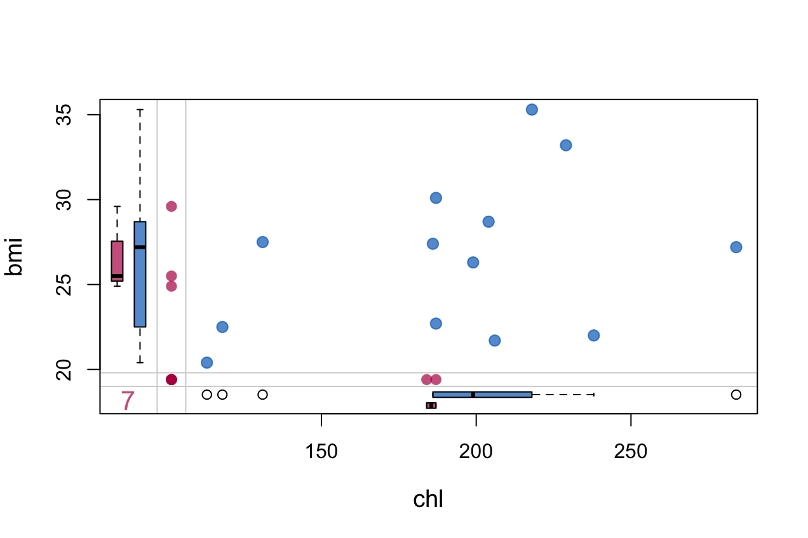
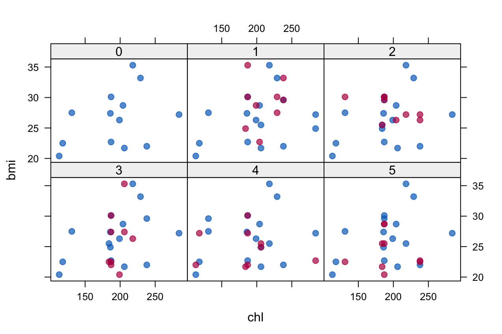
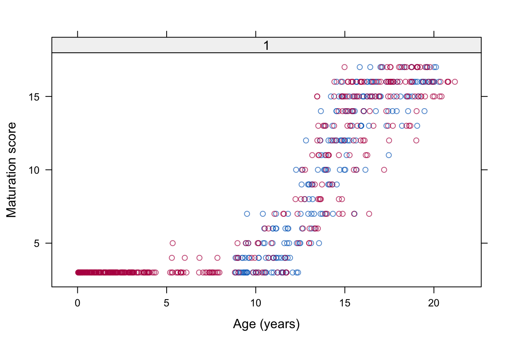
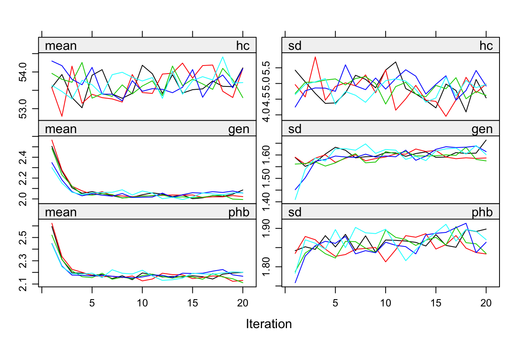

This page contains the R code from the article [mice: Multivariate Imputation by Chained Equations in R](https://www.jstatsoft.org/v45/i03/paper) published in the Journal of Statistical Software (Buuren and Groothuis-Oudshoorn 2011). For other examples using MICE see [MICE: Multivariate Imputation by Chained Equations](http://stefvanbuuren.github.io/mice/).

The code was tested in R 3.4.2 using mice 2.44.

### Install packages needed to run code

``` r
list.of.packages <- c("mice", "VIM", "mitools", "Zelig")
new.packages <- list.of.packages[!(list.of.packages %in% 
    installed.packages()[, "Package"])]
if (length(new.packages)) install.packages(new.packages)
```

### 2.4 Simple example

#### chunk number 4: example1

``` r
library("mice")
```

#### chunk number 5: example2 eval=FALSE

``` r
nhanes
```

    ##    age  bmi hyp chl
    ## 1    1   NA  NA  NA
    ## 2    2 22.7   1 187
    ## 3    1   NA   1 187
    ## 4    3   NA  NA  NA
    ## 5    1 20.4   1 113
    ## 6    3   NA  NA 184
    ## 7    1 22.5   1 118
    ## 8    1 30.1   1 187
    ## 9    2 22.0   1 238
    ## 10   2   NA  NA  NA
    ## 11   1   NA  NA  NA
    ## 12   2   NA  NA  NA
    ## 13   3 21.7   1 206
    ## 14   2 28.7   2 204
    ## 15   1 29.6   1  NA
    ## 16   1   NA  NA  NA
    ## 17   3 27.2   2 284
    ## 18   2 26.3   2 199
    ## 19   1 35.3   1 218
    ## 20   3 25.5   2  NA
    ## 21   1   NA  NA  NA
    ## 22   1 33.2   1 229
    ## 23   1 27.5   1 131
    ## 24   3 24.9   1  NA
    ## 25   2 27.4   1 186

#### chunk number 6: example3

``` r
md.pattern(nhanes)
```

    ##    age hyp bmi chl   
    ## 13   1   1   1   1  0
    ##  1   1   1   0   1  1
    ##  3   1   1   1   0  1
    ##  1   1   0   0   1  2
    ##  7   1   0   0   0  3
    ##      0   8   9  10 27

#### chunk number 7: example4

``` r
p <- md.pairs(nhanes)
p
```

    ## $rr
    ##     age bmi hyp chl
    ## age  25  16  17  15
    ## bmi  16  16  16  13
    ## hyp  17  16  17  14
    ## chl  15  13  14  15
    ## 
    ## $rm
    ##     age bmi hyp chl
    ## age   0   9   8  10
    ## bmi   0   0   0   3
    ## hyp   0   1   0   3
    ## chl   0   2   1   0
    ## 
    ## $mr
    ##     age bmi hyp chl
    ## age   0   0   0   0
    ## bmi   9   0   1   2
    ## hyp   8   0   0   1
    ## chl  10   3   3   0
    ## 
    ## $mm
    ##     age bmi hyp chl
    ## age   0   0   0   0
    ## bmi   0   9   8   7
    ## hyp   0   8   8   7
    ## chl   0   7   7  10

#### chunk number 9: marginplot

``` r
VIM::marginplot(nhanes[, c("chl", "bmi")], col = mdc(1:2), 
    cex = 1.2, cex.lab = 1.2, cex.numbers = 1.3, pch = 19)
```



#### chunk number 10: example1

``` r
imp <- mice(nhanes, seed = 23109)
```

    ## 
    ##  iter imp variable
    ##   1   1  bmi  hyp  chl
    ##   1   2  bmi  hyp  chl
    ##   1   3  bmi  hyp  chl
    ##   1   4  bmi  hyp  chl
    ##   1   5  bmi  hyp  chl
    ##   2   1  bmi  hyp  chl
    ##   2   2  bmi  hyp  chl
    ##   2   3  bmi  hyp  chl
    ##   2   4  bmi  hyp  chl
    ##   2   5  bmi  hyp  chl
    ##   3   1  bmi  hyp  chl
    ##   3   2  bmi  hyp  chl
    ##   3   3  bmi  hyp  chl
    ##   3   4  bmi  hyp  chl
    ##   3   5  bmi  hyp  chl
    ##   4   1  bmi  hyp  chl
    ##   4   2  bmi  hyp  chl
    ##   4   3  bmi  hyp  chl
    ##   4   4  bmi  hyp  chl
    ##   4   5  bmi  hyp  chl
    ##   5   1  bmi  hyp  chl
    ##   5   2  bmi  hyp  chl
    ##   5   3  bmi  hyp  chl
    ##   5   4  bmi  hyp  chl
    ##   5   5  bmi  hyp  chl

#### chunk number 11: example2

``` r
print(imp)
```

    ## Multiply imputed data set
    ## Call:
    ## mice(data = nhanes, seed = 23109)
    ## Number of multiple imputations:  5
    ## Missing cells per column:
    ## age bmi hyp chl 
    ##   0   9   8  10 
    ## Imputation methods:
    ##   age   bmi   hyp   chl 
    ##    "" "pmm" "pmm" "pmm" 
    ## VisitSequence:
    ## bmi hyp chl 
    ##   2   3   4 
    ## PredictorMatrix:
    ##     age bmi hyp chl
    ## age   0   0   0   0
    ## bmi   1   0   1   1
    ## hyp   1   1   0   1
    ## chl   1   1   1   0
    ## Random generator seed value:  23109

#### chunk number 12: example3

``` r
imp$imp$bmi
```

    ##       1    2    3    4    5
    ## 1  28.7 27.2 22.5 27.2 28.7
    ## 3  30.1 30.1 30.1 22.0 28.7
    ## 4  22.7 27.2 20.4 22.7 20.4
    ## 6  24.9 25.5 22.5 21.7 21.7
    ## 10 30.1 29.6 27.4 25.5 25.5
    ## 11 35.3 26.3 22.0 27.2 22.5
    ## 12 27.5 26.3 26.3 24.9 22.5
    ## 16 29.6 30.1 27.4 30.1 25.5
    ## 21 33.2 30.1 35.3 22.0 22.7

#### chunk number 13: example4 eval=FALSE

``` r
complete(imp)
```

    ##    age  bmi hyp chl
    ## 1    1 28.7   1 199
    ## 2    2 22.7   1 187
    ## 3    1 30.1   1 187
    ## 4    3 22.7   2 204
    ## 5    1 20.4   1 113
    ## 6    3 24.9   2 184
    ## 7    1 22.5   1 118
    ## 8    1 30.1   1 187
    ## 9    2 22.0   1 238
    ## 10   2 30.1   1 229
    ## 11   1 35.3   1 187
    ## 12   2 27.5   1 229
    ## 13   3 21.7   1 206
    ## 14   2 28.7   2 204
    ## 15   1 29.6   1 238
    ## 16   1 29.6   1 238
    ## 17   3 27.2   2 284
    ## 18   2 26.3   2 199
    ## 19   1 35.3   1 218
    ## 20   3 25.5   2 206
    ## 21   1 33.2   1 238
    ## 22   1 33.2   1 229
    ## 23   1 27.5   1 131
    ## 24   3 24.9   1 284
    ## 25   2 27.4   1 186

#### chunk number 14: stripplotcmd eval=FALSE

``` r
stripplot(imp, pch = 20, cex = 1.2)
```


#### chunk number 16: xyplotcmd eval=FALSE

``` r
xyplot(imp, bmi ~ chl | .imp, pch = 20, cex = 1.4)
```



#### chunk number 18: example6

``` r
fit <- with(imp, lm(chl ~ age + bmi))
```

#### chunk number 19: example7

``` r
print(pool(fit))
```

    ## Call: pool(object = fit)
    ## 
    ## Pooled coefficients:
    ## (Intercept)         age         bmi 
    ##        5.96       29.73        5.14 
    ## 
    ## Fraction of information about the coefficients missing due to nonresponse: 
    ## (Intercept)         age         bmi 
    ##       0.462       0.729       0.327

#### chunk number 20: example8

``` r
round(summary(pool(fit)), 2)
```

    ##               est    se    t    df Pr(>|t|)   lo 95
    ## (Intercept)  5.96 74.53 0.08  9.22     0.94 -162.04
    ## age         29.73 14.88 2.00  4.33     0.11  -10.37
    ## bmi          5.14  2.19 2.35 12.91     0.04    0.41
    ##              hi 95 nmis  fmi lambda
    ## (Intercept) 173.96   NA 0.46   0.36
    ## age          69.82    0 0.73   0.63
    ## bmi           9.87    9 0.33   0.23

#### chunk number 21: example9

``` r
imp50 <- mice(nhanes, m = 50, seed = 23109, print = FALSE)
fit <- with(imp50, lm(chl ~ age + bmi))
```

#### chunk number 22: example10

``` r
round(summary(pool(fit)), 2)
```

    ##               est    se     t   df Pr(>|t|)   lo 95
    ## (Intercept) -7.02 66.64 -0.11 14.2     0.92 -149.73
    ## age         32.06 11.53  2.78 11.6     0.02    6.84
    ## bmi          5.46  2.09  2.62 15.3     0.02    1.02
    ##             hi 95 nmis  fmi lambda
    ## (Intercept) 135.7   NA 0.36   0.28
    ## age          57.3    0 0.49   0.41
    ## bmi           9.9    9 0.32   0.23

### 3.2 Univariate imputation methods

#### chunk number 23: models1 eval=FALSE

``` r
imp <- mice(nhanes, method = "norm", print = FALSE)
```

#### chunk number 24: models2 eval=FALSE

``` r
imp <- mice(nhanes, meth = c("", "norm", "pmm", "mean"), 
    print = FALSE)
```

#### chunk number 25: models3

``` r
str(nhanes2)
```

    ## 'data.frame':    25 obs. of  4 variables:
    ##  $ age: Factor w/ 3 levels "20-39","40-59",..: 1 2 1 3 1 3 1 1 2 2 ...
    ##  $ bmi: num  NA 22.7 NA NA 20.4 NA 22.5 30.1 22 NA ...
    ##  $ hyp: Factor w/ 2 levels "no","yes": NA 1 1 NA 1 NA 1 1 1 NA ...
    ##  $ chl: num  NA 187 187 NA 113 184 118 187 238 NA ...

#### chunk number 26: models4 eval=FALSE

``` r
imp <- mice(nhanes2, me = c("polyreg", "pmm", "logreg", 
    "norm"), print = FALSE)
```

#### chunk number 27: models5 eval=FALSE

``` r
imp <- mice(nhanes2, meth = c("", "", "logreg", "norm"), 
    print = FALSE)
```

#### chunk number 28: models6 eval=FALSE

``` r
mice(nhanes2, defaultMethod = c("norm", "logreg", "polyreg", 
    "polr"), print = FALSE)
```

    ## Multiply imputed data set
    ## Call:
    ## mice(data = nhanes2, defaultMethod = c("norm", "logreg", "polyreg", 
    ##     "polr"), printFlag = FALSE)
    ## Number of multiple imputations:  5
    ## Missing cells per column:
    ## age bmi hyp chl 
    ##   0   9   8  10 
    ## Imputation methods:
    ##      age      bmi      hyp      chl 
    ##       ""   "norm" "logreg"   "norm" 
    ## VisitSequence:
    ## bmi hyp chl 
    ##   2   3   4 
    ## PredictorMatrix:
    ##     age bmi hyp chl
    ## age   0   0   0   0
    ## bmi   1   0   1   1
    ## hyp   1   1   0   1
    ## chl   1   1   1   0
    ## Random generator seed value:  NA

### 3.3 Predictor selection

#### chunk number 29: predictor1

``` r
imp <- mice(nhanes, print = FALSE)
imp$predictorMatrix
```

    ##     age bmi hyp chl
    ## age   0   0   0   0
    ## bmi   1   0   1   1
    ## hyp   1   1   0   1
    ## chl   1   1   1   0

#### removing a predictor chunk number 30: predictor2

``` r
pred <- imp$predictorMatrix
pred[, "bmi"] <- 0
pred
```

    ##     age bmi hyp chl
    ## age   0   0   0   0
    ## bmi   1   0   1   1
    ## hyp   1   0   0   1
    ## chl   1   0   1   0

#### chunk number 31: predictor3

``` r
imp <- mice(nhanes, pred = pred, print = FALSE)
```

#### skipping imputation chunk number 32: predictor4

``` r
ini <- mice(nhanes2, maxit = 0, print = FALSE)
pred <- ini$pred
pred[, "bmi"] <- 0
meth <- ini$meth
meth["bmi"] <- ""
imp <- mice(nhanes2, meth = meth, pred = pred, print = FALSE)
imp$imp$bmi
```

    ##     1  2  3  4  5
    ## 1  NA NA NA NA NA
    ## 3  NA NA NA NA NA
    ## 4  NA NA NA NA NA
    ## 6  NA NA NA NA NA
    ## 10 NA NA NA NA NA
    ## 11 NA NA NA NA NA
    ## 12 NA NA NA NA NA
    ## 16 NA NA NA NA NA
    ## 21 NA NA NA NA NA

#### intercept imputation chunk number 33: predictor5

``` r
pred <- ini$pred
pred["bmi", ] <- 0
imp <- mice(nhanes2, pred = pred, print = FALSE, seed = 51162)
imp$imp$bmi
```

    ##       1    2    3    4    5
    ## 1  22.7 22.7 22.5 22.7 22.7
    ## 3  20.4 20.4 22.7 22.0 22.0
    ## 4  30.1 22.0 22.5 22.7 22.0
    ## 6  22.7 22.7 22.0 22.7 22.7
    ## 10 20.4 22.5 22.7 22.7 22.0
    ## 11 30.1 30.1 30.1 22.7 22.5
    ## 12 20.4 20.4 22.7 22.5 22.5
    ## 16 22.5 20.4 30.1 30.1 22.0
    ## 21 30.1 20.4 30.1 30.1 20.4

#### multilevel imputation chunk number 34:

``` r
### multilevel1
popmis[1:3, ]
```

    ##   pupil school popular sex texp const teachpop
    ## 1     1      1      NA   1   24     1        7
    ## 2     2      1      NA   0   24     1        7
    ## 3     3      1       7   1   24     1        6

``` r
ini <- mice(popmis, maxit = 0, print = FALSE)
pred <- ini$pred
pred["popular", ] <- c(0, -2, 0, 2, 1, 2, 0)
imp <- mice(popmis, meth = c("", "", "2l.norm", "", "", 
    "", ""), pred = pred, maxit = 1, seed = 71152, print = FALSE)
```

#### chunk number 35: quickpred1

``` r
round(cor(nhanes, use = "pair"), 3)
```

    ##        age    bmi   hyp   chl
    ## age  1.000 -0.372 0.506 0.507
    ## bmi -0.372  1.000 0.051 0.373
    ## hyp  0.506  0.051 1.000 0.429
    ## chl  0.507  0.373 0.429 1.000

#### chunk number 36: quickpred2

``` r
round(cor(y = nhanes, x = !is.na(nhanes), use = "pair"), 
    3)
```

    ## Warning in cor(y = nhanes, x = !is.na(nhanes), use =
    ## "pair"): the standard deviation is zero

    ##        age    bmi    hyp   chl
    ## age     NA     NA     NA    NA
    ## bmi  0.086     NA  0.139 0.053
    ## hyp  0.008     NA     NA 0.045
    ## chl -0.040 -0.012 -0.107    NA

#### chunk number 37: quickpred3

``` r
p <- md.pairs(nhanes)
round(p$mr/(p$mr + p$mm), 3)
```

    ##     age bmi   hyp   chl
    ## age NaN NaN   NaN   NaN
    ## bmi   1 0.0 0.111 0.222
    ## hyp   1 0.0 0.000 0.125
    ## chl   1 0.3 0.300 0.000

#### chunk number 38: quickpred4

``` r
quickpred(nhanes)
```

    ##     age bmi hyp chl
    ## age   0   0   0   0
    ## bmi   1   0   1   1
    ## hyp   1   0   0   1
    ## chl   1   1   1   0

#### chunk number 39: quickpred5 eval=FALSE

``` r
imp <- mice(nhanes, pred = quickpred(nhanes, minpuc = 0.25, 
    include = "age"), print = FALSE)
```

### 3.4 Passive imputation

#### Preserving, chunk number 40: transform1

``` r
nhanes2.ext <- cbind(nhanes2, lchl = log(nhanes2$chl))
ini <- mice(nhanes2.ext, max = 0, print = FALSE)
meth <- ini$meth
meth["lchl"] <- "~log(chl)"
pred <- ini$pred
pred[c("hyp", "chl"), "lchl"] <- 0
pred["bmi", "chl"] <- 0
pred
```

    ##      age bmi hyp chl lchl
    ## age    0   0   0   0    0
    ## bmi    1   0   1   0    1
    ## hyp    1   1   0   1    0
    ## chl    1   1   1   0    0
    ## lchl   1   1   1   1    0

``` r
imp <- mice(nhanes2.ext, meth = meth, pred = pred, seed = 38788, 
    print = FALSE)
head(complete(imp))
```

    ##     age  bmi hyp chl lchl
    ## 1 20-39 33.2  no 186 5.23
    ## 2 40-59 22.7  no 187 5.23
    ## 3 20-39 30.1  no 187 5.23
    ## 4 60-99 26.3 yes 284 5.65
    ## 5 20-39 20.4  no 113 4.73
    ## 6 60-99 26.3  no 184 5.21

#### Index chunk number 41: transform2

``` r
nhanes2.ext <- cbind(nhanes2, lchl = NA)
```

#### chunk number 42: index1

``` r
md.pattern(boys[, c("hgt", "wgt", "bmi")])
```

    ##     wgt hgt bmi   
    ## 727   1   1   1  0
    ##  17   1   0   0  2
    ##   1   0   1   0  2
    ##   3   0   0   0  3
    ##       4  20  21 45

#### chunk number 43: index2

``` r
ini <- mice(boys, max = 0, print = FALSE)
meth <- ini$meth
meth["bmi"] <- "~I(wgt/(hgt/100)^2)"
pred <- ini$pred
pred[c("wgt", "hgt", "hc", "reg"), "bmi"] <- 0
pred[c("gen", "phb", "tv"), c("hgt", "wgt", "hc")] <- 0
pred
```

    ##     age hgt wgt bmi hc gen phb tv reg
    ## age   0   0   0   0  0   0   0  0   0
    ## hgt   1   0   1   0  1   1   1  1   1
    ## wgt   1   1   0   0  1   1   1  1   1
    ## bmi   1   1   1   0  1   1   1  1   1
    ## hc    1   1   1   0  0   1   1  1   1
    ## gen   1   0   0   1  0   0   1  1   1
    ## phb   1   0   0   1  0   1   0  1   1
    ## tv    1   0   0   1  0   1   1  0   1
    ## reg   1   1   1   0  1   1   1  1   0

#### chunk number 44: index3

``` r
imp.idx <- mice(boys, pred = pred, meth = meth, maxit = 20, 
    seed = 9212, print = FALSE)
head(complete(imp.idx)[is.na(boys$bmi), ], 3)
```

    ##        age  hgt   wgt  bmi   hc gen phb tv   reg
    ## 103  0.087 60.0  4.54 12.6 39.0  G1  P1  2  west
    ## 366  0.177 57.5  5.26 15.9 40.4  G1  P1  2  west
    ## 1617 1.481 87.5 12.04 15.7 47.5  G1  P1  2 north

#### chunk number 45: index4

``` r
meth["bmi"] <- "~round(wgt/(hgt/100)^2,dig=2)"
```

#### sum scores chunk number 46: sumscore1

``` r
ini <- mice(cbind(boys, mat = NA), max = 0, print = FALSE)
meth <- ini$meth
meth["mat"] <- "~I(as.integer(gen) + as.integer(phb) +
 + as.integer(cut(tv,breaks=c(0,3,6,10,15,20,25))))"
meth["bmi"] <- "~I(wgt/(hgt/100)^2)"
pred <- ini$pred
pred[c("bmi", "gen", "phb", "tv"), "mat"] <- 0
pred[c("hgt", "wgt", "hc", "reg"), "mat"] <- 1
pred[c("hgt", "wgt", "hc", "reg"), c("gen", "phb", "tv")] <- 0
pred[c("wgt", "hgt", "hc", "reg"), "bmi"] <- 0
pred[c("gen", "phb", "tv"), c("hgt", "wgt", "hc")] <- 0
pred
```

    ##     age hgt wgt bmi hc gen phb tv reg mat
    ## age   0   0   0   0  0   0   0  0   0   0
    ## hgt   1   0   1   0  1   0   0  0   1   1
    ## wgt   1   1   0   0  1   0   0  0   1   1
    ## bmi   1   1   1   0  1   1   1  1   1   0
    ## hc    1   1   1   0  0   0   0  0   1   1
    ## gen   1   0   0   1  0   0   1  1   1   0
    ## phb   1   0   0   1  0   1   0  1   1   0
    ## tv    1   0   0   1  0   1   1  0   1   0
    ## reg   1   1   1   0  1   0   0  0   0   1
    ## mat   0   0   0   0  0   0   0  0   0   0

#### chunk number 47: sumscore2

``` r
imp.sum <- mice(cbind(boys, mat = NA), pred = pred, meth = meth, 
    maxit = 20, seed = 10948, print = FALSE)
```

#### chunk number 48: sumscore3 eval=FALSE

``` r
xyplot(imp.sum, mat ~ age | .imp, na = gen | phb | tv, subset = .imp == 
    1, ylab = "Maturation score", xlab = "Age (years)")
```


#### interactions chunk number 50: interaction1

``` r
nhanes2.ext <- cbind(nhanes2, bmi.chl = NA)
ini <- mice(nhanes2.ext, max = 0, print = FALSE)
meth <- ini$meth
meth["bmi.chl"] <- "~I((bmi-25)*(chl-200))"
pred <- ini$pred
pred[c("bmi", "chl"), "bmi.chl"] <- 0
imp <- mice(nhanes2.ext, meth = meth, pred = pred, seed = 51600, 
    print = FALSE)
```

#### chunk number 51: interaction2

``` r
head(ini$pad$data, 3)
```

    ##     age  bmi  hyp chl bmi.chl age.1 age.2 hyp.1
    ## 1 20-39   NA <NA>  NA      NA     0     0    NA
    ## 2 40-59 22.7   no 187      NA     1     0     0
    ## 3 20-39   NA   no 187      NA     0     0     0

#### interaction chunk number 52: interaction3

``` r
nhanes2.ext <- cbind(nhanes2, age.1.bmi = NA, age.2.bmi = NA)
ini <- mice(nhanes2.ext, max = 0, print = FALSE)
meth <- ini$meth
meth["age.1.bmi"] <- "~I(age.1*(bmi-25))"
meth["age.2.bmi"] <- "~I(age.2*(bmi-25))"
pred <- ini$pred
pred[c("age", "bmi"), c("age.1.bmi", "age.2.bmi")] <- 0
imp <- mice(nhanes2.ext, meth = meth, pred = pred, maxit = 10, 
    print = FALSE)
```

#### squeeze chunk number 53: squeeze1

``` r
nhanes2.ext <- cbind(nhanes2, lchl = NA)
ini <- mice(nhanes2.ext, max = 0, print = FALSE)
meth <- ini$meth
meth[c("lchl", "chl")] <- c("~log(chl)", "norm")
pred <- ini$pred
pred[c("hyp", "chl"), "lchl"] <- 0
pred["bmi", "chl"] <- 0
imp <- mice(nhanes2.ext, meth = meth, pred = pred, seed = 1, 
    maxit = 100, print = FALSE)
```

    ## Warning in log(chl): NaNs produced

    ## Warning in log(chl): NaNs produced

    ## Warning in log(chl): NaNs produced

#### chunk number 54: squeeze2 eval=FALSE

``` r
meth["lchl"] <- "~log(squeeze(chl, bounds=c(100,300)))"
imp <- mice(nhanes2.ext, meth = meth, pred = pred, seed = 1, 
    maxit = 100, print = FALSE)
```

#### post-processing: chunk number 55: post1

``` r
nhanes2.ext <- cbind(nhanes2, lchl = NA)
ini <- mice(nhanes2.ext, max = 0, print = FALSE)
meth <- ini$meth
meth[c("lchl", "chl")] <- c("~log(chl)", "norm")
pred <- ini$pred
pred[c("hyp", "chl"), "lchl"] <- 0
pred["bmi", "chl"] <- 0
post <- ini$post
post["chl"] <- "imp[[j]][,i] <- squeeze(imp[[j]][,i],c(100,300))"
imp <- mice(nhanes2.ext, meth = meth, pred = pred, post = post, 
    seed = 30031, maxit = 10, print = FALSE)
imp$imp$chl
```

    ##      1   2   3   4   5
    ## 1  138 173 152 145 106
    ## 4  181 180 209 284 162
    ## 10 209 223 262 257 145
    ## 11 197 180 100 217 113
    ## 12 222 241 200 300 125
    ## 15 214 164 156 195 178
    ## 16 190 179 197 154 141
    ## 20 205 233 259 213 163
    ## 21 167 130 100 153 144
    ## 24 218 265 137 258 223

#### post-processing: chunk number 56: post2

``` r
ini <- mice(cbind(boys, mat = NA), max = 0, print = FALSE)
meth <- ini$meth
meth["mat"] <- "~I(as.integer(gen) + as.integer(phb) +
 + as.integer(cut(tv,breaks=c(0,3,6,10,15,20,25))))"
meth["bmi"] <- "~I(wgt/(hgt/100)^2)"
pred <- ini$pred
pred[c("bmi", "gen", "phb", "tv"), "mat"] <- 0
pred[c("hgt", "wgt", "hc", "reg"), "mat"] <- 1
pred[c("hgt", "wgt", "hc", "reg"), c("gen", "phb", "tv")] <- 0
pred[c("wgt", "hgt", "hc", "reg"), "bmi"] <- 0
pred[c("gen", "phb", "tv"), c("hgt", "wgt", "hc")] <- 0
pred
```

    ##     age hgt wgt bmi hc gen phb tv reg mat
    ## age   0   0   0   0  0   0   0  0   0   0
    ## hgt   1   0   1   0  1   0   0  0   1   1
    ## wgt   1   1   0   0  1   0   0  0   1   1
    ## bmi   1   1   1   0  1   1   1  1   1   0
    ## hc    1   1   1   0  0   0   0  0   1   1
    ## gen   1   0   0   1  0   0   1  1   1   0
    ## phb   1   0   0   1  0   1   0  1   1   0
    ## tv    1   0   0   1  0   1   1  0   1   0
    ## reg   1   1   1   0  1   0   0  0   0   1
    ## mat   0   0   0   0  0   0   0  0   0   0

#### chunk number 57: post3

``` r
post <- ini$post
post["gen"] <- "imp[[j]][p$data$age[!r[,j]]<5,i] <- levels(boys$gen)[1]"
post["phb"] <- "imp[[j]][p$data$age[!r[,j]]<5,i] <- levels(boys$phb)[1]"
post["tv"] <- "imp[[j]][p$data$age[!r[,j]]<5,i] <- 1"
imp <- mice(cbind(boys, mat = NA), pred = pred, meth = meth, 
    post = post, maxit = 10, print = FALSE)
```

#### chunk number 58: post4 eval=FALSE

``` r
xyplot(imp, mat ~ age | .imp, na = gen | phb | tv, subset = .imp == 
    1, ylab = "Maturation score", xlab = "Age (years)")
```



### 3.6 Visiting scheme

#### chunk number 60: visit1

``` r
nhanes2.ext <- cbind(nhanes2, bmi.chl = NA)
ini <- mice(nhanes2.ext, max = 0, print = FALSE)
meth <- ini$meth
meth["bmi.chl"] <- "~I((bmi-25)*(chl-200))"
pred <- ini$pred
pred[c("bmi", "chl"), "bmi.chl"] <- 0
imp <- mice(nhanes2.ext, meth = meth, pred = pred, seed = 51600, 
    print = FALSE)
```

#### chunk number 61: visit2

``` r
imp$vis
```

    ##     bmi     hyp     chl bmi.chl 
    ##       2       3       4       5

#### chunk number 62: visit3 eval=FALSE

``` r
vis <- imp$vis
vis <- append(vis, vis[4], 1)
vis
```

    ##     bmi bmi.chl     hyp     chl bmi.chl 
    ##       2       5       3       4       5

``` r
imp <- mice(nhanes2.ext, meth = meth, pred = pred, vis = vis, 
    print = FALSE)
```

#### chunk number 63: visit4 eval=FALSE

``` r
imp <- mice(nhanes2.ext, meth = meth, pred = pred, vis = c(2, 
    4, 5, 3), print = FALSE)
```

#### chunk number 64: visit5 eval=FALSE

``` r
imp <- mice(nhanes2.ext, meth = meth, pred = pred, vis = "monotone", 
    print = FALSE)
```

### 4.1 Dry run

#### chunk number 65: dryrun1

``` r
ini <- mice(nhanes2, maxit = 0)
```

#### chunk number 66: dryrun2

``` r
import <- matrix(c(30, 30, 30, 29, 25, 21, 25, 25, 22, 33, 
    27, 22, 27, 35, 27, 20, 27, 30), byrow = TRUE, nr = 9)
imp <- mice(nhanes, print = FALSE, seed = 77172)
imp$imp$bmi[, 1:2] <- import
imp$imp$bmi
```

    ##     1  2    3    4    5
    ## 1  30 30 30.1 22.0 22.5
    ## 3  30 29 22.0 27.2 22.7
    ## 4  25 21 27.4 22.7 22.5
    ## 6  25 25 27.4 21.7 22.7
    ## 10 22 33 27.4 27.2 22.0
    ## 11 27 22 35.3 30.1 22.5
    ## 12 27 35 27.5 27.4 26.3
    ## 16 27 20 27.2 27.2 26.3
    ## 21 27 30 28.7 35.3 27.5

### 4.2 Step by Step

#### chunk number 67: step1

``` r
imp <- mice(nhanes, maxit = 4, seed = 44612, print = FALSE)
imp1 <- mice(nhanes, maxit = 1, seed = 44612, print = FALSE)
a <- runif(10)
imp2 <- mice.mids(imp1, maxit = 3, print = FALSE)
```

#### chunk number 68: step2

``` r
all(imp$imp$bmi == imp2$imp$bmi)
```

    ## [1] TRUE

### 4.3 Assessing convergence

#### first path chunk number 69: convergence1

``` r
ini <- mice(boys, max = 0, print = FALSE)
meth <- ini$meth
meth["bmi"] <- "~I(wgt/(hgt/100)^2)"
meth["wgt"] <- "~I(bmi*(hgt/100)^2)"
meth["hgt"] <- "~I(100*sqrt(wgt/bmi))"
# this has been outcommented since it does not work
# anymore in more recent versions of R imp1 <-
# mice(boys, meth = meth, maxit = 20, print = FALSE,
# seed = 9212)
```

#### chunk number 70: convergence1plotcmd eval=FALSE

``` r
# plot(imp1, c('hgt', 'wgt', 'bmi'))
```

#### second path chunk number 72: convergence2

``` r
ini <- mice(boys, max = 0, print = FALSE)
meth <- ini$meth
meth["bmi"] <- "~I(wgt/(hgt/100)^2)"
imp2 <- mice(boys, meth = meth, maxit = 20, print = FALSE, 
    seed = 9212)
```

#### chunk number 73: convergence2plotcmd eval=FALSE

``` r
plot(imp2, c("hgt", "wgt", "bmi"))
```


#### convergenc chunk number 75: convergence3plotcmd

``` r
plot(imp.idx, c("hgt", "wgt", "bmi"))
```


#### chunk number 77: convergence4plotcmd eval=FALSE

``` r
plot(imp.idx, c("hc", "gen", "phb"), tick.number = 3)
```



#### number 79: convergence5

``` r
m <- 5
T <- 20
imp.kendall <- mice(boys, m = m, meth = imp.idx$meth, pred = imp.idx$pred, 
    maxit = 0, print = FALSE)
tau <- matrix(NA, nrow = T, ncol = m)
for (i in 1:T) {
    if (i == 1) 
        set.seed(9212)
    imp.kendall <- mice.mids(imp.kendall, maxit = 1, print = FALSE)
    x <- complete(imp.kendall, "repeated")[, paste("gen", 
        1:m, sep = ".")]
    y <- complete(imp.kendall, "repeated")[, paste("phb", 
        1:m, sep = ".")]
    xn <- as.data.frame(lapply(x, as.numeric))
    yn <- as.data.frame(lapply(y, as.numeric))
    tau[i, ] <- diag(cor(xn, yn, method = "kendall"))
}
```

#### chunk number 80: convergence5plotcmd

``` r
matplot(x = 1:T, y = tau, xlab = "Iteration", type = "l")
```


#### chunk number 81: convergence5plot

``` r
matplot(x = 1:T, y = tau, xlab = "Iteration", type = "l")
```


### 4.5 Checking your imputations

#### density plot chunk number 82: densityplotcmd

``` r
densityplot(imp.kendall, scales = list(x = list(relation = "free")), 
    layout = c(5, 1))
```


#### chunk number 84: propensity

``` r
hc.na <- is.na(boys$hc)
fit.hc <- with(imp.kendall, glm(hc.na ~ age + wgt + hgt + 
    reg, family = binomial))
ps <- rep(rowMeans(sapply(fit.hc$analyses, fitted.values)), 
    6)
```

#### chunk number 85: propensityplotcmd eval=FALSE

``` r
xyplot(imp.kendall, hc ~ ps | .imp, pch = c(1, 20), cex = c(0.8, 
    1.2), xlab = "Probability that head circumference is missing", 
    ylab = "Head circumference (cm)", scales = list(tick.number = 3))
```


#### calculate model and residuals chunk number 87: residuals1

``` r
hc <- complete(imp.kendall, "long", TRUE)$hc
fit <- lm(hc ~ poly(ps, 4))
```

#### chunk number 88: residuals2 eval=FALSE

``` r
densityplot(~residuals(fit), group = hc.na, plot.points = FALSE, 
    ref = TRUE, scales = list(y = list(draw = FALSE)), par.settings = simpleTheme(col.line = rep(mdc(1:2))), 
    xlab = "Residuals of regression of hc on propensity score", 
    lwd = 2)
```


### 5.1 Repeated data analysis

#### chunk number 90: repeated1

``` r
imp <- mice(nhanes2, seed = 99210, print = FALSE)
fit <- with(imp, lm(chl ~ age + bmi))
summary(pool(fit))
```

    ##               est    se     t    df Pr(>|t|)   lo 95
    ## (Intercept) 24.39 59.60 0.409 13.25   0.6889 -104.12
    ## age2        38.31 25.18 1.521  5.57   0.1828  -24.49
    ## age3        46.85 20.22 2.317 13.05   0.0374    3.19
    ## bmi          5.45  2.02 2.703 15.33   0.0161    1.16
    ##              hi 95 nmis   fmi lambda
    ## (Intercept) 152.90   NA 0.301  0.203
    ## age2        101.12   NA 0.638  0.528
    ## age3         90.50   NA 0.308  0.209
    ## bmi           9.75    9 0.233  0.139

#### chunk number 91: repeated2

``` r
expr <- expression(ov <- cut(bmi, c(10, 25, 50)), table(age, 
    ov))
fit <- with(imp, eval(expr))
```

#### chunk number 92: repeated3

``` r
fit$an[c(2, 5)]
```

    ## [[1]]
    ##        ov
    ## age     (10,25] (25,50]
    ##   20-39       4       8
    ##   40-59       2       5
    ##   60-99       2       4
    ## 
    ## [[2]]
    ##        ov
    ## age     (10,25] (25,50]
    ##   20-39       3       9
    ##   40-59       3       4
    ##   60-99       2       4

#### chunk number 93: extract1

``` r
com <- complete(imp, 3)
```

#### chunk number 94: extract2

``` r
com <- complete(imp, "long")
```

#### chunk number 95: extract3

``` r
com <- complete(imp, "long", include = TRUE)
by(cbind(age = com$age, ov = cut(com$bmi, c(10, 25, 50))), 
    com$.imp, table)
```

    ## INDICES: 0
    ##    ov
    ## age 1 2
    ##   1 2 5
    ##   2 2 3
    ##   3 2 2
    ## ----------------------------------------- 
    ## INDICES: 1
    ##    ov
    ## age 1 2
    ##   1 6 6
    ##   2 2 5
    ##   3 3 3
    ## ----------------------------------------- 
    ## INDICES: 2
    ##    ov
    ## age 1 2
    ##   1 4 8
    ##   2 2 5
    ##   3 2 4
    ## ----------------------------------------- 
    ## INDICES: 3
    ##    ov
    ## age  1  2
    ##   1  2 10
    ##   2  2  5
    ##   3  2  4
    ## ----------------------------------------- 
    ## INDICES: 4
    ##    ov
    ## age 1 2
    ##   1 3 9
    ##   2 3 4
    ##   3 2 4
    ## ----------------------------------------- 
    ## INDICES: 5
    ##    ov
    ## age 1 2
    ##   1 3 9
    ##   2 3 4
    ##   3 2 4

### 6.1 Adding your own imputation functions

#### chunk number 96: pool1

``` r
fit <- with(imp, lm(chl ~ age + bmi))
est <- pool(fit)
```

#### chunk number 97: pool2

``` r
methods(coef)
```

    ##  [1] coef,ANY-method               
    ##  [2] coef,glpModel-method          
    ##  [3] coef,mle-method               
    ##  [4] coef,qrrvglm-method           
    ##  [5] coef,rrvgam-method            
    ##  [6] coef,summary.mle-method       
    ##  [7] coef,summary.rrvglm-method    
    ##  [8] coef,summary.vglm-method      
    ##  [9] coef,vgam-method              
    ## [10] coef,vglm-method              
    ## [11] coef,vlm-method               
    ## [12] coef,vsmooth.spline-method    
    ## [13] coef,vsmooth.spline.fit-method
    ## [14] coef,Zelig-method             
    ## [15] coef.aov*                     
    ## [16] coef.Arima*                   
    ## [17] coef.bcnPowerTransform*       
    ## [18] coef.corAR1*                  
    ## [19] coef.corARMA*                 
    ## [20] coef.corCAR1*                 
    ## [21] coef.corCompSymm*             
    ## [22] coef.corIdent*                
    ## [23] coef.corLin*                  
    ## [24] coef.corNatural*              
    ## [25] coef.corSpatial*              
    ## [26] coef.corSpher*                
    ## [27] coef.corStruct*               
    ## [28] coef.corSymm*                 
    ## [29] coef.crq*                     
    ## [30] coef.default*                 
    ## [31] coef.fitdistr*                
    ## [32] coef.gls*                     
    ## [33] coef.gnls*                    
    ## [34] coef.lda*                     
    ## [35] coef.listof*                  
    ## [36] coef.lme*                     
    ## [37] coef.lmList*                  
    ## [38] coef.lmList4*                 
    ## [39] coef.lodds*                   
    ## [40] coef.loddsratio*              
    ## [41] coef.loglm*                   
    ## [42] coef.maov*                    
    ## [43] coef.maxim*                   
    ## [44] coef.maxLik*                  
    ## [45] coef.merMod*                  
    ## [46] coef.modelStruct*             
    ## [47] coef.multinom*                
    ## [48] coef.nlrq*                    
    ## [49] coef.nls*                     
    ## [50] coef.nnet*                    
    ## [51] coef.pdBlocked*               
    ## [52] coef.pdCompSymm*              
    ## [53] coef.pdDiag*                  
    ## [54] coef.pdIdent*                 
    ## [55] coef.pdIdnot*                 
    ## [56] coef.pdMat*                   
    ## [57] coef.pdNatural*               
    ## [58] coef.pdSymm*                  
    ## [59] coef.pdTens*                  
    ## [60] coef.powerTransform*          
    ## [61] coef.reStruct*                
    ## [62] coef.ridgelm*                 
    ## [63] coef.slm*                     
    ## [64] coef.summary.gls*             
    ## [65] coef.summary.lme*             
    ## [66] coef.summary.maxLik*          
    ## [67] coef.summary.nlsList*         
    ## [68] coef.svrepstat*               
    ## [69] coef.svyby*                   
    ## [70] coef.svyciprop*               
    ## [71] coef.svyglm*                  
    ## [72] coef.svyloglin*               
    ## [73] coef.svymle*                  
    ## [74] coef.svyolr*                  
    ## [75] coef.svyquantile*             
    ## [76] coef.svyratio*                
    ## [77] coef.svystat*                 
    ## [78] coef.varComb*                 
    ## [79] coef.varConstPower*           
    ## [80] coef.varExp*                  
    ## [81] coef.varFixed*                
    ## [82] coef.varFunc*                 
    ## [83] coef.varIdent*                
    ## [84] coef.varPower*                
    ## [85] coef.vlm*                     
    ## see '?methods' for accessing help and source code

``` r
methods(vcov)
```

    ##  [1] vcov,ANY-method         vcov,mle-method        
    ##  [3] vcov,pvgam-method       vcov,qrrvglm-method    
    ##  [5] vcov,rrvglm-method      vcov,vglm-method       
    ##  [7] vcov,vlm-method         vcov,Zelig-method      
    ##  [9] vcov.Arima*             vcov.bcnPowerTransform*
    ## [11] vcov.bgtest*            vcov.boot*             
    ## [13] vcov.cch*               vcov.coxph*            
    ## [15] vcov.fitdistr*          vcov.gam*              
    ## [17] vcov.glm*               vcov.glmrob*           
    ## [19] vcov.gls*               vcov.ivreg*            
    ## [21] vcov.jam*               vcov.lm*               
    ## [23] vcov.lme*               vcov.lmrob*            
    ## [25] vcov.lodds*             vcov.loddsratio*       
    ## [27] vcov.maxLik*            vcov.merMod*           
    ## [29] vcov.MIresult*          vcov.mlm*              
    ## [31] vcov.multinom*          vcov.negbin*           
    ## [33] vcov.nlrob*             vcov.nls*              
    ## [35] vcov.polr*              vcov.powerTransform*   
    ## [37] vcov.pvgam*             vcov.rlm*              
    ## [39] vcov.summary.glm*       vcov.summary.lm*       
    ## [41] vcov.summary.merMod*    vcov.survreg*          
    ## [43] vcov.svrepstat*         vcov.svyby*            
    ## [45] vcov.svyciprop*         vcov.svyglm*           
    ## [47] vcov.svyloglin*         vcov.svymle*           
    ## [49] vcov.svyolr*            vcov.svyquantile*      
    ## [51] vcov.svyratio*          vcov.svystat*          
    ## [53] vcov.vlm*              
    ## see '?methods' for accessing help and source code

#### Model testing - Wald method chunk number 98: pool3

``` r
imp <- mice(nhanes2, print = FALSE, m = 50, seed = 219)
fit0 <- with(data = imp, expr = lm(bmi ~ age + hyp))
fit1 <- with(data = imp, expr = lm(bmi ~ age + hyp + chl))
stat <- pool.compare(fit1, fit0, method = "Wald")
stat$p
```

    ##        [,1]
    ## [1,] 0.0103

#### Model testing - LLR method chunk number 99: pool4

``` r
imp <- mice(boys, print = FALSE, seed = 60019)
fit0 <- with(data = imp, expr = glm(I(gen > levels(gen)[1]) ~ 
    hgt + hc, family = binomial))
fit1 <- with(data = imp, expr = glm(I(gen > levels(gen)[1]) ~ 
    hgt + hc + reg, family = binomial))
stat <- pool.compare(fit1, fit0, method = "likelihood", 
    data = imp)
stat$p
```

    ## [1] 0.0456

#### chunk number 100: ownfunction eval=FALSE

``` r
mice.impute.myfunc <- mice.impute.pmm
# make some edits of myfunc, add run your method as
mice(nhanes, method = "myfunc", print = FALSE)
```

    ## Multiply imputed data set
    ## Call:
    ## mice(data = nhanes, method = "myfunc", printFlag = FALSE)
    ## Number of multiple imputations:  5
    ## Missing cells per column:
    ## age bmi hyp chl 
    ##   0   9   8  10 
    ## Imputation methods:
    ##      age      bmi      hyp      chl 
    ## "myfunc" "myfunc" "myfunc" "myfunc" 
    ## VisitSequence:
    ## bmi hyp chl 
    ##   2   3   4 
    ## PredictorMatrix:
    ##     age bmi hyp chl
    ## age   0   0   0   0
    ## bmi   1   0   1   1
    ## hyp   1   1   0   1
    ## chl   1   1   1   0
    ## Random generator seed value:  NA

### 6.2 Sensitivity analysis under MNAR

#### chunk number 101: sensitivity

``` r
ini <- mice(nhanes2, maxit = 0, print = FALSE)
post <- ini$post
k <- seq(1, 1.5, 0.1)
est <- vector("list", length(k))
for (i in 1:length(k)) {
    post["chl"] <- paste("imp[[j]][,i] <-", k[i], "* imp[[j]][,i]")
    imp <- mice(nhanes2, post = post, seed = 10, print = FALSE, 
        maxit = 20)
    fit <- with(imp, lm(bmi ~ age + chl))
    est[[i]] <- summary(pool(fit))
}
```

### 7.2 SPSS

``` r
# The code below should not be run from R, but from
# SPSS.  Remove one (1) # sign per line, and run.  BEGIN
# PROGRAM R.  Instruct R to import the data and the
# dictionary from SPSS.  dict <-
# spssdictionary.GetDictionaryFromSPSS() data <-
# spssdata.GetDataFromSPSS() Load mice, impute and get
# the original + imputed data. library(mice) imp <-
# mice(data,maxit=10) com <-
# complete(imp,'long',inc=TRUE) com <- cbind(com,
# Imputation_ = as.integer(com$.imp)-1) Export imputed
# data and dictionary from R to SPSS.
# spssdictionary.SetDictionaryToSPSS('com', dict)
# spssdata.SetDataToSPSS('com', com)
# spssdictionary.EndDataStep() END PROGRAM.
```

### 7.3 MItools

#### chunk number 102: mitools1

``` r
mydata <- mitools::imputationList(lapply(1:5, complete, 
    x = imp))
```

#### chunk number 103: mitools2 eval=FALSE

``` r
fit <- with(mydata, expr = lm(chl ~ age + bmi))
```

### 7.3 Zelig

#### chunk number 104: zelig1

``` r
library("Zelig", quietly = TRUE)
# NOTE: we must now call mice:::cbind.mids explicitly
# because cbind() does not use the standard S3 dispatch
# mechanism. Since April 2017 it dispatches to
# cbind.data.frame() when one of the arguments is a data
# frame. See also
# https://github.com/tidyverse/dplyr/issues/2667
imp <- mice:::cbind.mids(imp.idx, data.frame(r.hc = is.na(boys$hc)))
mydata2 <- mi(complete(imp, 1), complete(imp, 2), complete(imp, 
    3), complete(imp, 4), complete(imp, 5))
fit <- zelig(r.hc ~ age + wgt + hgt + bmi + gen + phb + 
    tv + reg, model = "logit", data = mydata2, cite = FALSE)
summary(fit)
```

    ## Model: Combined Imputations 
    ## 
    ##             Estimate Std.Error z value Pr(>|z|)
    ## (Intercept)  -3.4012   58.7914    -0.1     0.95
    ## age           0.0803    0.1455     0.6     0.58
    ## wgt           0.0016    0.0532     0.0     0.98
    ## hgt          -0.0116    0.0272    -0.4     0.67
    ## bmi           0.0202    0.1597     0.1     0.90
    ## gen.L         1.4606    2.1134     0.7     0.49
    ## gen.Q         0.9372  156.8283     0.0     1.00
    ## gen.C        -0.2262    1.3547    -0.2     0.87
    ## gen^4        -1.8084  210.3829     0.0     0.99
    ## phb.L        -0.4642    3.2374    -0.1     0.89
    ## phb.Q         0.3797    1.0035     0.4     0.71
    ## phb.C         0.3087    0.9035     0.3     0.73
    ## phb^4        -0.0629    0.7418    -0.1     0.93
    ## phb^5         0.1226    0.7917     0.2     0.88
    ## tv           -0.0071    0.0688    -0.1     0.92
    ## regeast       0.4128    0.7395     0.6     0.58
    ## regwest       1.0631    0.6802     1.6     0.12
    ## regsouth     -2.1053    1.1992    -1.8     0.08
    ## regcity       1.5032    0.7076     2.1     0.03
    ## 
    ## For results from individual imputed datasets, use summary(x, subset = i:j)
    ## Next step: Use 'setx' method

Buuren, S. van, and K. Groothuis-Oudshoorn. 2011. “MICE: Multivariate Imputation by Chained Equations in R.” *Journal of Statistical Software* 45 (3): 1–67.
